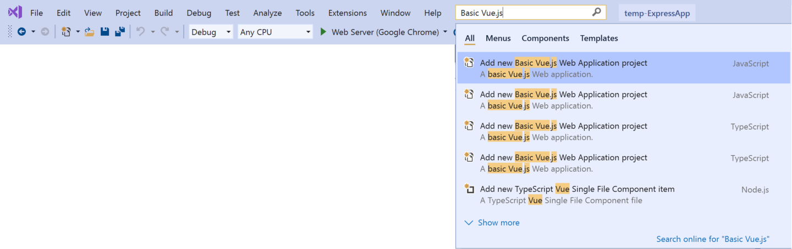
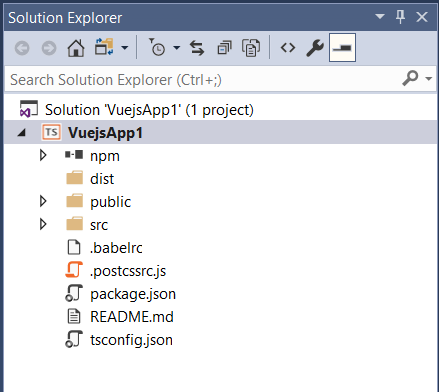
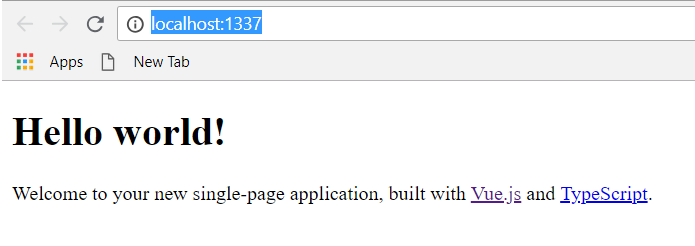

# Quickstart: Use Visual Studio to create your first Vue.js app

In this 5-10 minute introduction to the Visual Studio integrated development environment (IDE), you'll create and run a simple Vue.js web application.

## Prerequisites

* You must have Visual Studio installed and the Node.js development workload.

  If you haven't already installed Visual Studio 2019, go to the [Visual Studio downloads](https://aka.ms/vs/download/?cid=learn-onpage-download-cta) page to install it for free.

  If you need to install the workload but already have Visual Studio, go to **Tools** > **Get Tools and Features...**, which opens the Visual Studio Installer. Choose the **Node.js development** workload, then choose **Modify**.

  

* You must have the Node.js runtime installed.

  If you don't have it installed, we recommend you install the LTS version from the [Node.js](https://nodejs.org/en/download/) website for best compatibility with outside frameworks and libraries. Node.js is built for 32-bit and 64-bit architectures. The Node.js tools in Visual Studio, included in the Node.js workload, support both versions. Only one is required and the Node.js installer only supports one being installed at a time.

  In general, Visual Studio automatically detects the installed Node.js runtime. If it does not detect an installed runtime, you can configure your project to reference the installed runtime in the properties page (after you create a project, right-click the project node, choose **Properties**, and set the **Node.exe path**). You can use a global installation of Node.js or you can specify the path to a local interpreter in each of your Node.js projects. 

## Create a project

First, you'll create a Vue.js web application project.

1. If you don't have the Node.js runtime already installed, install the LTS version from the [Node.js](https://nodejs.org/en/download/) website.

    For more information, see the prerequisites.

1. Open Visual Studio.

1. Create a new project.

    Press **Esc** to close the start window. Type **Ctrl + Q** to open the search box, type **Basic Vue.js**, then choose **Basic Vue.js Web application** (either JavaScript or TypeScript). In the dialog box that appears, type the name **basic-vuejs**, and then choose **Create**.

    

    If you don't see the **Basic Vue.js Web application** project template, you must add the **Node.js development** workload. For detailed instructions, see the [Prerequisites](#prerequisites).

    Visual Studio creates the new project. The new project opens in Solution Explorer (right pane).

1. Check the Output window (lower pane) for progress on installing the npm packages required for the application.

1. In Solution Explorer, open the **npm** node and make sure that all the listed npm packages are installed.

    If any packages are missing (exclamation point icon), you can right-click the **npm** node and choose **Install Missing npm Packages**.

## Explore the IDE

1. Take a look at **Solution Explorer** in the right pane.

     

   - Highlighted in bold is your project, using the name you gave in the **New Project** dialog box. On disk, this project is represented by a .*njsproj* file in your project folder.

   - At the top level is a solution, which by default has the same name as your project. A solution, represented by a .*sln* file on disk, is a container for one or more related projects.

   - The **npm** node shows any installed npm packages. You can right-click the npm node to search for and install npm packages using a dialog box.

2. If you want to install npm packages or run Node.js commands from a command prompt, right-click the project node and choose **Open Command Prompt Here**.

## Add a .vue file to the project

1. In Solution Explorer, right-click any folder such as the *src/components* folder, and then choose **Add** > **New Item**.

   If you don't see all the item templates, choose **Show All Templates**, and then choose the item template.

1. Select either **JavaScript Vue Single File Component** or **TypeScript Vue Single File Component**, and then click **Add**.

    Visual Studio adds the new file to the project.

## Build the project

1. Next, choose **Build** > **Build Solution** to build the project.

1. Check the **Output** window to see build results, and choose **Build** from the **Show output from** list.

The JavaScript Vue.js project template (and older versions of the TypeScript template) use the `build` npm script by configuring a post build event. If you want to modify this setting, open the project file (*\<projectname\>.njsproj*) from Windows Explorer and locate this line of code:

```xml
<PostBuildEvent>npm run build</PostBuildEvent>
```

## Run the application

1. Press **Ctrl**+**F5** (or **Debug > Start Without Debugging**) to run the application.

   In the console, you see a message *Starting Development Server*.

   Then, the app opens in a browser.
   
   If you don't see the running app, refresh the page.

   

1. Close the web browser.

Congratulations on completing this Quickstart! We hope you learned a little bit about using the Visual Studio IDE with Vue.js. If you'd like to delve deeper into its capabilities, continue with a tutorial in the **Tutorials** section of the table of contents.

## Next steps

> [!div class="nextstepaction"]
> [Create a Vue.js app](create-application-with-vuejs.md)

> [!div class="nextstepaction"]
> [Deploy the app to Linux App Service](../javascript/publish-nodejs-app-azure.md)