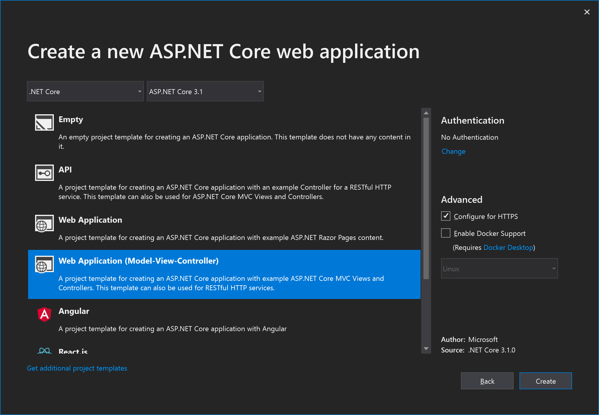

# Tutorial: Create an ASP.NET Core app with TypeScript in Visual Studio

In this tutorial for Visual Studio development ASP.NET Core and TypeScript, you create a simple web application, add some TypeScript code, and then run the app. 

::: moniker range="vs-2017"

If you haven't already installed Visual Studio, go to the [Visual Studio downloads](https://visualstudio.microsoft.com/vs/older-downloads/?utm_medium=microsoft&utm_source=docs.microsoft.com&utm_campaign=vs+2017+download) page to install it for free.

::: moniker-end

::: moniker range="vs-2019"

If you haven't already installed Visual Studio, go to the [Visual Studio downloads](https://visualstudio.microsoft.com/downloads) page to install it for free.

::: moniker-end

In this tutorial, you learn how to:
> [!div class="checklist"]
> * Create an ASP.NET Core project
> * Add the NuGet package for TypeScript support
> * Add some TypeScript code
> * Run the app

## Prerequisites

* You must have Visual Studio installed and the ASP.NET web development workload.

    ::: moniker range=">=vs-2019"
    If you haven't already installed Visual Studio 2019, go to the [Visual Studio downloads](https://visualstudio.microsoft.com/downloads/) page to install it for free.
    ::: moniker-end
    ::: moniker range="vs-2017"
    If you haven't already installed Visual Studio 2017, go to the [Visual Studio downloads](https://visualstudio.microsoft.com/downloads/) page to install it for free.
    ::: moniker-end

    If you need to install the workload but already have Visual Studio, go to **Tools** > **Get Tools and Features...**, which opens the Visual Studio Installer. Choose the **ASP.NET and web development** workload, then choose **Modify**.

## Create a new ASP.NET Core MVC project

Visual Studio manages files for a single application in a *project*. The project includes source code, resources, and configuration files.

In this tutorial, you begin with a simple project containing code for an ASP.NET Core MVC app.

1. Open Visual Studio.

1. Create a new project.

    ::: moniker range=">=vs-2019"
    Press **Esc** to close the start window. Type **Ctrl + Q** to open the search box, type **ASP.NET**, then choose **ASP.NET Core Web Application - C#**. In the dialog box that appears, choose **Create**.
    ::: moniker-end
    ::: moniker range="vs-2017"
    From the top menu bar, choose **File** > **New** > **Project**. In the left pane of the **New Project** dialog box, expand **JavaScript**, then choose **Node.js**. In the middle pane, choose **ASP.NET Core Web Application - C#**, then choose **OK**.
    ::: moniker-end
    If you don't see the **ASP.NET Core Web Application** project template, you must add the **ASP.NET and web development** workload. For detailed instructions, see the [Prerequisites](#prerequisites).

1. After you choose **Create**, select **Web Application (Model-View-Controller)** in the dialog box, and then choose **Create**.

   

    Visual Studio creates the new solution and opens your project in the right pane.

## Add some code

1. In Solution Explorer (right pane). right-click the project node and choose **Manage NuGet Packages**. In the **Browse** tab, search for **Microsoft.TypeScript.MSBuild**, and then click **Install** on the right to install the package.

   

   Visual Studio adds the NuGet package under the **Dependencies** node in Solution Explorer.

   > [!NOTE]
   > This tutorial requires the NuGet package. Alternatively, in your own apps, you may want to use the [TypeScript npm package](https://www.npmjs.com/package/typescript).

1. In Solution Explorer, right-click the project node and choose **Add > New Folder**. Use the name *scripts* for the new folder.

1. Right-click the *scripts* folder and choose **Add > New Item**. Choose the **TypeScript JSON Configuration File**, and then click **Add**.

   Visual Studio adds the *tsconfig.json* file to the *scripts* folder. You can use this file to configure options for the TypeScript compiler.

1. Open *tsconfig.json* and replace the default code with the following code:

   ```json
   {
     "compilerOptions": {
       "noImplicitAny": false,
       "noEmitOnError": true,
       "removeComments": false,
       "sourceMap": true,
       "target": "es5",
       "outDir": "../wwwroot/js"
     },
     "exclude": [
       "node_modules",
       "wwwroot"
     ]
   }
   ```

   The *outDir* option specifies the output folder for the plan JavaScript files that are transpiled by the TypeScript compiler.

   In other scenarios, you may want a different intermediate location for the transpiled JavaScript files, depending on your tools and configuration preferences, instead of *../wwwroot/js*.

1. Right-click the *scripts* folder and choose **Add > New Item**. Choose the **TypeScript File**, type the name *app.ts* for the filename, and then click **Add**.

   Visual Studio adds *app.ts* to the *scripts* folder.

1. Open *app.ts* and add the following TypeScript code.

    ```ts
    function TSButton() {
       let name: string = "Fred";
       document.getElementById("ts-example").innerHTML = greeter(user);
    }

    class Student {
       fullName: string;
       constructor(public firstName: string, public middleInitial: string, public lastName: string) {
           this.fullName = firstName + " " + middleInitial + " " + lastName;
       }
    }

    interface Person {
       firstName: string;
       lastName: string;
    }

    function greeter(person: Person) {
       return "Hello, " + person.firstName + " " + person.lastName;
    }

    let user = new Student("Fred", "M.", "Smith");
    ```

    Visual Studio provides IntelliSense support for your TypeScript code.

    As an example, remove `.lastName` from the `greeter` function, then retype the ".", and you see IntelliSense.

    

    Select `lastName` to add the last name back to the code.

1. Open the *Views / Home* folder, and then open *index.html*.

1. Add the following HTML code to the end of the file.

    ```html
    <div id="ts-example">
        <br />
        <button type="button" class="btn btn-primary btn-md" onclick="TSButton()">
            Click Me
        </button>
    </div>
    ```

1. Open the *Views / Shared* folder, and then open *_Layout.cshtml*.

1. Add the following script reference before the call to `@RenderSection("Scripts", required: false)`:

    ```js
    <script src="~/js/app.js"></script>
    ````

## Build the application

1. Choose **Build > Build Solution**.

   Although the app builds automatically when you run it, we want to take a look at something that happens during the build process.

1. Open the *wwwroot / js* folder, and you find two new files, *app.js* and the source map file, *app.js.map*. These files are generated by the TypeScript compiler.

   Source map files are required for debugging.

## Run the application

1. Press **F5** (**Debug** > **Start Debugging**) to run the application.

    The app opens in a browser.

    In the browser window, you will see the **Welcome** heading and the **Click Me** button.

    

1. Click the button to display the message we specified in the TypeScript file.

## Debug the application

1. Set a breakpoint in the `greeter` function in `app.ts` by clicking in the left margin in the code editor.

    

1. Press **F5** to run the application.

   You may need to respond to a message to enable script debugging.

   The application pauses at the breakpoint. Now, you can inspect variables and use debugger features.

## Next steps

> [!div class="nextstepaction"]
> [ASP.NET Core and TypeScript](https://www.typescriptlang.org/docs/handbook/asp-net-core.html)
