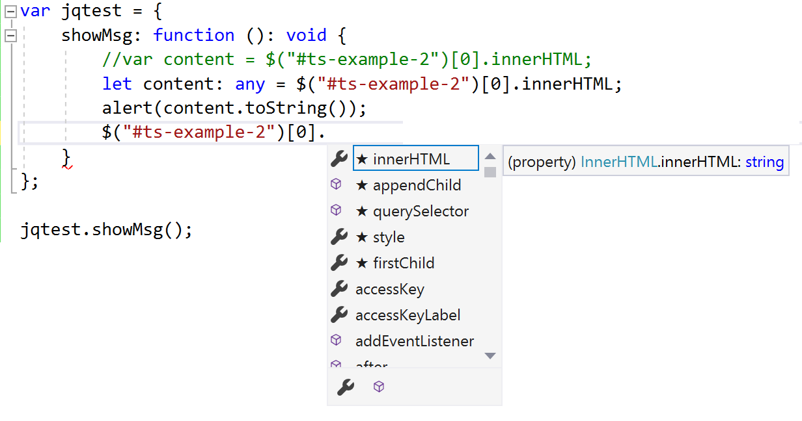
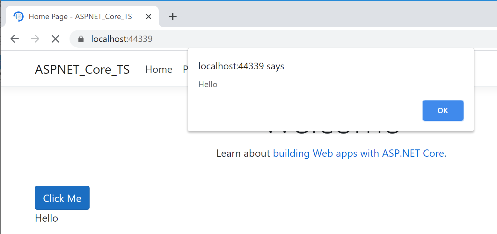

# Tutorial: Create an ASP.NET Core app with TypeScript in Visual Studio

 [!INCLUDE [Visual Studio](~/includes/applies-to-version/vs-windows-only.md)]

In this tutorial for Visual Studio development using ASP.NET Core and TypeScript, you create a simple web application, add some TypeScript code, and then run the app.

::: moniker range=">=vs-2022"

Starting in Visual Studio 2022, if you want to use Angular or Vue with ASP.NET Core, it is recommended that you use the ASP.NET Core Single Page Application (SPA) templates to create an ASP.NET Core app with TypeScript. For more information, see the Visual Studio tutorials for [Angular](../javascript/tutorial-asp-net-core-with-angular.md) or [Vue](../javascript/tutorial-asp-net-core-with-vue.md).
::: moniker-end

::: moniker range="vs-2019"

If you haven't already installed Visual Studio, go to the [Visual Studio downloads](https://visualstudio.microsoft.com/downloads) page to install it for free.

::: moniker-end

In this tutorial, you learn how to:
> [!div class="checklist"]
> * Create an ASP.NET Core project
> * Add the NuGet package for TypeScript support
> * Add some TypeScript code
> * Run the app
> * Add a third-party library using npm

## Prerequisites

* You must have Visual Studio installed and the ASP.NET web development workload.

    ::: moniker range=">=vs-2022"
    If you haven't already installed Visual Studio 2022, go to the [Visual Studio downloads](https://visualstudio.microsoft.com/downloads/) page to install it for free.
    ::: moniker-end
    ::: moniker range="vs-2019"
    If you haven't already installed Visual Studio 2019, go to the [Visual Studio downloads](https://visualstudio.microsoft.com/downloads/) page to install it for free.
    ::: moniker-end

    If you need to install the workload but already have Visual Studio, go to **Tools** > **Get Tools and Features...**, which opens the Visual Studio Installer. Choose the **ASP.NET and web development** workload, then choose **Modify**.

## Create a new ASP.NET Core MVC project

Visual Studio manages files for a single application in a *project*. The project includes source code, resources, and configuration files.

>[!NOTE]
> To start with an empty ASP.NET Core project and add a TypeScript frontend, see [ASP.NET Core with TypeScript](https://www.typescriptlang.org/docs/handbook/asp-net-core.html) instead.

In this tutorial, you begin with a simple project containing code for an ASP.NET Core MVC app.

1. Open Visual Studio.

1. Create a new project.

    ::: moniker range=">=vs-2022"
    In Visual Studio 2022, choose **Create a new project** in the start window. If the start window is not open, choose **File** > **Start Window**. Type **web app**, choose **C#** as the language, then choose **ASP.NET Core Web Application (Model-View-Controller)**, and then choose **Next**. On the next screen, name the project, and then choose **Next**.

    Choose either the recommended target framework or .NET 6, and then choose **Create**.
    ::: moniker-end
    ::: moniker range="vs-2019"
    In Visual Studio 2019, choose **Create a new project** in the start window. If the start window is not open, choose **File** > **Start Window**. Type **web app**, choose **C#** as the language, then choose **ASP.NET Core Web Application (Model-View-Controller)**, and then choose **Next**. On the next screen, name the project, and then choose **Next**.

    Choose either the recommended target framework or .NET 6, and then choose **Create**.
    ::: moniker-end

    If you don't see the **ASP.NET Core Web App** project template, you must add the **ASP.NET and web development** workload. For detailed instructions, see the [Prerequisites](#prerequisites).

    Visual Studio creates the new solution and opens your project in the right pane.

## Add some code

1. In Solution Explorer (right pane). right-click the project node and choose **Manage NuGet Packages**. In the **Browse** tab, search for **Microsoft.TypeScript.MSBuild**, and then click **Install** on the right to install the package.

   

   Visual Studio adds the NuGet package under the **Dependencies** node in Solution Explorer.

1. Right-click the project node and choose **Add > New Item**. Choose the **TypeScript JSON Configuration File**, and then click **Add**.

   Visual Studio adds the *tsconfig.json* file to the project root. You can use this file to [configure options](https://www.typescriptlang.org/docs/handbook/tsconfig-json.html) for the TypeScript compiler.

1. Open *tsconfig.json* and replace the default code with the following code:

   ```json
   {
     "compileOnSave": true,
     "compilerOptions": {
       "noImplicitAny": false,
       "noEmitOnError": true,
       "removeComments": false,
       "sourceMap": true,
       "target": "es5",
       "outDir": "wwwroot/js"
     },
     "include": [
       "scripts/**/*"
     ]
   }
   ```

   The *outDir* option specifies the output folder for the plain JavaScript files that are transpiled by the TypeScript compiler.

   This configuration provides a basic introduction to using TypeScript. In other scenarios, for example when using [gulp or webpack](https://www.typescriptlang.org/docs/handbook/asp-net-core.html), you may want a different intermediate location for the transpiled JavaScript files, depending on your tools and configuration preferences, instead of *wwwroot/js*.

1. In Solution Explorer, right-click the project node and choose **Add > New Folder**. Use the name *scripts* for the new folder.

1. Right-click the *scripts* folder and choose **Add > New Item**. Choose the **TypeScript File**, type the name *app.ts* for the filename, and then click **Add**.

   Visual Studio adds *app.ts* to the *scripts* folder.

1. Open *app.ts* and add the following TypeScript code.

    ```ts
    function TSButton() {
       let name: string = "Fred";
       document.getElementById("ts-example").innerHTML = greeter(user);
    }

    class Student {
       fullName: string;
       constructor(public firstName: string, public middleInitial: string, public lastName: string) {
           this.fullName = firstName + " " + middleInitial + " " + lastName;
       }
    }

    interface Person {
       firstName: string;
       lastName: string;
    }

    function greeter(person: Person) {
       return "Hello, " + person.firstName + " " + person.lastName;
    }

    let user = new Student("Fred", "M.", "Smith");
    ```

    Visual Studio provides IntelliSense support for your TypeScript code.

    To test this, remove `.lastName` from the `greeter` function, then retype the ".", and you see IntelliSense.

    

    Select `lastName` to add the last name back to the code.

1. Open the *Views/Home* folder, and then open *Index.cshtml*.

1. Add the following HTML code to the end of the file.

    ```html
    <div id="ts-example">
        <br />
        <button type="button" class="btn btn-primary btn-md" onclick="TSButton()">
            Click Me
        </button>
    </div>
    ```

1. Open the *Views/Shared* folder, and then open *_Layout.cshtml*.

1. Add the following script reference before the call to `@RenderSection("Scripts", required: false)`:

    ```js
    <script src="~/js/app.js"></script>
    ````

## Build the application

1. Choose **Build > Build Solution**.

   Although the app builds automatically when you run it, we want to take a look at something that happens during the build process.

1. Open the *wwwroot/js* folder, and you find two new files, *app.js* and the source map file, *app.js.map*. These files are generated by the TypeScript compiler.

   Source map files are required for debugging.

## Run the application

1. Press **F5** (**Debug** > **Start Debugging**) to run the application.

    The app opens in a browser.

    In the browser window, you will see the **Welcome** heading and the **Click Me** button.

    

1. Click the button to display the message we specified in the TypeScript file.

## Debug the application

1. Set a breakpoint in the `greeter` function in `app.ts` by clicking in the left margin in the code editor.

    

1. Press **F5** to run the application.

   You may need to respond to a message to enable script debugging.

   > [!NOTE]
   > Chrome or Edge is required for client-side script debugging.

   The application pauses at the breakpoint. Now, you can inspect variables and use debugger features.

## Add TypeScript support for a third-party library

1. Follow instructions in [npm package management](../javascript/npm-package-management.md#aspnet-core-projects) to add a `package.json` file to your project. This adds npm support to your project.

   >[!NOTE]
   > For ASP.NET Core projects, you can also use [Library Manager](/aspnet/core/client-side/libman/) or yarn instead of npm to install client-side JavaScript and CSS files.

1. In this example, add a TypeScript definition file for jQuery to your project. Include the following in your *package.json* file.

   ```json
   "devDependencies": {
      "@types/jquery": "3.3.33"
   }
   ```

   This adds TypeScript support for jQuery. The jQuery library itself is already included in the MVC project template (look under wwwroot/lib in Solution Explorer). If you are using a different template, you may need to include the jquery npm package as well.

1. If the package in Solution Explorer is not installed, right-click the npm node and choose **Restore Packages**.

   >[!NOTE]
   > In some scenarios, Solution Explorer may indicate that an npm package is out of sync with *package.json* due to a known issue described [here](https://github.com/aspnet/Tooling/issues/479). For example, the package may appear as not installed when it is installed. In most cases, you can update Solution Explorer by deleting *package.json*, restarting Visual Studio, and re-adding the *package.json* file as described earlier in this article.

1. In Solution Explorer, right-click the scripts folder and choose **Add** > **New Item**.

1. Choose **TypeScript File**, type *library.ts*, and choose **Add**.

1. In *library.ts*, add the following code.

   ```ts
   var jqtest = {
      showMsg: function (): void {
         let v: any = jQuery.fn.jquery.toString();
         let content: any = $("#ts-example-2")[0].innerHTML;
         alert(content.toString() + " " + v + "!!");
         $("#ts-example-2")[0].innerHTML = content + " " + v + "!!";
      }
   };

   jqtest.showMsg();
   ```

   For simplicity, this code displays a message using jQuery and an alert.

   With TypeScript type definitions for jQuery added, you get IntelliSense support on jQuery objects when you type a "." following a jQuery object, as shown here.

   

1. In _Layout.cshtml, update the script references to include `library.js`.

   ```html
   <script src="~/js/app.js"></script>
   <script src="~/js/library.js"></script>
   ```

1. In Index.cshtml, add the following HTML to the end of the file.

   ```html
   <div>
      <p id="ts-example-2">jQuery version is:</p>
   </div>
   ```

1. Press **F5** (**Debug** > **Start Debugging**) to run the application.

    The app opens in the browser.

    Click **OK** in the alert to see the page updated to **jQuery version is: 3.3.1!!**.

    

## Next steps

You may want to learn more details about using TypeScript with ASP.NET Core. If you are interested in Angular programming in Visual Studio, you can use the [Angular language service extension](https://devblogs.microsoft.com/visualstudio/angular-language-service-for-visual-studio) for Visual Studio.

> [!div class="nextstepaction"]
> [ASP.NET Core and TypeScript](https://www.typescriptlang.org/docs/handbook/asp-net-core.html)

> [!div class="nextstepaction"]
> [Angular language service extension](https://devblogs.microsoft.com/visualstudio/angular-language-service-for-visual-studio)
