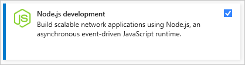
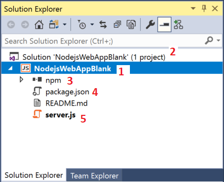
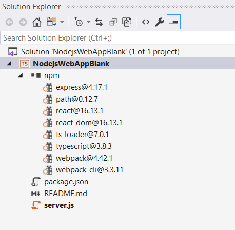
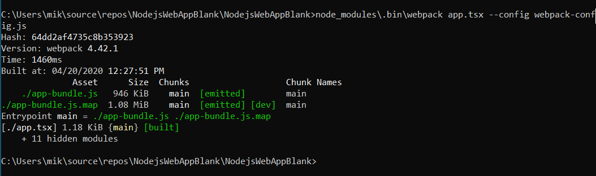
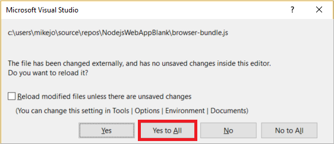
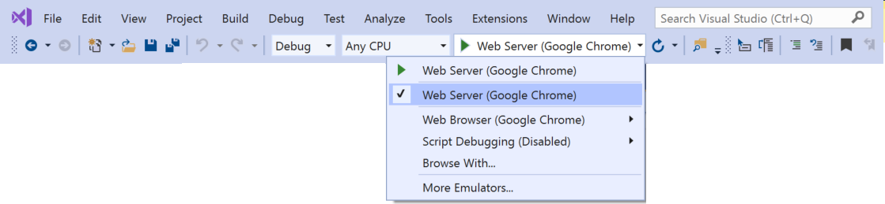
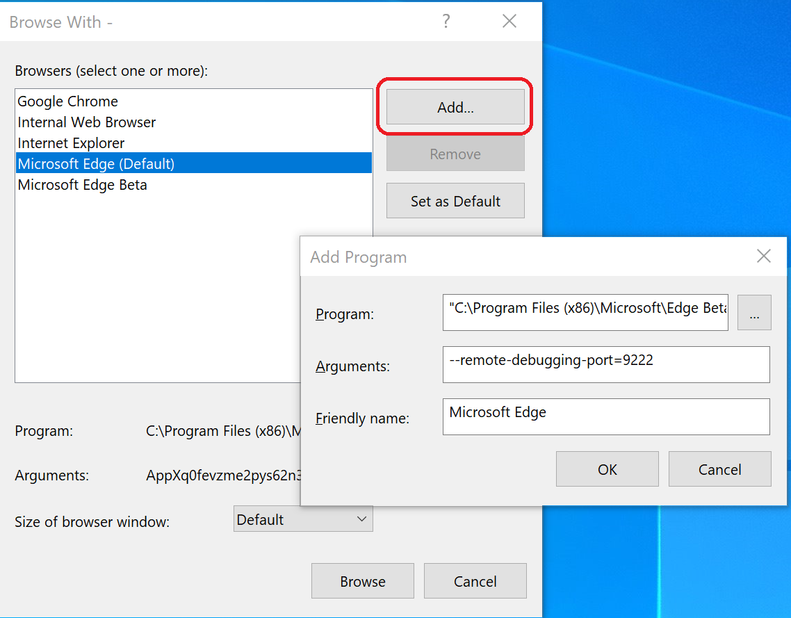
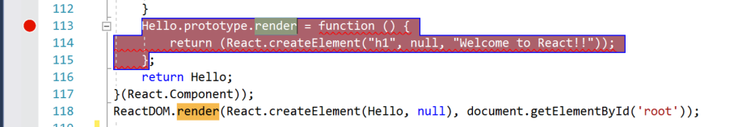
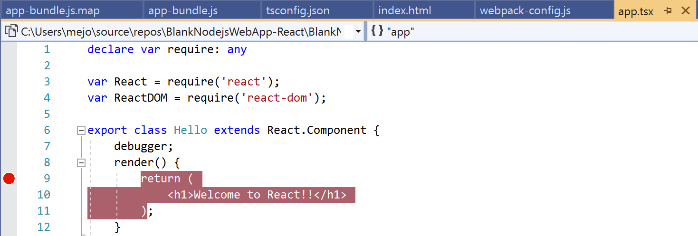
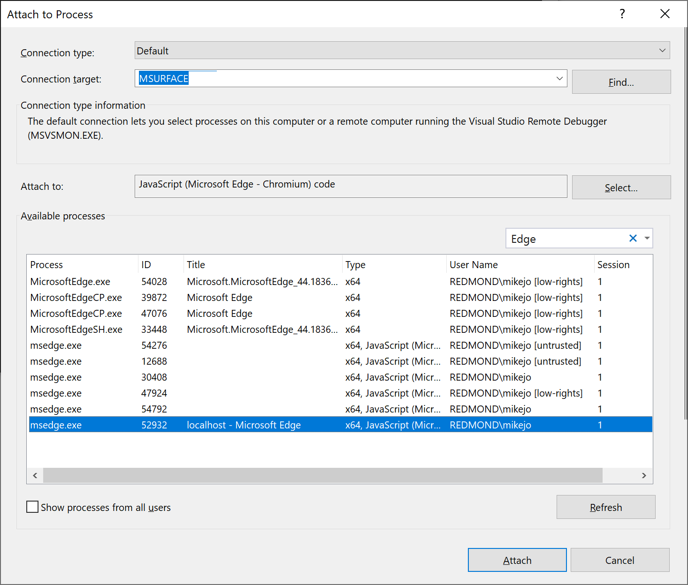

# Tutorial: Create a Node.js and React app in Visual Studio

With Visual Studio, you can easily create a Node.js project and use IntelliSense and other built-in features that support Node.js. In this tutorial, you create a Node.js web app project from a Visual Studio template. Then, you create a simple app using React.

In this tutorial, you learn how to:
> [!div class="checklist"]
> * Create a Node.js project
> * Add npm packages
> * Add React code to your app
> * Transpile JSX
> * Attach the debugger

> [!IMPORTANT]
> Starting in Visual Studio 2022, you can alternatively [create a React project](../javascript/tutorial-create-react-app.md) using the recommended [CLI-based project type](https://devblogs.microsoft.com/visualstudio/the-new-javascript-typescript-experience-in-vs-2022-preview-3/). Some of the information in this article applies only to the Node.js project type (.njsproj). The template used in this article is no longer available starting in Visual Studio 2022 version 17.8 Preview 2.

Before you begin, here's a quick FAQ to introduce you to some key concepts:

- **What is Node.js?**
  
  Node.js is a server-side JavaScript runtime environment that executes JavaScript code.

- **What is npm?**
  
  The default package manager for Node.js is npm. A package manager makes it easier to publish and share Node.js source code libraries. The npm package manager simplifies library installation, updating, and uninstallation.

- **What is React?**
  
  React is a front-end framework for creating a user interface (UI).

- **What is JSX?**
  
  JSX is a JavaScript syntax extension typically used with React to describe UI elements. You must transpile JSX code to plain JavaScript before it can run in a browser.

- **What is webpack?**

  Webpack bundles JavaScript files so they can run in a browser, and can also transform or package other resources and assets. Webpack can specify a compiler, such as Babel or TypeScript, to transpile JSX or TypeScript code to plain JavaScript.

## Prerequisites

This tutorial requires the following prerequisites:

- Visual Studio with the Node.js development workload installed.
  
  If you haven't yet installed Visual Studio:
  
  1. Go to the [Visual Studio downloads](https://visualstudio.microsoft.com/downloads/?cid=learn-onpage-download-cta) page to install Visual Studio for free.
     
  1. In the Visual Studio Installer, select the **Node.js development** workload, and select **Install**.
     
     
  
  If you have Visual Studio installed but need the Node.js workload:
  
  1. In Visual Studio, go to **Tools** > **Get Tools and Features**.
     
  1. In the Visual Studio Installer, choose the **Node.js development** workload, and select **Modify** to download and install the workload.
  
- The Node.js runtime installed:
  
  If you don't have the Node.js runtime installed, [install the LTS version from the Node.js website](https://nodejs.org/en/download/). The LTS version has the best compatibility with other frameworks and libraries.
  
  The Node.js tools in the Visual Studio Node.js workload support both Node.js 32-bit and 64-bit architecture versions. Visual Studio requires only one version, and the Node.js installer only supports one version at a time.
  
  Visual Studio usually detects the installed Node.js runtime automatically. If not, you can configure your project to reference the installed runtime:
  
  1. After you create a project, right-click the project node and select **Properties**.
     
  1. In the **Properties** pane, set the **Node.exe path** to reference a global or local installation of Node.js. You can specify the path to a local interpreter in each of your Node.js projects.

This tutorial was tested with Node.js 12.6.2.

## Create a project

First, create a Node.js web app project.

1. Open Visual Studio.

1. Create a new project.

    Press **Esc** to close the start window. Type **Ctrl + Q** to open the search box, type **Node.js**, then choose **Blank Node.js Web Application - JavaScript**. (Although this tutorial uses the TypeScript compiler, the steps require that you start with the **JavaScript** template.)
    
    In the dialog box that appears, choose **Create**.

    If you don't see the **Blank Node.js Web Application** project template, you must add the **Node.js development** workload. For detailed instructions, see the [Prerequisites](#prerequisites).

    Visual Studio creates the new solution and opens your project.

    

    (1) Highlighted in **bold** is your project, using the name you gave in the **New Project** dialog box. In the file system, this project is represented by a `.njsproj` file in your project folder. You can set properties and environment variables associated with the project by right-clicking the project and choosing **Properties** (or press **Alt** + **Enter**). You can do round-tripping with other development tools, because the project file does not make custom changes to the Node.js project source.

    (2) At the top level is a solution, which by default has the same name as your project. A solution, represented by a `.sln` file on disk, is a container for one or more related projects.

    (3) The npm node shows any installed npm packages. You can right-click the npm node to search for and install npm packages using a dialog box or install and update packages using the settings in `package.json` and right-click options in the npm node.

    (4) `package.json` is a file used by npm to manage package dependencies and package versions for locally installed packages. For more information, see [Manage npm packages](../javascript/npm-package-management.md).

    (5) Project files such as `server.js` show up under the project node. `server.js` is the project startup file and that is why it shows up in **bold**. You can set the startup file by right-clicking a file in the project and selecting **Set as Node.js startup file**.

## Add npm packages

This app requires the following npm modules to run correctly:

- react
- react-dom
- express
- path
- ts-loader
- typescript
- webpack
- webpack-cli

To install a package:

1. In **Solution Explorer**, right-click the **npm** node and select **Install New npm Packages**.
   
1. In the **Install New npm Packages** dialog box, search for the **react** package, and select **Install Package** to install it.

    

    In the **Install New npm Packages** dialog box, you can choose to install the most current package version or to specify a version. If you choose to install the current versions, but run into unexpected errors later, try installing the exact package versions listed in the next step.

    The **Output** window in the Visual Studio lower pane shows package installation progress. Open the **Output** window by selecting **View** > **Output** or pressing **Ctrl**+**Alt**+**O**. In the **Show output from** field of the **Output** window, select **Npm**.

    When installed, the **react** package appears under the **npm** node in **Solution Explorer**.

    The project's `package.json` file updates with the new package information, including the package version.

Instead of using the UI to search for and add the rest of the packages one at a time, you can paste the required package code into *package.json*.

1. From **Solution Explorer**, open **package.json** in the Visual Studio editor. Add the following `dependencies` section before the end of the file:

    ```json
    "dependencies": {
      "express": "^4.18.2",
      "path": "^0.12.7",
      "react": "^18.2.0",
      "react-dom": "^18.2.0",
      "ts-loader": "^9.4.2",
      "typescript": "^5.0.2",
      "webpack": "^5.76.3",
      "webpack-cli": "^5.0.1"
    },
    ```

    If the file already has a `dependencies` section, replace it with the preceding JSON code. For more information on using the `package.json` file, see [package.json configuration](configure-packages-with-package-json.md).

1. Press **Ctrl**+**S** or select **File** > **Save package.json** to save the changes.

1. In **Solution Explorer**, right-click the **npm** node in your project and select **Install npm Packages**.

    This command runs the npm install command directly to install all the packages listed in *packages.json*.

    Select the **Output** window in the lower pane to see installation progress. Installation might take a few minutes, and you might not see results immediately. Make sure that you select **Npm** in the **Show output from** field in the **Output** window.

    After installation, the npm modules appear in the **npm** node in **Solution Explorer**.

    

    > [!NOTE]
    > You can also install npm packages by using the command line. In **Solution Explorer**, right-click the project name and select **Open Command Prompt Here**. Use standard Node.js commands to install packages.

## Add project files

Next, add four new files to your project.

- *app.tsx*
- *webpack-config.js*
- *index.html*
- *tsconfig.json*

For this simple app, you add the new project files in the project root. For most apps, you add the files to subfolders and adjust relative path references accordingly.

1. In **Solution Explorer**, select the project name and press **Ctrl**+**Shift**+**A**, or right-click the project name and select **Add** > **New Item**.

   If you don't see all the item templates, choose **Show All Templates**, and then choose the item template.

1. In the **Add New Item** dialog box, choose **TypeScript JSX File**, type the name *app.tsx*, and select **Add** or **OK**.

1. Repeat these steps to add a **JavaScript file** named *webpack-config.js*.

1. Repeat these steps to add an **HTML file** named *index.html*.

1. Repeat these steps to add a **TypeScript JSON Configuration File** named *tsconfig.json*.

## Add app code

1. In **Solution Explorer**, open **server.js** and replace the existing code with the following code:

    ```javascript
    'use strict';
    var path = require('path');
    var express = require('express');

    var app = express();

    var staticPath = path.join(__dirname, '/');
    app.use(express.static(staticPath));

    // Allows you to set port in the project properties.
    app.set('port', process.env.PORT || 3000);

    var server = app.listen(app.get('port'), function() {
        console.log('listening');
    });
    ```

   The preceding code uses Express to start Node.js as your web application server. The code sets the port to the port number configured in the project properties, which by default is 1337. If you need to open the project properties, right-click the project name in **Solution Explorer** and select **Properties**.

1. Open **app.tsx** and add the following code:

    ```javascript
    declare var require: any

    var React = require('react');
    var ReactDOM = require('react-dom');

    export class Hello extends React.Component {
        render() {
            return (
                <h1>Welcome to React!!</h1>
            );
        }
    }

    ReactDOM.render(<Hello />, document.getElementById('root'));
    ```

    The preceding code uses JSX syntax and React to display a message.

1. Open **index.html** and replace the `body` section with the following code:

    ```html
    <body>
        <div id="root"></div>
        <!-- scripts -->
        <script src="./dist/app-bundle.js"></script>
    </body>
    ```

    This HTML page loads *app-bundle.js*, which contains the JSX and React code transpiled to plain JavaScript. Currently, *app-bundle.js* is an empty file. In the next section, you configure options to transpile the code.

## Configure webpack and TypeScript compiler options

Next, you add webpack configuration code to *webpack-config.js*. You add a simple webpack configuration that specifies an input file, *app.tsx*, and an output file, *app-bundle.js*, for bundling and transpiling JSX to plain JavaScript. For transpiling, you also configure some TypeScript compiler options. This basic configuration code is an introduction to webpack and the TypeScript compiler.

1. In **Solution Explorer**, open **webpack-config.js** and add the following code.

    ```json
    module.exports = {
        devtool: 'source-map',
        entry: "./app.tsx",
        mode: "development",
        output: {
            filename: "./app-bundle.js"
        },
        resolve: {
            extensions: ['.Webpack.js', '.web.js', '.ts', '.js', '.jsx', '.tsx']
        },
        module: {
            rules: [
                {
                    test: /\.tsx$/,
                    exclude: /(node_modules|bower_components)/,
                    use: {
                        loader: 'ts-loader'
                    }
                }
            ]
        }
    }
    ```

    The webpack configuration code instructs webpack to use the TypeScript loader to transpile the JSX.

1. Open **tsconfig.json** and replace the contents with the following code, which specifies the TypeScript compiler options:

    ```json
    {
      "compilerOptions": {
        "noImplicitAny": false,
        "module": "commonjs",
        "noEmitOnError": true,
        "removeComments": false,
        "sourceMap": true,
        "target": "es5",
        "jsx": "react"
      },
      "exclude": [
        "node_modules"
      ],
      "files": [
        "app.tsx"
      ]
    }
    ```

    The code specifies `app.tsx` as the source file.

1. Press **Ctrl**+**Shift**+**S** or select **File** > **Save All** to save all changes.

## Transpile the JSX

1. In **Solution Explorer**, right-click the project name and select **Open Command Prompt Here**.

1. In the command prompt, enter the following webpack command:

    `node_modules\.bin\webpack --config webpack-config.js`

    The command prompt window shows the result.

    

    If you see any errors instead of the preceding output, you must resolve them before your app will work. If your npm package versions are different than the versions this tutorial specifies, that can cause errors. To fix the errors, try the following:

    - Use the exact versions shown in the earlier step, if you didn't already

      Or, if you still see errors:

    - Install the most recent versions of the npm packages by right-clicking the npm node in Solution Explorer and choosing **Install npm packages**.

    If one or more package versions are deprecated and result in an error, you might need to install a more recent version to fix errors. For information on using `package.json` to control npm package versions, see [package.json configuration](../javascript/configure-packages-with-package-json.md).

1. In **Solution Explorer**, right-click the project node and select **Add** > **Existing Folder**.

1. Select the *dist* folder, and then select **Select Folder**.

    Visual Studio adds the *dist* folder, which contains *app-bundle.js* and *app-bundle.js.map*, to the project.

1. Open *app-bundle.js* to see the transpiled JavaScript code.

1. If prompted whether to reload externally modified files, select **Yes to All**.

    

Anytime you make changes to *app.tsx*, you must rerun the webpack command. To automate this step, you can add a build script to transpile the JSX.

### Add a build script to transpile the JSX

Visual Studio versions starting with Visual Studio 2019 require a build script. Instead of transpiling JSX at the command line, as shown in the preceding section, you can transpile JSX when building from Visual Studio.

1. Open `package.json` and add the following section after the `dependencies` section:

   ```json
   "scripts": {
    "build": "webpack-cli --config webpack-config.js"
   }
   ```

1. Save your changes.

## Run the app

1. In the **Debug** toolbar, select either **Web Server (Microsoft Edge)** or **Web Server (Google Chrome)** as the debug target.

    

    If you know your preferred debug target is available on your machine, but it doesn't appear as an option, select **Browse With** from the debug target dropdown list. Select your default browser target in the list, and select **Set as Default**.

1. To run the app, press **F5**, select the green arrow button, or select **Debug** > **Start Debugging**.

    A Node.js console window opens that shows the debugger listening port.

    Visual Studio starts the app by launching the startup file, *server.js*.

    

1. Close the browser and console windows.

## Set a breakpoint and run the app

Breakpoints are the most basic and essential feature of reliable debugging. A breakpoint indicates where Visual Studio should suspend your running code. You can then observe variable values, memory behavior, or whether a branch of code is running.

1. In *server.js*, click in the gutter to the left of the `staticPath` declaration to set a breakpoint:

    

1. To run the app, press **F5** or select **Debug** > **Start Debugging**.

    The debugger pauses at the breakpoint you set, with the current statement highlighted. Now, you can inspect your app state by hovering over variables that are currently in scope, using debugger windows like the **Locals** and **Watch** windows.

1. To continue running the app, press **F5**, select **Continue** in the **Debug** toolbar, or select **Debug** > **Continue**.

   If you want to use the Chrome Developer Tools or F12 Tools for Microsoft Edge, press **F12**. You can use these tools to examine the DOM and interact with the app by using the JavaScript Console.

1. Close the browser and console windows.

## Set and hit a breakpoint in the client-side React code

In the preceding section, you attached the debugger to server-side Node.js code. To attach to and hit breakpoints in the client-side React code, you have to attach the debugger to the correct process. Here's one way to enable a browser and attach a process for debugging.

### Enable the browser for debugging

You can use either Microsoft Edge or Google Chrome. Close all windows for the target browser. For Microsoft Edge, also shut down all instances of Chrome. Because both browsers share the Chromium code base, shutting down both browsers gives the best results.

Other browser instances can prevent the browser from opening with debugging enabled. Browser extensions might prevent full debug mode. You might need to use Task Manager to find and end all running Chrome instances.

To start your browser with debugging enabled:

1. Select **Browse With** from the dropdown list in the **Debug** toolbar. 
   
1. On the **Browse With** screen, with your preferred browser highlighted, select **Add**.
   
1. Enter the *--remote-debugging-port=9222* flag in the **Arguments** field.
   
1. Give the browser a new friendly name such as *Edge with debugging* or *Chrome with debugging*, and then select **OK**.
   
1. On the **Browse With** screen, select **Browse**.

    

- Alternatively, you can open the **Run** command by right-clicking the Windows **Start** button, and enter:
  
  `msedge --remote-debugging-port=9222`
  
  or
  
  `chrome.exe --remote-debugging-port=9222`

The browser starts with debugging enabled. The app isn't running yet, so the browser page is empty.

### Attach the debugger to client-side script

1. In the Visual Studio editor, set a breakpoint in either the *app-bundle.js* or `app.tsx` source code.

    - For *app-bundle.js*, set the breakpoint in the `render()` function. To find the `render()` function in the *app-bundle.js* file, press **Ctrl**+**F** or select **Edit** > **Find and Replace** > **Quick Find**, and enter *render* in the search field.

      

    - For *app.tsx*, set the breakpoint inside the `render()` function, on the `return` statement.

      

      If you set the breakpoint in *app.tsx*, also update *webpack-config.js* to replace the following code, and save your changes.

      Replace this code:

      ```javascript
      output: {
          filename: "./app-bundle.js",
      },
      ```

      With this code:

      ```javascript
      output: {
          filename: "./app-bundle.js",
          devtoolModuleFilenameTemplate: '[resource-path]'  // removes the webpack:/// prefix
      },
      ```

      This development-only setting enables debugging in Visual Studio. By default, webpack references in the source map file include the *webpack:///* prefix, which prevents Visual Studio from finding the source file *app.tsx*. This setting overrides the generated references in the source map file, *app-bundle.js.map*, when building the app. Specifically, this setting changes the reference to the source file from *webpack:///./app.tsx* to *./app.tsx*, which enables debugging.

1. Select your target browser as the debug target in Visual Studio, and then press **Ctrl**+**F5**, or select **Debug** > **Start Without Debugging**, to run the app in the browser.

    If you created a debugging-enabled browser configuration with a friendly name, choose that browser as your debug target.

    The app opens in a new browser tab.

1. Select **Debug** > **Attach to Process**, or press **Ctrl**+**Alt**+**P**.

    > [!TIP]
    > Once you attach to the process the first time, you can quickly reattach to the same process by selecting **Debug** > **Reattach to Process** or pressing **Shift**+**Alt**+**P**.

1. In the **Attach to Process** dialog box, get a filtered list of browser instances that you can attach to.

    Make sure the correct debugger for your target browser, **JavaScript (Chrome)** or **JavaScript (Microsoft Edge - Chromium)**, appears in the **Attach to** field. Type *chrome* or *edge* in the filter box to filter the results.

1. Select the browser process with the correct host port, `localhost` in this example. The port number **1337** or `localhost` might also appear in the **Title** field to help you select the correct process.

1. Select **Attach**.

    The following example shows an **Attach to Process** window for the Microsoft Edge browser.

    

    > [!TIP]
    > If the debugger doesn't attach and you see the message **Unable to attach to the process. An operation is not legal in the current state.**, use Task Manager to close all instances of the target browser before starting the browser in debugging mode. Browser extensions may be running and preventing full debug mode.

1. Because the code with the breakpoint already executed, refresh your browser page to hit the breakpoint.

    Depending on your environment, browser state, and which steps you followed earlier, you might hit the breakpoint in *app-bundle.js* or its mapped location in *app.tsx*. Either way, you can step through code and examine variables.

    While the debugger is paused, you can examine your app state by hovering over variables and using debugger windows. To step through code, press **F11** or select **Debug** > **Step Into**, or press **F10** or select **Debug** > **Step Over**. To continue running the code, press **F5** or select **Continue**. For more information on basic debugging features, see [First look at the debugger](../debugger/debugger-feature-tour.md).

   - If you can't break into code in *app.tsx*, retry using **Attach to Process** to attach the debugger as described in the previous steps. Make sure that your environment is set up correctly:

      - Close all browser instances, including Chrome extensions, by using the Task Manager. Make sure you start the browser in debug mode.

      - Make sure your source map file includes a reference to *./app.tsx* and not *webpack:///./app.tsx*, which prevents the Visual Studio debugger from locating *app.tsx*.

     Or, try using the `debugger;` statement in *app.tsx*, or set breakpoints in the Chrome Developer Tools or F12 Tools for Microsoft Edge instead.

   - If you can't break into code in *app-bundle.js*, remove the source map file, *app-bundle.js.map*.

## Next steps

> [!div class="nextstepaction"]
> [Deploy the app to Linux App Service](../javascript/publish-nodejs-app-azure.md)
