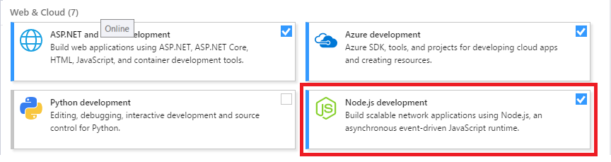
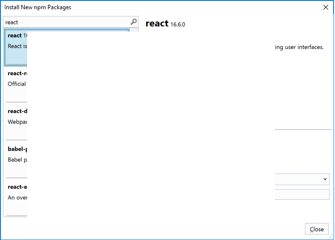
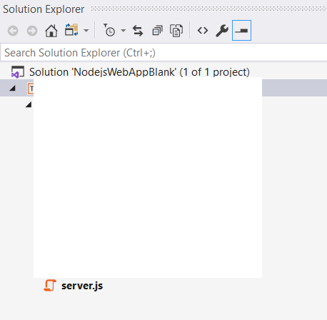
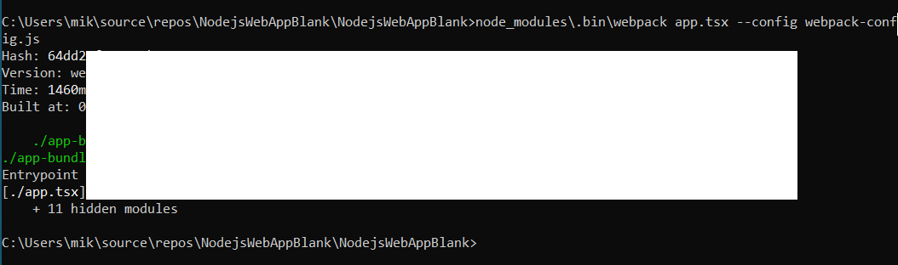
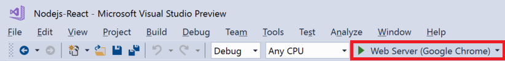

# Tutorial: Create a Node.js and React app in Visual Studio

Visual Studio allows you to easily create a Node.js project and experience IntelliSense and other built-in features that support Node.js. In this tutorial for Visual Studio, you create a Node.js web application project from a Visual Studio template. Then, you create a simple app using React.

In this tutorial, you learn how to:
> [!div class="checklist"]
> * Create a Node.js project
> * Add npm packages
> * Add React code to your app
> * Transpile JSX
> * Attach the debugger

## Before you begin

Here's a quick FAQ to introduce you to some key concepts.

### What is Node.js?

Node.js is a server-side JavaScript runtime environment that executes JavaScript server-side.

### What is npm?

npm is the default package manager for the Node.js. The package manager makes it easier for programmers to publish and share source code of Node.js libraries and is designed to simplify installation, updating, and uninstallation of libraries.

### What is React?

React is a front-end framework to create a UI.

### What is JSX?

JSX is a JavaScript syntax extension, typically used with React to describe UI elements. JSX code must be transpiled to plain JavaScript before it can run in a browser.

### What is webpack?

webpack bundles JavaScript files so they can run in a browser. It can also transform or package other resources and assets. It is often used to specify a compiler, such as Babel or TypeScript, to transpile JSX or TypeScript code to plain JavaScript.

## Prerequisites

* You must have Visual Studio installed and the Node.js development workload.

    ::: moniker range=">=vs-2019"
    If you haven't already installed Visual Studio 2019, go to the [Visual Studio downloads](https://visualstudio.microsoft.com/downloads/) page to install it for free.
    ::: moniker-end
    ::: moniker range="vs-2017"
    If you haven't already installed Visual Studio 2017, go to the [Visual Studio downloads](https://visualstudio.microsoft.com/downloads/) page to install it for free.
    ::: moniker-end

    If you need to install the workload but already have Visual Studio, go to **Tools** > **Get Tools and Features...**, which opens the Visual Studio Installer. Choose the **Node.js development** workload, then choose **Modify**.

    

* You must have the Node.js runtime installed.

    This tutorial was tested with version 10.16.0.

    If you don't have it installed, install the LTS version from the [Node.js](https://nodejs.org/en/download/) website. In general, Visual Studio automatically detects the installed Node.js runtime. If it does not detect an installed runtime, you can configure your project to reference the installed runtime in the properties page (after you create a project, right-click the project node and choose **Properties**).

## Create a project

First, create a Node.js web application project.

1. Open Visual Studio.

1. Create a new project.

    ::: moniker range=">=vs-2019"
    Press **Esc** to close the start window. Type **Ctrl + Q** to open the search box, type **Node.js**, then choose **Blank Node.js Web Application** (JavaScript). In the dialog box that appears, choose **Create**.
    ::: moniker-end
    ::: moniker range="vs-2017"
    From the top menu bar, choose **File** > **New** > **Project**. In the left pane of the **New Project** dialog box, expand **JavaScript**, then choose **Node.js**. In the middle pane, choose **Blank Node.js Web Application**, type the name **NodejsWebAppBlank**, then choose **OK**.
    ::: moniker-end
    If you don't see the **Blank Node.js Web Application** project template, you must add the **Node.js development** workload. For detailed instructions, see the [Prerequisites](#prerequisites).

    Visual Studio creates the new solution and opens your project.

    

    (1) Highlighted in **bold** is your project, using the name you gave in the **New Project** dialog box. In the file system, this project is represented by a *.njsproj* file in your project folder. You can set properties and environment variables associated with the project by right-clicking the project and choosing **Properties**. You can do round-tripping with other development tools, because the project file does not make custom changes to the Node.js project source.

    (2) At the top level is a solution, which by default has the same name as your project. A solution, represented by a *.sln* file on disk, is a container for one or more related projects.

    (3) The npm node shows any installed npm packages. You can right-click the npm node to search for and install npm packages using a dialog box or install and update packages using the settings in *package.json* and right-click options in the npm node.

    (4) *package.json* is a file used by npm to manage package dependencies and package versions for locally-installed packages. For more information on this file, see [package.json configuration](../javascript/configure-packages-with-package-json.md)

    (5) Project files such as *server.js* show up under the project node. *server.js* is the project startup file and that is why it shows up in **bold**. You can set the startup file by right-clicking a file in the project and selecting **Set as Node.js startup file**.

## Add npm packages

This app requires a number of npm modules to run correctly.

* react
* react-dom
* express
* path
* ts-loader
* typescript
* webpack
* webpack-cli

1. In Solution Explorer (right pane), right-click the **npm** node in the project and choose **Install New npm Packages**.

    In the **Install New npm Packages** dialog box, you can choose to install the most current package version or specify a version. If you choose to install the current version of these packages, but run into unexpected errors later, you may need to install the exact package versions described later in these steps.

1. In the **Install New npm Packages** dialog box, search for the react package, and select **Install Package** to install it.

    

    Select the **Output** window to see progress on installing the package (select **Npm** in the **Show output from** field). When installed, the package appears under the **npm** node.

    The project's *package.json* file is updated with the new package information including the package version.

1. Instead of using the UI to search for and add the rest of the packages one at a time, paste the following code into *package.json*. To do this, add a `dependencies` section with this code:

    ```json
    "dependencies": {
      "express": "~4.16.4",
      "path": "~0.12.7",
      "react": "~16.6.0",
      "react-dom": "~16.6.0",
      "ts-loader": "~5.3.0",
      "typescript": "~3.1.5",
      "webpack": "~4.23.1",
      "webpack-cli": "~3.1.2"
    }
    ```

    If there is already a `dependencies` section in your version of the blank template, just replace it with the preceding JSON code. For more information on use of this file, see [package.json configuration](../javascript/configure-packages-with-package-json.md).

1. Save the changes.

1. Right-click **npm** node in your project and choose **Update npm Packages**.

    In the lower pane, select the **Output** window to see progress on installing the packages. Installation may take a few minutes and you may not see results immediately. To see the output, make sure that you select **Npm** in the **Show output from** field in the **Output** window.

    Here are the npm modules as they appear in Solution Explorer after they are installed.

    

    > [!NOTE]
    > If you prefer to install npm packages using the command line, right-click the project node and choose **Open Command Prompt Here**. Use standard Node.js commands to install packages.

## Add project files

In these steps, you add four new files to your project.

* *app.tsx*
* *webpack-config.js*
* *index.html*
* *tsconfig.json*

For this simple app, you add the new project files in the project root. (In most apps, you typically add the files to subfolders and adjust relative path references accordingly.)

1. In Solution Explorer, right-click the project **NodejsWebAppBlank** and choose **Add** > **New Item**.

1. In the **Add New Item** dialog box, choose **TypeScript JSX file**, type the name *app.tsx*, and select **Add** or **OK**.

1. Repeat these steps to add *webpack-config.js*. Instead of a TypeScript JSX file, choose **JavaScript file**.

1. Repeat the same steps to add *index.html* to the project. Instead of a JavaScript file, choose **HTML file**.

1. Repeat the same steps to add *tsconfig.json* to the project. Instead of a JavaScript file, choose **TypeScript JSON Configuration file**.

## Add app code

1. Open *server.js* and replace the existing code with the following code:

    ```javascript
    'use strict';
    var path = require('path');
    var express = require('express');

    var app = express();

    var staticPath = path.join(__dirname, '/');
    app.use(express.static(staticPath));

    // Allows you to set port in the project properties.
    app.set('port', process.env.PORT || 3000);

    var server = app.listen(app.get('port'), function() {
        console.log('listening');
    });
    ```

   The preceding code uses Express to start Node.js as your web application server. This code sets the port to the port number configured in the project properties (by default, the port is configured to 1337 in the properties). To open the project properties, right-click the project in Solution Explorer and choose **Properties**.

1. Open *app.tsx* and add the following code:

    ```javascript
    declare var require: any

    var React = require('react');
    var ReactDOM = require('react-dom');

    export class Hello extends React.Component {
        render() {
            return (
                <h1>Welcome to React!!</h1>
            );
        }
    }

    ReactDOM.render(<Hello />, document.getElementById('root'));
    ```

    The preceding code uses JSX syntax and React to display a simple message.

1. Open *index.html* and replace the **body** section with the following code:

    ```html
    <body>
        <div id="root"></div>
        <!-- scripts -->
        <script src="./dist/app-bundle.js"></script>
    </body>
    ```

    This HTML page loads *app-bundle.js*, which contains the JSX and React code transpiled to plain JavaScript. Currently, *app-bundle.js* is an empty file. In the next section, you configure options to transpile the code.

## Configure webpack and TypeScript compiler options

In the previous steps, you added *webpack-config.js* to the project. Next, you add webpack configuration code. You will add a simple webpack configuration that specifies an input file (*app.tsx*) and an output file (*app-bundle.js*) for bundling and transpiling JSX to plain JavaScript. For transpiling, you also configure some TypeScript compiler options. This code is a basic configuration that is intended as an introduction to webpack and the TypeScript compiler.

1. In Solution Explorer, open *webpack-config.js* and add the following code.

    ```json
    module.exports = {
        devtool: 'source-map',
        entry: "./app.tsx",
        mode: "development",
        output: {
            filename: "./app-bundle.js"
        },
        resolve: {
            extensions: ['.Webpack.js', '.web.js', '.ts', '.js', '.jsx', '.tsx']
        },
        module: {
            rules: [
                {
                    test: /\.tsx$/,
                    exclude: /(node_modules|bower_components)/,
                    use: {
                        loader: 'ts-loader'
                    }
                }
            ]
        }
    }
    ```

    The webpack configuration code instructs webpack to use the TypeScript loader to transpile the JSX.

1. Open *tsconfig.json* and replace the default code with the following code, which specifies the TypeScript compiler options:

    ```json
    {
      "compilerOptions": {
        "noImplicitAny": false,
        "module": "commonjs",
        "noEmitOnError": true,
        "removeComments": false,
        "sourceMap": true,
        "target": "es5",
        "jsx": "react"
      },
      "exclude": [
        "node_modules"
      ],
      "files": [
        "app.tsx"
      ]
    }
    ```

    *app.tsx* is specified as the source file.

## Transpile the JSX

1. In Solution Explorer, right-click the project node and choose **Open Command Prompt Here**.

1. In the command prompt, type the following command:

    `node_modules\.bin\webpack app.tsx --config webpack-config.js`

    The command prompt window shows the result.

    

    If you see any errors instead of the preceding output, you must resolve them before your app will work. If your npm package versions are different than the versions shown in this tutorial, that can be a source of errors. One way to fix errors is to use the exact versions shown in the earlier steps. Also, if one or more of these package versions has been deprecated and results in an error, you may need to install a more recent version to fix errors. For information on using *package.json* to control npm package versions, see [package.json configuration](../javascript/configure-packages-with-package-json.md).

1. In Solution Explorer, right-click the project node and choose **Add** > **Existing Folder**, then choose the *dist* folder and choose **Select Folder**.

    Visual Studio adds the *dist* folder to the project, which contains *app-bundle.js* and *app-bundle.js.map*.

1. Open *app-bundle.js* to see the transpiled JavaScript code.

1. If prompted to reload externally modified files, select **Yes to All**.

    

Each time you make changes to *app.tsx*, you must rerun the webpack command. To automate this step, add a build script to transpile the JSX.

## Add a build script to transpile the JSX

Starting in Visual Studio 2019, a build script is required. Instead of transpiling JSX at the command line (as shown in the preceding section), you can transpile JSX when building from Visual Studio.

* Open *package.json* and add the following section after the `dependencies` section:

   ```json
   "scripts": {
    "build": "webpack-cli app.tsx --config webpack-config.js"
   }
   ```

## Run the app

1. Select either Microsoft Edge or Chrome as the current debug target.

    ::: moniker range=">=vs-2019"
    
    ::: moniker-end
    ::: moniker range="vs-2017"
    
    ::: moniker-end

    ::: moniker range=">=vs-2019"
    If Chrome is available on your machine, but does not show up as an option, choose **Web Browser (browsername)** > **Select Web Browser** from the debug target dropdown list, and select **Chrome** as the default browser target.
    ::: moniker-end
    ::: moniker range="vs-2017"
    If Chrome is available on your machine, but does not show up as an option, choose **Web Browser (browsername)** > **Google Chrome** from the debug target dropdown list, and select **Chrome** as the default browser target.
    ::: moniker-end

1. To run the app, press **F5** (**Debug** > **Start Debugging**) or the green arrow button.

    A Node.js console window opens that shows the port on which the debugger is listening.

    Visual Studio starts the app by launching the startup file, *server.js*.

    

1. Close the browser window.

1. Close the console window.

## Set a breakpoint and run the app

1. In *server.js*, click in the gutter to the left of the `staticPath` declaration to set a breakpoint:

    

    Breakpoints are the most basic and essential feature of reliable debugging. A breakpoint indicates where Visual Studio should suspend your running code so you can take a look at the values of variables, or the behavior of memory, or whether or not a branch of code is getting run.

1. To run the app, press **F5** (**Debug** > **Start Debugging**).

    The debugger pauses at the breakpoint you set (the current statement is marked in yellow). Now, you can inspect your app state by hovering over variables that are currently in scope, using debugger windows like the **Locals** and **Watch** windows.

1. Press **F5** to continue the app.

1. If you want to use the Chrome Developer Tools or F12 Tools for Microsoft Edge, press **F12**. You can use these tools to examine the DOM and interact with the app using the JavaScript Console.

1. Close the web browser and the console.

## Set and hit a breakpoint in the client-side React code

In the preceding section, you attached the debugger to server-side Node.js code. To attach the debugger from Visual Studio and hit breakpoints in client-side React code, the debugger needs help to identify the correct process. Here is one way to enable this.

### Prepare the browser for debugging

::: moniker range=">=vs-2019"
For this scenario, use either Microsoft Edge (Chromium), currently named **Microsoft Edge Beta** in the IDE, or Chrome.
::: moniker-end
::: moniker range="vs-2017"
For this scenario, use Chrome.
::: moniker-end

1. Close all windows for the target browser.

   Other browser instances can prevent the browser from opening with debugging enabled. (Browser extensions may be running and preventing full debug mode, so you may need to open Task Manager to find unexpected instances of Chrome.)

   ::: moniker range=">=vs-2019"
   For Microsoft Edge (Chromium), also shut down all instances of Chrome. Because both browsers share the chromium code base, this gives the best results.
   ::: moniker-end

   ::: moniker range=">=vs-2019"
   For Microsoft Edge (Chromium), also shut down all instances of Chrome. Because both browsers use the chromium code base, this gives the best results.
   ::: moniker-end

2. Start your browser with debugging enabled.

    ::: moniker range=">=vs-2019"
    Starting in Visual Studio 2019, you can set the `--remote-debugging-port=9222` flag at browser launch by selecting **Browse With...** > from the **Debug** toolbar, then choosing **Add**, and then setting the flag in the **Arguments** field. Use a different friendly name for the browser such as **Edge with Debugging** or **Chrome with Debugging**. For details, see the [Release Notes](/visualstudio/releases/2019/release-notes-v16.2).

    

    Alternatively, open the **Run** command from the Windows **Start** button (right-click and choose **Run**), and enter the following command:

    `msedge --remote-debugging-port=9222`

    or,

    `chrome.exe --remote-debugging-port=9222`
    ::: moniker-end

    ::: moniker range="vs-2017"
    Open the **Run** command from the Windows **Start** button (right-click and choose **Run**), and enter the following command:

    `chrome.exe --remote-debugging-port=9222`
    ::: moniker-end

    This starts your browser with debugging enabled.

    The app is not yet running, so you get an empty browser page.

### Attach the debugger to client-side script

1. Switch to Visual Studio and then set a breakpoint in your source code, either *app-bundle.js*  or *app.tsx*.

    For *app-bundle.js*, set the breakpoint in the `render()` function as shown in the following illustration:

    

    To find the `render()` function in the transpiled *app-bundle.js* file, use **Ctrl**+**F** (**Edit** > **Find and Replace** > **Quick Find**).

    For *app.tsx*, set the breakpoint inside the `render()` function, on the `return` statement.

    

2. If you are setting the breakpoint in the *.tsx* file (rather than *app-bundle.js*), you need to update *webpack-config.js*. Replace the following code:

    ```javascript
    output: {
        filename: "./app-bundle.js",
    },
    ```

    with this code:

    ```javascript
    output: {
        filename: "./app-bundle.js",
        devtoolModuleFilenameTemplate: '[resource-path]'  // removes the webpack:/// prefix
    },
    ```

    This is a development-only setting to enable debugging in Visual Studio. This setting allows you to override the generated references in the source map file, *app-bundle.js.map*, when building the app. By default, webpack references in the source map file include the *webpack:///* prefix, which prevents Visual Studio from finding the source file, *app.tsx*. Specifically, when you make this change, the reference to the source file, *app.tsx*, gets changed from *webpack:///./app.tsx* to *./app.tsx*, which enables debugging.

3. Select your target browser as the debug target in Visual Studio, then press **Ctrl**+**F5** (**Debug** > **Start Without Debugging**) to run the app in the browser.

    ::: moniker range=">=vs-2019"
    If you created a browser configuration with a friendly name, choose that as your debug target.
    ::: moniker-end

    The app opens in a new browser tab.

4. Choose **Debug** > **Attach to Process**.

    > [!TIP]
    > Starting in Visual Studio 2017, once you attach to the process the first time by following these steps, you can quickly reattach to the same process by choosing **Debug** > **Reattach to Process**.

5. In the **Attach to Process** dialog box, get a filtered list of browser instances that you can attach to.

    ::: moniker range=">=vs-2019"
    In Visual Studio 2019, choose the correct debugger for your target browser, **JavaScript (Chrome)** or **JavaScript (Microsoft Edge - Chromium)** in the **Attach to** field, type **chrome** or **edge** in the filter box to filter the search results.
    ::: moniker-end
    ::: moniker range="vs-2017"
    In Visual Studio 2017, choose **Webkit code** in the **Attach to** field, type **chrome** in the filter box to filter the search results.
    ::: moniker-end

6. Select the browser process with the correct host port (localhost in this example), and select **Attach**.

    The port (1337) may also appear in the **Title** field to help you select the correct browser instance.

    ::: moniker range=">=vs-2019"
    The following example shows how this looks for the Microsoft Edge (Chromium) browser.

    
    ::: moniker-end
    ::: moniker range="vs-2017"
    

    You know the debugger has attached correctly when the DOM Explorer and the JavaScript Console open in Visual Studio. These debugging tools are similar to Chrome Developer Tools and F12 Tools for Microsoft Edge.
    ::: moniker-end

    > [!TIP]
    > If the debugger does not attach and you see the message "Unable to attach to the process. An operation is not legal in the current state.", use the Task Manager to close all instances of the target browser before starting the browser in debugging mode. Browser extensions may be running and preventing full debug mode.

7. Because the code with the breakpoint already executed, refresh your browser page to hit the breakpoint.

    While paused in the debugger, you can examine your app state by hovering over variables and using debugger windows. You can advance the debugger by stepping through code (**F5**, **F10**, and **F11**). For more information on basic debugging features, see [First look at the debugger](../debugger/debugger-feature-tour.md).

    You may hit the breakpoint in either *app-bundle.js* or its mapped location in *app.tsx*, depending on which steps you followed previously, along with your environment and browser state. Either way, you can step through code and examine variables.

   * If you need to break into code in *app.tsx* and are unable to do it, use **Attach to Process** as described in the previous steps to attach the debugger. Make sure you that your environment is set up correctly:

      * You closed all browser instances, including Chrome extensions (using the Task Manager), so that you can run the browser in debug mode. Make sure you start the browser in debug mode.

      * Make sure that your source map file includes a reference to *./app.tsx* and not *webpack:///./app.tsx*, which prevents the Visual Studio debugger from locating *app.tsx*.
       Alternatively, if you need to break into code in *app.tsx* and are unable to do it, try using the `debugger;` statement in *app.tsx*, or set breakpoints in the Chrome Developer Tools (or F12 Tools for Microsoft Edge) instead.

   * If you need to break into code in *app-bundle.js* and are unable to do it, remove the source map file, *app-bundle.js.map*.

## Next steps

> [!div class="nextstepaction"]
> [Deploy the app to Linux App Service](../javascript/publish-nodejs-app-azure.md)
