# Tutorial: Create a Node.js and Express app in Visual Studio

This tutorial for Visual Studio development uses Node.js and Express. In this tutorial, you create a simple Node.js web app, add some code, explore some features of the IDE, and run the app. 

In this tutorial, you learn how to:

> [!div class="checklist"]
> * Create a Node.js project
> * Add some code
> * Use IntelliSense to edit code
> * Run the app
> * Hit a breakpoint in the debugger

Before you begin, here's a quick FAQ to introduce you to some key concepts:

- **What is Node.js?**
  
  Node.js is a server-side JavaScript runtime environment that executes JavaScript code.

- **What is npm?**
  
  A package manager makes it easier to publish and share Node.js source code libraries. The default package manager for Node.js is npm. The npm package manager simplifies library installation, updating, and uninstallation.

- **What is Express?**
  
  Express is a server web application framework that Node.js uses to build web apps. With Express, you can use different front-end frameworks to create a user interface. This tutorial uses Pug, formerly called Jade, for its front-end framework.

## Prerequisites

This tutorial requires the following prerequisites:

- Visual Studio with the Node.js development workload installed.
  
  If you haven't yet installed Visual Studio:
  
  1. Go to the [Visual Studio downloads](https://visualstudio.microsoft.com/downloads) page to install Visual Studio for free.
     
  1. In the Visual Studio Installer, select the **Node.js development** workload, and select **Install**.
     
     
  
  If you have Visual Studio installed already:
  
  1. In Visual Studio, go to **Tools** > **Get Tools and Features**.
     
  1. In the Visual Studio Installer, choose the **Node.js development** workload, and select **Modify** to download and install the workload.
  
- The Node.js runtime installed:
  
  If you don't have the Node.js runtime installed, [install the LTS version from the Node.js website](https://nodejs.org/en/download/). The LTS version has the best compatibility with other frameworks and libraries.
  
  The Node.js tools in the Visual Studio Node.js workload support both Node.js 32-bit and 64-bit architecture versions. Visual Studio requires only one version, and the Node.js installer only supports one version at a time.
  
  Visual Studio usually detects the installed Node.js runtime automatically. If not, you can configure your project to reference the installed runtime:
  
  1. After you create a project, right-click the project node and select **Properties**.
     
  1. In the **Properties** pane, set the **Node.exe path** to reference a global or local installation of Node.js. You can specify the path to a local interpreter in each of your Node.js projects.

::: moniker range=">=vs-2022"
This tutorial was tested with Node.js 14.17.5.
::: moniker-end
::: moniker range="<=vs-2019"
This tutorial was tested with Node.js 8.10.0.
::: moniker-end

## Create a new Node.js project

Visual Studio manages files for a single application in a *project*. The project includes source code, resources, and configuration files.

In this tutorial, you begin with a simple project that has code for a Node.js and Express app.

::: moniker range=">=vs-2022"
1. Open Visual Studio, and press **Esc** to close the start window.
   
1. Press **Ctrl**+**Q**, type *node.js* in the search box, and then choose **Basic Azure Node.js Express 4 Application - JavaScript** from the dropdown list.
   
   If you don't see the **Basic Azure Node.js Express 4 Application** choice, you need to install the Node.js development workload. For instructions, see the [Prerequisites](#prerequisites).
   
1. In the **Configure your new project** dialog box, select **Create**.
   
   Visual Studio creates the new solution and project, and opens the project in the right pane. The *app.js* project file opens in the editor in the left pane.
   
1. Look at the project structure in **Solution Explorer** in the right pane.
   
   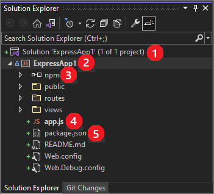
   
   - At the top level is the *solution* (**1**), which by default has the same name as your project. A solution, represented by a *.sln* file on disk, is a container for one or more related projects.
   
   - Your project (**2**), using the name you gave in the **Configure your new project** dialog box, is highlighted in bold. In the file system, the project is a *.njsproj* file in your project folder.
     
     You can see and set project properties and environment variables by right-clicking the project and selecting **Properties** from the context menu. You can work with other development tools, because the project file doesn't make custom changes to the Node.js project source.
   
   - The **npm** node (**3**) shows any installed npm packages. You can right-click the npm node to search for and install npm packages by using a dialog box.
     
     You can install and update packages by using the settings in *package.json* and the right-click options in the **npm** node.
   
   - Project files (**4**) appear under the project node. The project startup file, **app.js**, shows in bold.
     
     You can set the startup file by right-clicking a file in the project and selecting **Set as Node.js startup file**.

   - Npm uses the **package.json** file (**5**) to manage dependencies and versions for locally installed packages. For more information, see [Manage npm packages](npm-package-management.md).
   
1. Open the **npm** node to make sure all the required npm packages are present.
   
   If any packages show as **(missing)**, right-click the **npm** node, select **Install npm Packages**, and install the missing packages.
:::moniker-end
:::moniker range="vs-2019"
1. Open Visual Studio.

1. Create a new project.

    Press **Esc** to close the start window. Type **Ctrl + Q** to open the search box, type **Node.js**, then choose **Create a new Basic Azure Node.js Express 4 application** (JavaScript). In the dialog box that appears, choose **Create**.
    
    If you don't see the **Basic Azure Node.js Express 4 application** project template, you must add the **Node.js development** workload. For instructions, see the [Prerequisites](#prerequisites).

    Visual Studio creates the new solution and opens your project in the right pane. The *app.js* project file opens in the editor (left pane).

    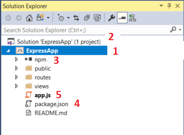

    (1) Highlighted in **bold** is your project, using the name you gave in the **New Project** dialog box. In the file system, this project is represented by a *.njsproj* file in your project folder. You can set properties and environment variables associated with the project by right-clicking the project and choosing **Properties**. You can do round-tripping with other development tools, because the project file does not make custom changes to the Node.js project source.

    (2) At the top level is a solution, which by default has the same name as your project. A solution, represented by a *.sln* file on disk, is a container for one or more related projects.

    (3) The npm node shows any installed npm packages. You can right-click the npm node to search for and install npm packages using a dialog box or install and update packages using the settings in *package.json* and right-click options in the npm node.

    (4) *package.json* is a file used by npm to manage package dependencies and package versions for locally installed packages. For more information, see [Manage npm packages](../javascript/npm-package-management.md).

    (5) Project files such as *app.js* show up under the project node. *app.js* is the project startup file and that is why it shows up in **bold**. You can set the startup file by right-clicking a file in the project and selecting **Set as Node.js startup file**.

1. Open the **npm** node and make sure that all the required npm packages are present.

    If any packages are missing (exclamation point icon), you can right-click the **npm** node and choose **Install npm Packages**.
:::moniker-end
:::moniker range="vs-2017"
1. Open Visual Studio.

1. Create a new project.

    From the top menu bar, choose **File** > **New** > **Project**. In the left pane of the **New Project** dialog box, expand **JavaScript**, then choose **Node.js**. In the middle pane, choose **Basic Azure Node.js Express 4 application**, then choose **OK**.
    
    If you don't see the **Basic Azure Node.js Express 4 application** project template, you must add the **Node.js development** workload. For instructions, see the [Prerequisites](#prerequisites).

    Visual Studio creates the new solution and opens your project in the right pane. The *app.js* project file opens in the editor (left pane).

    

    (1) Highlighted in **bold** is your project, using the name you gave in the **New Project** dialog box. In the file system, this project is represented by a *.njsproj* file in your project folder. You can set properties and environment variables associated with the project by right-clicking the project and choosing **Properties**. You can do round-tripping with other development tools, because the project file does not make custom changes to the Node.js project source.

    (2) At the top level is a solution, which by default has the same name as your project. A solution, represented by a *.sln* file on disk, is a container for one or more related projects.

    (3) The npm node shows any installed npm packages. You can right-click the npm node to search for and install npm packages using a dialog box or install and update packages using the settings in *package.json* and right-click options in the npm node.

    (4) *package.json* is a file used by npm to manage package dependencies and package versions for locally installed packages. For more information, see [Manage npm packages](../javascript/npm-package-management.md).

    (5) Project files such as *app.js* show up under the project node. *app.js* is the project startup file and that is why it shows up in **bold**. You can set the startup file by right-clicking a file in the project and selecting **Set as Node.js startup file**.

1. Open the **npm** node and make sure that all the required npm packages are present.

    If any packages are missing (exclamation point icon), you can right-click the **npm** node and choose **Install npm Packages**.
    ::: moniker-end

## Add some code

The application uses Pug for the front-end JavaScript framework. Pug uses simple markup code that compiles to HTML.

Pug is set as the view engine in *app.js*, with the code `app.set('view engine', 'pug');`.

1. In **Solution Explorer**, open the **views** folder, and then select **index.pug** to open the file.

1. Replace the file contents with the following markup.

    ```js
    extends layout

    block content
      h1= title
      p Welcome to #{title}
      script.
        var f1 = function() { document.getElementById('myImage').src='#{data.item1}' }
      script.
        var f2 = function() { document.getElementById('myImage').src='#{data.item2}' }
      script.
        var f3 = function() { document.getElementById('myImage').src='#{data.item3}' }

      button(onclick='f1()') One!
      button(onclick='f2()') Two!
      button(onclick='f3()') Three!
      p
      a: img(id='myImage' height='300' width='300' src='')
    ```

    The preceding code dynamically generates an HTML page with a title and welcome message. The page also includes code to display an image that changes whenever you press a button.

1. In the **routes** folder, open **index.js**.

1. Add the following code before the `router.get` function call:

    ```js
    var getData = function () {
        var data = {
            'item1': 'https://images.unsplash.com/photo-1563422156298-c778a278f9a5',
            'item2': 'https://images.unsplash.com/photo-1620173834206-c029bf322dba',
            'item3': 'https://images.unsplash.com/photo-1602491673980-73aa38de027a'
        }
        return data;
    }
    ````

    This code creates a data object that you pass to the dynamically generated HTML page.

1. Replace the `router.get` function call with the following code:

    ```js
    router.get('/', function (req, res) {
        res.render('index', { title: 'Express', "data" });
    });
    ```

    The preceding code sets the current page using the Express router object and renders the page, passing the title and data object to the page. The code specifies the *index.pug* file as the page to load when *index.js* runs. The *app.js* code, not shown here, configures *index.js* as the default route.

    To demonstrate several Visual Studio features, there's a deliberate error in the line of code that contains `res.render`. In the next section, IntelliSense helps you fix the error so the app can run.

## Use IntelliSense

IntelliSense is a Visual Studio tool that helps you as you write code.

1. In *index.js* in the Visual Studio code editor, go to the line of code that contains `res.render`.

1. Put your cursor after the `"data"` string and type `: get`. IntelliSense displays the `getData` function you defined earlier in the code. Select `getData`.

    ::: moniker range=">=vs-2022"
    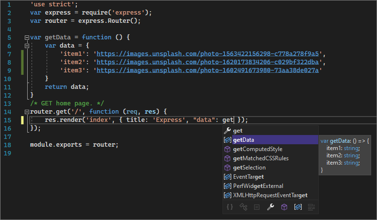
    ::: moniker-end
    ::: moniker range="<=vs-2019"
    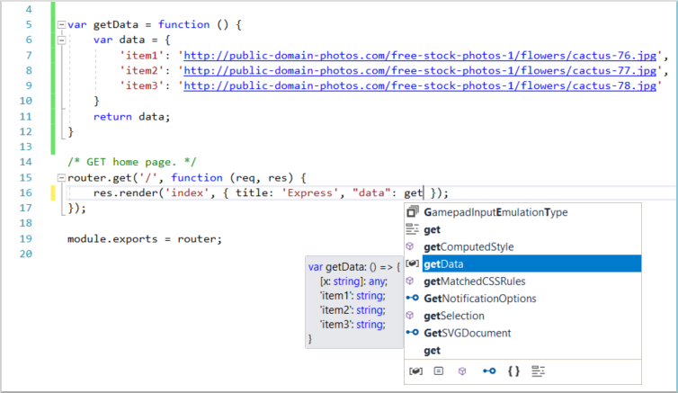
    ::: moniker-end

1. Add parentheses to make the code a function call: `getData()`.

1. Remove the comma before `"data"`. Green syntax highlighting appears on the expression. Hover over the syntax highlighting.

    ::: moniker range=">=vs-2022"
    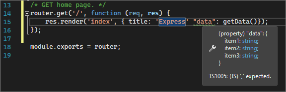
    ::: moniker-end
    ::: moniker range="<=vs-2019"
    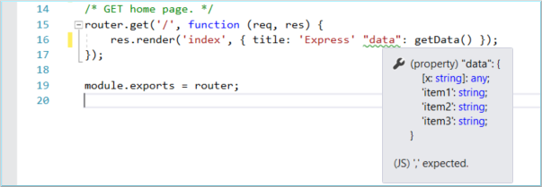
    ::: moniker-end

    The last line of the message tells you that the JavaScript interpreter expected a comma.

1. In the lower pane, select the **Error List** tab, and select **Build + IntelliSense** from the dropdown list for the type of issues reported.

    The pane displays the warning and description along with the filename and line number.

    ::: moniker range=">=vs-2022"
    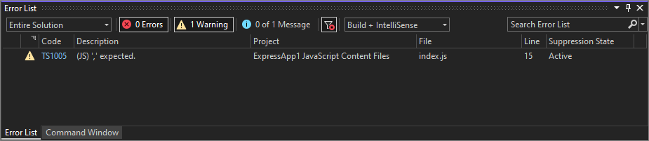
    ::: moniker-end
    ::: moniker range="<=vs-2019"
    
    ::: moniker-end

1. Fix the code by replacing the comma before `"data"`.

    The corrected line of code should look like this: `res.render('index', { title: 'Express', "data": getData() });`

## Run the app

Next, run the app with the Visual Studio debugger attached. Before you do that, you need to set a breakpoint.

### Set a breakpoint

Breakpoints are the most basic and essential feature of reliable debugging. A breakpoint indicates where Visual Studio should suspend your running code. You can then observe variable values, memory behavior, or whether a branch of code is running.

- To set a breakpoint, in *index.js*, click in the left gutter before the following line of code:

  `res.render('index', { title: 'Express', "data": getData() });`

  ::: moniker range=">=vs-2022"
  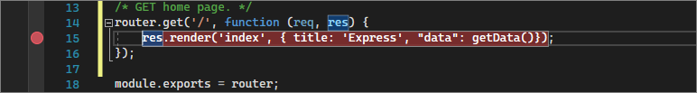
  ::: moniker-end
  ::: moniker range="<=vs-2019"
  
  ::: moniker-end

### Run the app in Debug mode

1. Select the debug target in the **Debug** toolbar, such as **Web Server (Google Chrome)** or **Web Server (Microsoft Edge)**.

    ::: moniker range=">=vs-2022"
    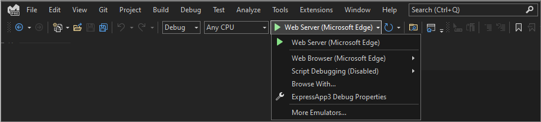
    ::: moniker-end
    ::: moniker range="vs-2019"
    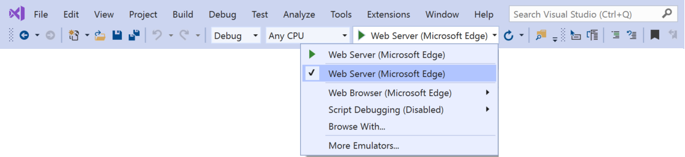
    ::: moniker-end
    ::: moniker range="vs-2017"
    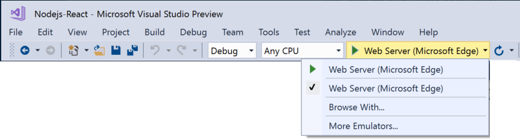
    ::: moniker-end

    If you know your preferred debug target is available on your machine, but it doesn't appear as an option, select **Browse With** from the debug target dropdown list. Select your default browser target in the list, and select **Set as Default**.

1. Press **F5** or select **Debug** > **Start Debugging** to run the app.

    The debugger pauses at the breakpoint you set, so you can inspect your app state.

1. Hover over `getData` to see its properties in a DataTip:

    ::: moniker range=">=vs-2022"
    [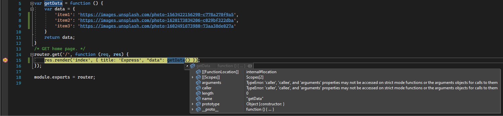](media/vs-2022/tutorial-nodejs-inspect-variables.png#lightbox)
    ::: moniker-end
    ::: moniker range="<=vs-2019"
    
    ::: moniker-end

1. Press **F5** or select **Debug** > **Continue** to continue running the app.

    The app opens in a browser. In the browser window, you should see **Express** as the title and **Welcome to Express** as the first paragraph.

1. Select the **One!**, **Two!**, and **Three!** buttons to display different images.

    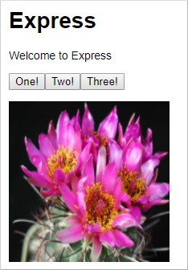

1. Close the web browser.

## Publish to Azure App Service (optional)

::: moniker range=">=vs-2022"
1. In **Solution Explorer**, right-click the project and select **Publish**. 
   
   - If prompted, select **Add a publish profile**.
   - If you're prompted to install Azure WebJob Tools, select **Install**.
   
1. On the first **Publish** screen, select **Azure**, and then select **Next**.
   
   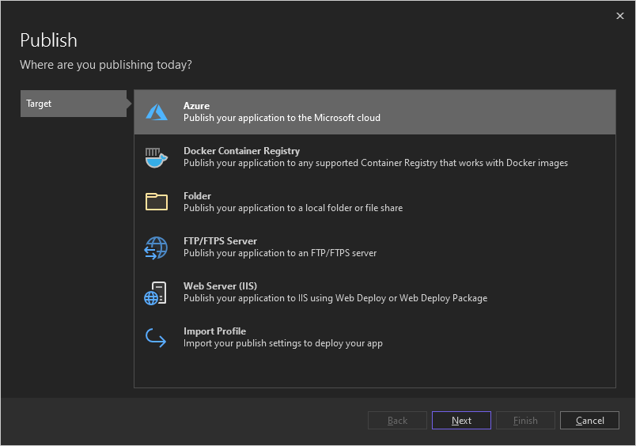
   
   
1. On the second **Publish** screen, select **Azure App Service (Windows)**, and then select **Next**.
   
   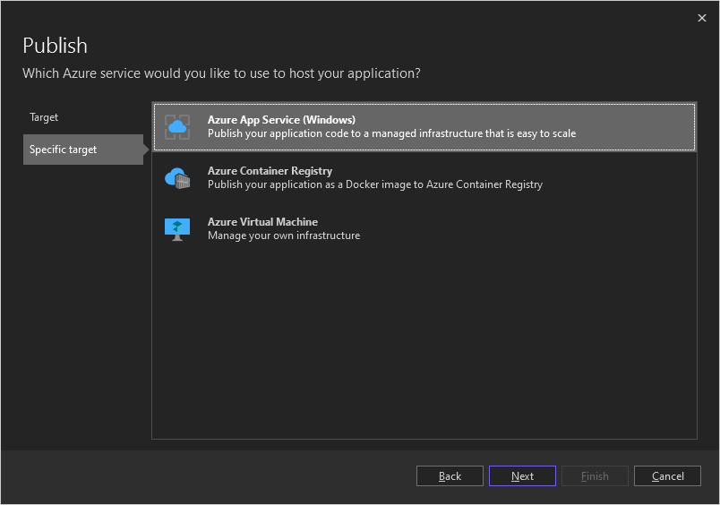
   
1. On the next screen, sign in to Azure if necessary. Select the Azure subscription, resource group, and App Service you want to publish to, and then select **Finish**.

   - If you don't have an Azure subscription, resource group, or App Service, you can create them by following the prompts on this screen.
   
   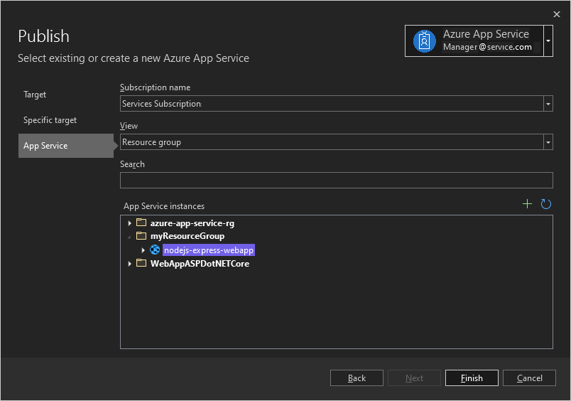
   
   For more detailed instructions, see [Publish to Azure website using web deploy](https://github.com/Microsoft/nodejstools/wiki/Publish-to-Azure-Website-using-Web-Deploy).
   
1. Look over the publishing configuration, and then select **Publish**.

   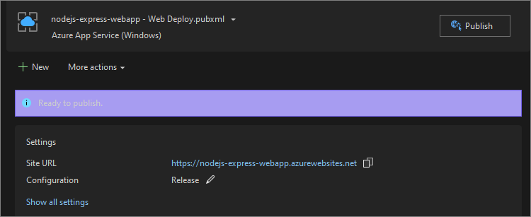
   
   The Visual Studio **Output** window shows the Azure deployment progress.
   
1. On successful deployment, your app opens running in Azure App Service in a browser. Select a button to display an image.
   
   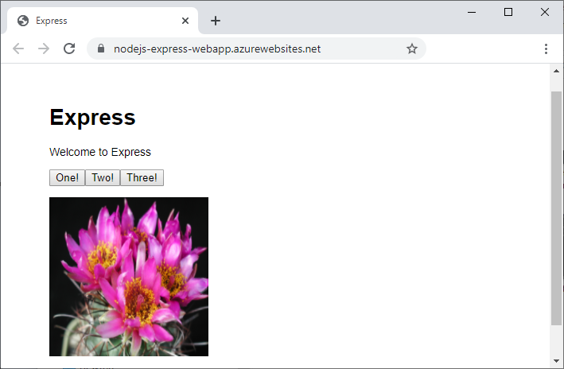

::: moniker-end
::: moniker range="<=vs-2019"
1. In Solution Explorer, right-click the project and choose **Publish**.

   

1. Choose **Microsoft Azure App Service**.

    In the **App Service** dialog box, you can sign into your Azure account and connect to existing Azure subscriptions.

1. Follow the remaining steps to select a subscription, choose or create a resource group, choose or create an app service plan, and then follow the steps when prompted to publish to Azure. For more detailed instructions, see [Publish to Azure website using web deploy](https://github.com/Microsoft/nodejstools/wiki/Publish-to-Azure-Website-using-Web-Deploy).

1. The **Output** window shows progress on deploying to Azure.

    On successful deployment, your app opens in a browser running in Azure App Service. Click a button to display an image.

   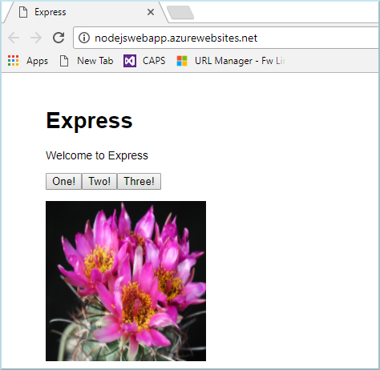
::: moniker-end
Congratulations on completing this tutorial!

## Next steps

> [!div class="nextstepaction"]
> [Deploy the app to Linux App Service](../javascript/publish-nodejs-app-azure.md)

> [!div class="nextstepaction"]
> [AngularJS language service extension](https://devblogs.microsoft.com/visualstudio/angular-language-service-for-visual-studio)
