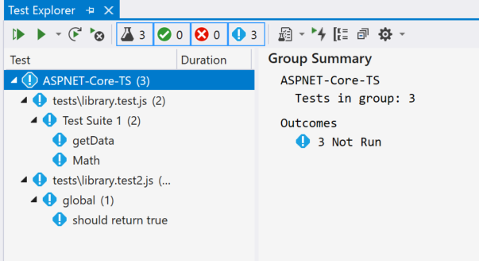
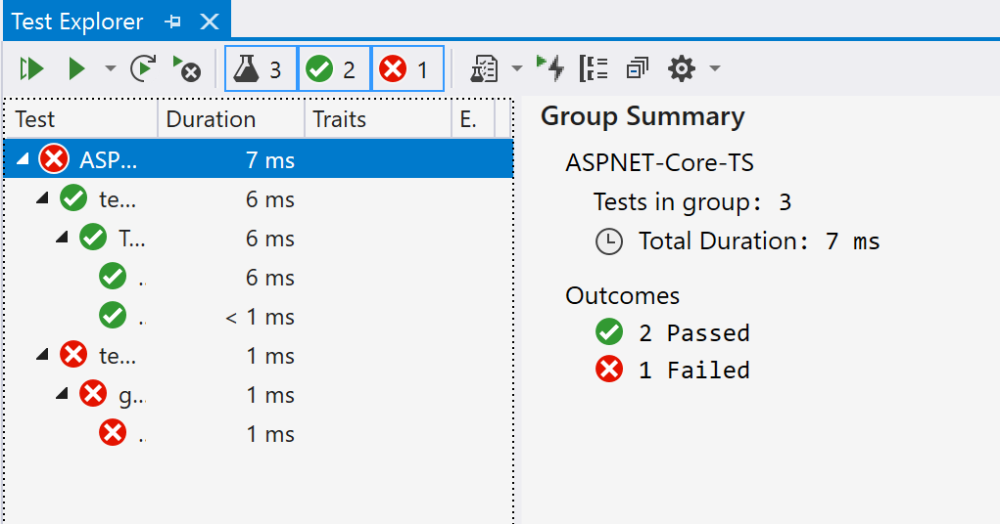

# Unit testing JavaScript and TypeScript in Visual Studio

You can write and run unit tests in Visual Studio using some of the more popular
JavaScript frameworks without the need to switch to a command prompt. Both Node.js and ASP.NET Core projects are supported.

The supported frameworks are:
* Mocha ([mochajs.org](https://mochajs.org/))
* Jasmine ([Jasmine.github.io](https://jasmine.github.io/))
* Tape ([github.com/substack/tape](https://github.com/substack/tape))
* Jest ([jestjs.io](https://jestjs.io/))
* Export Runner (this framework is specific to Node.js Tools for Visual Studio)

For ASP.NET Core and JavaScript or TypeScript, see [Write unit tests for ASP.NET Core
](#write-unit-tests-for-aspnet-core).

If your favorite framework is not supported, see [Add support for a unit test framework](#addingFramework) for information on adding support.

::: moniker range=">=vs-2022"
## Write unit tests for a CLI-based project (.esproj)

The [CLI-based projects](../javascript/javascript-in-vs-2022.md#project-templates) supported in Visual Studio 2022 work with Test Explorer. Jest is the built-in test framework for React and Vue projects, and Karma and Jasmine is used for Angular projects. By default, you will be able to run the default tests provided by each framework, as well as any additional tests you write.  Just hit the **Run** button in Test Explorer. If you don’t already have Test Explorer open, you can find it by selecting **Test** > **Test Explorer** in the menu bar.

The Node.js development workload is required to support unit testing for CLI-based projects.

Mocha and Tape test libraries are also supported. To use one of these, simply change the default test library in package.json to the appropriate test library’s package.
::: moniker-end

## Write unit tests in a Node.js project (.njsproj)

For Node.js projects, before adding unit tests to your project, make sure the framework you plan to use is installed locally in your project. This is easy to do using the [npm package installation window](npm-package-management.md#npmInstallWindow).

The preferred way to add unit tests to your project is by creating a *tests* folder in
your project, and setting that as the test root in project properties. You also need
to select the test framework you want to use.


You can add simple blank tests to your project, using the **Add New Item** dialog box. Both JavaScript and TypeScript are supported in the same project.


For a Mocha unit test, use the following code:

```javascript
var assert = require('assert');

describe('Test Suite 1', function() {
    it('Test 1', function() {
        assert.ok(true, "This shouldn't fail");
    })

    it('Test 2', function() {
        assert.ok(1 === 1, "This shouldn't fail");
        assert.ok(false, "This should fail");
    })
})
```

If you haven't set the unit test options in the project properties, you must ensure the **Test Framework**
property in the **Properties** window is set to the correct test framework for your unit test files. This is
done automatically by the unit test file templates.


> [!Note]
> The unit test options will take preference over the settings for individual files.

After opening Test Explorer (choose **Test** > **Windows** > **Test Explorer**), Visual Studio discovers and displays tests. If tests are not showing initially, then rebuild the project to refresh the list.


> [!NOTE]
> For TypeScript, do not use the `outdir` or `outfile` option in *tsconfig.json*, because Test Explorer won't be able to find your unit tests.

## Run tests (Node.js)

You can run tests in Visual Studio or from the command line.

### Run tests in Visual Studio

::: moniker range=">=vs-2019"
You can run the tests by clicking the **Run All** link in Test Explorer. Or, you can run tests by selecting one or more tests or groups, right-clicking, and selecting **Run** from the shortcut menu. Tests run in the background, and Test Explorer automatically updates and shows the results. Furthermore, you can also debug selected tests by right-clicking and selecting **Debug**.
::: moniker-end
::: moniker range="vs-2017"
You can run the tests by clicking the **Run All** link in Test Explorer. Or, you can run tests by selecting one or more tests or groups, right-clicking, and selecting **Run Selected Tests** from the shortcut menu. Tests run in the background, and Test Explorer automatically updates and shows the results. Furthermore, you can also debug selected tests by selecting **Debug Selected Tests**.
::: moniker-end

For TypeScript, unit tests are run against the generated JavaScript code.

> [!NOTE]
> In most TypeScript scenarios, you can debug a unit test by setting a breakpoint in TypeScript code, right-clicking a test in Test Explorer, and choosing **Debug**. In more complex scenarios, such as some scenarios that use source maps, you may have difficulty hitting breakpoints in TypeScript code. As a workaround, try using the `debugger` keyword.

> [!NOTE]
> We don't currently support profiling tests, or code coverage.

### Run tests from the command line

You can run the tests from [Developer Command Prompt for Visual Studio](../ide/reference/command-prompt-powershell.md) using the following command:

```
vstest.console.exe <path to project file>\NodejsConsoleApp23.njsproj /TestAdapterPath:<VisualStudioFolder>\Common7\IDE\Extensions\Microsoft\NodeJsTools\TestAdapter
```

This command shows output similar to the following:

```
Microsoft (R) Test Execution Command Line Tool Version 15.5.0
Copyright (c) Microsoft Corporation.  All rights reserved.

Starting test execution, please wait...
Processing: NodejsConsoleApp23\NodejsConsoleApp23\UnitTest1.js
  Creating TestCase:NodejsConsoleApp23\NodejsConsoleApp23\UnitTest1.js::Test Suite 1 Test 1::mocha
  Creating TestCase:NodejsConsoleApp23\NodejsConsoleApp23\UnitTest1.js::Test Suite 1 Test 2::mocha
Processing finished for framework of Mocha
Passed   Test Suite 1 Test 1
Standard Output Messages:
 Using default Mocha settings
 1..2
 ok 1 Test Suite 1 Test 1

Failed   Test Suite 1 Test 2
Standard Output Messages:
 not ok 1 Test Suite 1 Test 2
   AssertionError [ERR_ASSERTION]: This should fail
       at Context.<anonymous> (NodejsConsoleApp23\NodejsConsoleApp23\UnitTest1.js:10:16)

Total tests: 2. Passed: 1. Failed: 1. Skipped: 0.
Test Run Failed.
Test execution time: 1.5731 Seconds
```

> [!NOTE]
> If you get an error indicating that *vstest.console.exe* cannot be found, make sure you've opened the Developer Command Prompt and not a regular command prompt.

## Write unit tests for ASP.NET Core

1. Create an ASP.NET Core project and add TypeScript support.

   For an example project, see [Create an ASP.NET Core app with TypeScript](../javascript/tutorial-aspnet-with-typescript.md). For unit testing support, we recommend you start with a standard ASP.NET Core project template.

   Use the NuGet package to add TypeScript support instead of the npm TypeScript package.

1. Install the NuGet package [Microsoft.JavaScript.UnitTest](https://www.nuget.org/packages/Microsoft.JavaScript.UnitTest/)

1. In Solution Explorer, right-click the project node and choose **Unload Project**.

   The *.csproj* file should open in Visual Studio.

1. Add the following elements to the *.csproj* file in the `PropertyGroup` element.

   This example specifies Mocha as the test framework. You could specify Jest, Tape, or Jasmine instead.

   ```xml
   <PropertyGroup>
      ...
      <JavaScriptTestRoot>tests\</JavaScriptTestRoot>
      <JavaScriptTestFramework>Mocha</JavaScriptTestFramework>
      <GenerateProgramFile>false</GenerateProgramFile>
   </PropertyGroup>
   ```

   The `JavaScriptTestRoot` element specifies that your unit tests will be in the *tests* folder of the project root.

1. In Solution Explorer, right-click the project node and choose **Reload Project**.

1. Add npm support as described in the npm package management article under [ASP.NET Core projects](../javascript/npm-package-management.md#aspnet-core-projects).

   This requires installing the Node.js runtime for npm support and adding *package.json* in the project root.

1. In *package.json*, add the npm package you want under dependencies.

   For example, for mocha, you might use the following:

   ```json
   "dependencies": {
     "mocha": "8.3.0",
   ```

   Some unit testing frameworks, such as Jest, require additional npm packages. For Jest, use the following JSON:

   ```json
   "dependencies": {
     "jest": "26.6.3",
     "jest-editor-support": "28.1.0"
   ```

   >[!NOTE]
   > In some scenarios, Solution Explorer may not show the npm node due to a known issue described [here](https://github.com/aspnet/Tooling/issues/479). If you need to see the npm node, you can unload the project (right-click the project and choose **Unload Project**) and then reload the project to make the npm node re-appear.

1. Add code to test.

   If you are using the example described in [Create an ASP.NET Core app with TypeScript](tutorial-aspnet-with-typescript.md), add the following code at the end of the *library.ts* file, which is in the *scripts* folder.

   ```typescript
   function getData(value) {
      if (value > 1) {
         return true;
      }
   }
    
   module.exports = getData;
   ```

   For TypeScript, unit tests are run against the generated JavaScript code.

1. Add your unit tests to the *tests* folder in the project root.

   For example, you might use the following code by selecting the correct documentation tab that matches your test framework, in this example either Mocha or Jest. This code tests a function called `getData`.

   # [Mocha](#tab/mocha)

   ```typescript
   const getData = require('../wwwroot/js/library.js');
   var assert = require('assert');
    
   describe('Test Suite 1', function () {
      it('getData', function () {
         assert.ok(true, getData(2));
      })
   })
   ```

   # [Jest](#tab/jest)

   ```typescript
   const getData = require('../wwwroot/js/library.js');
    
   test('should return true', () => {
      expect(getData(2)).toBe(true);
   });
   ```

1. Open Test Explorer (choose **Test** > **Windows** > **Test Explorer**) and Visual Studio discovers and displays tests. If tests are not showing initially, then rebuild the project to refresh the list.

   

   > [!NOTE]
   > For TypeScript, do not use the `outfile` option in *tsconfig.json*, because Test Explorer won't be able to find your unit tests. You can use the `outdir` option, but make sure that configuration files such as `package.json` and `tsconfig.json` are in the project root.

## Run tests (ASP.NET Core)

::: moniker range=">=vs-2019"
You can run the tests by clicking the **Run All** link in Test Explorer. Or, you can run tests by selecting one or more tests or groups, right-clicking, and selecting **Run** from the shortcut menu. Tests run in the background, and Test Explorer automatically updates and shows the results. Furthermore, you can also debug selected tests by right-clicking and selecting **Debug**.
::: moniker-end
::: moniker range="vs-2017"
You can run the tests by clicking the **Run All** link in Test Explorer. Or, you can run tests by selecting one or more tests or groups, right-clicking, and selecting **Run Selected Tests** from the shortcut menu. Tests run in the background, and Test Explorer automatically updates and shows the results. Furthermore, you can also debug selected tests by selecting **Debug Selected Tests**.
::: moniker-end

For TypeScript, unit tests are run against the generated JavaScript code.



> [!NOTE]
> In most TypeScript scenarios, you can debug a unit test by setting a breakpoint in TypeScript code, right-clicking a test in Test Explorer, and choosing **Debug**. In more complex scenarios, such as some scenarios that use source maps, you may have difficulty hitting breakpoints in TypeScript code. As a workaround, try using the `debugger` keyword.

> [!NOTE]
> We don't currently support profiling tests, or code coverage.

## <a name="addingFramework"></a>Add support for a unit test framework

You can add support for additional test frameworks by implementing the discovery and execution logic using JavaScript.

> [!NOTE]
> For ASP.NET Core, add the NuGet package [Microsoft.JavaScript.UnitTest](https://www.nuget.org/packages/Microsoft.JavaScript.UnitTest/) to your project to add support.

You do this by adding a folder with the name of the test framework under:

`<VisualStudioFolder>\Common7\IDE\Extensions\Microsoft\NodeJsTools\TestAdapter\TestFrameworks`

If you don't see the `NodeJsTools` folder in an ASP.NET Core project, add the Node.js development workload using the Visual Studio Installer. This workload includes support for unit testing JavaScript and TypeScript.

This folder has to contain a JavaScript file with the same name which exports the following two functions:

* `find_tests`
* `run_tests`

For a good example of the `find_tests` and the `run_tests` implementations, see the implementation for the Mocha
unit testing framework in:

`<VisualStudioFolder>\Common7\IDE\Extensions\Microsoft\NodeJsTools\TestAdapter\TestFrameworks\mocha\mocha.js`

Discovery of available test frameworks occurs at Visual Studio start. If a framework is added while
Visual Studio is running, restart Visual Studio to detect the framework. However you don't need to restart
when making changes to the implementation.

## Unit tests in .NET Framework

You are not limited to writing unit tests in just your Node.js and ASP.NET Core projects. When you add the TestFramework and
TestRoot properties to any C# or Visual Basic project, those tests will be enumerated and you can run them using
the Test Explorer window.

To enable this, right-click the project node in the Solution Explorer, choose **Unload Project**, and then choose **Edit Project**. Then in the project file, add the following two elements to a property group.

> [!IMPORTANT]
> Make sure that the property group you're adding the elements to doesn't have a condition specified.
> This can cause unexpected behavior.

```xml
<PropertyGroup>
    <JavaScriptTestRoot>tests\</JavaScriptTestRoot>
    <JavaScriptTestFramework>Tape</JavaScriptTestFramework>
</PropertyGroup>
```

Next, add your tests to the test root folder you specified, and they will be available to run in the
Test Explorer window. If they don't initially appear, you may need to rebuild the project.

## Unit test .NET Core and .NET Standard

In addition to the preceding properties, you also need to install the NuGet package [Microsoft.JavaScript.UnitTest](https://www.nuget.org/packages/Microsoft.JavaScript.UnitTest/) and set the property:

```xml
<PropertyGroup>
    <GenerateProgramFile>false</GenerateProgramFile>
</PropertyGroup>
```

Some test frameworks may require additional npm packages for test detection. For example, jest requires the jest-editor-support npm package. If necessary, check the documentation for the specific framework.
