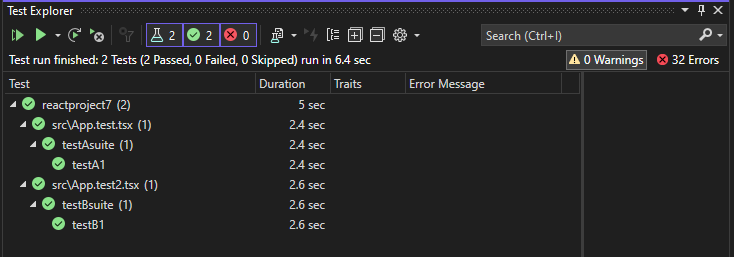
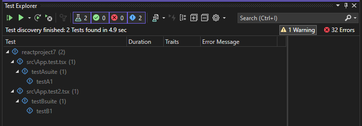
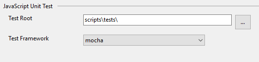
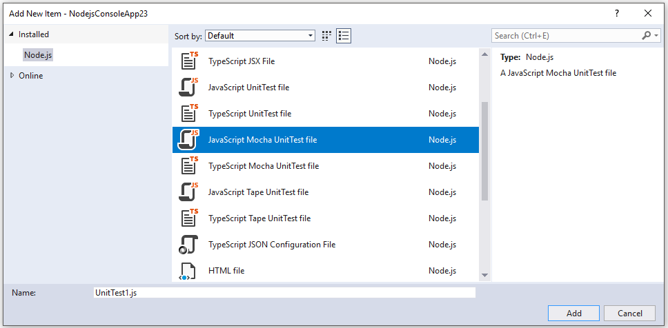
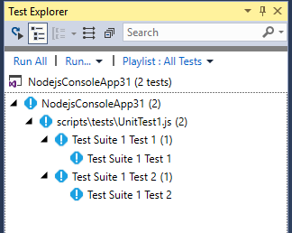

# Unit testing JavaScript and TypeScript in Visual Studio

You can write and run unit tests in Visual Studio using some of the more popular JavaScript frameworks without the need to switch to a command prompt. Both Node.js and ASP.NET Core projects are supported.

::: moniker range=">=vs-2022"
The supported frameworks are:
- Mocha ([mochajs.org](https://mochajs.org/))
- Jasmine ([Jasmine.github.io](https://jasmine.github.io/))
- Tape ([github.com/substack/tape](https://github.com/substack/tape))
- Jest ([jestjs.io](https://jestjs.io/))
- Vitest ([vitest.dev](https://vitest.dev/))
::: moniker-end

::: moniker range="<=vs-2019"
The supported frameworks are:
- Mocha ([mochajs.org](https://mochajs.org/))
- Jasmine ([Jasmine.github.io](https://jasmine.github.io/))
- Tape ([github.com/substack/tape](https://github.com/substack/tape))
- Jest ([jestjs.io](https://jestjs.io/))
::: moniker-end

::: moniker range="<=vs-2019"
If your favorite framework is not supported, see [Add support for a unit test framework](#addingFramework) for information on adding support.
::: moniker-end

::: moniker range=">=vs-2022"
## Write unit tests for a CLI-based project (.esproj)

The [CLI-based projects](../javascript/javascript-in-vs-2022.md#project-templates) supported in Visual Studio 2022 work with Test Explorer. Vitest is the built-in test framework for React and Vue projects (previously Jest), and Karma and Jasmine is used for Angular projects. By default, you will be able to run the default tests provided by each framework, as well as any additional tests you write.  Just hit the **Run** button in Test Explorer. If you don’t already have Test Explorer open, you can find it by selecting **Test** > **Test Explorer** in the menu bar.

To run unit tests from the command-line, right-click the project in Solution Explorer, choose **Open in Terminal**, and run the command specific to the test type.

For information on setting up unit tests, see the following:

- [Testing with Vitest](https://vitest.dev/guide/)
- [Testing React with Jest](https://jestjs.io/docs/tutorial-react)
- [Angular testing](https://angular.io/guide/testing)
- [Testing Vue.js](https://vuejs.org/guide/scaling-up/testing.html#unit-testing)

A simple example is also provided here. However, use the preceding links for complete information.

### Add a unit test (.esproj)

The following example is based on the TypeScript React project template provided in Visual Studio 2022 version 17.12 or later, which is the **Standalone TypeScript React Project** template. For Vue and Angular, the steps are similar.

1. In Solution Explorer, right-click the React project and choose **Edit Project File**.

1. Make sure that the following properties are present in the *.esproj* file with the values shown.

   ```xml
   <PropertyGroup>
     <JavaScriptTestRoot>src\</JavaScriptTestRoot>
     <JavaScriptTestFramework>Vitest</JavaScriptTestFramework>
   </PropertyGroup> 
   ```

   This example specifies Vitest as the test framework. You could specify Mocha, Tape, Jasmine, or Jest instead.

   The `JavaScriptTestRoot` element specifies that your unit tests will be in the *src* folder of the project root. It's also common to specify the *test* folder.

1. In Solution Explorer, right-click the **npm** node and choose **Install new npm packages**.

   Use the npm package installation dialog to install the following npm packages:

   - vitest

   This package are added to the *package.json* file under dependencies.

   > [!NOTE]
   > If you're using jest, the jest-editor-support npm package is required as well as the jest package.

1. In *package.json*, add the `test` section at the end of the `scripts` section:

   ```json
   "scripts": {
      ...
      "test": "vitest"
   },
   ```

1. In Solution Explorer, right-click the src folder and choose **Add** > **New Item**, and then add a new file named *App.test.tsx*.

   This adds the new file under the src folder.

1. Add the following code to *App.test.tsx*.

   ```javascript
   import { describe, it, expect } from 'vitest';

   describe('testAsuite', () => {
      it('testA1', async () => {
         expect(2).toBe(2);
      });
   });
   ```

   ::: moniker range="vs-2022"
   > [!IMPORTANT]
   > Due to a known [MSBuild issue](https://github.com/dotnet/msbuild/issues/7873), open the folder, *Program Files\Microsoft Visual Studio\2022\\<version\>\Common7\IDE\Extensions\TestPlatform*, and rename *System.Memory.dll* to a different name. This fix enables test discovery.
   ::: moniker-end

1. Open Test Explorer (choose **Test** > **Test Explorer**) and Visual Studio discovers and displays tests. If tests are not showing initially, then rebuild the project to refresh the list.

   

   > [!NOTE]
   > For TypeScript, do not use the `outfile` option in *tsconfig.json*, because Test Explorer won't be able to find your unit tests. You can use the `outdir` option, but make sure that configuration files such as `package.json` and `tsconfig.json` are in the project root.

### Run tests (.esproj)

You can run the tests by clicking the **Run All** link in Test Explorer. Or, you can run tests by selecting one or more tests or groups, right-clicking, and selecting **Run** from the shortcut menu. Tests run in the background, and Test Explorer automatically updates and shows the results. Furthermore, you can also debug selected tests by right-clicking and selecting **Debug**.

The following illustration shows the example with a second unit test added.



For some unit test frameworks, unit tests are typically run against the generated JavaScript code.

> [!NOTE]
> In most TypeScript scenarios, you can debug a unit test by setting a breakpoint in TypeScript code, right-clicking a test in Test Explorer, and choosing **Debug**. In more complex scenarios, such as some scenarios that use source maps, you may have difficulty hitting breakpoints in TypeScript code. As a workaround, try using the `debugger` keyword.

> [!NOTE]
> Profiling tests and code coverage are not currently supported.

::: moniker-end

## Write unit tests for ASP.NET Core

To add support for unit testing of JavaScript and TypeScript in an ASP.NET Core project, you need to add TypeScript, Npm, and unit testing support to the project by including required NuGet packages.

### Add a unit test (ASP.NET Core)

The following example is based on the ASP.NET Core Model-View-Controller project template, and includes adding a Jest or Mocha unit test.

1. Create an ASP.NET Core Model-View-Controller project.

   For an example project, see [Add TypeScript to an existing ASP.NET Core app](../javascript/tutorial-aspnet-with-typescript.md). For unit testing support, we recommend you start with a standard ASP.NET Core project template.

1. In Solution Explorer (right pane), right-click the ASP.NET Core project node and select **Manage NuGet Packages for Solutions**.

1. In the **Browse** tab, search for the following packages and install each one:

   ::: moniker range=">=vs-2022"
   - [Microsoft.TypeScript.MSBuild](https://www.nuget.org/packages/Microsoft.TypeScript.MSBuild)
   - [Npm](https://www.nuget.org/packages/Npm)
   ::: moniker-end

   ::: moniker range="vs-2019"
   - [Microsoft.TypeScript.MSBuild](https://www.nuget.org/packages/Microsoft.TypeScript.MSBuild)
   - [Npm](https://www.nuget.org/packages/Npm)
   - [Microsoft.JavaScript.UnitTest](https://www.nuget.org/packages/Microsoft.JavaScript.UnitTest/)
   ::: moniker-end

   Use the NuGet package to add TypeScript support instead of the npm TypeScript package.

1. In Solution Explorer, right-click the project node and choose **Edit Project File**.

   The *.csproj* file opens in Visual Studio.

1. Add the following elements to the *.csproj* file in the `PropertyGroup` element.

   This example specifies Jest or Mocha as the test framework. You could specify Tape or Jasmine instead.

   # [Jest](#tab/jest)

   The `JavaScriptTestRoot` element specifies that your unit tests will be in the *tests* folder of the project root.

   ```xml
   <PropertyGroup>
      ...
      <JavaScriptTestRoot>tests\</JavaScriptTestRoot>
      <JavaScriptTestFramework>Jest</JavaScriptTestFramework>
      <GenerateProgramFile>false</GenerateProgramFile>
   </PropertyGroup>
   ```

   # [Mocha](#tab/mocha)

   The `JavaScriptTestRoot` element specifies the location for your unit tests. To simplify the configuration for Mocha, in this example we point the test root to the output folder, *wwwroot\js\tests\*.

   ```xml
   <PropertyGroup>
      ...
      <JavaScriptTestRoot>wwwroot\js\tests\</JavaScriptTestRoot>
      <JavaScriptTestFramework>Mocha</JavaScriptTestFramework>
      <GenerateProgramFile>false</GenerateProgramFile>
   </PropertyGroup>
   ```

1. In Solution Explorer, right-click the ASP.NET Core project node and select **Add > New Item**. Choose the **TypeScript JSON Configuration File**, and then select **Add**.

   If you don't see all the item templates, select **Show All Templates**, and then choose the item template.

   Visual Studio adds the *tsconfig.json* file to the project root. You can use this file to [configure options](https://www.typescriptlang.org/docs/handbook/tsconfig-json.html) for the TypeScript compiler.

1. Open *tsconfig.json* and replace the default code with the following code:

   # [Jest](#tab/jest)

   ```json
   {
     "compileOnSave": true,
     "compilerOptions": {
        "noImplicitAny": false,
        "noEmitOnError": true,
        "removeComments": false,
        "sourceMap": true,
        "target": "es5",
        "outDir": "wwwroot/js"
     },
     "include": [
       "scripts/**/*"
     ],
     "exclude": [
      "node_modules",
      "tests"
     ]
   }
   ```

   For Jest, if you want to compile TypeScript tests to JavaScript, remove the *tests* folder from the *exclude* section.

   The *scripts* folder is where you can put the TypeScript code for your app. For an example project that adds code, see [Add TypeScript to an existing ASP.NET Core app](../javascript/tutorial-aspnet-with-typescript.md).

   # [Mocha](#tab/mocha)

   ```json
   {
     "compileOnSave": true,
     "compilerOptions": {
        "noImplicitAny": false,
        "noEmitOnError": true,
        "removeComments": false,
        "sourceMap": true,
        "target": "es5",
        "outDir": "wwwroot/js"
     },
     "include": [
        "scripts/**/*",
        "tests/**/*"
     ],
     "exclude": [
        "node_modules"
     ]
   }
   ```

   The *scripts* folder is where you can put the TypeScript code for your app. For an example project that adds code, see [Add TypeScript to an existing ASP.NET Core app](../javascript/tutorial-aspnet-with-typescript.md).

1. Right-click the project in Solution Explorer and choose **Add** > **New Item** (or press **Ctrl** + **SHIFT** + **A**). Use the search box to find the npm file, choose the **npm Configuration File**, use the default name, and click **Add**.

   A *package.json* file is added to the project root.

1. In Solution Explorer, right-click the **npm** node under Dependencies and choose **Install new npm packages**.

   >[!NOTE]
   > In some scenarios, Solution Explorer might not show the npm node due to a known issue described [here](https://github.com/aspnet/Tooling/issues/479). If you need to see the npm node, you can unload the project (right-click the project and choose **Unload Project**) and then reload the project to make the npm node re-appear. Alternatively, you can add the package entries to *package.json* and install by building the project.

   Use the npm package installation dialog to install the following npm packages:

   # [Jest](#tab/jest)

   - jest
   - jest-editor-support
   - @types/jest

   These packages are added to the *package.json* file under devDependencies.

   ```typescript
    "@types/jest": "^29.5.8",
    "jest": "^29.7.0",
    "jest-editor-support": "^31.1.2"
   ```

   # [Mocha](#tab/mocha)

   - mocha
   - assert
   - @types/mocha
   - @types/node

   These packages are added to the *package.json* file under devDependencies.

   ```typescript
    "@types/mocha": "^10.0.5",
    "@types/node": "^20.9.2",
    "assert": "^2.1.0",
    "mocha": "^10.2.0"
   ```

1. In *package.json*, add the `test` section at the end of the `scripts` section:

   # [Jest](#tab/jest)

   ```json
   "scripts": {
      ...
      "test": "jest"
   },
   ```

   # [Mocha](#tab/mocha)

   ```json
   "scripts": {
      ...
      "test": "mocha"
   },
   ```

1. In Solution Explorer, right-click the *test* folder and choose **Add** > **New Item**, and then add a new file named *App.test.tsx*.

   This adds the new file under the *test* folder.

1. Add the following code to *App.test.tsx*.

   # [Jest](#tab/jest)

   ```javascript
   describe('testAsuite', () => {
      it('testA1', async () => {
         expect(2).toBe(2);
      });
   });
   ```

   # [Mocha](#tab/mocha)

   ```javascript
   var assert = require('assert');

   describe('testAsuite', function () {
      it('testA1', function () {
         assert.equal(1, 1);
      })
   })
   ```

   ::: moniker range="vs-2022"
   > [!IMPORTANT]
   > Due to a known [MSBuild issue](https://github.com/dotnet/msbuild/issues/7873), open the folder, *Program Files\Microsoft Visual Studio\2022\\<version\>\Common7\IDE\Extensions\TestPlatform*, and rename *System.Memory.dll* to a different name. This fix enables test discovery.
   ::: moniker-end

1. Open Test Explorer (choose **Test** > **Windows** > **Test Explorer**) and Visual Studio discovers and displays tests. If tests are not showing initially, then rebuild the project to refresh the list. The following illustration shows the Jest example, with two different unit test files.

   

   > [!NOTE]
   > For TypeScript, do not use the `outfile` option in *tsconfig.json*, because Test Explorer won't be able to find your unit tests. You can use the `outdir` option, but make sure that configuration files such as `package.json` and `tsconfig.json` are in the project root.

### Run tests (ASP.NET Core)

You can run the tests by clicking the **Run All** link in Test Explorer. Or, you can run tests by selecting one or more tests or groups, right-clicking, and selecting **Run** from the shortcut menu. Tests run in the background, and Test Explorer automatically updates and shows the results. Furthermore, you can also debug selected tests by right-clicking and selecting **Debug**.

The following illustration shows the Jest example, with a second unit test added.


For some unit test frameworks, unit tests are typically run against the generated JavaScript code.

> [!NOTE]
> In most TypeScript scenarios, you can debug a unit test by setting a breakpoint in TypeScript code, right-clicking a test in Test Explorer, and choosing **Debug**. In more complex scenarios, such as some scenarios that use source maps, you may have difficulty hitting breakpoints in TypeScript code. As a workaround, try using the `debugger` keyword.

> [!NOTE]
> Profiling tests and code coverage are not currently supported.

::: moniker range="<=vs-2019"
## <a name="addingFramework"></a>Add support for a unit test framework

You can add support for additional test frameworks by implementing the discovery and execution logic using JavaScript.

> [!NOTE]
> For ASP.NET Core, add the NuGet package [Microsoft.JavaScript.UnitTest](https://www.nuget.org/packages/Microsoft.JavaScript.UnitTest/) to your project to add support.

You do this by adding a folder with the name of the test framework under:

`<VisualStudioFolder>\Common7\IDE\Extensions\Microsoft\NodeJsTools\TestAdapter\TestFrameworks`

If you don't see the `NodeJsTools` folder in an ASP.NET Core project, add the Node.js development workload using the Visual Studio Installer. This workload includes support for unit testing JavaScript and TypeScript.

This folder has to contain a JavaScript file with the same name which exports the following two functions:

- `find_tests`
- `run_tests`

For a good example of the `find_tests` and the `run_tests` implementations, see the implementation for the Mocha unit testing framework in:

`<VisualStudioFolder>\Common7\IDE\Extensions\Microsoft\NodeJsTools\TestAdapter\TestFrameworks\mocha\mocha.js`

Discovery of available test frameworks occurs at Visual Studio start. If a framework is added while Visual Studio is running, restart Visual Studio to detect the framework. However you don't need to restart when making changes to the implementation.

## Unit tests in .NET Framework

You are not limited to writing unit tests in just your Node.js and ASP.NET Core projects. When you add the TestFramework and TestRoot properties to any C# or Visual Basic project, those tests will be enumerated and you can run them using the Test Explorer window.

To enable this, right-click the project node in the Solution Explorer, choose **Unload Project**, and then choose **Edit Project**. Then in the project file, add the following two elements to a property group.

> [!IMPORTANT]
> Make sure that the property group you're adding the elements to doesn't have a condition specified.
> This can cause unexpected behavior.

```xml
<PropertyGroup>
    <JavaScriptTestRoot>tests\</JavaScriptTestRoot>
    <JavaScriptTestFramework>Tape</JavaScriptTestFramework>
</PropertyGroup>
```

Next, add your tests to the test root folder you specified, and they will be available to run in the Test Explorer window. If they don't initially appear, you might need to rebuild the project.

## Unit test .NET Core and .NET Standard

In addition to the preceding properties described for .NET Framework, you also need to install the NuGet package [Microsoft.JavaScript.UnitTest](https://www.nuget.org/packages/Microsoft.JavaScript.UnitTest/) and set the property:

```xml
<PropertyGroup>
    <GenerateProgramFile>false</GenerateProgramFile>
</PropertyGroup>
```

Some test frameworks might require additional npm packages for test detection. For example, jest requires the jest-editor-support npm package. If necessary, check the documentation for the specific framework.
::: moniker-end

::: moniker range="<=vs-2019"
## Write unit tests in a Node.js project (.njsproj)

For Node.js projects, before adding unit tests to your project, make sure the framework you plan to use is installed locally in your project. This is easy to do using the [npm package installation window](npm-package-management.md#npmInstallWindow).

The preferred way to add unit tests to your project is by creating a *tests* folder in your project, and setting that as the test root in project properties. You also need to select the test framework you want to use.



You can add simple blank tests to your project, using the **Add New Item** dialog box. Both JavaScript and TypeScript are supported in the same project.



For a Mocha unit test, use the following code:

```javascript
var assert = require('assert');

describe('Test Suite 1', function() {
    it('Test 1', function() {
        assert.ok(true, "This shouldn't fail");
    })

    it('Test 2', function() {
        assert.ok(1 === 1, "This shouldn't fail");
        assert.ok(false, "This should fail");
    })
})
```

If you haven't set the unit test options in the project properties, you must ensure the **Test Framework**
property in the **Properties** window is set to the correct test framework for your unit test files. This is done automatically by the unit test file templates.


> [!NOTE]
> The unit test options will take preference over the settings for individual files.

After opening Test Explorer (choose **Test** > **Windows** > **Test Explorer**), Visual Studio discovers and displays tests. If tests are not showing initially, then rebuild the project to refresh the list.



> [!NOTE]
> For TypeScript, do not use the `outdir` or `outfile` option in *tsconfig.json*, because Test Explorer won't be able to find your unit tests.

## Run tests (Node.js)

You can run tests in Visual Studio or from the command line.

### Run tests in Visual Studio

You can run the tests by clicking the **Run All** link in Test Explorer. Or, you can run tests by selecting one or more tests or groups, right-clicking, and selecting **Run** from the shortcut menu. Tests run in the background, and Test Explorer automatically updates and shows the results. Furthermore, you can also debug selected tests by right-clicking and selecting **Debug**.

For TypeScript, unit tests are run against the generated JavaScript code.

> [!NOTE]
> In most TypeScript scenarios, you can debug a unit test by setting a breakpoint in TypeScript code, right-clicking a test in Test Explorer, and choosing **Debug**. In more complex scenarios, such as some scenarios that use source maps, you may have difficulty hitting breakpoints in TypeScript code. As a workaround, try using the `debugger` keyword.

> [!NOTE]
> We don't currently support profiling tests, or code coverage.

### Run tests from the command line

You can run the tests from [Developer Command Prompt for Visual Studio](../ide/reference/command-prompt-powershell.md) using the following command:

```
vstest.console.exe <path to project file>\NodejsConsoleApp23.njsproj /TestAdapterPath:<VisualStudioFolder>\Common7\IDE\Extensions\Microsoft\NodeJsTools\TestAdapter
```

This command shows output similar to the following:

```
Microsoft (R) Test Execution Command Line Tool Version 15.5.0
Copyright (c) Microsoft Corporation.  All rights reserved.

Starting test execution, please wait...
Processing: NodejsConsoleApp23\NodejsConsoleApp23\UnitTest1.js
  Creating TestCase:NodejsConsoleApp23\NodejsConsoleApp23\UnitTest1.js::Test Suite 1 Test 1::mocha
  Creating TestCase:NodejsConsoleApp23\NodejsConsoleApp23\UnitTest1.js::Test Suite 1 Test 2::mocha
Processing finished for framework of Mocha
Passed   Test Suite 1 Test 1
Standard Output Messages:
 Using default Mocha settings
 1..2
 ok 1 Test Suite 1 Test 1

Failed   Test Suite 1 Test 2
Standard Output Messages:
 not ok 1 Test Suite 1 Test 2
   AssertionError [ERR_ASSERTION]: This should fail
       at Context.<anonymous> (NodejsConsoleApp23\NodejsConsoleApp23\UnitTest1.js:10:16)

Total tests: 2. Passed: 1. Failed: 1. Skipped: 0.
Test Run Failed.
Test execution time: 1.5731 Seconds
```

> [!NOTE]
> If you get an error indicating that *vstest.console.exe* cannot be found, make sure you've opened the Developer Command Prompt and not a regular command prompt.
::: moniker-end
