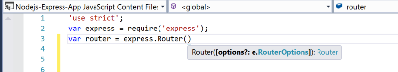
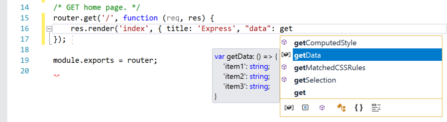
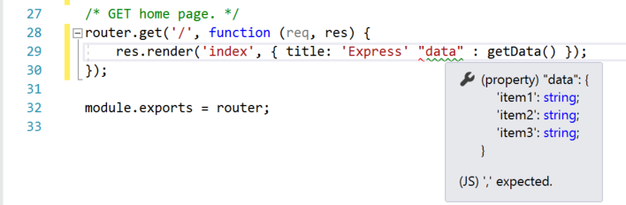
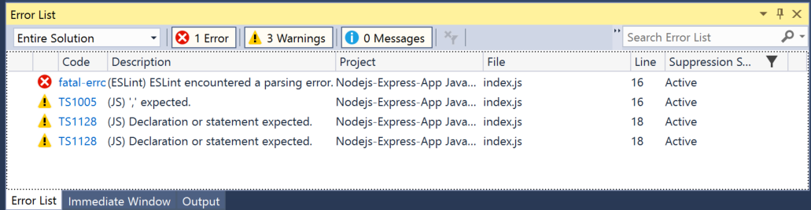
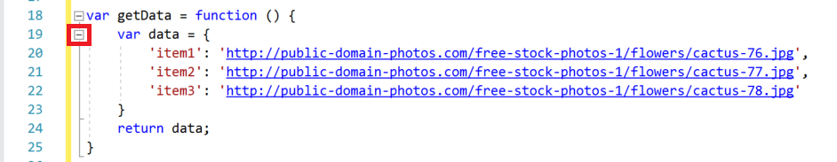
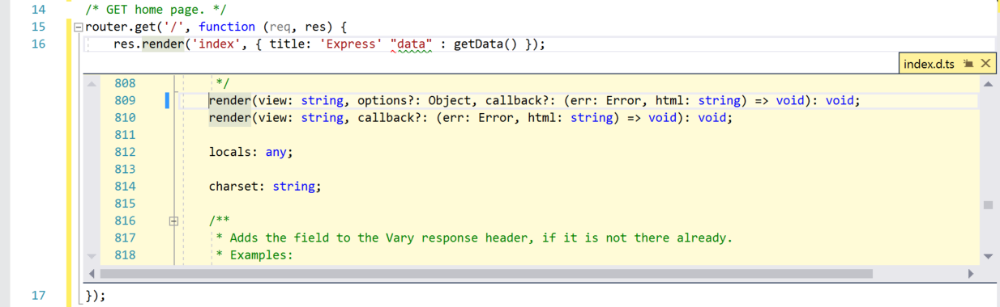
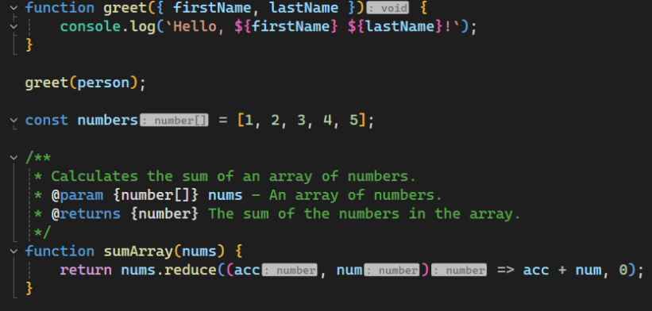
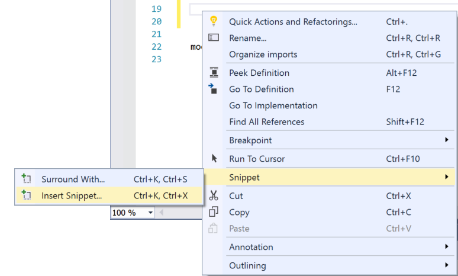
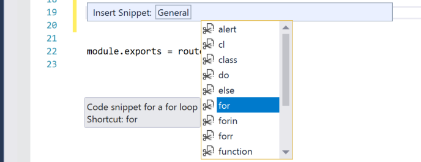

# Learn to use the code editor for JavaScript

In this short introduction to the code editor in Visual Studio, we'll look at some of the ways that Visual Studio makes writing, navigating, and understanding code easier.

> [!TIP]
> If you haven't already installed Visual Studio, go to the [Visual Studio downloads](https://visualstudio.microsoft.com/downloads/?cid=learn-onpage-download-cta) page to install it for free. For more information in getting the language service for TypeScript, see [TypeScript support](../javascript/javascript-in-visual-studio.md#typescript-support).

This article assumes you're already familiar with JavaScript development. If you aren't, we suggest you look at a tutorial such as [Create a Node.js and Express app](../javascript/tutorial-nodejs.md) first.

## Add a new project file

You can use the IDE to add new files to your project.

1. With your project open in Visual Studio, right-click on a folder or your project node in Solution Explorer (right pane), and choose **Add** > **New Item**.

   If you don't see all the item templates, choose **Show All Templates**, and then choose the item template.

1. In the **New File** dialog box, under the **General** category, choose the file type that you want to add, such as **JavaScript File**, and then choose **Open**.

    The new file gets added to your project and it opens in the editor.

## Use IntelliSense to complete words

IntelliSense is an invaluable resource when you're coding. It can show you information about available members of a type, or parameter details for different overloads of a method. In the following code, when you type `Router()`, you see the argument types that you can pass. This is called signature help.



You can also use IntelliSense to complete a word after you type enough characters to disambiguate it. If you put your cursor after the `data` string in the following code and type `get`, IntelliSense will show you functions defined earlier in the code or defined in a third-party library that you've added to your project.



IntelliSense can also show you information about types when you hover over programming elements.

To provide IntelliSense information, the language service can use TypeScript *d.ts* files and JSDoc comments. For most common JavaScript libraries, *d.ts* files are automatically acquired. For more details about how IntelliSense information is acquired, see [JavaScript IntelliSense](../ide/javascript-intellisense.md?toc=/visualstudio/javascript/toc.json).

## Check syntax

The language service uses ESLint to provide syntax checking and linting. If you need to set options for syntax checking in the editor, select **Tools** > **Options** > **JavaScript/TypeScript** > **Linting**. The linting options point you to the global ESLint configuration file.

In the following code, you see green syntax highlighting (green squiggles) on the expression. Hover over the syntax highlighting.



The last line of this message tells you that the language service expected a comma (`,`). The green squiggle indicates a warning. Red squiggles indicate an error.

In the lower pane, you can click the **Error List** tab to see the warning and description along with the filename and line number.



You can fix this code by adding the comma (`,`) before `"data"`.

For additional information on linting, see [Linting](https://github.com/microsoft/JSTSdocs/blob/master/articles/editor/linting.md).

## Comment out code

The toolbar, which is the row of buttons under the menu bar in Visual Studio, can help make you more productive as you code. For example, you can toggle IntelliSense completion mode ([IntelliSense](../ide/using-intellisense.md) is a coding aid that displays a list of matching methods, amongst other things), increase or decrease a line indent, or comment out code that you don't want to compile. In this section, we'll comment out some code.

Select one or more lines of code in the editor and then choose the **Comment out the selected lines** button  on the toolbar. If you prefer to use the keyboard, press **Ctrl**+**K**, **Ctrl**+**C**.

The JavaScript comment characters `//` are added to the beginning of each selected line to comment out the code.

## Collapse code blocks

If you need to unclutter your view of some regions of code, you can collapse it. Choose the small gray box with the minus sign inside it in the margin of the first line of a function. Or, if you're a keyboard user, place the cursor anywhere in the constructor code and press **Ctrl**+**M**, **Ctrl**+**M**.



The code block collapses to just the first line, followed by an ellipsis (`...`). To expand the code block again, click the same gray box that now has a plus sign in it, or press **Ctrl**+**M**, **Ctrl**+**M** again. This feature is called [Outlining](../ide/outlining.md) and is especially useful when you're collapsing long functions or entire classes.

## View definitions

The Visual Studio editor makes it easy to inspect the definition of a type, function, etc. One way is to navigate to the file that contains the definition, for example by choosing **Go to Definition** anywhere the programming element is referenced. An even quicker way that doesn't move your focus away from the file you're working in is to use [Peek Definition](../ide/go-to-and-peek-definition.md#peek-at-a-definition). Let's peek at the definition of the `render` method in the example below.

Right-click on `render` and choose **Peek Definition** from the content menu. Or, press **Alt**+**F12**.

   A pop-up window appears with the definition of the `render` method. You can scroll within the pop-up window, or even peek at the definition of another type from the peeked code.

   

Close the peeked definition window by choosing the small box with an "x" at the top right of the pop-up window.

::: moniker range=">=vs-2022"
## View inlay hints

Starting in Visual Studio 2022 version 17.12, inlay hints show additional information about source code that is rendered inline. This is usually used to show inferred types, parameter names, and other implicit information from your code directly in your editor.



To configure inlay hints:

1. Go to **Tools > Options > Text Editor > All Languages > Inlay Hints**, and select an option for viewing inlay hints.

1. Go to **Tools > Options > Text Editor > JavaScript/TypeScript > Advanced > General** and configure the inlay hints you want to hide or show.

   By default, most of these options are disabled.

::: moniker-end

## Use code snippets

Visual Studio provides useful *code snippets* that you can use to quickly and easily generate commonly used code blocks. [Code snippets](../ide/code-snippets.md) are available for different programming languages including JavaScript. Let's add a `for` loop to your code file.

Place your cursor where you want to insert the snippet, right-click and choose **Snippet** > **Insert Snippet**.



An **Insert Snippet** box appears in the editor. Choose **General** and then double-click the **for** item in the list.



This adds the `for` loop snippet to your code:

```javascript
for (var i = 0; i < length; i++) {

}
```

You can look at the available code snippets for your language by choosing **Edit** > **IntelliSense** > **Insert Snippet**, and then choosing your language's folder.

## Related content

- [Code snippets](../ide/code-snippets.md)
- [Navigate code](../ide/navigating-code.md)
- [Outlining](../ide/outlining.md)
- [Go To Definition and Peek Definition](../ide/go-to-and-peek-definition.md)
- [Refactoring](../ide/refactoring-in-visual-studio.md)
- [Use IntelliSense](../ide/using-intellisense.md)
