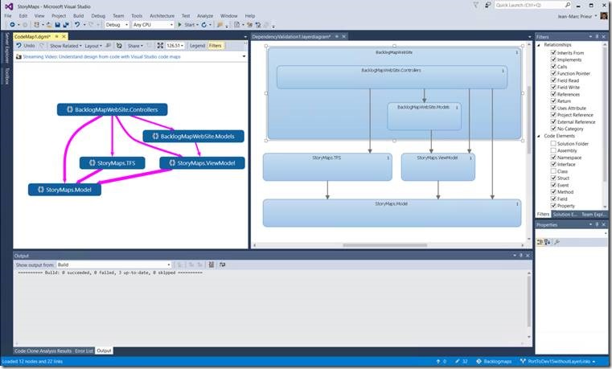

# Create dependency diagrams from your code

To visualize your software system's high-level, logical architecture, create a *dependency diagram* in Visual Studio. To make sure that your code stays consistent with this design, validate your code with a dependency diagram. You can create dependency diagrams for Visual C# and Visual Basic projects. To see which editions of Visual Studio support this feature, see [Edition support for architecture and modeling tools](../modeling/what-s-new-for-design-in-visual-studio.md#edition-support-for-architecture-and-modeling-tools).

A dependency diagram lets you organize Visual Studio solution items into logical, abstract groups called *layers*. You can use layers to describe major tasks that these artifacts perform or the system's major components. Each layer can contain other layers that describe more detailed tasks. You can also specify the intended or existing *dependencies* between layers. These dependencies, which are represented as arrows, show which layers can use or currently use the functionality represented by other layers. To maintain architectural control of the code, show the intended dependencies on the diagram and then validate the code against the diagram.

[Video: Validate your architecture dependencies in real time](https://sec.ch9.ms/sessions/69613110-c334-4f25-bb36-08e5a93456b5/170ValidateArchitectureDependenciesWithVisualStudio.mp4)

##  Create a dependency diagram

Before you create a dependency diagram, make sure your solution has a modeling project.

> [!IMPORTANT]
> Don't add, drag, or copy an existing dependency diagram from a modeling project to another modeling project or to another place in the solution. This preserves the references from the original diagram, even if you change the diagram. This also prevents layer validation from working correctly and might cause other issues, such as missing elements or other errors when you try to open the diagram.
>
> Instead, add a new dependency diagram to the modeling project. Copy the elements from the source diagram to the new diagram. Save both the modeling project and the new dependency diagram.

### Add a new dependency diagram to a modeling project

> [!NOTE]
> Dependency diagrams for .NET Core projects are supported starting in Visual Studio 2019 version 16.2.

1. On the **Architecture** menu, choose **New Dependency Diagram**.

2. Under **Templates**, choose **dependency diagram**.

3. Name the diagram.

4. In **Add to Modeling Project**, browse to and select an existing modeling project in your solution.

     -or-

     Choose **Create a new modeling project** to add a new modeling project to the solution.

    > [!NOTE]
    > The dependency diagram must exist inside a modeling project. However, you can link it to items anywhere in the solution.

5. Make sure to save both the modeling project and the dependency diagram.

## Drag and drop, or copy and paste, from a Code Map

1. Generate a Code Map for the solution using the **Architecture** menu.

2. Consider applying a Code Map filter to remove solution folders and "Test Assets" if you only want to enforce dependencies in product code.

3. On the generated Code Map, remove the "External" node, or expand it to show external assemblies, depending on whether you want to enforce namespace dependencies, and delete non-required assemblies from the Code Map.

4. Create a new Dependency Diagram for the solution using the **Architecture** menu

5. Select all the nodes on the Code Map (use _Ctrl_ + _A_, or use the rubber band selection by pressing the _Shift_ key before you click, drag, and release.

6. Drag and drop, or a copy and paste, the selected elements to the new Dependency Validation diagram.

7. This shows the current app architecture. Decide what you want the architecture to be and modify the dependency diagram accordingly.

##  Create layers from artifacts
 You can create layers from Visual Studio solution items, such as projects, code files, namespaces, classes, and methods. This automatically creates links between layers and items, including them in the layer validation process.

 You can also link layers to items that don't support validation, such as Word documents or PowerPoint presentations, so that you can associate a layer with specifications or plans. You can also link layers to files in projects that are shared across multiple apps, but the validation process won't include those layers, which appear with generic names such as "Layer 1" and "Layer 2".

 To see if a linked item supports validation, open **Layer Explorer** and examine the **Supports Validation** property of the item. See [Managing links to artifacts](#Managing).

|**To**|**Follow these steps**|
|-|-|
|Create a layer for a single artifact|<ol><li>Drag the item onto the dependency diagram from these sources:   <ul><li>**Solution Explorer**           For example, you can drag files or projects.</li><li>Code maps           See [Map dependencies across your solutions](../modeling/map-dependencies-across-your-solutions.md) and [Use code maps to debug your applications](../modeling/use-code-maps-to-debug-your-applications.md).</li><li>**Class View** or **Object Browser**</li></ul>      A layer appears on the diagram and is linked to the artifact.</li><li>Rename the layer to reflect the responsibilities of the associated code or artifacts.</li></ol> **Important:**  Dragging binary files to the dependency diagram does not automatically add their references to modeling project. You must manually add the binary files that you want to validate to the modeling project. **To add binary files to the modeling project** <ol><li>In **Solution Explorer**, open the shortcut menu for the modeling project, and then choose **Add Existing Item**.</li><li>In the **Add Existing Item** dialog box, browse to the binary files, select them, and then choose **OK**.     The binary files appear in the modeling project.</li><li>In **Solution Explorer**, choose a binary file that you added, and then press **F4** to open the **Properties** window.</li><li>On each binary file, set the **Build Action** property to **Validate**.</li></ol>|
|Create a single layer for all selected artifacts|Drag all the artifacts to the dependency diagram at the same time.   A layer appears on the diagram and is linked to all of the artifacts.|
|Create a layer for each selected artifact|Press and hold the **SHIFT** key while you drag all of the artifacts to the dependency diagram at the same time. **Note:**  If you use the **SHIFT** key to select a range of items, release the key after you select the artifacts. Press and hold it again when you drag the artifacts to the diagram.    A layer for each artifact appears on the diagram and is linked to each artifact.|
|Add an artifact to a layer|Drag the artifact to the layer.|
|Create a new unlinked layer|In the **Toolbox**, expand the **Dependency Diagram** section, and then drag a **Layer** to the dependency diagram.   To add multiple layers, double-click the tool. When you are finished, choose the **Pointer** tool or press the **ESC** key.   - or -   Open the shortcut menu for the dependency diagram, choose **Add**, and then choose **Layer**.|
|Create nested layers|Drag an existing layer onto another layer.   - or -   Open the shortcut menu for a layer, choose **Add**, and then choose **Layer**.|
|Create a new layer that contains two or more existing layers|Select the layers, open the shortcut menu for your selection, and then choose **Group**.|
|Change the color of a layer|Set its **Color** property to the color that you want.|
|Specify that artifacts associated with a layer must not belong to the specified namespaces|Type the namespaces in the layer's **Forbidden Namespaces** property. Use a semicolon (**;**) to separate the namespaces.|
|Specify that artifacts associated with a layer cannot depend on the specified namespaces|Type the namespaces in the layer's **Forbidden Namespace Dependencies** property. Use a semicolon (**;**) to separate the namespaces.|
|Specify that artifacts associated with a layer must belong to one of the specified namespaces|Type the namespace in the layer's **Required Namespaces** property. Use a semicolon (**;**) to separate the namespaces.|

 The number on a layer indicates the number of artifacts that are linked to the layer. However, when reading this number, remember the following:

- If a layer links to an artifact that contains other artifacts, but the layer does not link directly to the other artifacts, then the number includes only the linked artifact. However, the other artifacts are included for analysis during layer validation.

     For example, if a layer is linked to a single namespace, then the number of linked artifacts is 1, even if the namespace contains classes. If the layer also has links to each class in the namespace, then the number will include the linked classes.

- If a layer contains other layers that are linked to artifacts, then the container layer is also linked to those artifacts, even though the number on the container layer does not include those artifacts.

##  Manage links between layers and artifacts

1. On the dependency diagram, open the shortcut menu for the layer, and then choose **View Links**.

     **Layer Explorer** shows the artifact links for the selected layer.

2. Use the following tasks to manage these links:

|**To**|**In Layer Explorer**|
|-|-|
|Delete the link between the layer and an artifact|Open the shortcut menu for the artifact link, and then choose **Delete**.|
|Move the link from one layer to another|Drag the artifact link to an existing layer on the diagram.   - or -   1.  Open the shortcut menu for the artifact link, and then choose **Cut**. 2.  On the dependency diagram, open the shortcut menu for the layer, and then choose **Paste**.|
|Copy the link from one layer to another|1.  Open the shortcut menu for the artifact link, and then choose **Copy**. 2.  On the dependency diagram, open the shortcut menu for the layer, and then choose **Paste**.|
|Create a new layer from an existing artifact link|Drag the artifact link to a blank area on the diagram.|
|Verify that a linked artifact supports validation against the dependency diagram.|Look at the **Supports Validation** column for the artifact link.|

##  Reverse-engineer existing dependencies
 A dependency exists wherever an artifact that is associated with one layer has a reference to an artifact that is associated with another layer. For example, a class in one layer declares a variable that has a class in another layer. You can reverse-engineer existing dependencies for artifacts that are linked to layers on the diagram.

> [!NOTE]
> Dependencies cannot be reverse-engineered for certain kinds of artifacts. For example, no dependencies will be reverse-engineered from or to a layer that is linked to a text file. To see which artifacts have dependencies that you can reverse-engineer, open the shortcut menu for one or multiple layers, and then choose **View Links**. In **Layer Explorer**, examine the **Supports Validation** column. Dependencies will not be reverse-engineered for artifacts for which this column shows **False**.

- Select one or multiple layers, open the shortcut menu for a selected layer, and then choose **Generate Dependencies**.

  Typically, you will see some dependencies that should not exist. You can edit these dependencies to align them with the intended design.

##  Edit layers and dependencies to show the intended design
 To describe the changes that you plan to make to your system or the intended architecture, edit the dependency diagram:

|**To**|**Perform these steps**|
|-|-|
|Change or restrict the direction of a dependency|Set its **Direction** property.|
|Create new dependencies|Use the **Dependency** and **Bidirectional Dependency** tools.   To draw multiple dependencies, double-click the tool. When you are finished, choose the **Pointer** tool or press the **ESC** key.|
|Specify that artifacts associated with a layer cannot depend on the specified namespaces|Type the namespaces in the layer's **Forbidden Namespace Dependencies** property. Use a semicolon (**;**) to separate the namespaces.|
|Specify that artifacts associated with a layer must not belong to the specified namespaces|Type the namespaces in the layer's **Forbidden Namespaces** property. Use a semicolon (**;**) to separate the namespaces.|
|Specify that artifacts associated with a layer must belong to one of the specified namespaces|Type the namespace in the layer's **Required Namespaces** property. Use a semicolon (**;**) to separate the namespaces.|

##  Change how elements appear on the diagram
 You can change the size, shape, color, and position of layers or the color of dependencies by editing their properties.

##  Discover patterns and dependencies on a code map
 While creating dependency diagrams, you might also create **code maps**. These diagrams can help you discover patterns and dependencies while you explore the code. Use Solution Explorer, Class View, or Object Browser to explore assemblies, namespaces, and classes - which often correspond well to existing layers. For more information about code maps, see:

- [Map dependencies across your solutions](../modeling/map-dependencies-across-your-solutions.md)

- [Use code maps to debug your applications](../modeling/use-code-maps-to-debug-your-applications.md)

- [Find potential problems using code map analyzers](../modeling/find-potential-problems-using-code-map-analyzers.md)

## See also

- [Edition support for architecture and modeling tools](../modeling/what-s-new-for-design-in-visual-studio.md#edition-support-for-architecture-and-modeling-tools)
- [Video: Validate your architecture dependencies in real time](https://sec.ch9.ms/sessions/69613110-c334-4f25-bb36-08e5a93456b5/170ValidateArchitectureDependenciesWithVisualStudio.mp4)
- [Dependency Diagrams: Reference](../modeling/layer-diagrams-reference.md)
- [Dependency Diagrams: Guidelines](../modeling/layer-diagrams-guidelines.md)
- [Validate code with dependency diagrams](../modeling/validate-code-with-layer-diagrams.md)
- [Visualize code](../modeling/visualize-code.md)
