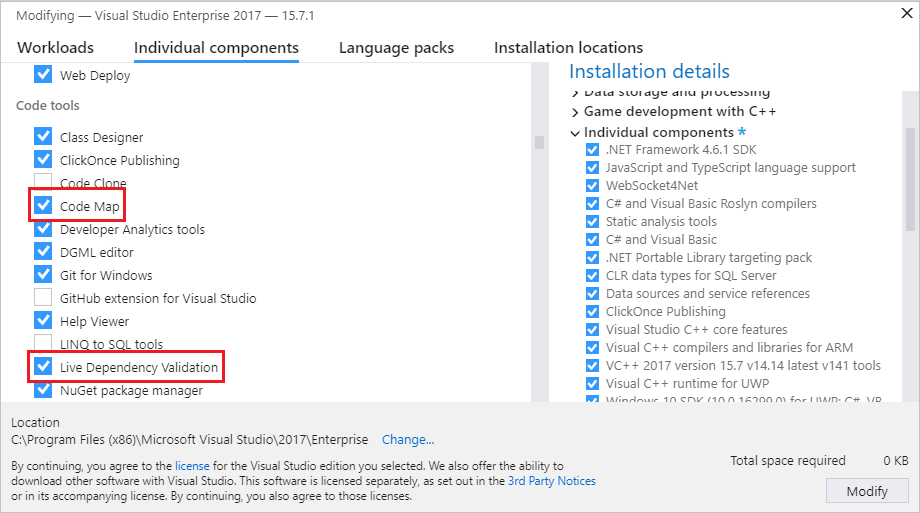

# Install Code Map and Live Dependency Validation

To create a code map in Visual Studio, first install the **Code Map** and **Live Dependency Validation** components:

1. Open **Visual Studio Installer**. You can open it from the Windows Start menu, or within Visual Studio by selecting **Tools** > **Get Tools and Features**.

1. Select the **Individual components** tab.

1. Scroll down to the **Code tools** section and select **Code Map** and **Live Dependency Validation**.

   

1. Select **Modify**.

   The **Code Map** and **Live Dependency Validation** components begin installing. You may be asked to close Visual Studio.