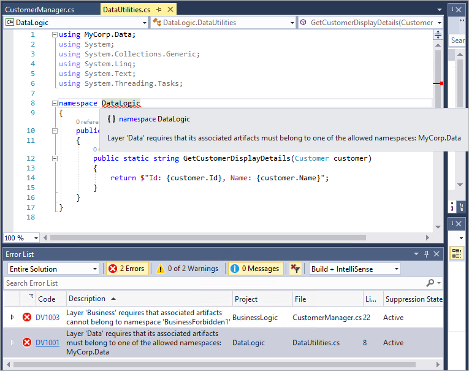
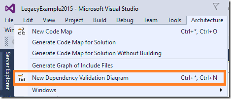
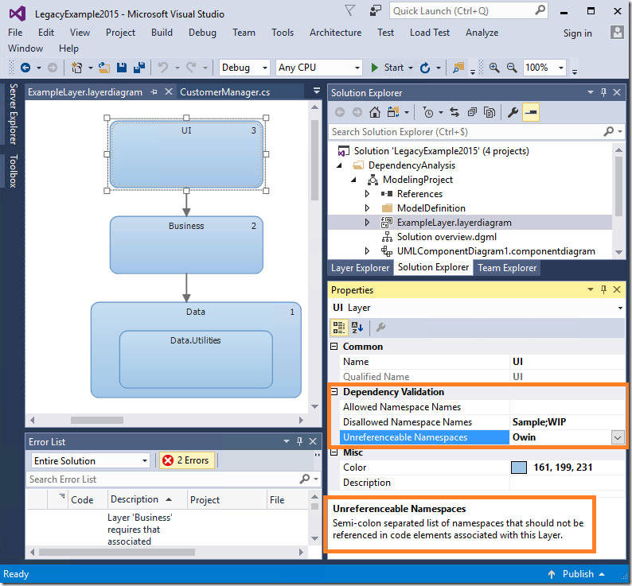

# What's new for design in Visual Studio 2017

## Live dependency validation

Removing unwanted dependencies is an important part of managing your technical debt. Live validation of dependencies is now included, providing precise information about issues, and benefitting fully from the new features in the Error list and the editor.

The authoring experience has changed to make dependency validation more discoverable and more accessible, changing the terminology from "Layer diagram" to "Dependency diagram".

The **Architecture** menu now contains a command to directly create a Dependency diagram:

... and the property names of a Layer in a Dependency diagram, and their descriptions, have been changed to make them more meaningful:

You now see the impact of your changes immediately in the analysis results for the current code in the solution each time you save the diagram. You don't have to wait any longer for the completion of the "Validate Dependencies" command.

For more details, see [this blog post](https://devblogs.microsoft.com/devops/live-architecture-dependency-validation-in-visual-studio-15-preview-5/).

## UML designers have been removed

The UML designers have been removed from this version of Visual Studio Enterprise.

* UML diagrams are now presented as XML files
* The UML Model Explorer no longer exists
* Modeling project references are no longer used for dependency validation
* The "Layer References" node in Solution Explorer is no longer displayed
* The "Validate" build action on a Dependency (Layer) diagram is no longer used - the Build task has been removed
* The project structure is maintained for round-tripping between versions
* You can still open, create, edit, and save a Dependency (Layer) diagram as XML
* TFS work items linked to a Dependency (Layer) diagram are not accessible on the design surface
* Back linking from to DSL or a Layer is no longer supported
* UML extensibility in the Modeling SDK is no longer supported

However, support for visualizing the architecture of .NET and C++ code is available through [code maps](map-dependencies-across-your-solutions.md), and the significant improvements to dependency validation described above.

If you are a significant user of the UML designers, you can continue to use Visual Studio 2015 or earlier versions while you decide on an alternative tool for your UML needs.

For more details, see [this blog post](https://devblogs.microsoft.com/devops/uml-designers-have-been-removed-layer-designer-now-supports-live-architectural-analysis/).

[!INCLUDE[modeling_sdk_info](includes/modeling_sdk_info.md)]

## <a name="VersionSupport" />Edition support for architecture and modeling tools

Visual Studio is available in several editions. Not all of these provide support for the architecture and modeling tools. The following table shows the availability of each tool.

|**Feature**|**Enterprise edition**|**Professional edition**|**Community edition**|
|-|-|-|-|
|**Code maps**|Yes|Only supports reading code maps, filtering code maps, adding new generic nodes, and creating a new Directed Graph from a selection.|-|
|**Dependency diagrams**|Yes|Only supports reading dependency diagrams.|Only supports reading dependency diagrams.|
|**Directed graphs** (DGML diagrams)|Yes|Yes|Yes|
|**Code clone**|Yes|-|-|