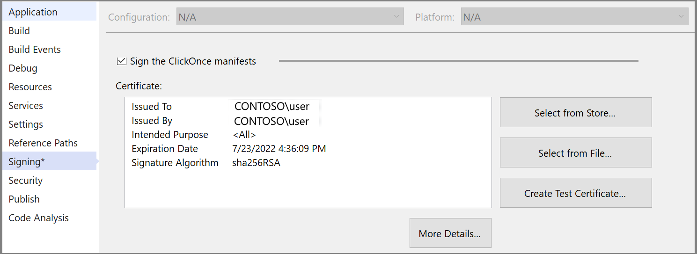

# MSB3323

This article describes the MSB3323 error code.

## Message text

`Unable to find manifest signing certificate in the certificate store.`

## Remarks

This error occurs when MSBuild tries to sign a manifest, but fails to find the certificate.

You could get the error if you enabled **Sign the ClickOnce manifests** and the `.pfx` file specified for ClickOnce manifest signing could not be found in your certificate store when MSBuild was trying to publish the manifest.

## Resolution

To resolve this error, try re-importing the .pfx file again in the certificate store. To re-import the `.pfx` file, right-click the `.pfx` file in Windows Explorer and choose **Install PFX**.



See [How to: Sign application and deployment manifests](../../ide/how-to-sign-application-and-deployment-manifests.md) or for newer .NET projects in Visual Studio 2019 or later, see [Deploy a .NET Windows Desktop application using ClickOnce](../../deployment/quickstart-deploy-using-clickonce-folder.md).

When running in a non-interactive environment, such as a script in a pipeline, use the command-line tool [certutil](/windows-server/administration/windows-commands/certutil).

```cmd
certutil –f –p [certificate_password] –importpfx <path to pfx file>
```

## Applies to

All versions of MSBuild
