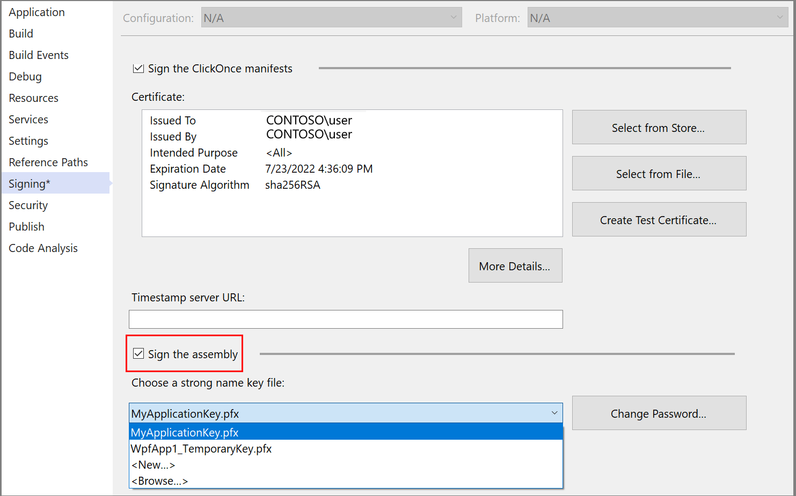

# MSB3325: Cannot import the following key file

The full error text is similar to the following example:

```output
MSB3325: Cannot import the following key file: {0}. The key file may be password protected. To correct this, try to import the certificate again or manually install the certificate to the Strong Name CSP with the following key container name: 'name'
```

You could get this error if you checked the **Sign the assembly** option in the **Signing** tab of **Project Properties** and chose a .pfx file for assembly signing. In this case, the strong name public key should get imported to the Cryptographic Service Provider (CSP) on the machine when the .pfx file is selected. When you publish an app, MSBuild tries to sign the assembly. If the signing code could not read the strong name public key from the strong name CSP for any reason, it gives this error.

When you get this error for any reason, the workaround is to manually install the .pfx in the strong name Cryptographic Service Provider (CSP) with the key container name specified in the error message.

To install the strong name certificate to the CSP manually, open a developer command prompt, and run the `sn.exe` command as follows:

```cmd
sn.exe -i <pfx_file> <key_container_name_from_error_message>
```

After that, the publish process should be able to read the strong name public key from the CSP and strong name sign the assembly.



See [How to: Sign application and deployment manifests](../../ide/how-to-sign-application-and-deployment-manifests.md).
