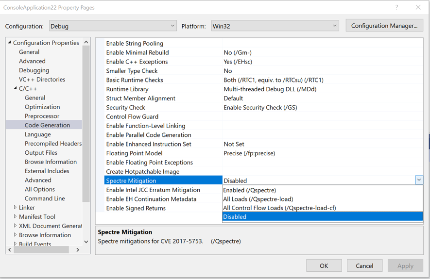
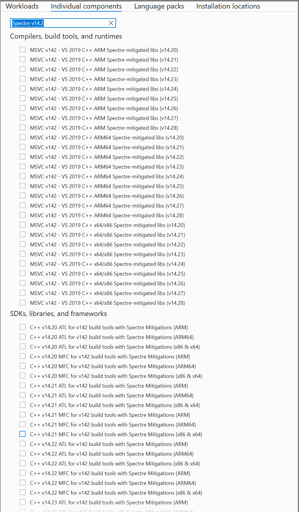

# MSBuild error MSB8042

> ATL or MFC libraries with Spectre Mitigations are required for this project. Install them from the Visual Studio installer (Individual components tab) for any toolsets and architectures being used. Learn more: [`https://aka.ms/Ofhn4c`](https://aka.ms/Ofhn4c)

This error occurs in an MFC or ATL project when using Spectre-mitigated libraries is requested (**C/C++** > **Spectre Mitigation** isn't set to **Disabled**), but Spectre-mitigated MFC or ATL libraries aren't installed.

To fix the error, first decide if you want Spectre mitigation. You can read about Spectre mitigation at the page for the [`/Qspectre`](/cpp/build/reference/qspectre) compiler option. If you don't want Spectre mitigation, make sure it's disabled. For command-line builds, check that you're not using the `/Qspectre` compiler option or its variants `/Qspectre-load` and `/Qspectre-load-cf`. To disable it in the Visual Studio IDE, open **Properties** for your projects, and in the **Configuration Properties** > **C/C++** > **Code Generation** property page, set the **Spectre Mitigations** property to **Disabled**.

 If you want Spectre mitigation, make sure that the right compiler and library components with support for Spectre mitigation are installed. In the Visual Studio Installer, choose **Modify** and then choose **Individual Components**, search for "Spectre v14.2," and in the **Compiler, build tools and runtime** section, make sure that **MSVC v142… Spectre-mitigated libs** are selected for all architectures that you're building for. If you're using ATL or MFC, make sure that the libraries, such as **C++ MFC for latest v142 build tools with Spectre Mitigations** (or the appropriate version for your toolset) are also selected for all the architectures you're building for.

Also, to enable Spectre mitigations, make sure that you're using one of the `/Qspectre` compiler options. To set this property in the Visual Studio IDE, open **Properties** for your projects, and in the **Configuration Properties** > **C/C++** > **Code Generation** property page, set the **Spectre Mitigations** property to **Enabled**, or **All loads** for [/Qspectre-load](/cpp/build/reference/qspectre-load), or **All Control Flow Loads** for [/Qspectre-load-cf](/cpp/build/reference/qspectre-load-cf).

For more information, see [Spectre mitigations in MFC](https://devblogs.microsoft.com/cppblog/spectre-mitigations-in-msvc/).
