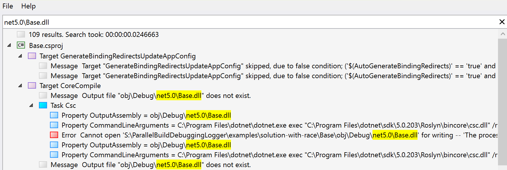
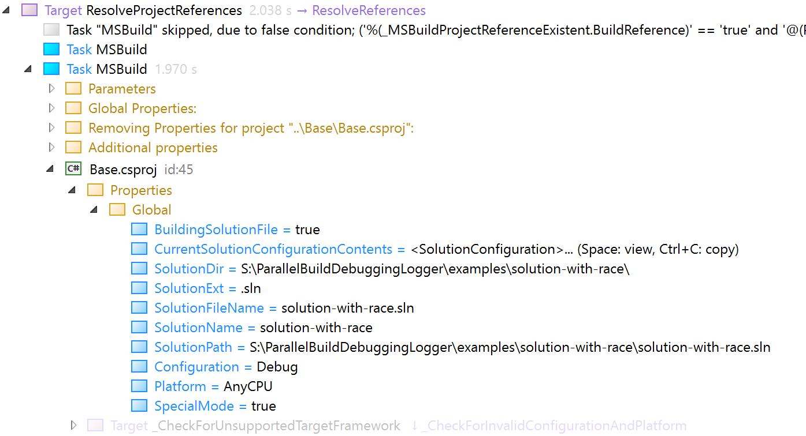
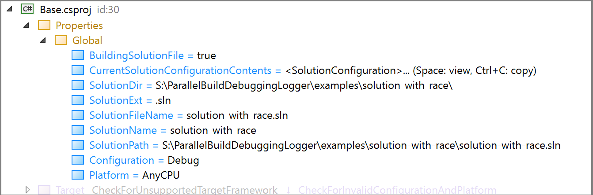

# Fix intermittent build failures

Dealing with build failures that don't happen every time is a frustrating experience. This article will help you identify the root cause, and make changes that will enable you to fix intermittent build failures, so that your builds run consistently every time.

MSBuild supports parallel builds by running different worker node processes on different CPU cores. While there are often significant performance benefits from building in parallel, doing so can also introduce the risk of errors that occur when multiple processes try to use the same resource at the same time. This situation is a type of race condition. A race condition can manifest behavior that differs from build to build. For example, one process might be ahead or behind the other by differing amounts of time.

Error messages that arise from file I/O contention always include an operating system file I/O failure, but can have different MSBuild error codes, depending on what was happening in the build when the file I/O error occurred. Some examples might look like the following on the Windows platform:

```output
error MSB3677: Unable to move file "source" to "dest".
Cannot create a file when that file already exists. [{project file}] 
```

```output
The process cannot access the file 'file' because it is being used by another process.
```

File contention race can occur when a particular project is requested to build with more than one combination of property settings. MSBuild typically does a separate build for a referenced project whenever property settings differ, in case the output might also differ. Depending on the timing of concurrently running builds, move or copy operations can fail if a file is already present at the same location, or they can fail because the destination file is being used by another MSBuild process. Also, file read operations can fail if another MSBuild process is reading or writing the same file.

You can permanently fix most build file contention issues by understanding the cause and making appropriate changes in the project files, but only if the cause is in your own code. Race conditions can also be caused by bugs in SDK code, in which case the issue has to be reported to and investigated by the owners of the relevant SDK.

## Causes of build race conditions

This section describes different types of problems that can occur which lead to race conditions. The next section, [Diagnose and fix race conditions](#diagnose-and-fix-race-conditions), describes what to do to solve these problems.

### Inconsistent ProjectReference property settings

Different builds of the same project are a normal part of a many build processes; they occur when MSBuild builds output for more than one combination of settings. For example, a solution may have multiple target frameworks (such as `net472` and `net7`), or multiple target platform architectures (such as `Arm64` and `x64`). This build requirement is satisfied by specifying a different output folder for each combination of outputs. That way, the `Arm64` `net472` version of an assembly is output to a different folder from the other combinations and no conflict occurs. The default SDK settings already handle the examples mentioned here, but sometimes the occurrence of multiple combinations of settings is not as obvious and needs to be investigated.

### ProjectReference properties conflict with global properties

Global properties, that is, when you set a property on the command line with the `/p` or `/property` option, are implicitly used for referenced project builds. However, by using  `RemoveGlobalProperties` or `GlobalPropertiesToRemove`, you can omit some or all global property settings for any given project reference, so if those properties are not used consistently, you can have a situation where more than one version of a referenced project is built with the global property set, and another where it's unset or has a different value.

### Packaging unintentionally triggers project builds

If your build packages the output of projects that have been built previously, you might encounter a race condition when your packaging build logic specifies different property settings than the original projects used when they were built. In that case, MSBuild normally would trigger a rebuild of those projects because of the mismatch in properties. This situation can lead to race conditions. Consider setting `BuildProjectReferences` to `false` in the packaging project, so that the projects that are being packaged are never asked to be built. This would mean that the packaging build should only be requested when project builds are previously done and up-to-date.

## Diagnose and fix race conditions

You should suspect a race condition error when move operations, copy operations, or file writes for files generated by your build fail intermittently.

The approach to address the problem depends on the desired outcome. Do you really need two different versions of the built project? If so, make the output folder different for the two different property configurations. If not, you can change the `ProjectReference` elements to ensure that the same properties are set for each reference.

To diagnose and fix the race condition, follow these steps.

1. Check that you don't have any other program running that is using those files, such as a Visual Studio debugger session on the same machine.

1. Find out if the problem goes away if you run builds with the MSBuild `/m:1` option. See [MSBuild command-line reference](./msbuild-command-line-reference.md). This is the command-line option that tells MSBuild the number of nodes to use for builds. If set to 1, then builds proceed serially, and a race condition cannot occur. Using the `/m:1` option is a workaround you can use to avoid the race condition, but it's not a long-term solution. Your build output is still built more than once, with possible differences, which is an error condition called *overbuild*. In addition, building serially significantly increases the time required to complete a build. If the build only demonstrates the intermittent file I/O failure when parallel build is enabled (number of processors is greater than 1), then that is a build race condition.

1. Generate a log. Run a build with the verbosity to `Normal` or greater (for example, use the command-line option `-verbosity:Normal`). To troubleshoot the race condition, it is recommended to generate a binary log (use the `/bl` or `/binlog` option) and view it with the [Structured Log Viewer](https://msbuildlog.com/). To get a useful log for diagnosing a race condition, it is not required that the log be from a failed run, because you can still locate the multiple places where the output that produced the error is accessed.

1. Whether that particular run failed or not, open the log (or `.binlog` file) and search for the filename of the file that triggers the failure and find all the places where the file is used.

   The following screenshot shows the Structured Log Viewer viewing the log produced by building the solution in the [Example](#example). What's shown are the search results for the file *net5.0\Base.dll*, which was mentioned in an error message. The same output file shows up twice as the `OutputAssembly` for the `Csc` task in the search results, indicating that it's building more than once.
   

1. Note the property settings in effect for each instance of that project's build. The Structured Log Viewer makes this easier, since every individual project build has a **Properties** node listing all the property settings in effect for that project build. If you're using a text log, the properties set for a build are output in text when the verbosity setting is `Normal` or greater. Compare the lists of properties for each build of the project that generates the failed output. You should see a difference, if the problem is actually a race condition.

   The following screenshot shows the Structured Log Viewer, with the Properties node expanded for one project build. Notice that this build is under the `ProjectReferences` node for another project, which means this build was triggered by a `ProjectReference` element in another project. If you follow the nodes up the tree, you can see what project referenced it.

   

   Compare the list to the other build of the same project, and you can see that `SpecialMode` is missing. This build is a top-level build, meaning it was built because it was in the solution itself, not because it was referenced by another project.

   

1. Search the project files for `ProjectReference` where the `Include` attribute specifies that project. Look for any of the metadata `SetConfiguration`, `SetPlatform`, `SetTargetFramework`, `AdditionalProperties`, `RemoveGlobalProperties`, or `GlobalPropertiesToRemove`. Check for differences in the values set for these metadata between different `ProjectReference` elements across the solution. In the [example](#example), it's the inconsistent `AdditionalProperties` metadata setting (in one place, but not in the other) that is the source of the problem.

1. Consider the meaning of property settings that are different, and whether they would materially impact the build output. If the property setting differences are meaningful and the output is intended to be distinct, then the fix is to use a different folder for each variation of the setting, just as the .NET SDK does for the platform, the configuration (for example, Debug or Release), or the target framework. If the property setting difference is unintentional or insignificant, then try to find a way to change the project code to eliminate the difference in the properties. In the [example](#example), this could be accomplished by adding the `AdditionalProperties="SpecialMode=true"` metadata to the `ProjectReference` in *Middle2.csproj*, or by removing the `AdditionalProperties` metadata from *Middle1.csproj*. The appropriate change depends on the specific requirements of your application, service, or target.

1. If the error is in an SDK not under your control, report the issue to the SDK owner.

## Example

A simple case that demonstrates the pattern is presented here. Suppose you have a solution with several projects, one front-end client (`App`), two class libraries (`Middle1` and `Middle2`), and a library (`Base`), which is referenced by the two class libraries.

The project files in the following code sections are all part of a single solution. This collection of projects results in two different builds of `Base`, one with `SpecialMode=true` and another without it. An intermittent error could occur that would reference the *Base.dll* output. You might sometimes get an error that `Base.dll` could not be written "because it is being used by another process."

```xml
<!-- Base.csproj -->
<Project Sdk="Microsoft.NET.Sdk">

  <ItemGroup>
    <ProjectReference Include="..\Base\Base.csproj" />
  </ItemGroup>

  <PropertyGroup>
    <TargetFramework>net5.0</TargetFramework>
  </PropertyGroup>

</Project>
```

```xml
<!-- Middle1.csproj -->
<Project Sdk="Microsoft.NET.Sdk">

  <ItemGroup>
    <ProjectReference Include="..\Base\Base.csproj" AdditionalProperties="SpecialMode=true" />
  </ItemGroup>

  <PropertyGroup>
    <TargetFramework>net5.0</TargetFramework>
  </PropertyGroup>

</Project>
```

```xml
<!-- Middle2.csproj -->
<Project Sdk="Microsoft.NET.Sdk">

  <ItemGroup>
    <ProjectReference Include="..\Base\Base.csproj" />
  </ItemGroup>

  <PropertyGroup>
    <TargetFramework>net5.0</TargetFramework>
  </PropertyGroup>

</Project>
```

```xml
<!-- App.csproj -->
<Project Sdk="Microsoft.NET.Sdk">

  <ItemGroup>
    <ProjectReference Include="..\Middle1\Middle1.csproj" />
    <ProjectReference Include="..\Middle2\Middle2.csproj" />
  </ItemGroup>

  <PropertyGroup>
    <OutputType>Exe</OutputType>
    <TargetFramework>net5.0</TargetFramework>
  </PropertyGroup>

</Project>
```

If the desired behavior is to use `SpecialMode`, then the appropriate fix is to add the same `AdditionalProperties` metadata value to the `ProjectReference` in *Middle2.csproj*:

```xml
<!-- Middle2.csproj -->
<Project Sdk="Microsoft.NET.Sdk">

  <ItemGroup>
    <ProjectReference Include="..\Base\Base.csproj" AdditionalProperties="SpecialMode=true" />
  </ItemGroup>

  <PropertyGroup>
    <TargetFramework>net5.0</TargetFramework>
  </PropertyGroup>

</Project>
```

The build issue could be fixed also by removing the AdditionalProperties metadata from *Middle1.csproj*, if that fits the intention.

## Next steps

- [Build multiple projects in parallel with MSBuild](building-multiple-projects-in-parallel-with-msbuild.md)

- [How MSBuild builds projects](build-process-overview.md)