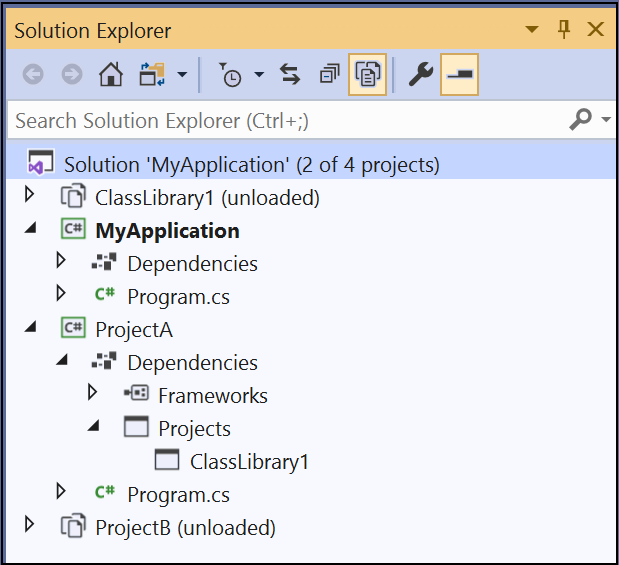

# Solution filters in MSBuild

Solution filter files are JSON files with the extension *.slnf* that indicate which projects to build or load from all the projects in a solution. Starting with MSBuild 16.7, you can invoke MSBuild on the solution filter file to build the solution with filtering enabled. 

> [!NOTE]
> The solution filter file reduces the set of projects that will be loaded or built and simplifies the format. The solution file is still required.

## Build a solution filter from the command line

Building a solution filter file from the command line uses exactly the same syntax as building a solution file. Specify the solution filter file instead of the solution to build with filtering enabled, as follows:

```console
msbuild [options] solutionFilterFile.slnf
```

You can also append switches and extra properties as normal. See [MSBuild command line reference](msbuild-command-line-reference.md). This command builds the filtered projects and any projects they depend on. When building a solution filter from the command line, MSBuild automatically follows dependencies. It builds a project if it's specified in the filter or referenced by a project that is built.

## Solution filter files

You can use Visual Studio to work with solution filter files. Opening a solution filter in Visual Studio displays the unloaded projects as well as the loaded projects and gives you the option of loading more projects to select them for building. You can load all projects the initial project(s) depend on to build as well, but this is not required. See [Filtered solutions](../ide/filtered-solutions.md).

The solution filter doesn't have to be in the same folder as the solution. The path to the solution file is relative to the location of solution filter file, but the paths to each project are relative to the solution file itself and should match the project paths in the solution file. The following example demonstrates the use of relative paths:

```json
{
  "solution": {
    "path": "..\\..\\Documents\\GitHub\\msbuild\\MSBuild.sln",
    "projects": [
      "src\\Build.OM.UnitTests\\Microsoft.Build.Engine.OM.UnitTests.csproj"
    ]
  }
}
```

The backslashes in paths must be doubled, since they're escaped.

> [!NOTE]
> In the case where you're using the `.slnx` solution file format, supported in MSBuild 17.12 and later, the `.slnx` file takes priority over the `.slnf` file.

## Example

Here's an example of a filtered solution in Visual Studio:



In this solution, ClassLibrary1 is used by both ProjectA and ProjectB and so ClassLibrary1 is listed as a project reference.

Here's the solution filter file that Visual Studio generates:

```json
{
  "solution": {
    "path": "MyApplication.sln",
    "projects": [
      "MyApplication\\MyApplication.csproj",
      "ProjectA\\ProjectA.csproj"
    ]
  }
}
```

In this example, when you build with filtering enabled (by using the command `MSBuild [options] MyFilter.slnf`), MSBuild builds MyApplication and ProjectA because they're explicitly listed in the solution filter file. As part of building ProjectA, MSBuild builds ClassLibrary1 because ProjectA depends on it.  ProjectB is not built. (This discussion assumes a clean build. If projects were built previously, the usual rules apply for skipping projects that are already up-to-date.)

## See also

- [Filtered solutions](../ide/filtered-solutions.md)
- [MSBuild command line reference](msbuild-command-line-reference.md)
