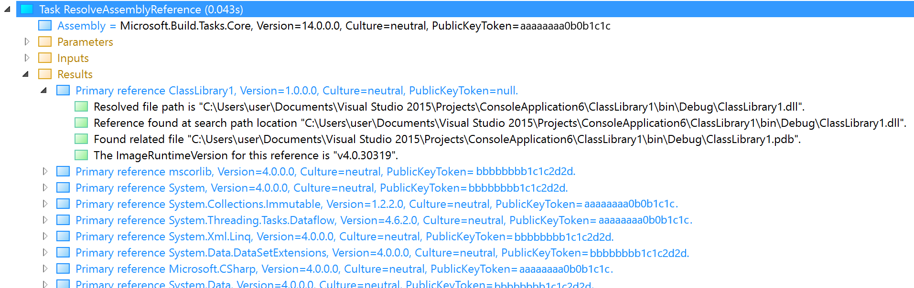

# Troubleshoot assembly references

One of the most important tasks in MSBuild and the .NET build process is resolving assembly references, which happens in the `ResolveAssemblyReference` task. This article explains some of the details of how `ResolveAssemblyReference` works, and how to troubleshoot build failures that can happen when `ResolveAssemblyReference` is unable to resolve a reference. To investigate assembly reference failures, you might want to install the [Structured Log Viewer](https://msbuildlog.com/) to view MSBuild logs. The screenshots in this article are taken from the Structured Log Viewer.

The purpose of `ResolveAssemblyReference` is to take all the references specified in `.csproj` files (or elsewhere) via the `<Reference>` item and map them to paths to assembly files in the filesystem.

The compilers only can accept a `.dll` path on the filesystem as a reference, so `ResolveAssemblyReference` converts strings like `mscorlib, Version=4.0.0.0, Culture=neutral, PublicKeyToken=b77a5c561934e089` that appear in project files to paths like `C:\Program Files (x86)\Reference Assemblies\Microsoft\Framework\.NETFramework\v4.6.1\mscorlib.dll`, which are then passed to the compiler via the `/r` switch.

Additionally `ResolveAssemblyReference` determines the complete set (actually the *transitive closure* in graph theory terms) of all `.dll` and `.exe` references recursively, and for each of them determines whether it should be copied to the build output directory or not. It doesn't do the actual copying (that is handled later, after the actual compile step), but it prepares an item list of files to copy.

`ResolveAssemblyReference` is invoked from the `ResolveAssemblyReferences` target:


If you notice the ordering, `ResolveAssemblyReferences` is happening before `Compile`, and of course, `CopyFilesToOutputDirectory` happens after `Compile`.

> [!NOTE]
> `ResolveAssemblyReference` task is invoked in the standard `.targets` file `Microsoft.Common.CurrentVersion.targets` in the MSBuild installation folders. You can also browse the .NET SDK MSBuild targets online at <https://github.com/dotnet/msbuild/blob/a936b97e30679dcea4d99c362efa6f732c9d3587/src/Tasks/Microsoft.Common.CurrentVersion.targets#L1991-L2140>. This link shows exactly where the `ResolveAssemblyReference` task is invoked in the `.targets` file.

## ResolveAssemblyReference inputs

`ResolveAssemblyReference` is comprehensive about logging its inputs:


The `Parameters` node is standard for all tasks, but additionally `ResolveAssemblyReference` logs its own set of information under Inputs (which is basically the same as under `Parameters`, but structured differently).

The most important inputs are `Assemblies` and `AssemblyFiles`:

```xml
    <ResolveAssemblyReference
        Assemblies="@(Reference)"
        AssemblyFiles="@(_ResolvedProjectReferencePaths);@(_ExplicitReference)"
```

`Assemblies` uses the contents of the `Reference` MSBuild item at the moment when `ResolveAssemblyReference` is invoked for the project. All the metadata and assembly references, including your NuGet references, should be contained in this item. Each reference has a rich set of metadata attached to it:


`AssemblyFiles` comes from `ResolveProjectReference` target's output item called `_ResolvedProjectReferencePaths`. `ResolveProjectReference` runs before `ResolveAssemblyReference` and it converts `<ProjectReference>` items to paths of built assemblies on disk. So the `AssemblyFiles` will contain the assemblies built by all referenced projects of the current project:


Another useful input is the boolean `FindDependencies` parameter, which takes its value from the `_FindDependencies` property:

```xml
FindDependencies="$(_FindDependencies)"
```

You can set this property to `false` in your build to turn off analyzing transitive dependency assemblies.

## ResolveAssemblyReference algorithm

The simplified algorithm for the `ResolveAssemblyReference` task is as follows:

1. Log inputs.
1. Check the `MSBUILDLOGVERBOSERARSEARCHRESULTS` environment variable. Set this variable to any value to get more detailed logs.
1. Initialize the table of references object.
1. Read the cache file from the `obj` directory (if present).
1. Compute the closure of dependencies.
1. Build the output tables.
1. Write the cache file to the `obj` directory.
1. Log the results.

The algorithm takes the input list of assemblies (both from metadata and project references), retrieves the list of references for each assembly it processes (by reading metadata) and builds a complete set (transitive closure) of all referenced assemblies, and resolves them from various locations (including the GAC, AssemblyFoldersEx, and so on).

Referenced assemblies are added to the list iteratively until no more new references are added. Then the algorithm stops.

Direct references that you provided to the task are called Primary references. Indirect assemblies that were added to the set because of a transitive reference are called Dependency. The record for each indirect assembly keeps track of all the primary ("root") items that led to its inclusion and their corresponding metadata.

## Results of the ResolveAssemblyReference task

`ResolveAssemblyReference` provides detailed logging of the results:



Resolved assemblies are divided into two categories: Primary references and Dependencies. Primary references were specified explicitly as references of the project being built. Dependencies were inferred from references of references transitively.

> [!IMPORTANT]
> `ResolveAssemblyReference` reads assembly metadata to determine the references of a given assembly. When the C# compiler emits an assembly, it only adds references to assemblies that are actually needed. So, it might happen that when you compile a certain project, the project may specify an unneeded reference that won't be baked into the assembly. It's OK to add references to project that are not needed; they are ignored.

## CopyLocal item metadata

References can also have the `CopyLocal` metadata or not. If the reference has `CopyLocal = true`, it will later be copied to the output directory by the `CopyFilesToOutputDirectory` target. In this example, `DataFlow` has `CopyLocal` set to true, while `Immutable` does not:


If the `CopyLocal` metadata is missing entirely, it's assumed to be true by default. So `ResolveAssemblyReference` by default tries to copy dependencies to output unless it finds a reason not to. `ResolveAssemblyReference` records the reasons why it chose a particular reference to be `CopyLocal` or not.

All possible reasons for `CopyLocal` decision are enumerated in the following table. It's useful to know these strings to be able to search for them in build logs.

| CopyLocal state | Description |
|-|-|
| `Undecided` | The copy local state is undecided right now. |
| `YesBecauseOfHeuristic` | The reference should have `CopyLocal='true'` because it wasn't 'no' for any reason. |
| `YesBecauseReferenceItemHadMetadata` | The Reference should have `CopyLocal='true'` because its source item has Private='true' |
| `NoBecauseFrameworkFile` | The reference should have `CopyLocal='false'` because it is a framework file. |
| `NoBecausePrerequisite` | The reference should have `CopyLocal='false'` because it is a prerequisite file. |
| `NoBecauseReferenceItemHadMetadata` | The reference should have `CopyLocal='false'` because the `Private` attribute is set to 'false' in the project. |
| `NoBecauseReferenceResolvedFromGAC` | The reference should have `CopyLocal='false'` because it was resolved from the GAC. |
| `NoBecauseReferenceFoundInGAC` | Legacy behavior, `CopyLocal='false'` when the assembly is found in the GAC (even when it was resolved elsewhere). |
| `NoBecauseConflictVictim` | The reference should have `CopyLocal='false'` because it lost a conflict between a same-named assembly file. |
| `NoBecauseUnresolved` | The reference was unresolved. It can't be copied to the bin directory because it wasn't found. |
| `NoBecauseEmbedded` | The reference was embedded. It shouldn't be copied to the bin directory because it won't be loaded at runtime. |
| `NoBecauseParentReferencesFoundInGAC` | The property `copyLocalDependenciesWhenParentReferenceInGac` is set to false and all the parent source items were found in the GAC. |
| `NoBecauseBadImage` | The assembly file provided should not be copied because it is a bad image, possibly not managed, possibly not an assembly at all. |

## Private item metadata

An important part of determining `CopyLocal` is the `Private` metadata on all primary references. Each reference (primary or dependency) has a list of all primary references (source items) that have contributed to that reference being added to the closure.

 - If none of the source items specify `Private` metadata, `CopyLocal` is set to `True` (or not set, which defaults to `True`)
 - If any of the source items specify `Private=true`, `CopyLocal` is set to `True`
 - If none of the source assemblies specify `Private=true` and at least one specifies `Private=false`, `CopyLocal` is set to `False`

## Which reference set Private to false?

The last point is an often used reason for `CopyLocal` being set to false:
`This reference is not "CopyLocal" because at least one source item had "Private" set to "false" and no source items had "Private" set to "true".`

MSBuild doesn't tell us which reference has set `Private` to false, but the structured log viewer adds `Private` metadata to the items that had it specified above:


This simplifies investigations and tells you exactly which reference caused the dependency in question to be set with `CopyLocal=false`.

## Global Assembly Cache

The Global Assembly Cache (GAC) plays an important role in determining whether to copy references to output. This is unfortunate because the contents of the GAC is machine-specific and this results in problems for reproducible builds (where the behavior differs on different machine dependent on machine state, such as the GAC).

There were recent fixes made to `ResolveAssemblyReference` to alleviate the situation. You can control the behavior by these two new inputs to `ResolveAssemblyReference`:

```xml
    CopyLocalDependenciesWhenParentReferenceInGac="$(CopyLocalDependenciesWhenParentReferenceInGac)"
    DoNotCopyLocalIfInGac="$(DoNotCopyLocalIfInGac)"
```

## AssemblySearchPaths

There are two ways to customize the list of paths `ResolveAssemblyReference` searches in attempting to locate an assembly. To fully customize the list, the property `AssemblySearchPaths` can be set ahead of time. The order matters; if an assembly is in two locations, `ResolveAssemblyReference` stops after it finds it at the first location.

By default, there are ten locations `ResolveAssemblyReference` searches (four if you use the .NET SDK), and each can be disabled by setting the relevant flag to false:

- Searching files from the current project is disabled by setting the `AssemblySearchPath_UseCandidateAssemblyFiles` property to false.
- Searching the reference path property (from a `.user` file) is disabled by setting the `AssemblySearchPath_UseReferencePath` property to false.
- Using the hint path from the item is disabled by setting the `AssemblySearchPath_UseHintPathFromItem` property to false.
- Using the directory with MSBuild's target runtime is disabled by setting the `AssemblySearchPath_UseTargetFrameworkDirectory` property to false.
- Searching assembly folders from AssemblyFolders.config is disabled by setting the `AssemblySearchPath_UseAssemblyFoldersConfigFileSearchPath` property to false.
- Searching the registry is disabled by setting the `AssemblySearchPath_UseRegistry` property to false.
- Searching legacy registered assembly folders is disabled by setting the `AssemblySearchPath_UseAssemblyFolders` property to false.
- Looking in the GAC is disabled by setting the `AssemblySearchPath_UseGAC` property to false.
- Treating the reference's Include as a real file name is disabled by setting the `AssemblySearchPath_UseRawFileName` property to false.
- Checking the application's output folder is disabled by setting the `AssemblySearchPath_UseOutDir` property to false.

## There was a conflict

A common situation is MSBuild gives a warning about different versions of the same assembly being used by different references. The solution often involves adding a binding redirect to the app.config file.

A useful way to investigate these conflicts is to search in MSBuild Structured Log Viewer for "There was a conflict". It shows you detailed information about which references needed which versions of the assembly in question.

## Related content

- [ResolveAssemblyReference task](resolveassemblyreference-task.md)
