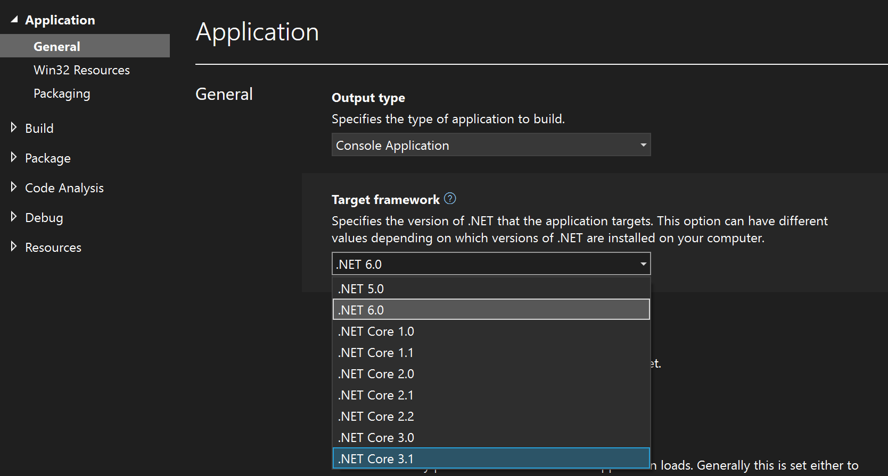

# Troubleshoot .NET Framework targeting errors

This topic describes MSBuild errors that might occur because of reference issues and how you can resolve those errors.

## You have referenced a project or assembly that targets a different version of .NET

 You can create applications that reference projects or assemblies that target different versions of .NET. For example, you can create an application that targets .NET 6 but references an assembly that targets .NET Core 3.1. However, if you create a project that targets an earlier version of .NET, you can't set a reference in that project to a project or assembly that targets .NET 6.  Here's an example of the error you might see in this case:

 ```output
 error NU1201: Project ClassLibrary-NET6 is not compatible with netcoreapp3.1 (.NETCoreApp,Version=v3.1). Project ClassLibrary-NET6 supports: net6.0 (.NETCoreApp,Version=v6.0)
2>Done building project "ClassLibrary-NET31.csproj" -- FAILED.
```

To resolve the error, make sure that your application targets a .NET version that's compatible with the version that's targeted by the projects or assemblies that your application references.

## You have re-targeted a project to a different version of .NET

 If you change the target version of .NET for your application, Visual Studio changes some of the references, but you might have to update some references manually. For example, one of the previously mentioned errors might occur if you change an application to target .NET Core 3.1 and that application has references, resources, or settings that rely on .NET 6.



### Updating references in app.config

 To work around application settings in .NET Framework applications, open **Solution Explorer**, choose **Show All Files**, and then edit the *app.config* file in the XML editor of Visual Studio. Change the version in the settings to match the appropriate version of .NET. For example, you can change the version setting from 4.0.0.0 to 2.0.0.0. Similarly, for an application that has added resources, open **Solution Explorer**, choose the **Show All Files** button, expand **My Project** (Visual Basic) or **Properties** (C#), and then edit the *Resources.resx* file in the XML editor of Visual Studio. Change the version setting from 4.0.0.0 to 2.0.0.0.

### Updating resources

 If your application has resources such as icons or bitmaps or settings such as data connection strings, you can also resolve the error by removing all the items on the **Settings** page of the **Project Designer** and then re-adding the required settings.

## You have re-targeted a project to a different version of .NET and references do not resolve

 If you retarget a project to a different version of .NET, your references may not resolve properly in some cases. Explicit fully qualified references to assemblies often cause this issue, but you can resolve it by removing the references that do not resolve and then adding them back to the project. As an alternative, you can edit the project file to replace the references. First, you remove references of the following form:

```xml
<Reference Include="System.ServiceModel, Version=3.0.0.0, Culture=neutral, PublicKeyToken=b77a5c561934e089, processorArchitecture=MSIL" />
```

 Then you replace them with the simple form:

```xml
<Reference Include="System.ServiceModel" />
```

> [!NOTE]
> After you close and reopen your project, you should also rebuild it to ensure that all references resolve correctly.

## See also

- [How to: Target a version of the .NET Framework](../ide/visual-studio-multi-targeting-overview.md)
- [.NET Framework client profile](/dotnet/framework/deployment/client-profile)
- [Framework targeting overview](../ide/visual-studio-multi-targeting-overview.md)
- [Multitargeting](../msbuild/msbuild-multitargeting-overview.md)
