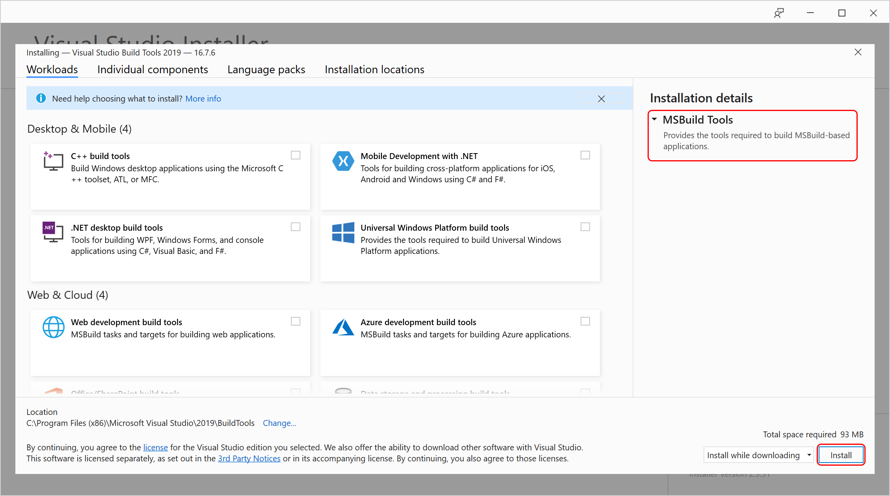

# Tutorial: Use MSBuild

MSBuild is the build platform for Microsoft and Visual Studio. This tutorial introduces you to the building blocks of MSBuild and shows you how to write, manipulate, and debug MSBuild projects. You learn about:

- Creating and manipulating a project file.

- How to use build properties.

- How to use build items.

You can run MSBuild from Visual Studio, or from the **Command Window**. In this tutorial, you create an MSBuild project file using Visual Studio. You edit the project file in Visual Studio, and use the **Command Window** to build the project and examine the results.

## Install MSBuild

::: moniker range="vs-2019"
If you have Visual Studio, then you already have MSBuild installed. With Visual Studio 2019 and later, it's installed under the Visual Studio installation folder. For a typical default installation on Windows 10, MSBuild.exe is under the installation folder in *MSBuild\Current\Bin*.

In the installer, make sure MSBuild tools for the workloads you use are selected, and choose **Install**.



To install MSBuild on a system that doesn't have Visual Studio, go to [Build Tools for Visual Studio 2019](https://visualstudio.microsoft.com/downloads/#build-tools-for-visual-studio-2019), or install the [.NET SDK](/dotnet/core/sdk#acquiring-the-net-sdk).

::: moniker-end

::: moniker range=">=vs-2022"
If you have Visual Studio, then you already have MSBuild installed. With Visual Studio 2022, it's installed under the Visual Studio installation folder. For a typical default installation on Windows 10, MSBuild.exe is under the installation folder in *MSBuild\Current\Bin*.

In the Visual Studio installer, navigate to **Individual Components**, and locate the checkbox for **MSBuild**. It's automatically selected when you choose any of the other workloads to install.

:::moniker range="vs-2019"
To install MSBuild on a system that doesn't have Visual Studio, go to [Build Tools for Visual Studio 2019](https://visualstudio.microsoft.com/vs/older-downloads/#visual-studio-2019-and-other-products) on the [downloads page](https://visualstudio.microsoft.com/downloads/?cid=learn-onpage-download-cta). Another way of getting MSBuild is to install the [.NET SDK](/dotnet/core/sdk#acquiring-the-net-sdk).
:::moniker-end
:::moniker range="vs-2022"
To install MSBuild on a system that doesn't have Visual Studio, go to [Build Tools for Visual Studio 2022](https://visualstudio.microsoft.com/downloads/?cid=learn-onpage-download-cta#build-tools-for-visual-studio-2022) on the [downloads page](https://visualstudio.microsoft.com/downloads/?cid=learn-onpage-download-cta). Another way of getting MSBuild is to install the [.NET SDK](/dotnet/core/sdk#acquiring-the-net-sdk).
:::moniker-end
:::moniker range="visualstudio"
To install MSBuild on a system that doesn't have Visual Studio, go to **Tools for Visual Studio** > **Build Tools for Visual Studio** on the [downloads page](https://visualstudio.microsoft.com/downloads/?cid=learn-onpage-download-cta). Another way of getting MSBuild is to install the [.NET SDK](/dotnet/core/sdk#acquiring-the-net-sdk).
:::moniker-end

::: moniker-end

## Create an MSBuild project

 The Visual Studio project system is based on MSBuild. It's easy to create a new project file using Visual Studio. In this section, you create a C# project file. You can choose to create a Visual Basic project file instead. In the context of this tutorial, the difference between the two project files is minor.

**To create a project file**

1. Open Visual Studio and create a project:

    In the search box, type `winforms`, then choose **Create a new Windows Forms App (.NET Framework)**. In the dialog box that appears, choose **Create**.

    In the **Project name** box, type `BuildApp`. Enter a **Location** for the solution, for example, *D:\\*.

1. Click **OK** or **Create** to create the project file.

## Examine the project file

 In the previous section, you used Visual Studio to create a C# project file. The project file is represented in **Solution Explorer** by the project node named BuildApp. You can use the Visual Studio code editor to examine the project file.

**To examine the project file**

1. In **Solution Explorer**, click the project node **BuildApp**.

1. In the **Properties** browser, notice that the **Project File** property is *BuildApp.csproj*. All project files are named with the suffix *proj*. If you had created a Visual Basic project, the project file name would be *BuildApp.vbproj*.

1. Right-click the project node again, then click **Edit BuildApp.csproj**. 

     The project file appears in the code editor.

>[!NOTE]
> For some project types, such as C++, you need to unload the project (right-click on the project file and choose **Unload project**) before you can open and edit the project file.

## Targets and tasks

Project files are XML-formatted files with the root node [Project](../msbuild/project-element-msbuild.md).

Most .NET projects have an `Sdk` attribute. These projects are called SDK-style projects. Referencing an SDK means MSBuild imports a set of files that provide the build infrastructure for that SDK. If you don't reference any SDK, you can still use MSBuild, you just won't automatically have all the SDK-specific properties and targets available to you.

```xml
<Project Sdk="Microsoft.NET.Sdk">
```

There are many variations of .NET SDKs for special purposes; they're described at [.NET Project SDKs](/dotnet/core/project-sdk/overview).

The work of building an application is done with [Target](../msbuild/target-element-msbuild.md) and [Task](../msbuild/task-element-msbuild.md) elements.

- A task is the smallest unit of work, in other words, the "atom" of a build. Tasks are independent executable components, which can have inputs and outputs. There are no tasks currently referenced or defined in the project file. You add tasks to the project file in the following sections. For more information, see [Tasks](../msbuild/msbuild-tasks.md).

- A target is a named sequence of tasks. It might be a named sequence of tasks, but critically, it represents something to be built or done, so it should be defined in a goal-oriented way. For more information, see [Targets](../msbuild/msbuild-targets.md).

The default target is not defined in the project file. Instead, it's specified in imported projects. The [Import](../msbuild/import-element-msbuild.md) element specifies imported projects. For example, in a C# project, the default target is imported from the file *Microsoft.CSharp.targets*.

```xml
<Import Project="$(MSBuildToolsPath)\Microsoft.CSharp.targets" />
```

Imported files are effectively inserted into the project file wherever they're referenced.

In SDK-style projects, you don't see this import element, since the SDK attribute causes this file to be imported implicitly.

MSBuild keeps track of the targets of a build, and guarantees that each target is built no more than once.

## Add a target and a task

 Add a target to the project file. Add a task to the target that prints a message.

**To add a target and a task**

1. Add these lines to the project file, just after the Import statement or the opening Project element.

    ```xml
    <Target Name="HelloWorld">
    </Target>
    ```

    This code creates a target named HelloWorld. Notice that you have IntelliSense support while editing the project file.

2. Add lines to the HelloWorld target, so that the resulting section looks like this:

    ```xml
    <Target Name="HelloWorld">
      <Message Text="Hello"></Message>
      <Message Text="World"></Message>
    </Target>
    ```

3. Save the project file.

The `Message` task is one of the many tasks that ships with MSBuild. For a complete list of available tasks and usage information, see [Task reference](../msbuild/msbuild-task-reference.md).

The `Message` task takes the string value of the `Text` attribute as input and displays it on the output device (or writes it to one or more logs, if applicable). The `HelloWorld` target executes the Message task twice: first to display "Hello", and then to display "World."

## Build the target

If you try to build this project from Visual Studio, it doesn't build the target you defined. That's because Visual Studio chooses the default target, which is still the one in the imported `.targets` file.

Run MSBuild from the **Developer Command Prompt** for Visual Studio to build the HelloWorld target defined previously. Use the `-target` or `-t` command-line switch to select the target.

> [!NOTE]
> We will refer to the **Developer Command Prompt** as the **Command Window** in the following sections.

**To build the target:**

1. Open the **Command Window**.

   In the search box on the taskbar, start typing the name of the tool, such as `dev` or `developer command prompt`. A list of installed apps that match your search pattern appears.

   If you need to find it manually, the file is *LaunchDevCmd.bat* in the *{Visual Studio installation folder}\Common7\Tools* folder.

2. From the command window, navigate to the folder containing the project file, in this case, *D:\BuildApp\BuildApp*.

3. Run msbuild with the command switch `-t:HelloWorld`. This command selects and builds the HelloWorld target:

    ```cmd
    msbuild buildapp.csproj -t:HelloWorld
    ```

4. Examine the output in the **Command window**. You should see the two lines "Hello" and "World":

    ```output
    Hello
    World
    ```

> [!NOTE]
> If instead you see `The target "HelloWorld" does not exist in the project` then you probably forgot to save the project file in the code editor. Save the file and try again.

 By alternating between the code editor and the command window, you can change the project file and quickly see the results.

## Build properties

 Build properties are name-value pairs that guide the build. Several build properties are already defined at the top of the project file:

```xml
<PropertyGroup>
...
  <ProductVersion>10.0.11107</ProductVersion>
  <SchemaVersion>2.0</SchemaVersion>
  <ProjectGuid>{30E3C9D5-FD86-4691-A331-80EA5BA7E571}</ProjectGuid>
  <OutputType>WinExe</OutputType>
...
</PropertyGroup>
```

 All properties are child elements of PropertyGroup elements. The name of the property is the name of the child element, and the value of the property is the text element of the child element. For example,

```xml
<TargetFrameworkVersion>net8.0</TargetFrameworkVersion>
```

 defines the property named `TargetFrameworkVersion`, giving it the string value "net8.0"

 Build properties can be redefined at any time. If

```xml
<TargetFrameworkVersion>net6.0</TargetFrameworkVersion>
```

 appears later in the project file, or in a file imported later in the project file, then `TargetFrameworkVersion` takes the new value "net6.0"

## Examine a property value

 To get the value of a property, use the following syntax, where `PropertyName` is the name of the property:

```xml
$(PropertyName)
```

Use this syntax to examine some of the properties in the project file.

**To examine a property value**

1. From the code editor, replace the HelloWorld target with this code:

    ```xml
    <Target Name="HelloWorld">
      <Message Text="Configuration is $(Configuration)" />
      <Message Text="MSBuildToolsPath is $(MSBuildToolsPath)" />
    </Target>
    ```

1. Save the project file.

1. From the **Command Window**, enter and execute this line:

    ```cmd
    msbuild buildapp.csproj -t:HelloWorld
    ```

1. Examine the output. You should see these two lines (your output might differ):

    ::: moniker range="=vs-2022"

    ```output
    Configuration is Debug
    MSBuildToolsPath is C:\Program Files\Microsoft Visual Studio\2022\MSBuild\Current\Bin\amd64
    ```

    ::: moniker-end

    ::: moniker range="vs-2019"

    ```output
    Configuration is Debug
    MSBuildToolsPath is C:\Program Files (x86)\Microsoft Visual Studio\2019\MSBuild\16.0\Bin
    ```

    ::: moniker-end

### Conditional properties

Many properties like `Configuration` are defined conditionally, that is, the `Condition` attribute appears in the property element. Conditional properties are defined or redefined only if the condition evaluates to "true." Undefined properties are given the default value of an empty string. For example,

```xml
<Configuration Condition=" '$(Configuration)' == '' ">Debug</Configuration>
```

means "If the Configuration property hasn't been defined yet, define it and give it the value 'Debug'."

Almost all MSBuild elements can have a `Condition` attribute. For more discussion about using the `Condition` attribute, see [Conditions](../msbuild/msbuild-conditions.md).

### Reserved properties

MSBuild reserves some property names to store information about the project file and the MSBuild binaries. MSBuildToolsPath is an example of a reserved property. Reserved properties are referenced with the `$` notation like any other property. For more information, see [How to: Reference the name or location of the project file](../msbuild/how-to-reference-the-name-or-location-of-the-project-file.md) and [MSBuild reserved and well-known properties](../msbuild/msbuild-reserved-and-well-known-properties.md).

### Environment variables

You can reference environment variables in project files the same way as build properties. For example, to use the `PATH` environment variable in your project file, use `$(Path`). If the project contains a property definition that has the same name as an environment variable, the property in the project overrides the value of the environment variable. For more information, see [How to: Use environment variables in a build](../msbuild/how-to-use-environment-variables-in-a-build.md).

## Set properties from the command line

Properties can be defined on the command line using the `-property` or `-p` command line switch. Property values received from the command line override property values set in the project file and environment variables.

**To set a property value from the command line:**

1. From the **Command Window**, enter and execute this line:

    ```cmd
    msbuild buildapp.csproj -t:HelloWorld -p:Configuration=Release
    ```

1. Examine the output. You should see this line:

    ```output
    Configuration is Release.
    ```

MSBuild creates the Configuration property and gives it the value "Release."

## Special characters

Certain characters have special meaning in MSBuild project files. Examples of these characters include semicolons (`;`) and asterisks (`*`). In order to use these special characters as literals in a project file, they must be specified by using the syntax `%<xx>`, where `<xx>` represents the ASCII hexadecimal value of the character.

Change the Message task to show the value of the Configuration property with special characters to make it more readable.

**To use special characters in the Message task:**

1. From the code editor, replace both Message tasks with this line:

    ```xml
    <Message Text="%24(Configuration) is %22$(Configuration)%22" />
    ```

1. Save the project file.

1. From the **Command Window**, enter and execute this line:

    ```cmd
    msbuild buildapp.csproj -t:HelloWorld
    ```

1. Examine the output. You should see this line:

    ```output
    $(Configuration) is "Debug"
    ```

For more information, see [MSBuild special characters](../msbuild/msbuild-special-characters.md).

## Build items

An item is a piece of information, typically a file name, that is used as an input to the build system. For example, a collection of items representing source files might be passed to a task named Compile to compile them into an assembly.

All items are child elements of ItemGroup elements. The item name is the name of the child element, and the item value is the value of the Include attribute of the child element. The values of items with the same name are collected into item types of that name.  For example,

```xml
<ItemGroup>
    <Compile Include="Program.cs" />
    <Compile Include="Properties\AssemblyInfo.cs" />
</ItemGroup>
```

defines an item group containing two items. The item type Compile has two values: *Program.cs* and *Properties\AssemblyInfo.cs*.

The following code creates the same item type by declaring both files in one `Include` attribute, separated by a semicolon.

```xml
<ItemGroup>
    <Compile Include="Program.cs;Properties\AssemblyInfo.cs" />
</ItemGroup>
```

For more information, see [Items](../msbuild/msbuild-items.md).

> [!NOTE]
> File paths are relative to the folder containing the MSBuild project file, even if the project file is an imported project file. There are a few exceptions to this, such as when using [Import](import-element-msbuild.md) and [UsingTask](usingtask-element-msbuild.md) elements.

## Examine item type values

 To get the values of an item type, use the following syntax, where `ItemType` is the name of the item type:

```xml
@(ItemType)
```

Use this syntax to examine the `Compile` item type in the project file.

**To examine item type values:**

1. From the code editor, replace the HelloWorld target task with this code:

    ```xml
    <Target Name="HelloWorld">
      <Message Text="Compile item type contains @(Compile)" />
    </Target>
    ```

1. Save the project file.

1. From the **Command Window**, enter and execute this line:

    ```cmd
    msbuild buildapp.csproj -t:HelloWorld
    ```

1. Examine the output. You should see this long line:

    ```output
    Compile item type contains Form1.cs;Form1.Designer.cs;Program.cs;Properties\AssemblyInfo.cs;Properties\Resources.Designer.cs;Properties\Settings.Designer.cs
    ```

The values of an item type are separated with semicolons by default.

To change the separator of an item type, use the following syntax, where ItemType is the item type and Separator is a string of one or more separating characters:

```xml
@(ItemType, Separator)
```

Change the `Message` task to use carriage returns and line feeds (%0A%0D) to display Compile items one per line.

**To display item type values one per line**

1. From the code editor, replace the Message task with this line:

    ```xml
    <Message Text="Compile item type contains @(Compile, '%0A%0D')" />
    ```

2. Save the project file.

3. From the **Command Window**, enter and execute this line:

    ```cmd
    msbuild buildapp.csproj -t:HelloWorld
    ```

4. Examine the output. You should see these lines:

    ```output
    Compile item type contains Form1.cs
    Form1.Designer.cs
    Program.cs
    Properties\AssemblyInfo.cs
    Properties\Resources.Designer.cs
    Properties\Settings.Designer.cs
    ```

### Include, Exclude, and wildcards

 You can use the wildcards "*", "\*\*", and "?" with the `Include` attribute to add items to an item type. For example,

```xml
<Photos Include="images\*.jpeg" />
```

 adds all files with the file extension *.jpeg* in the *images* folder to the Photos item type, while

```xml
<Photos Include="images\**\*.jpeg" />
```

 adds all files with the file extension *.jpeg* in the *images* folder, and all its subfolders, to the Photos item type. For more examples, see [How to: Select the files to build](../msbuild/how-to-select-the-files-to-build.md).

 Notice that as items are declared they're added to the item type. For example,

```xml
<Photos Include="images\*.jpeg" />
<Photos Include="images\*.gif" />
```

 creates an item type named Photo that contains all files in the *images* folder with a file extension of either `.jpeg` or `.gif`. Those lines are equivalent to the following line:

```xml
<Photos Include="images\*.jpeg;images\*.gif" />
```

 You can exclude an item from an item type with the `Exclude` attribute. For example,

```xml
<Compile Include="*.cs" Exclude="*Designer*">
```

 adds all files with the file extension *.cs* to the `Compile` item type, except for files whose names contain the string *Designer*. For more examples, see [How to: Exclude files from the build](../msbuild/how-to-exclude-files-from-the-build.md).

The `Exclude` attribute only affects the items added by the `Include` attribute in the item element that contains them both. For example,

```xml
<Compile Include="*.cs" />
<Compile Include="*.res" Exclude="Form1.cs">
```

wouldn't exclude the file *Form1.cs*, which was added in the preceding item element.

**To include and exclude items**

1. From the code editor, replace the Message task with this line:

    ```xml
    <Message Text="XFiles item type contains @(XFiles)" />
    ```

2. Add this item group just after the Import element:

    ```xml
    <ItemGroup>
       <XFiles Include="*.cs;properties/*.resx" Exclude="*Designer*" />
    </ItemGroup>
    ```

3. Save the project file.

4. From the **Command Window**, enter and execute this line:

    ```cmd
    msbuild buildapp.csproj -t:HelloWorld
    ```

5. Examine the output. You should see this line:

    ```output
    XFiles item type contains Form1.cs;Program.cs;Properties/Resources.resx
    ```

## Item metadata

 Items can contain metadata in addition to the information gathered from the `Include` and `Exclude` attributes. Tasks that require more information about items than just the item value can use this metadata.

 Item metadata is declared in the project file by creating an element with the name of the metadata as a child element of the item. An item can have zero or more metadata values. For example, the following CSFile item has Culture metadata with a value of "Fr":

```xml
<ItemGroup>
    <CSFile Include="main.cs">
        <Culture>Fr</Culture>
    </CSFile>
</ItemGroup>
```

 To get the metadata value of an item type, use the following syntax, where `ItemType` is the name of the item type and MetaDataName is the name of the metadata:

```xml
%(ItemType.MetaDataName)
```

**To examine item metadata:**

1. From the code editor, replace the Message task with this line:

    ```xml
    <Message Text="Compile.DependentUpon: %(Compile.DependentUpon)" />
    ```

2. Save the project file.

3. From the **Command Window**, enter and execute this line:

    ```cmd
    msbuild buildapp.csproj -t:HelloWorld
    ```

4. Examine the output. You should see these lines:

    ```output
    Compile.DependentUpon:
    Compile.DependentUpon: Form1.cs
    Compile.DependentUpon: Resources.resx
    Compile.DependentUpon: Settings.settings
    ```

Notice how the phrase "Compile.DependentUpon" appears several times. The use of metadata with this syntax within a target causes "batching." Batching means that the tasks within the target are executed once for each unique metadata value. Batching is the MSBuild script equivalent of the common "foreach loop" programming construct. For more information, see [Batching](../msbuild/msbuild-batching.md).

### Well-known metadata

 Whenever an item is added to an item list, that item is assigned some well-known metadata. For example, `%(Filename)` returns the file name of any item. For a complete list of well-known metadata, see [Well-known item metadata](../msbuild/msbuild-well-known-item-metadata.md).

**To examine well-known metadata:**

1. From the code editor, replace the Message task with this line:

    ```xml
    <Message Text="Compile Filename: %(Compile.Filename)" />
    ```

2. Save the project file.

3. From the **Command Window**, enter and execute this line:

    ```cmd
    msbuild buildapp.csproj -t:HelloWorld
    ```

4. Examine the output. You should see these lines:

    ```output
    Compile Filename: Form1
    Compile Filename: Form1.Designer
    Compile Filename: Program
    Compile Filename: AssemblyInfo
    Compile Filename: Resources.Designer
    Compile Filename: Settings.Designer
    ```

By comparing the preceding two examples, you can see that while not every item in the `Compile` item type has DependentUpon metadata, all items have the well-known Filename metadata.

### Metadata transformations

 Item lists can be transformed into new item lists. To transform an item list, use the following syntax, where `<ItemType>` is the name of the item type and `<MetadataName>` is the name of the metadata:

```xml
@(ItemType -> '%(MetadataName)')
```

For example, an item list of source files can be transformed into a collection of object files using an expression like `@(SourceFiles -> '%(Filename).obj')`. For more information, see [Transforms](../msbuild/msbuild-transforms.md).

**To transform items using metadata:**

1. From the code editor, replace the Message task with this line:

    ```xml
    <Message Text="Backup files: @(Compile->'%(filename).bak')" />
    ```

2. Save the project file.

3. From the **Command Window**, enter and execute this line:

    ```cmd
    msbuild buildapp.csproj -t:HelloWorld
    ```

4. Examine the output. You should see this line:

    ```output
    Backup files: Form1.bak;Form1.Designer.bak;Program.bak;AssemblyInfo.bak;Resources.Designer.bak;Settings.Designer.bak
    ```

Notice that metadata expressed in this syntax doesn't cause batching.

## Next steps

 To learn how to create a simple project file one step at a time, on Windows, try out [Create an MSBuild project file from scratch](../msbuild/walkthrough-creating-an-msbuild-project-file-from-scratch.md).

If you're primarily using the .NET SDK, continue reading at [MSBuild Reference for .NET SDK Projects](/dotnet/core/project-sdk/msbuild-props).

## Related content

- [MSBuild overview](../msbuild/msbuild.md)
- [MSBuild reference](../msbuild/msbuild-reference.md)
