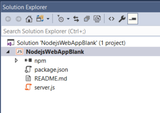
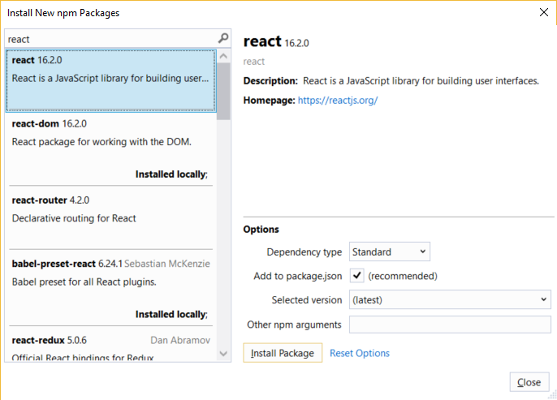
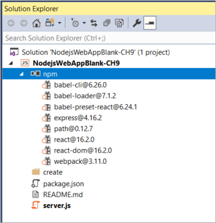
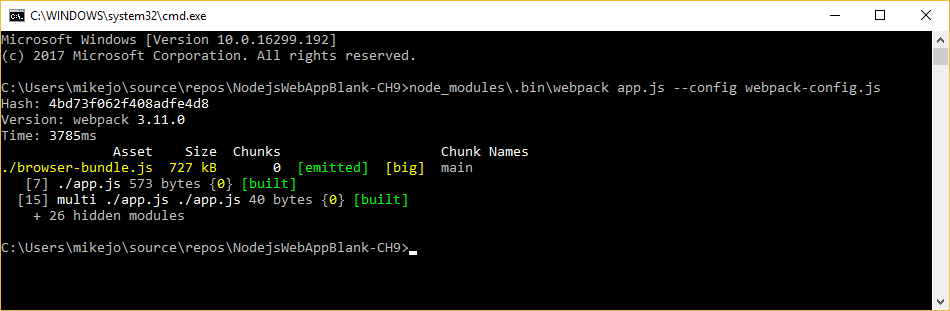
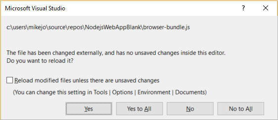
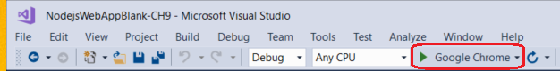
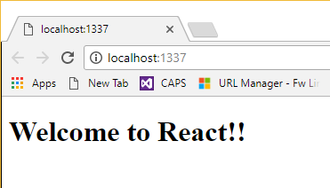
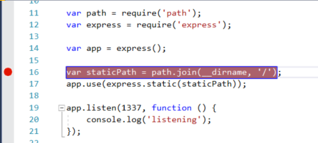
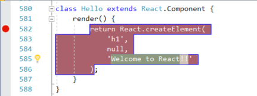
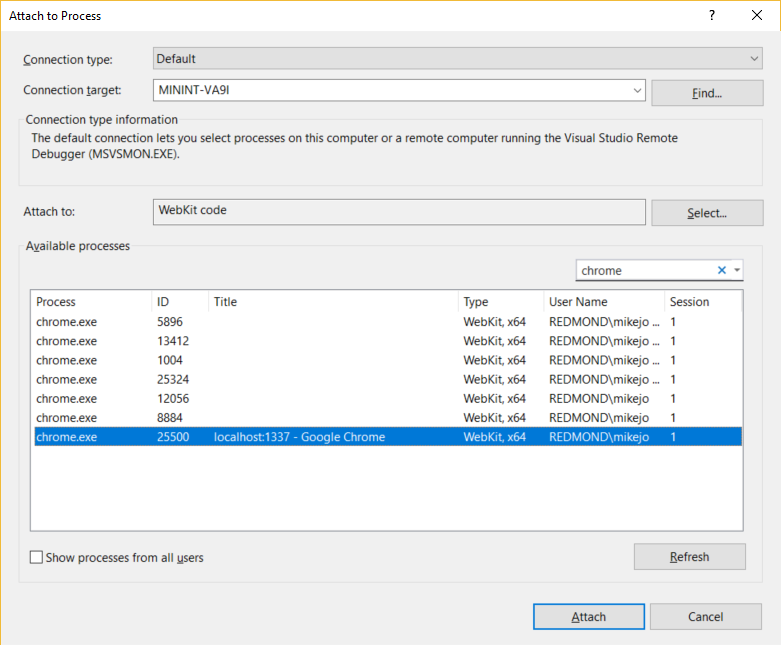

# Tutorial: Create a Node.js and React app in Visual Studio
Visual Studio allows you to easily create a Node.js project and leverage IntelliSense and other built-in features that support Node.js. In this tutorial for Visual Studio, you create a Node.js web application project from a Visual Studio template. Then, you create a simple app using React.

In this tutorial, you learn how to:
> [!div class="checklist"]
> * Create a Node.js project
> * Add npm packages
> * Add React code to your app
> * Transpile JSX
> * Attach the debugger

## Prerequisites

* You must have Visual Studio 2017 installed and the Node.js development workload.

    If you haven't already installed Visual Studio, install it for free [here](http://www.visualstudio.com).

    If you need to install the workload but already have Visual Studio, click the **Open Visual Studio Installer** link in the left pane of the **New Project** dialog box. The Visual Studio Installer launches. Choose the **Node.js development** workload, then choose **Modify**.

* You must have the Node.js runtime installed.

    This tutorial was tested with version 8.11.2.

    If you don't have it installed, install the LTS version from the [Node.js](https://nodejs.org/en/download/) website. In general, Visual Studio automatically detects the installed Node.js runtime. If it does not detect an installed runtime, you can configure your project to reference the installed runtime in the properties page (after you create a project, right-click the project node and choose **Properties**).

## Create a project
First, create a Node.js web application project.

1. Open Visual Studio 2017.

1. From the top menu bar, choose **File** > **New** > **Project**.

1. In the **New Project** dialog box, in the left pane, expand **JavaScript**, and then choose **Node.js**. In the middle pane, choose **Blank Node.js Web Application**, type the name **NodejsWebAppBlank**, and then choose **OK**.

     If you don't see the **Blank Node.js Web Application** project template, you must first install the Node.js development workload.

    Visual Studio creates the new solution and opens your project.

    

    - Highlighted in bold is your project, using the name you gave in the **New Project** dialog box. In the file system, this project is represented by a *.njsproj* file in your project folder. You can set properties and environment variables associated with the project by right-clicking the project and choosing **Properties**. You can do round-tripping with other development tools, since the project file does not make custom changes to the Node.js project source.

    - At the top level is a solution, which by default has the same name as your project. A solution, represented by a *.sln* file on disk, is a container for one or more related projects.

    - The npm node shows any installed npm packages. You can right-click the npm node to search for and install npm packages using a dialog box.

    - Project files such as *server.js* show up under the project node. *server.js* is the project startup file.

## Add npm packages

This app requires a number of npm modules to run correctly.

* react
* react-dom
* express
* path
* ts-loader
* typescript
* webpack
* webpack-cli

1. In Solution Explorer (right pane), right-click the **npm** node in the project and choose **Install New npm Packages**.

    In the **Install New npm Packages** dialog box, you can choose to install the most current package version or specify a version. If you choose to install the current version of these packages, but run into unexpected errors later, you may need to install the exact package versions described later in these steps.

1. In the **Install New npm Packages** dialog box, search for the react package, and click **Install Package** to install it.

    

    Click the **Output** window to see progress on installing the package (select **Npm** in the **Show output from** field). When installed, the package appears under the **npm** node.

    The project's *package.json* file is updated with the new package information including the package version.

1. Instead of using the UI to search for and add the rest of the packages one at a time, paste the following code into package.json. Replace the `dependencies` section with this code:

    ```js
    "dependencies": {
      "express": "4.16.2",
      "path": "0.12.7",
      "react": "16.4.0",
      "react-dom": "16.4.0",
      "ts-loader": "4.0.1",
      "typescript": "2.7.2",
      "webpack": "4.1.1",
      "webpack-cli": "2.0.11"
    }
    ```

1. Right-click **npm** node in your project and choose **Update npm Packages**.

    Click the **Output** window to see progress on installing the packages. This may take a few minutes and you may not see results immediately.

    Here are the npm modules as they appear in Solution Explorer after they are installed.

    

    > [!NOTE]
    > If you prefer to install npm packages using the command line, right-click the project node and choose **Open Command Prompt Here**. Use standard Node.js commands to install packages.

## Add project files

In these steps, you add four new files to your project.

* *app.tsx*
* *webpack-config.js*
* *index.html*
* *tsconfig.json*

For this simple app, you add the new project files in the project root. (In most apps, you typically add the files to subfolders and adjust relative path references accordingly.)

1. In Solution Explorer, right-click the project **NodejsWebAppBlank** and choose **Add** > **New Item**.

1. In the **Add New Item** dialog box, choose **TypeScript JSX file**, type the name *app.tsx*, and click **OK**.

1. Repeat these steps to add *webpack-config.js*. Instead of a TypeScript JSX file, choose **JavaScript file**.

1. Repeat the same steps to add *index.html* to the project. Instead of a JavaScript file, choose **HTML file**.

1. Repeat the same steps to add *tsconfig.json* to the project. Instead of a JavaScript file, choose **TypeScript JSON Configuration file**.

## Add app code

1. Open *server.js* and replace the code with the following code:

    ```javascript
    'use strict';
    var path = require('path');
    var express = require('express');

    var app = express();

    var staticPath = path.join(__dirname, '/');
    app.use(express.static(staticPath));

    // Allows you to set port in the project properties.
    app.set('port', process.env.PORT || 3000);

    var server = app.listen(app.get('port'), function() {
        console.log('listening');
    });
    ```

   The preceding code uses Express to start Node.js as your web application server. This code sets the port to the port number configured in the project properties (by default, the port is configured to 1337 in the properties). To open the project properties, right-click the project in Solution Explorer and choose **Properties**.

1. Open *app.tsx* and add the following code:

    ```javascript
    declare var require: any

    var React = require('react');
    var ReactDOM = require('react-dom');

    class Hello extends React.Component {
        render() {
            return (
                <h1>Welcome to React!!</h1>
            );
        }
    }

    ReactDOM.render(<Hello />, document.getElementById('root'));
    ```

    The preceding code uses JSX syntax and React to display a simple message.

1. Open *index.html* and replace the **body** section with the following code:

    ```html
    <body>
        <div id="root"></div>
        <!-- scripts -->
        <script src="./dist/app-bundle.js"></script>
    </body>
    ```

    This HTML page loads *app-bundle.js*, which contains the JSX and React code transpiled to plain JavaScript. Currently, *app-bundle.js* is an empty file. In the next section, you configure options to transpile the code.

## Configure webpack and TypeScript compiler options

In the previous steps, you added *webpack-config.js* to the project. Next, you add webpack configuration code. You will add a simple webpack configuration that specifies an input file (*app.tsx*) and an output file (*app-bundle.js*) for bundling and transpiling JSX to plain JavaScript. For transpiling, you also configure some TypeScript compiler options. This code is a basic configuration that is intended as an introduction to webpack and the TypeScript compiler.

1. In Solution Explorer, open *webpack-config.js* and add the following code.

    ```json
    module.exports = {
        devtool: 'source-map',
        entry: "./app.tsx",
        mode: "development",
        output: {
            filename: "./app-bundle.js"
        },
        resolve: {
            extensions: ['.Webpack.js', '.web.js', '.ts', '.js', '.jsx', '.tsx']
        },
        module: {
            rules: [
                {
                    test: /\.tsx$/,
                    exclude: /(node_modules|bower_components)/,
                    use: {
                        loader: 'ts-loader'
                    }
                }
            ]
        }
    }
    ```

    The webpack configuration code instructs Webpack to use the TypeScript loader to transpile the JSX.

1. Open *tsconfig.json* and replace the default code with the following code, which specifies the TypeScript compiler options:

    ```json
    {
      "compilerOptions": {
        "noImplicitAny": false,
        "module": "commonjs",
        "noEmitOnError": true,
        "removeComments": false,
        "sourceMap": true,
        "target": "es5",
        "jsx": "react"
      },
      "exclude": [
        "node_modules"
      ],
      "files": [
        "app.tsx"
      ]
    }
    ```

    *app.tsx* is specified as the source file.

## Transpile the JSX

1. In Solution Explorer, right-click the project node and choose **Open Command Prompt Here**.

1. In the command prompt, type the following command:

    `node_modules\.bin\webpack app.tsx --config webpack-config.js`

    The command prompt window shows the result.

    

    If you see any errors instead of the preceding output, you must resolve them before your app will work. If your npm package versions are different than the versions shown in this tutorial, that can be a source of errors. One way to fix errors is to use the exact versions shown in the earlier steps. Also, if one or more of these package versions has been deprecated and results in an error, you may need to install a more recent version to fix errors.

1. In Solution Explorer, right-click the project node and choose **Add** > **Existing Folder**, then choose the *dist* folder and click **Select Folder**.

    Visual Studio adds the *dist* folder to the project, which contains *app-bundle.js* and *app-bundle.js.map*.

1. Open *app-bundle.js* to see the transpiled JavaScript code.

1. If prompted to reload externally modified files, click **Yes to All**.

    

Each time you make changes to *app.tsx*, you must rerun the webpack command.

## Run the app

1. Make sure that Chrome is selected as the current debug target.

    

1. To run the app, press **F5** (**Debug** > **Start Debugging**) or the green arrow button.

    A Node.js console window opens that shows the port on which the debugger is listening.

    Visual Studio starts the app by launching the startup file, *server.js*.

    

1. Close the browser window.

1. Close the console window.

## Set a breakpoint and run the app

1. In *server.js*, click in the gutter to the left of the `staticPath` declaration to set a breakpoint:

    

    Breakpoints are the most basic and essential feature of reliable debugging. A breakpoint indicates where Visual Studio should suspend your running code so you can take a look at the values of variables, or the behavior of memory, or whether or not a branch of code is getting run.

1. To run the app, press **F5** (**Debug** > **Start Debugging**).

    The debugger pauses at the breakpoint you set (the current statement is marked in yellow). Now, you can inspect your app state by hovering over variables that are currently in scope, using debugger windows like the **Locals** and **Watch** windows.

1. Press **F5** to continue the app.

1. If you want to use the Chrome Developer Tools, press **F12**. You can use these tools to examine the DOM and interact with the app using the JavaScript Console.

1. Close the web browser and the console.

## Set and hit a breakpoint in the client-side React code

In the preceding section, you attached the debugger to server-side Node.js code. To attach the debugger from Visual Studio and hit breakpoints in client-side React code, the debugger needs help to identify the correct process. Here is one way to enable this.

1. Close all Chrome windows.

1. Open the **Run** command from the Windows **Start** button (right-click and choose **Run**), and enter the following command:

    `chrome.exe --remote-debugging-port=9222`

    This starts Chrome with debugging enabled.

1. Switch to Visual Studio and set a breakpoint in *app-bundle.js* code in the `render()` function as shown in the following illustration:

    

1. With Chrome selected as the debug target in Visual Studio, press **Ctrl**+**F5** (**Debug** > **Start Without Debugging**) to run the app in the browser.

    The app opens in a new browser tab.

1. Choose **Debug** > **Attach to Process**.

1. In the **Attach to Process** dialog box, choose **Webkit code** in the **Attach to** field, type **chrome** in the filter box to filter the search results.

1. Select the Chrome process with the correct host port (1337 in this example), and click **Attach**.

    

    You know the debugger has attached correctly when the DOM Explorer and the JavaScript Console open in Visual Studio. These debugging tools are similar to Chrome Developer Tools and F12 Tools for Edge.

    > [!NOTE]
    > If the debugger does not attach and you see the message "Unable to attach to the process. An operation is not legal in the current state.", use the Task Manager to close all instances of Chrome before starting Chrome in debugging mode. Chrome Extensions may be running and preventing full debug mode.

1. Because the code with the breakpoint already executed, refresh your browser page to hit the breakpoint.

    While paused in the debugger, you can examine your app state by hovering over variables and using debugger windows. You can advance the debugger by stepping through code (**F5**, **F10**, and **F11**).

    You may hit the breakpoint in either *app-bundle.js* or its mapped location in *app.tsx*, depending on your environment and browser state. Either way, you can step through code and examine variables.

    * If you need to break into code in *app.tsx* and are unable to do it, use **Attach to Process** as described in the previous steps to attach the debugger. Then open the dynamically generated *app.tsx* file from Solution Explorer by opening **Script Documents** > **app.tsx**, set a breakpoint, and refresh the page in your browser (set the breakpoint in a line of code that allows breakpoints, such as the `return` statement or a `var` declaration).

        Alternatively, if you need to break into code in *app.tsx* and are unable to do it, try using the `debugger;` statement in *app.tsx*, or set breakpoints in the Chrome Developer Tools instead.

    * If you need to break into code in *app-bundle.js* and are unable to do it, remove the sourcemap file, *app-bundle.js.map*.

    > [!TIP]
    > Once you attach to the process the first time by following these steps, you can quickly reattach to the same process in Visual Studio 2017 by choosing **Debug** > **Reattach to Process**.

## Next steps

In this tutorial, you learned how to create a Node.js and React app, transpile JSX, and debug. To learn more about Node.js Tools for Visual Studio, see the Wiki page.

> [!div class="nextstepaction"]
> [Node.js tools for Visual Studio](https://github.com/Microsoft/nodejstools)
