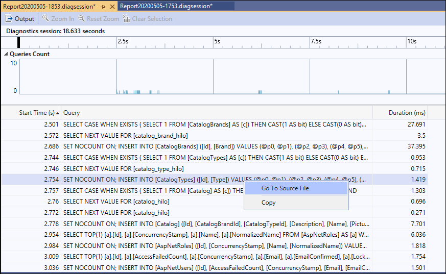

# Analyze database performance using the Database tool

Use the Database tool to record the database queries that your app makes during a diagnostic session. You can then analyze information about individual queries to find places to improve your app's performance.

> [!NOTE]
> The Database tool requires Visual Studio 2019 version 16.3 or later and a .NET Core project using either [ADO.NET](/dotnet/framework/data/adonet/ado-net-overview) or [Entity Framework Core](/ef/core/).

## Setup

1. Select **Alt+F2** to open the performance profiler in Visual Studio.

1. Select the **Database** check box.

   

   > [!NOTE]
   > If the tool isn't available for selection, clear every other tool's check box because some tools need to run alone. To learn more about running tools together, see [Using profiling tools from the command line](../profiling/using-the-profiling-tools-from-the-command-line.md).
   >
   > If the tool still isn't available, check that your project meets the preceding requirements. Make sure your project is in Release mode to capture the most accurate data.

1. Select the **Start** button to run the tool.

1. After the tool starts running, go through the scenario you want to profile in your app. Then select **Stop collection** or close your app to see your data.

1. After collection stops, you see a table of the queries that ran during your profiling session.

   

The queries are organized chronologically, but you can sort them by any of the columns. You can show more columns by right-clicking the column titles. Selecting the **Duration** column orders the queries from the longest lasting to the shortest.

After you find a query you want to investigate, right-click the query. Then select **Go To Source File** to see what code is responsible for that query.

If you select a time range on a graph, the query table shows only queries that occurred during that time range. This behavior is especially useful when you also run the [CPU Usage tool](./cpu-usage.md?view=vs-2019&preserve-view=true).

## Related content

- [Optimizing Profiler settings](../profiling/optimize-profiler-settings.md)
- [Identify hot paths with Flame Graph](../profiling/flame-graph.md)
- [Use File IO](../profiling/use-file-io.md)
