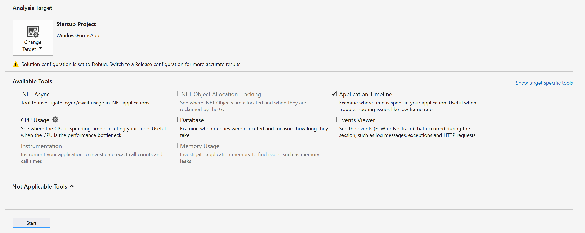

# Analyze resource consumption and UI thread activity (XAML)

Use the **Application Timeline** profiler to find and fix application-interaction related performance issues in XAML applications. This tool helps improve the XAML application performance by showing a detailed view of the applications' resource consumption. You can analyze the time spent by your application preparing UI frames (layout and render), servicing network and disk requests, and in scenarios like Application Startup, Page Load, and Windows resize.

**Application Timeline** is one of the tools you can start with the **Debug** > **Performance Profiler** command.

This tool replaces the **XAML UI Responsiveness** tool that was part of the diagnostic toolset in older versions of Visual Studio.

You can use this tool on the following platforms:

- Universal Windows apps (on Windows 10 and later)
- Windows 8.1
- Windows Presentation Foundation (.NET 4.0 and above)
- Windows 7

> [!NOTE]
> You can collect and analyze CPU usage data and energy consumption data along with the **ApplicationTimeline** data. See [Run profiling tools on release or debug builds](../profiling/running-profiling-tools-with-or-without-the-debugger.md).

## Collect application timeline data

You can profile the responsiveness of your app on your local machine, connected device, Visual Studio simulator or emulators, or a remote device. See [Run profiling tools on release or debug builds](../profiling/running-profiling-tools-with-or-without-the-debugger.md).

> [!TIP]
> If possible, run the app directly on the device. The application performance observed on the simulator or through a remote desktop connection might not be the same as the actual performance on the device. On the other hand, collecting the data by using the Visual Studio Remote Tools doesn't affect the performance data.

Here are the basic steps:

1. Open your XAML app.

2. Click **Debug / Performance Profiler**. You should see a list of profiling tools in the .diagsession window.

3. Select **Application Timeline** and then click **Start** at the bottom of the window.

   

   > [!NOTE]
   > You might see a User Account Control window requesting your permission to run *VsEtwCollector.exe*. Click **Yes**.

4. Run the scenario you are interested in profiling in your app to collect performance data.

5. To stop profiling, switch back to the .diagsession window and click **Stop** at the top of the window.

   Visual Studio analyzes the collected data and displays the results.

   

## Analyze timeline profiling data

After you have collected the profiling data, you can use these steps to start your analysis:

1. View the information in the **UI thread utilization** and **Visual throughput (FPS)** graphs and then use the timeline navigation bars to select a time range that you want to analyze.

2. Using the information in the **UI thread utilization** or **Visual throughput (FPS)** graphs, examine the details in the **Timeline details** view to find possible causes for any seeming lack of responsiveness.

###  Report scenarios, categories, and events

The **Application Timeline** tool displays timing data for scenarios, categories, and events that are related to XAML performance.

###  Diagnostic session timeline

The ruler at the top of the page shows the timeline for profiled information. This timeline applies to both the **UI thread utilization** graph and the **Visual throughput** graph. You can narrow the scope of the report by dragging the navigation bars on the timeline to select a segment of the timeline.

The timeline also displays any user marks that you've inserted, and the app's activation lifecycle events.

###  UI thread utilization graph

The **UI thread utilization (%)** graph is a bar chart that displays the relative amount of time spent in a category for during a collection span.

###  Visual throughput (FPS) graph

The **Visual throughput (FPS)** line graph shows the frames per second (FPS) on the UI and composition thread for the app.

###  Timeline details

The details view is where you spend most of your time analyzing the report. It shows the CPU use by your application categorized by the UI Framework subsystem or the system component that consumed the CPU.

The following events are supported:

|Name|Description|
|-|-|
|**Parsing**|Time spent parsing XAML files and creating objects.   Expanding a **Parsing** node in **Timeline details** displays the dependency chain of all the XAML files that were parsed because of the root event. This tip lets you identify unnecessary file parsing and object creation in performance sensitive scenarios and optimize them out.|
|**Layout**|In large applications, thousands of elements may be shown on the screen at the same time. This display might result in a low UI frame rate and correspondingly poor application responsiveness. The Layout event accurately determines the cost of laying out each element (that is, the time spent in Arrange, Measure, ApplyTemplate, ArrangeOverride, and MeasureOverride). It also builds the visual trees that took part in a Layout pass. You can use this visualization to determine which logical trees to prune, or to evaluate other deferral mechanisms to optimize your layout pass.|
|**Render**|Time spent drawing XAML elements to the screen.|
|**I/0**|Time spent retrieving data from the local disk or from network resources that are accessed through the [Microsoft Windows Internet (WinINet) API](/windows/desktop/WinInet/portal).|
|**App Code**|Time spent executing application (user) code that isn't related to parsing or layout.|
|**Xaml Other**|Time spent executing XAML runtime code.|

> [!TIP]
> Choose the **CPU Usage** tool along with the **Application Timeline** tool when you start profiling to view app methods that execute on the UI thread. Moving long-running app code to a background thread can improve UI responsiveness.

####  Customizing Timeline details

Use the **Timeline details** toolbar to sort, filter, and specify the annotations of **Timeline details** view entries.

|Name|Description|
|-|-|
|**Sort by**|Sort by start time or the length of events.|
||Adds or removes a top-level **Frame** category that groups events by frame.|
||Filters the list by selected categories and the length of events.|
||Lets you specify the annotations to events.|

## Related content

- [WPF team blog: New UI performance analysis tool for WPF applications](/archive/blogs/wpf/new-ui-performance-analysis-tool-for-wpf-applications)
- [Performance best practices for UWP apps using C++, C#, and Visual Basic](/previous-versions/windows/apps/hh750313\(v\=win.10\))
- [Optimize WPF application performance](/dotnet/framework/wpf/advanced/optimizing-wpf-application-performance)
- [Profiling in Visual Studio](../profiling/index.yml)
- [First look at profiling tools](../profiling/profiling-feature-tour.md)
