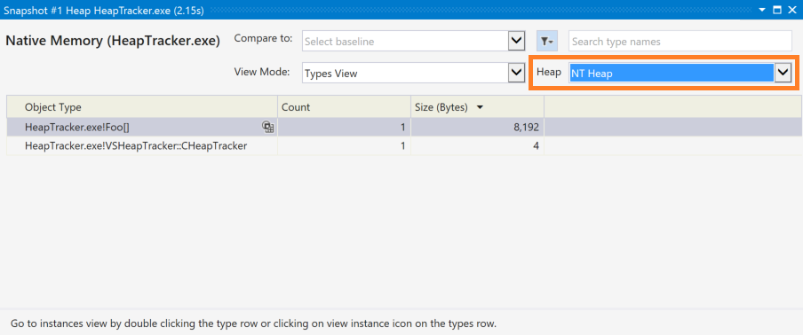
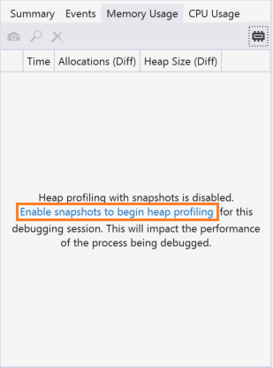
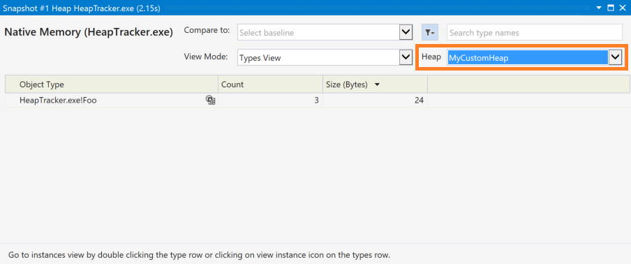

# Custom native ETW heap events

Visual Studio contains a variety of [profiling and diagnostic tools](../profiling/profiling-feature-tour.md), including a native memory profiler.  This profiler hooks [ETW events](/windows-hardware/drivers/devtest/event-tracing-for-windows--etw-) from the heap provider and provides analysis of how memory is being allocated and used.  By default, this tool can only analyze allocations made from the standard Windows heap, and any allocations outside this native heap would not be displayed.

There are many cases in which you may want to use your own custom heap and avoid the allocation overhead from the standard heap.  For instance, you could use [VirtualAlloc](/windows/desktop/api/memoryapi/nf-memoryapi-virtualalloc) to allocate a large amount of memory at the start of the app or game, and then manage your own blocks within that list.  In this scenario, the memory profiler tool would only see that initial allocation, and not your custom management done inside the memory chunk.  However, using the Custom Native Heap ETW Provider, you can let the tool know about any allocations you are making outside the standard heap.

For example, in a project like the following where `MemoryPool` is a custom heap, you would only see a single allocation on the Windows heap:

```cpp
class Foo
{
public:
    int x, y;
};

...

// MemoryPool is a custom managed heap, which allocates 8192 bytes
// on the standard Windows Heap named "Windows NT"
MemoryPool<Foo, 8192> mPool;

// the "allocate" method requests memory from the pool created above
// and is cast to an object of type Foo, shown above
Foo* pFoo1 = (Foo*)mPool.allocate();
Foo* pFoo2 = (Foo*)mPool.allocate();
Foo* pFoo3 = (Foo*)mPool.allocate();
```

A snapshot from the [Memory Usage](../profiling/memory-usage.md) tool without custom heap tracking would show just the single 8192 byte allocation, and none of the custom allocations being made by the pool:



By performing the following steps, we can use this same tool to track memory usage in our custom heap.

## How to use

This library can be easily used in C and C++.

1. Include the header for the custom heap ETW provider:

   ```cpp
   #include <VSCustomNativeHeapEtwProvider.h>
   ```

1. Add the `__declspec(allocator)` decorator to any function in your custom heap manager that returns a pointer to newly allocated heap memory.  This decorator allows the tool to correctly identify the type of the memory being returned.  For example:

   ```cpp
   __declspec(allocator) void *MyMalloc(size_t size);
   ```

   > [!NOTE]
   > This decorator will tell the compiler that this function is a call to an allocator.  Each call to the function will output the address of the callsite, the size of the call instruction, and the typeId of the new object to a new `S_HEAPALLOCSITE` symbol.  When a callstack is allocated, Windows will emit an ETW event with this information.  The memory profiler tool walks the callstack looking for a return address matching an `S_HEAPALLOCSITE` symbol, and the typeId information in the symbol is used to display the runtime type of the allocation.
   >
   > In short, this means a call that looks like `(B*)(A*)MyMalloc(sizeof(B))` will show up in the tool as being of type `B`, not `void` or `A`.

1. For C++, create the `VSHeapTracker::CHeapTracker` object, providing a name for the heap, which will show up in the profiling tool:

   ```cpp
   auto pHeapTracker = std::make_unique<VSHeapTracker::CHeapTracker>("MyCustomHeap");
   ```

   If you are using C, use the `OpenHeapTracker` function instead.  This function will return a handle that you will use when calling other tracking functions:

   ```C
   VSHeapTrackerHandle hHeapTracker = OpenHeapTracker("MyHeap");
   ```

1. When allocating memory using your custom function, call the `AllocateEvent` (C++) or `VSHeapTrackerAllocateEvent` (C) method, passing in the pointer to the memory and its size, to track the allocation:

   ```cpp
   pHeapTracker->AllocateEvent(memPtr, size);
   ```

   or

   ```C
   VSHeapTrackerAllocateEvent(hHeapTracker, memPtr, size);
   ```

   > [!IMPORTANT]
   > Don't forget to tag your custom allocator function with the `__declspec(allocator)` decorator described earlier.

1. When deallocating memory using your custom function, call the `DeallocateEvent` (C++) or `VSHeapTracerDeallocateEvent` (C) function, passing in the pointer to the memory, to track the deallocation:

   ```cpp
   pHeapTracker->DeallocateEvent(memPtr);
   ```

   or:

   ```C
   VSHeapTrackerDeallocateEvent(hHeapTracker, memPtr);
   ```

1. When reallocating memory using your custom function, call the `ReallocateEvent` (C++) or `VSHeapReallocateEvent` (C) method, passing in a pointer to the new memory, the size of the allocation, and a pointer to the old memory:

   ```cpp
   pHeapTracker->ReallocateEvent(memPtrNew, size, memPtrOld);
   ```

   or:

   ```C
   VSHeapTrackerReallocateEvent(hHeapTracker, memPtrNew, size, memPtrOld);
   ```

1. Finally, to close and clean up the custom heap tracker in C++, use the `CHeapTracker` destructor, either manually or via standard scoping rules, or the `CloseHeapTracker` function in C:

   ```cpp
   delete pHeapTracker;
   ```

   or:

   ```C
   CloseHeapTracker(hHeapTracker);
   ```

## Track memory usage
With these calls in place, your custom heap usage can now be tracked using the standard **Memory Usage** tool in Visual Studio.  For more information on how to use this tool, please see the [Memory Usage](../profiling/memory-usage.md) documentation. Ensure you have enabled heap profiling with snapshots, otherwise you will not see your custom heap usage displayed.



To view your custom heap tracking, use the **Heap** dropdown located at the upper-right corner of the **Snapshot** window to change the view from *NT Heap* to your own heap as named previously.



Using the code example above, with `MemoryPool` creating a `VSHeapTracker::CHeapTracker` object, and our own `allocate` method now calling the `AllocateEvent` method, you can now see the result of that custom allocation, showing three instances totaling 24 bytes, all of type `Foo`.

The default *NT Heap* heap looks the same as earlier, with the addition of our `CHeapTracker` object.


As with the standard Windows heap, you can also use this tool to compare snapshots and look for leaks and corruption in your custom heap, which is described in the main [Memory Usage](../profiling/memory-usage.md) documentation.

> [!TIP]
> Visual Studio also contains a **Memory Usage** tool in the **Performance Profiling** toolset, which is enabled from the **Debug** > **Performance Profiler** menu option, or the **Alt**+**F2** keyboard combination.  This feature does not include heap tracking and will not display your custom heap as described here.  Only the **Diagnostic Tools** window, which can be enabled with the **Debug** > **Windows** > **Show Diagnostic Tools** menu, or the **Ctrl**+**Alt**+**F2** keyboard combination, contains this functionality.

## Related content

- [First look at profiling tools](../profiling/profiling-feature-tour.md)
- [Memory Usage](../profiling/memory-usage.md)
