# Analyze memory usage by using the .NET Object Allocation tool

You can see how much memory your app uses and what code paths allocate the most memory by using the .NET Object Allocation tool.

After running the tool, you can see the function execution paths where objects are being allocated. You can then trace back to the root of the call tree that is taking up the most memory.

For a tutorial that shows how to improve performance using the .NET Object Allocation tool, see [Case study: Beginner's guide to optimizing code](../profiling/optimize-code-using-profiling-tools.md).

## Setup

1. In the Visual Studio project, set the solution configuration to **Release** and select the deployment target.

   ::: moniker range=">=vs-2022"
   The deployment target typically matches the project name, indicating a local deployment.
   ::: moniker-end
   ::: moniker range="vs-2019"
   The deployment target is typically **Local Windows Debugger** (or **Local Machine**).
   ::: moniker-end

1. Select **Alt+F2** to open the Performance Profiler in Visual Studio.

1. Select the **.NET Object Allocation Tracking** check box.

   ::: moniker range=">=vs-2022"
   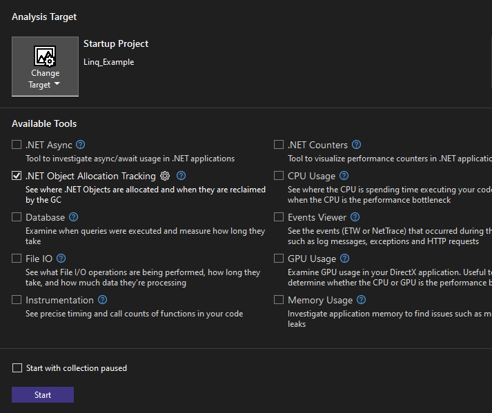
   ::: moniker-end
   ::: moniker range="vs-2019"
   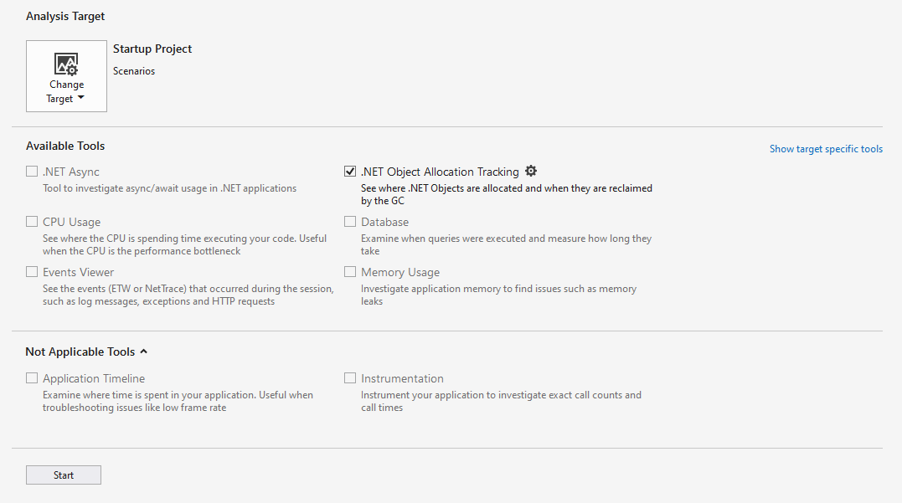
   ::: moniker-end

1. Select the **Start** button to run the tool.

   If you enable the **Start with collection paused** option before starting the profiler, data will not be collected until you select the **Record** button in the diagnostic session view.

1. After the tool starts running, go through the scenario you want to profile in your app. Then select **Stop collection** or close your app to see your data.

   ::: moniker range=">=vs-2022"
   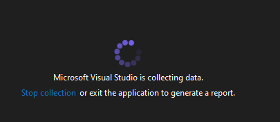
   ::: moniker-end
   ::: moniker range="vs-2019"
   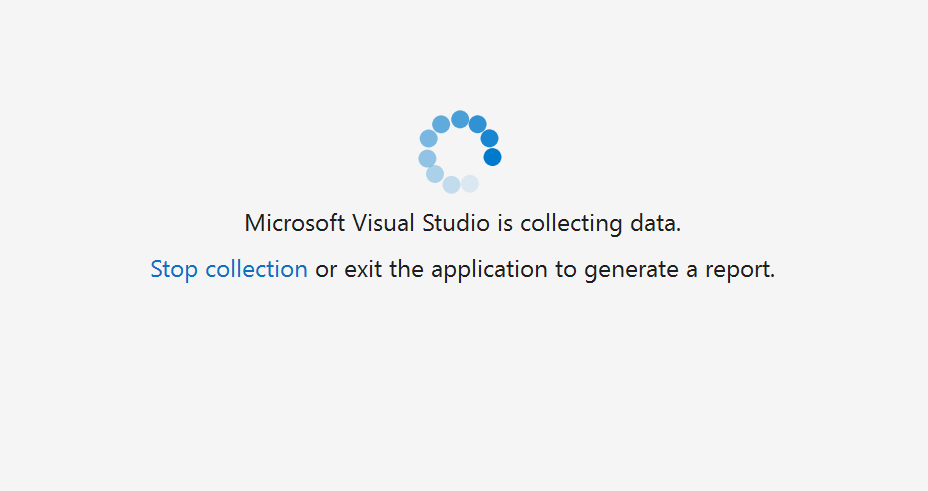
   ::: moniker-end

1. Select the **Allocation** tab. Memory allocation data similar to the following appears.

   ::: moniker range=">=vs-2022"
   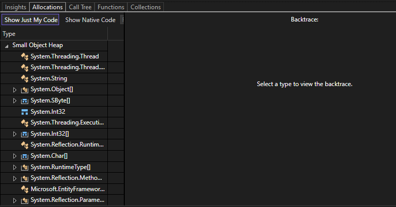
   ::: moniker-end
   ::: moniker range="vs-2019"
   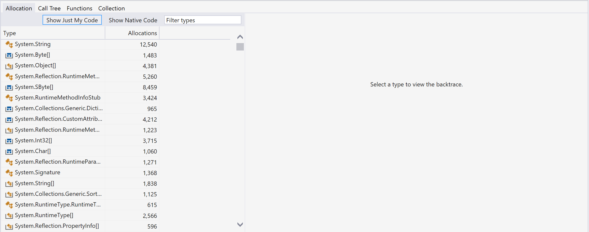
   ::: moniker-end

You can now analyze the memory allocation of the objects.

During collection, the tracking tool can slow down the profiled app. If performance of the tracking tool or the app is slow, and if you don't need to track every object, you can adjust the sampling rate. To do so, select the gear symbol next to the tracking tool in the profiler summary page.

::: moniker range=">=vs-2022"
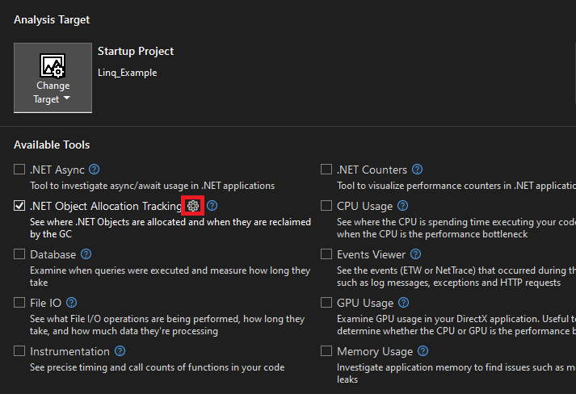
::: moniker-end
::: moniker range="vs-2019"
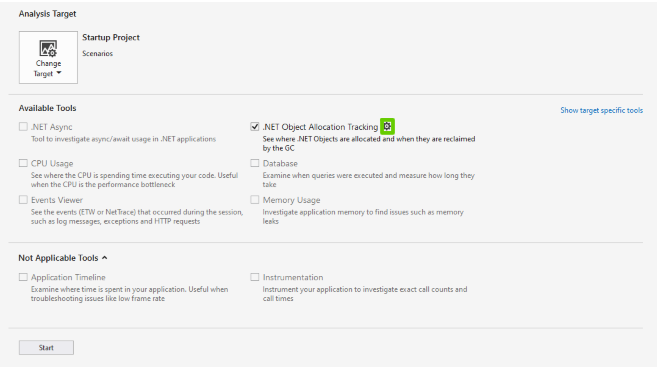
::: moniker-end

Adjust the sampling rate to the rate you want. This change helps speed up performance of your app during collection and analysis.

::: moniker range=">=vs-2022"
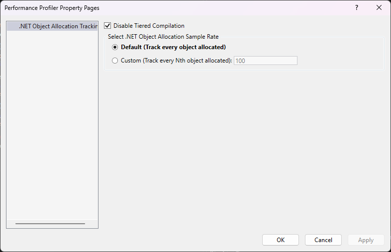
::: moniker-end
::: moniker range="vs-2019"
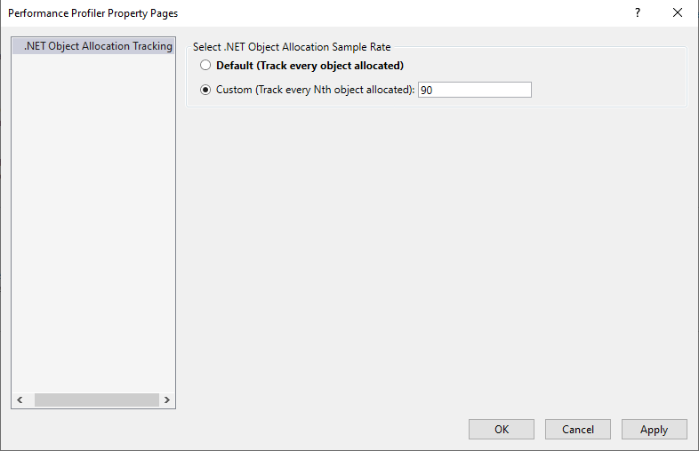
::: moniker-end

For more information on how to make the tool more efficient, see [Optimizing Profiler settings](../profiling/optimize-profiler-settings.md).

## Understand your data

In the following graphical view, the top graph shows the number of live objects in your app. The bottom **Object delta** graph shows the percentage change of app objects. Red bars denote when garbage collection took place.

::: moniker range=">=vs-2022"
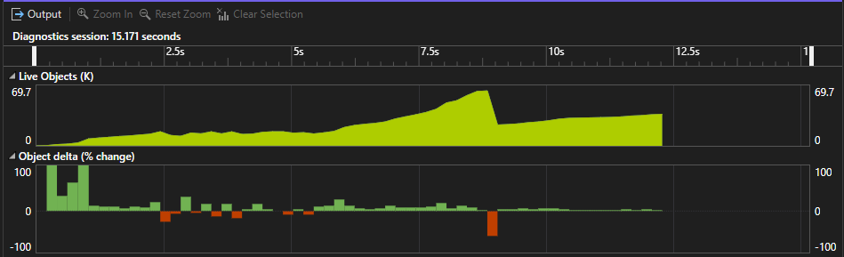
::: moniker-end
::: moniker range="vs-2019"
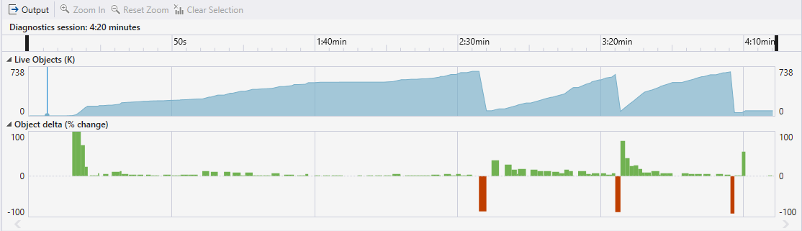
::: moniker-end

You can filter the tabular data to display activity for only a specified time range by selecting a time range. When you do this, the information that appears in the tabs is scoped to the filtered time range.

::: moniker range=">=vs-2022"
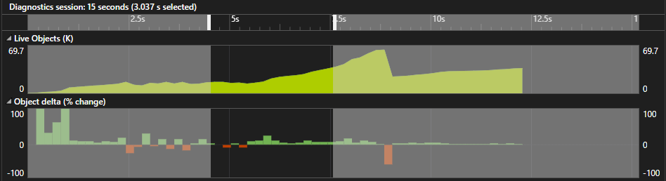
::: moniker-end
::: moniker range="vs-2019"

::: moniker-end

You can also zoom into or out of the graph.

### Allocation

The **Allocation** view shows the location of objects that are allocating memory and how much memory those objects are allocating.

::: moniker range=">=vs-2022"
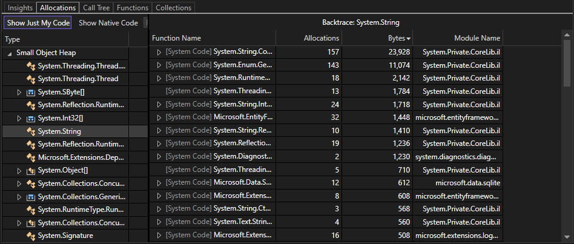
::: moniker-end
::: moniker range="vs-2019"
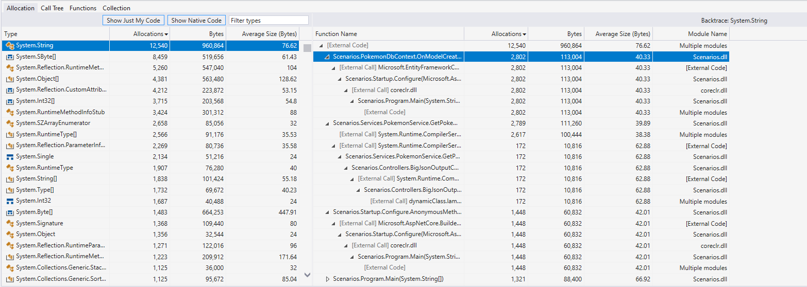
::: moniker-end

The following information appears in the **Allocation** view:

- The **Type** column is a list of classes and structures that take up memory. Double-click a type to view its backtrace as an inverted call tree. In the **Allocation** view only, you can see items within the selected category that take up memory.

- The **Allocations** column shows the number of objects that take up memory within a particular allocation type or function. This column appears only in the **Allocation**, **Call Tree**, and **Functions** views.

- The **Bytes** and **Average Size (Bytes)** columns don't appear by default. To show them, right-click the **Type** or **Allocations** column, and then select the **Bytes** and **Average Size (Bytes)** options to add them to the chart. 

   The two columns are similar to **Total (Allocations)** and **Self (Allocations)**, except they show the amount of memory taken up instead of the number of objects taking up memory. These columns appear only in the **Allocation** view.

- The **Module name** column shows the module that contains the function or process that is calling.

All of these columns are sortable. For the **Type** and **Module Name** columns, you can sort items alphabetically in either ascending or descending order. For **Allocations**, **Bytes** and **Average Size (Bytes)**, you can sort items by increasing or decreasing numeric value.

#### Symbols

The following symbols appear in the **Allocation**, **Call Tree**, and **Functions** tabs:

-  - A value type like integer

-  - A value-type collection like array of integers

-  - A reference type like string

-  - A reference-type collection like array of strings

### Call Tree

The **Call Tree** view shows the function execution paths that contain objects allocating much memory.

::: moniker range=">=vs-2022"
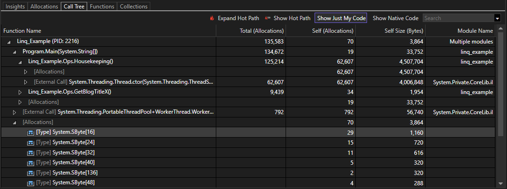
::: moniker-end
::: moniker range="vs-2019"
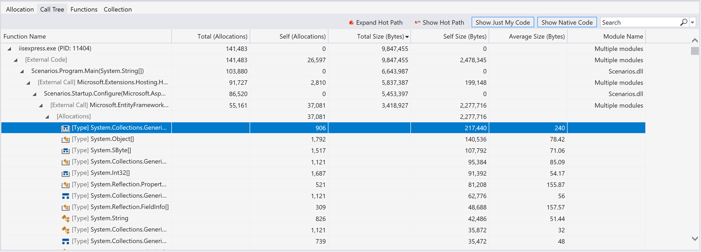
::: moniker-end

The following information appears in the **Call Tree** view:

- The **Function Name** column shows the process or name of the function containing objects that allocate memory. The display is based on the level of the node you're inspecting.
- The **Total (Allocations)** and **Total Size (Bytes)** columns show the number of allocated objects and the amount of memory that is used by a function and all other functions it calls. The **Total Size (Bytes)** column is hidden by default.
- The **Self (Allocations)** and **Self-Size (Bytes)** columns show the number of allocated objects and the amount of memory that is used by a single selected function or allocation type.
- The **Average Size (Bytes)** column shows the same information as it does in the **Allocations** view. This column is hidden by default.
- The **Module name** column shows the module that contains the function or process that is calling.

Additional options that appear in the **Call Tree** view include:

- The **Expand Hot Path** button highlights a function execution pathway that contains many objects that are allocating memory. The algorithm starts at a node you select and highlights the path of the most allocations, guiding you in your investigation.
- The **Show Hot Path** button shows or hides the flame symbols that indicate which nodes are part of the hot path.

::: moniker range=">=vs-2022"
   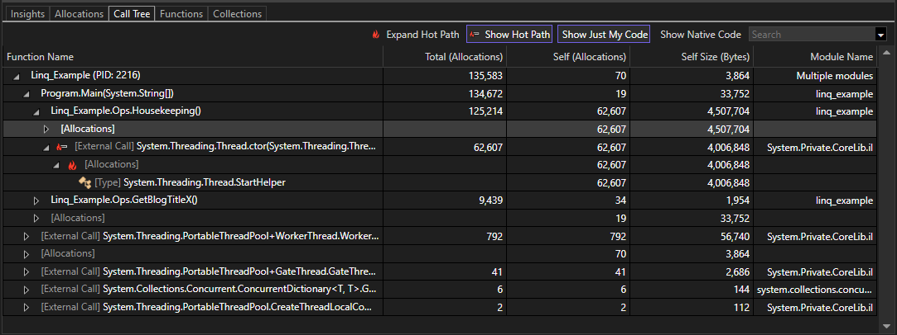
::: moniker-end
::: moniker range="vs-2019"
   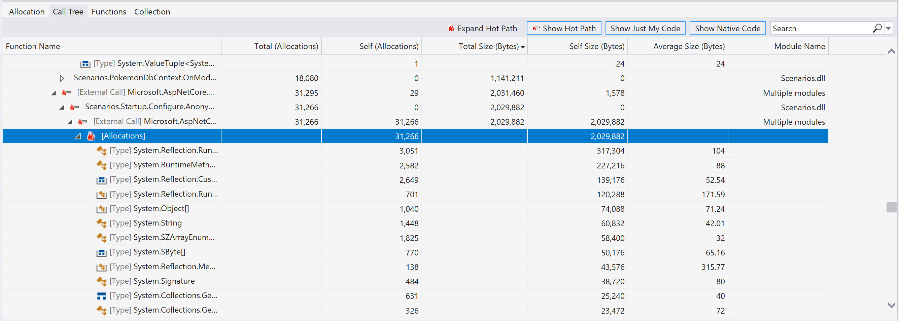
::: moniker-end

### Functions

The **Functions** view shows processes, modules, and functions that are allocating memory.

::: moniker range=">=vs-2022"
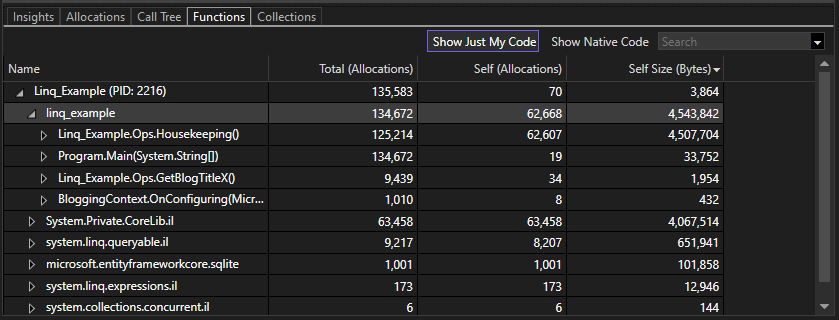
::: moniker-end
::: moniker range="vs-2019"
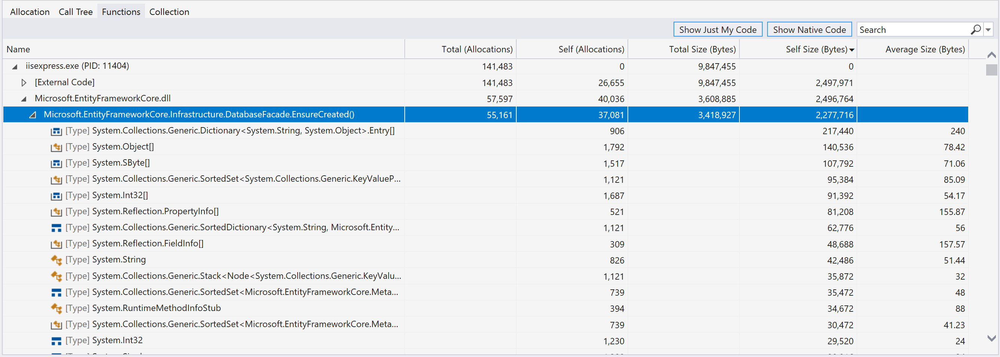
::: moniker-end

Information that appears in the **Functions** view includes:

- The **Name** column shows processes as the highest-level nodes. Underneath processes are modules, and underneath modules are functions.
- The following columns, which show the same information as they do in the **Allocation** and **Call tree** views:

  - **Total (Allocations)**
  - **Self (Allocations)**
  - **Total Size (Bytes)**
  - **Self Size (Bytes)**
  - **Average Size (Bytes)**

### Collection

The **Collection** view shows how many objects were collected or retained during garbage collection.

::: moniker range=">=vs-2022"
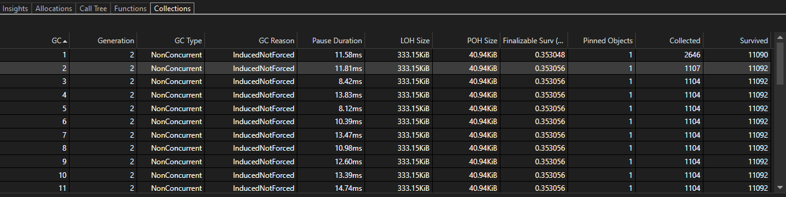
::: moniker-end
::: moniker range="vs-2019"
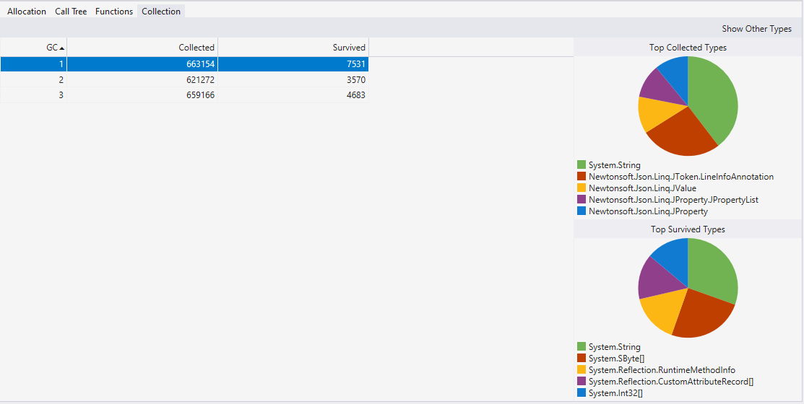
::: moniker-end

The following information appears in the **Collection** view.

- The **GC** column shows the ID of this garbage collection in the executable's lifecycle.
- The **Generation** column shows the Generation of the garbage collection.
- The **GC Type** column shows the type of this garbage collection.
- The **GC Reason** column shows the reason for this garbage collection event.
- The **Pause Duration** column shows the time that execution was blocked because the garbage collector needs exclusive use of the heap. For a background garbage collection, this value is small.
- The **LOH Size** column shows the size of the Large Object Heap after the garbage collector was run.
- The **POH Size** column shows the size of the Pinned Object Heap after the garbage collector was run.
- The **Finalizable Surv (MB)** column shows the number of MB of objects that have finalizers (destructors) that survived the garbage collection.
- The **Pinned Objects** column shows the number of pinned objects this garbage collection promoted.
- The **Collected** column shows the number of objects that the garbage collector collected.
- The **Survived** column shows the number of objects that survived after the garbage collector was run.

When you select a row, this view also shows pie charts to visualize collected and survived objects by type.

::: moniker range=">=vs-2022"
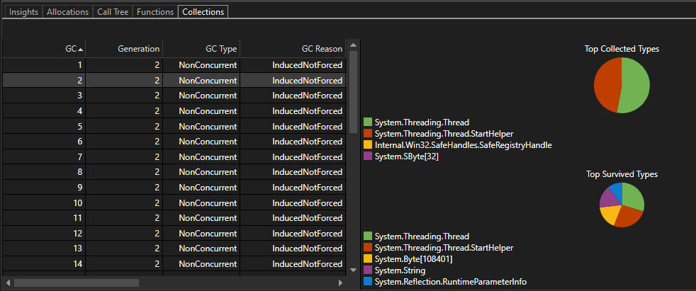
::: moniker-end

### Filtering tools

The **Allocations**, **Call Tree**, and **Functions** views all contain the **Show Just My Code** and **Show Native Code** options and a filter box.

- **Show Just My Code** collapses systems, frameworks, and other nonuser code into **[External Code]** frames so that you can focus on just your code. For more information, see [Debug user code with Just My Code](../debugger/just-my-code.md).
- **Show Native Code** shows native code within the analysis target and can include nonuser code.
- With the filter box, you can filter down the **Name** or **Function name** column based on the value you provide. Enter a string value in the box. The table then shows only types that contain that string.
