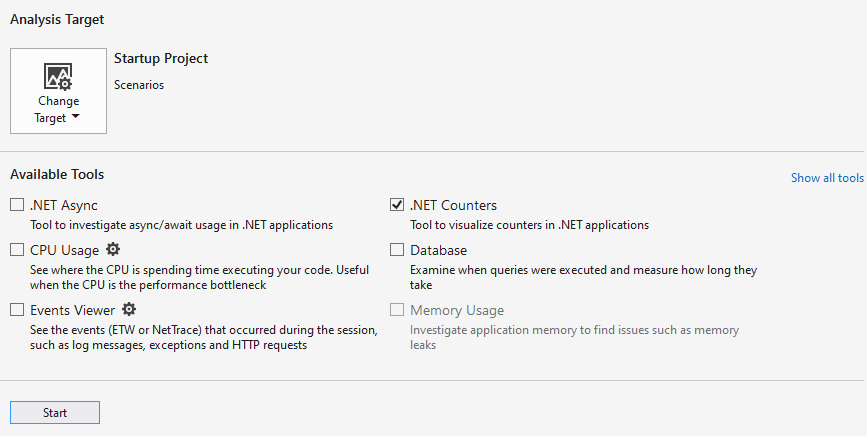
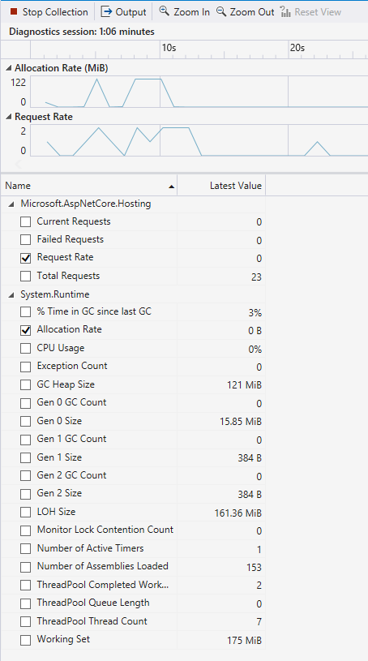
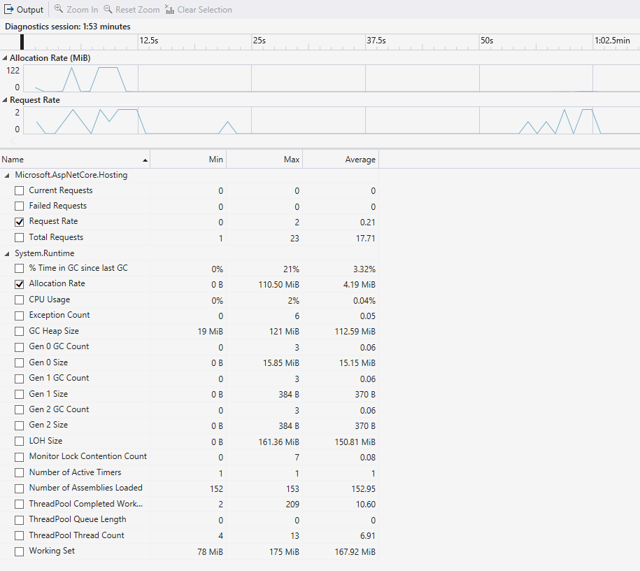
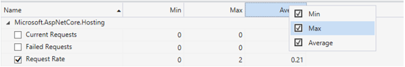

# Visualize dotnet counters from the Visual Studio profiler

The .NET Counters tool allows you to visualize [dotnet counters](/dotnet/core/diagnostics/dotnet-counters) over time right from within the Visual Studio profiler.

> [!NOTE]
> The .NET Counters tool requires Visual Studio 2019 version 16.7 or later and targets .NET Core 3.0+.

## Setup

1. Open the Performance Profiler (**Alt + F2** or **Debug -> Performance Profiler**) in Visual Studio.

2. Select the **.NET Counters** check box.

   

3. Click the **Start** button to run the tool.

For more information on how to optimize tool performance, see [Optimizing Profiler settings](../profiling/optimize-profiler-settings.md).

## Understand Your data

While the tool is initially collecting data, you can see the live values of [dotnet counters](/dotnet/core/diagnostics/dotnet-counters).

You can also view graphs of the counters by selecting the checkbox next to the counters names. You can display the graphs of multiple counters at a time.

Once you are done exercising your app and collecting data, you can stop collection for an even more detailed report. To do this hit the Stop Collection button.

Once the report loads you should see a finalized report similar to the one shown below.

The report shows you the following values:

- Min - The minimum value for that counter in the selected time range.
- Max - The maximum value for that counter in the selected time range.
- Average - The average value for that counter in the selected time range.

You can filter or add columns in the table by right clicking on the column headings and selecting a heading.

You can also view graphs in the detailed report by selecting the checkboxes next to counters. The data in the tables represents the values of the entire duration of your collected trace by defualt. To filter down the data to a specific time range, click and drag on the graphs.

The table will now update to relevant value for the time selected in the graphs. Use the Clear Selection button to reset the selected time range to the entire trace.

## See also

- [Optimizing Profiler settings](../profiling/optimize-profiler-settings.md)
- [dotnet counters](../docs/core/diagnostics/dotnet-counters.md)
