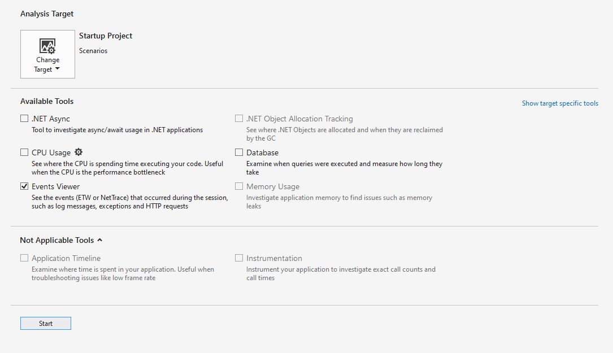

# Events viewer

 [!INCLUDE [Visual Studio](~/includes/applies-to-version/vs-windows-only.md)]

The generic events viewer shows app activity through a list of events like module load, thread start, and system configuration. This view helps you better diagnose how your app is doing within the Visual Studio profiler.

## Setup

1. Select **Alt+F2** to open the Performance Profiler in Visual Studio.

1. Select the **Events Viewer** check box.

   

1. Select the **Start** button to run the tool.

1. After the tool starts running, go through the scenario to profile in your app. Then select **Stop collection** or close your app to see your data.

   

For more information on how to make the tool more efficient, see [Optimizing Profiling settings](../profiling/optimize-profiler-settings.md).

## Understand your data

|Column name|Description|
|----------|---------------------|
|Provider Name|The event source|
|Event Name|The event as specified by its provider|
|Text|Descriptions of the provider, event name, and ID for the event|
|Timestamp (ms)|When the event took place|
|Provider Guid|The ID of the event provider|
|Event ID|The ID of the event|
|Process ID|The process from which the event occurred (if known)|
|Process Name|The name of the process if it's actively running|
|Thread ID|The ID of the thread from which the event occurred (if known)|

If any column is missing by default, right-click one of the existing column headers and select the column you want to add.

When you select an event, the **Additional Properties** window appears. **Common Properties** shows the list of properties that will appear for any event. **Payload Properties** shows properties specific to the event. For some events, you can also view **Stacks**.

## Organize your data

All columns except for the **Text** column are sortable.

The event viewer displays up to 20,000 events at a time. To focus on the events of interest, you can filter the display of events by selecting the event filter. You can also see what percentage of the total number of events occurred for each provider. Hover over a single event filter to see a tooltip that shows the:

- Event name
- Provider
- GUID
- Percentage of total events
- Event count

The provider filter shows what percentage of the total number of events occurred for each provider. Hover over a single provider to see a similar tooltip with provider name, percentage of total events, and event count.

