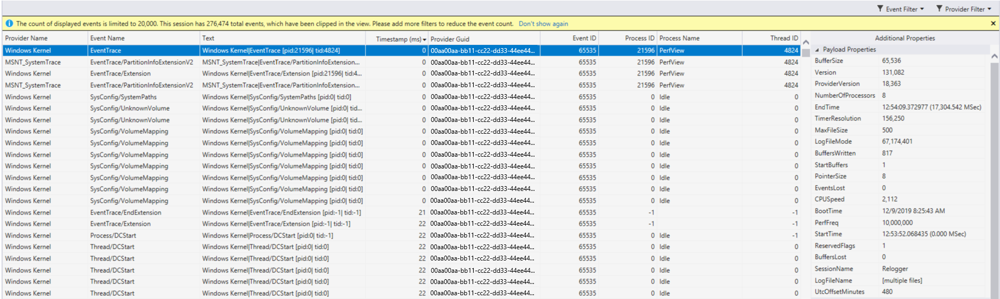

# Events viewer

In the Performance Profiler, you can collect diagnostic info while your app is running, and then examine the collected information after the app stops like a post-mortem analysis.

The generic events viewer shows app activity through a list of events like module load, thread start, and system configuration. This view helps you better diagnose how your app is doing within the Visual Studio profiler.

## Setup

1. Select **Alt+F2** to open the Performance Profiler in Visual Studio.

1. Select the **Events Viewer** check box.

   [  ](../profiling/media/events-viewer-selected.png#lightbox)

1. Select the **Start** button to run the tool.

1. After the tool starts running, go through the scenario to profile in your app. Then select **Stop collection** or close your app to see your data.

   

For more information on how to make the tool more efficient, see [Optimizing Profiling settings](../profiling/optimize-profiler-settings.md).

## Understand your data

[  ](../profiling/media/event-viewer-trace.png#lightbox)

|Column name|Description|
|----------|---------------------|
|Provider Name|The event source|
|Event Name|The event as specified by its provider|
|Text|Descriptions of the provider, event name, and ID for the event|
|Timestamp (ms)|When the event took place|
|Provider Guid|The ID of the event provider|
|Event ID|The ID of the event|
|Process ID|The process from which the event occurred (if known)|
|Process Name|The name of the process if it's actively running|
|Thread ID|The ID of the thread from which the event occurred (if known)|

If any column is missing by default, right-click one of the existing column headers and select the column you want to add.

[  ](../profiling/media/event-viewer-add-columns.png#lightbox)

When you select an event, the **Additional Properties** window appears. **Common Properties** shows the list of properties that will appear for any event. **Payload Properties** shows properties specific to the event. For some events, you can also view **Stacks**.

[  ](../profiling/media/event-viewer-stacks.png#lightbox)

## Organize your data

All columns except for the **Text** column are sortable.

[  ](../profiling/media/event-viewer-trace.png#lightbox)

The event viewer displays up to 20,000 events at a time. To focus on the events of interest, you can filter the display of events by selecting the Event filter. You can also see what percentage of the total number of events occurred for each provider, and this information gives you a breakdown of where your time is being spent. Hover over a single event filter to see a tooltip that shows the:

- Event name
- Provider
- GUID
- Percentage of total events
- Event count

[  ](../profiling/media/event-viewer-event-filter.png#lightbox)

The provider filter shows what percentage of the total number of events occurred for each provider. Hover over a single provider to see a similar tooltip with provider name, percentage of total events, and event count.

[  ](../profiling/media/event-viewer-provider-filter.png#lightbox)

::: moniker range=">=vs-2022"

## Enable custom ETW events

You can instrument your code with custom ETW events and enable them to show up in the Events Viewer. To enable custom events:

1. Build the custom event code.

   An example of C++ custom event code is provided at the end of this section.

1. Open the Performance Profiler (**Alt + F2**), enable the Events Viewer, and then select the **Settings** icon (gear icon) next to it.

   [  ](../profiling/media/vs-2022/events-viewer-settings-icon.png#lightbox)

1. In the dialog box, enable the first row under **Additional Providers**, and then take one of the following actions:

   - For native custom event code, set the **Provider GUID** based on the GUID for the custom event code, and leave the **Provider Name** value empty or use its default value.
   - For C# custom event code, set the same **Provider Name** value that you used when declaring your event code. This name gets converted into a GUID in the background, so leave the **Provider GUID** empty.

     For a native custom event, the row should look similar to the following illustration.

     [  ](../profiling/media/vs-2022/events-viewer-settings.png#lightbox)

1. Select **OK**.

   The custom event appears in the Events Viewer when you collect a diagnostics trace and open it. The following illustration shows the custom events in the Events Viewer with filtering set to show only the custom event.

   [  ](../profiling/media/vs-2022/events-viewer-showing-custom-events.png#lightbox)

Here's an example of custom event code for C++.

```cpp
#include <Windows.h>
#include <evntprov.h>
#include <iostream>
#include <thread>

// This GUID must be regenerated so it is unique for your provider
// {7369B7AC-64EB-4618-B6B6-C8442B12E8F2}
GUID customEventProvider = { 0x7369b7ac, 0x64eb, 0x4618, { 0xb6, 0xb6, 0xc8, 0x44, 0x2b, 0x12, 0xe8, 0xf2 } };
REGHANDLE _customEventProviderRegHandle = 0;

// Id, Version, Channel, Level, OpCode, Task, Keyword
const EVENT_DESCRIPTOR CustomEventDescriptor = { 1, 0, 0, 0, 0, 0, 1 };

int main()
{
    // Register the provider
    ULONG res = ::EventRegister(&customEventProvider, nullptr, nullptr, &_customEventProviderRegHandle);
    if (res != ERROR_SUCCESS)
    {
        return res;
    }

    byte data[] = { 0xFF, 0xFF, 0xFF, 0xFF };
    EVENT_DATA_DESCRIPTOR eventData[1];
    ::EventDataDescCreate(&(eventData[0]), &data, sizeof(data));

    for (int i = 0; i < 10; ++i)
    {
        std::this_thread::sleep_for(std::chrono::milliseconds(1000));
        ::EventWrite(_customEventProviderRegHandle, &CustomEventDescriptor, _countof(eventData), eventData);
        std::cout << "Wrote event\n";
    }

    res = ::EventUnregister(_customEventProviderRegHandle);
    if (res != ERROR_SUCCESS)
    {
        return res;
    }

    return 0;
}
```

::: moniker-end

## Related content

- [Identify hot paths with Flame Graph](../profiling/flame-graph.md)
- [Diagnose high latency with CPU Insights](../profiling/cpu-insights.md)
- [Analyze performance by using CPU profiling](../profiling/cpu-usage.md)
- [Use File IO](../profiling/use-file-io.md)