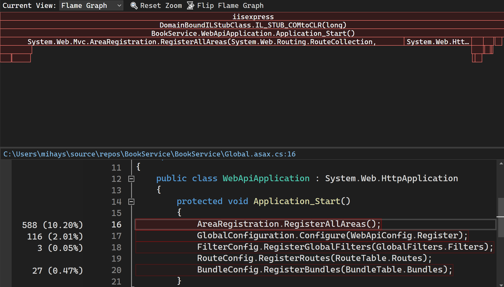
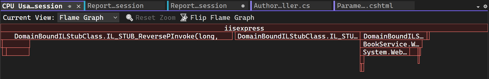

# Identify hot paths with a visualized call tree

Flame graphs are a visualization of categorized data, created to visualize stack traces of profiled software so that the most frequent code paths can be identified quickly and accurately.

The **Flame Graph** helps you identify hot paths in your code by visualizing a call tree. The graph gives a visual overview of where time is being spent in your application and you can click on specific nodes to dig into them further.

## Investigate hot paths

1. The Flame Graph view is in the CPU tool details tool window, above the source line highlighting view. After you've stopped your profiling session, you can view the Flame Graph by clicking **Open details**.

   

1. Select **Flame Graph** in the Current View dropdown selection.

   

   

1. By default, the flame graph in the CPU tool is shown upside down or as an "icicle chart," where the y-axis is counting stack depth downwards from zero at the top. You can view the standard flame chart layout by clicking **Flip Flame Graph**.

   

## Navigation
In the Flame Graph view, you can navigate by clicking on a node with a mouse or using the keyboard.

|Keyboard shortcut|Command|
|-|-|
|Tab|Go to any node|
|Up/Down arrow|Go to a node's parent or child|
|Enter|Zoom in|
|Escape|Zoom out|

## See also

- [Diagnose high latency with CPU Insights](../profiling/cpu-insights.md)
- [Analyze CPU usage without debugging](../profiling/cpu-usage.md)