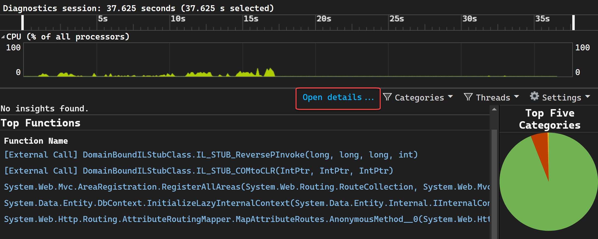
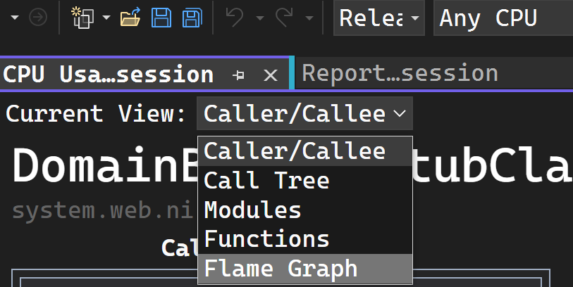
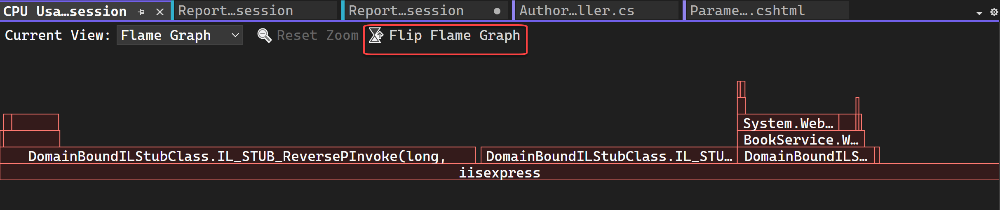

# Identify hot paths with a flame graph (C#, Visual Basic, C++, F#)

Visual Studio profiling tools for CPU utilization and instrumentation include the **Flame Graph** view. The **Flame Graph** helps you identify *hot paths* in your code by showing a visualization of the call tree. The *hot path* is the call stack for the functions that are using the most CPU or the most time, and is often a good place to look for potential performance optimizations. The graph gives a visual overview of where time is being spent in your application and you can click on specific nodes to dig into them further.

:::image type="content" source="./media/vs-2022/flame-graph-tooltips.gif" alt-text="Screenshot showing Flame Graph with context menu displayed." lightbox="media/vs-2022/flame-graph-tooltips.gif":::

For a tutorial that shows how to improve performance using the flame graph, see [Case study: Beginner's guide to optimizing code](../profiling/optimize-code-using-profiling-tools.md). For information on the CPU profiler, see [Analyze performance by using CPU profiling](../profiling/cpu-usage.md).

## Investigate hot paths

The Flame Graph view is in the details view of *.diagession* report. 

1. [Start a profiling session](../profiling/cpu-usage.md#collect-cpu-utilization-data) with either the CPU Usage or Instrumentation tool.

1. After you've stopped your profiling session and the report loads, select **Open details**.

   

1. Select **Flame Graph** in the Current View dropdown selection.

   

   The Flame Graph view appears.

   :::image type="content" source="./media/vs-2022/flame-graph-overview.png" alt-text="Screenshot showing Flame Graph overview displayed." lightbox="media/vs-2022/flame-graph-overview.png":::

   The hot path is the code path using the most CPU or the most time as you look downward through the call tree.

   By default, the data shown in the Flame Graph represents the same data as shown in the **Call tree** view for the data collection period. Specifically, for CPU Usage, it shows the **Total CPU** values. This value is inclusive, so it includes CPU utilization (that is, CPU computation time) used by calls to the function, and any other functions called by the function. In the same way, for Instrumentation, the graph shows the values equivalent to the **Total** column in the call tree view.

   However, if you select a node, the selected node becomes the new baseline and uses 100% of the flame graph width. This allows you to better visualize a complex call tree and view long names when they're truncated or hidden. Here is an example of a flame graph that shows a more complex call tree.

   :::image type="content" source="./media/vs-2022/flame-graph-complex-call-tree.gif" alt-text="Screenshot showing Flame Graph for a complex call tree." lightbox="media/vs-2022/flame-graph-complex-call-tree.gif":::

   To view details about any node, select the node. 

   Choose **Reset Zoom** to return to the default view. 

   You can also navigate to different views in the profiling report by selecting a node, and then choosing an option such as **View in call tree** from the context menu.

   :::image type="content" source="./media/vs-2022/flame-graph-view-in-call-tree.png" alt-text="Screenshot showing Flame Graph option to view in call tree." lightbox="media/vs-2022/flame-graph-view-in-call-tree.png":::

## Flip the Flame Graph

By default, the flame graph in the tool is shown upside down or as an *icicle chart*, where the y-axis is counting stack depth downwards from zero at the top. 

You can view a standard flame chart layout by clicking **Flip Flame Graph**.

## Navigate in the flame graph

For a complex flame graph, you can zoom the visualization by selecting specific elements.

In the Flame Graph view, you can navigate by clicking on a node with a mouse or using the keyboard. In addition, the following keyboard shortcuts are supported.

|Keyboard shortcut|Command|
|-|-|
|Tab|Go to any node|
|Up/Down arrow|Go to a node's parent or child|
|Right/left arrow|Go to a node's peer on the stack|
|Enter|Zoom in (select)|
|Escape|Zoom out|

## Related content

- [Case study: Beginner's guide to optimizing code](../profiling/optimize-code-using-profiling-tools.md)
- [Analyze CPU usage on release builds](../profiling/cpu-usage.md)