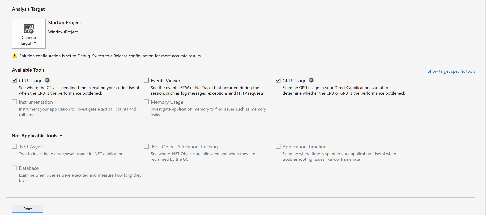
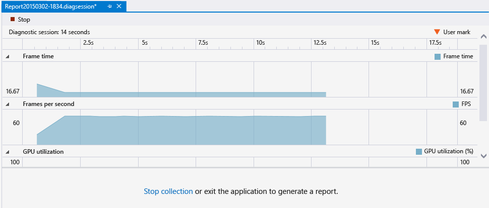
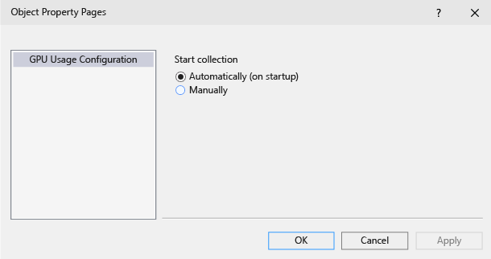

# GPU usage

>[!NOTE]
> Visual Studio Graphics Diagnostics is not supported on ARM64 Visual Studio.

Use the GPU Usage tool in the Performance Profiler to better understand the high-level hardware usage of your Direct3D app. It helps you see whether the performance of your app is CPU-bound or GPU-bound, and gain insight into how you can use the platform's hardware more effectively. GPU Usage supports apps that use Direct3D 12, Direct3D 11, and Direct3D 10. It doesn't support other graphics APIs, such as Direct2D or OpenGL.

Here's what the **GPU Usage Report** window looks like:

## Requirements

In addition to the requirements for Graphics Diagnostics, the following is required for using the GPU Usage tool:

- A GPU and driver that support the necessary timing instrumentation.

  > [!NOTE]
  > For more information on supported hardware and drivers, see [Hardware and driver support](#hwsupport) at the end of this document.

For more information about Graphics Diagnostics requirements, see [Getting started](/previous-versions/visualstudio/visual-studio-2017/debugger/graphics/getting-started-with-visual-studio-graphics-diagnostics).

## Use the GPU Usage tool

When you run your app under the GPU Usage tool, Visual Studio creates a diagnostic session. This session graphs high-level information about your app's rendering performance and GPU usage in real time.

To start the GPU Usage tool:

1. In the main menu, choose **Debug** > **Performance and Diagnostics** (or, on the keyboard, press Alt+F2).

2. In the **Performance and Diagnostics** hub, check the box next to **GPU Usage**. Optionally, check the boxes next to other tools you're interested in. You can run several performance and diagnostics tools concurrently to get a fuller picture of your app's performance.

    

   > [!NOTE]
   > Not all performance and diagnostics tools can be used at the same time.

3. At the bottom of the **Performance and Diagnostics** hub, select **Start** to run your app under the tools you selected.

The high-level information shown in real time includes frame timing, frame rate, and GPU usage. Each of these pieces of information is graphed independently, but they all use a common time-scale so that you can easily understand the relationships.

The **Frame time (ms)** and **Frames per second (FPS)** graphs each have two red, horizontal lines that show performance targets of 60 and 30 frames per second. In the Frame time graph, your app exceeds the performance target when the graph is below the line, and it misses the target when the graph is above the line. For the Frames per second graph, it's the opposite: your app exceeds the performance target when the graph is above the line, and it misses the target when the graph is below the line. You use these graphs primarily to get a high-level idea of your app's performance, and to identify slow-downs that you might want to investigate. For example, further investigation might be warranted if you see a sudden drop in frame rate or a spike in GPU utilization.

While your app runs under the GPU Usage tool, the diagnostics session also collects detailed information about graphics events that were run on the GPU. You use this information to generate a more granular report of how your app utilizes the hardware. Because this report takes some time to generate from the collected information, it's only available after the diagnostics session is done collecting information.

When you want to look at a performance or utilization issue more closely, stop collecting performance information, so that you can generate the report.

To generate and view the GPU Usage report:

1. In the bottom portion of the diagnostics session window, choose the **Stop Collection** link, or select **Stop** in the upper left-hand corner.

   

2. In the top portion of the report, select a section from one of the graphs that shows the issue you want to investigate. Your selection can be up to 3 seconds long. Longer sections are truncated towards the beginning.

   

3. To view a detailed timeline of your selection, in the bottom portion of the report, in the **...click here to view details of GPU usage for that range** message, select **view details**.

   

This selection opens a new tabbed document that contains the report. The GPU Usage report helps you see when a graphics event is started on the CPU, when it reaches the GPU, and how long the GPU takes to run it. This information can help you to identify bottlenecks and opportunities for increased parallelism in your code.

<!-- VERSIONLESS -->
## Export to GPUView or Windows Performance Analyzer

Starting with Visual Studio 2017, you can open this data with [GPUView](/windows-hardware/drivers/display/using-gpuview) and [Windows Performance Analyzer](/windows-hardware/test/wpt/windows-performance-analyzer). Just select the **Open in GpuView** or **Open in WPA** links located at the lower-right corner of the diagnostic session.

<!-- /VERSIONLESS -->

## Use the GPU Usage report

The top portion of the GPU Usage report shows timelines for the CPU processing activity, GPU rendering activity, and GPU copy activity. These timelines are divided by light-gray, vertical bars that indicate the display's vertical synchronization (vsync). The frequency of the bars matches the refresh rate of one of the displays (selected by using the **Display** drop-down list) that GPU usage data was collected from.

Because the display might have a higher refresh rate than your app's performance target, there might not be a 1-to-1 relationship between vsync and the frame-rate you want your app to achieve. To meet its performance target, an app must complete all processing, do the rendering, and make a `Present()` call at the targeted framerate. The rendered frame won't be shown until the next vsync after `Present()`, though.

The bottom portion of the GPU Usage report lists the graphics events that occurred during the time period of the report. When you select an event, a marker appears at corresponding events in the relevant timelines. Typically, one event on a CPU thread shows the API call, while another event on one of the GPU timelines shows when the GPU completed the task. Likewise, when you select an event in a timeline, the report highlights the corresponding graphics event in the bottom portion of the report.

When you're zoomed out of the timelines in the top portion of the report, only the most time-consuming events are visible. To see events that have a shorter duration, zoom into the timelines by using Ctrl+wheel on your pointing device, or the scaling control in the lower-left corner of the top panel. You can also drag the timeline panel's contents to move through the recorded events.

To help find what you're looking for, filter the GPU Usage report based on process names, thread IDs, and the event name. Additionally, you can choose which display's refresh rate determines the vysnc lines. You can sort events hierarchically if your app uses the [ID3DUserDefinedAnnotation](/windows/desktop/api/d3d11_1/nn-d3d11_1-id3duserdefinedannotation) interface to group rendering commands.

 Here are more details:

|Filter control|Description|
|--------------------|-----------------|
|**Process**|The name of the process you're interested in. All processes that used the GPU during the diagnostics session are included in this drop-down list. The color associated with the process is the color of the thread's activity in the timelines.|
|**Thread**|The thread ID that you're interested in. In a multi-threaded app, this information can help you isolate particular threads that belong to the process that you're interested in. Events associated with the selected thread are highlighted in each timeline.|
|**Display**|The number of the display whose refresh rate is shown. Some drivers can be configured to present multiple physical displays as a single, large virtual display. You might see just one display listed, even if the machine has multiple displays attached.|
|**Filter**|Keywords that you're interested in. Events in the bottom portion of the report will only include the ones that match a keyword, wholly or partially. You can specify multiple keywords by separating them with a semicolon (;).|
|**Hierarchy Sort**|A check box that indicates whether event hierarchies, defined through user markers, are preserved or ignored.|

The list of events in the bottom portion of the GPU Usage report shows the details of each event.

|Column|Description|
|------------|-----------------|
|**Event Name**|The name of the graphics event. An event usually corresponds to an event in a CPU thread timeline and a GPU timeline event. Event names might be *unattributed* if GPU Usage is unable to determine the name of an event. For more information, see the note following this table.|
|**CPU Start (ns)**|The time that the event was initiated on the CPU by calling a Direct3D API. The time Is measured in nanoseconds, relative to when the app started.|
|**GPU Start (ns)**|The time that the event was initiated on the GPU. The time is measured in nanoseconds, relative to when the app started.|
|**GPU Duration (ns)**|The time, in nanoseconds, that the event took to complete on the GPU.|
|**Process Name**|The name of the app from which the event came.|
|**Thread ID**|The thread ID from which the event came.|

> [!IMPORTANT]
> If your GPU or driver don't support the necessary instrumentation features, all events will appear as *unattributed*. If you experience this problem, update your GPU driver and try again. For more information, see [Hardware and driver support](#hwsupport) at the end of this document.

## GPU Usage settings

You can configure the GPU Usage tool to postpone collection of profiling information, rather than starting to collect information as soon as the app starts. Because the size of the profiling information can be significant, this action is useful when you know that slowdowns in your app's performance won't appear until later.

To postpone profiling from the start of the app:

1. In the main menu, choose **Debug** > **Performance and Diagnostics** (or, on the keyboard, press Alt+F2).

2. In the **Performance and Diagnostics** hub, next to **GPU Usage**, select the **settings** link.

3. Under **GPU Profiling Configuration**, on the **General** property page, clear the **Begin profiling at app start** check box to postpone profiling.

   

> [!IMPORTANT]
> At this time, you can't postpone profiling for Direct3D 12 apps.

After you run your app under the GPU Usage tool, an additional link becomes available in the bottom portion of the GPU Usage tool window. To start collecting profiling information, choose the **Start** link in the **Start collecting additional detailed GPU Usage Data** message.

##  Hardware and driver support

The following GPU hardware and drivers are supported:

|Vendor|GPU description|Driver version required|
|------------|---------------------|-----------------------------|
|Intel®|4th Generation Intel® Core Processors ('Haswell')   -   Intel® HD Graphics (GT1) -   Intel® HD Graphics 4200 (GT2) -   Intel® HD Graphics 4400 (GT2) -   Intel® HD Graphics 4600 (GT2) -   Intel® HD Graphics P4600 (GT2) -   Intel® HD Graphics P4700 (GT2) -   Intel® HD Graphics 5000 (GT3) -   Intel® Iris™ Graphics 5100 (GT3) -   Intel® Iris™ Pro Graphics 5200 (GT3e)|(use latest drivers)|
|AMD®|Most since the AMD Radeon™ HD 7000-series (excludes AMD Radeon™ HD 7350-7670)   AMD Radeon™ GPU, AMD FirePro™ GPUs, and AMD FirePro GPU accelerators featuring Graphics Core Next (GCN) architecture   AMD® E-Series and AMD A-series Accelerated Processing Units (APUs) featuring Graphics Core Next (GCN) architecture ('Kaveri', 'Kabini', 'Temash' , 'Beema', 'Mullins')|14.7 RC3 or later|
|NVIDIA®|Most since the NVIDIA® GeForce® 400-series   NVIDIA® GeForce® GPUs, NVIDIA Quadro® GPUs and NVIDIA® Tesla™ GPU accelerators featuring Fermi™, Kepler™, or Maxwell™ architecture|343.37 or later|

 Multi-GPU configurations, such as NVIDIA® SLI™ and AMD Crossfire™, aren't supported at this time. Hybrid graphics setups, such as NVIDIA® Optimus™ and AMD Enduro™, are supported.
