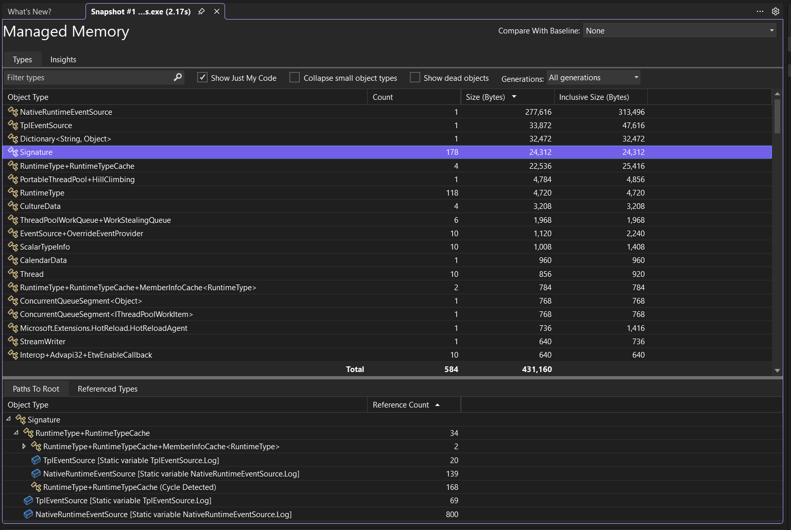
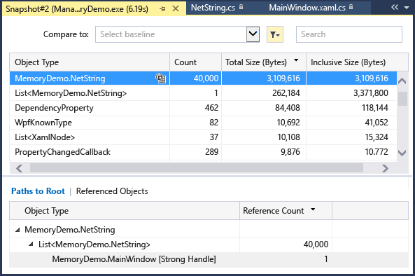
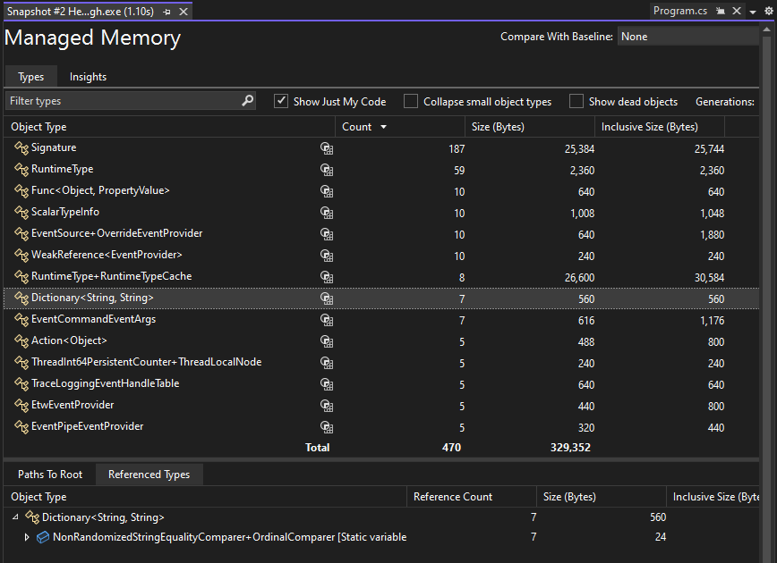

 Choose the current link of an **Objects (Diff)** cell in the Memory Usage summary table.

 ::: moniker range=">=vs-2022"

 

 > [!NOTE]
 > For .NET code, the **View Instances** icon () is only available while using the [debugger-integrated Memory Usage tool](../../profiling/memory-usage.md) or when you open a [heap snapshot](../../debugger/using-dump-files.md) and choose **Debug Managed Memory**.

 The top pane shows the count and size of the types in the snapshot, including the size of all objects that are referenced by the type (**Inclusive Size**).

 The **Paths to Root** tree in the bottom pane displays the objects that reference the type selected in the upper pane. The .NET garbage collector cleans up the memory for an object only when the last type that references it has been released. For more information on using the **Paths to Root** tree, see [Analyze hot path to root](../../profiling/hot-path-to-root.md).

 ::: moniker-end

 ::: moniker range="vs-2019"

 

 The top pane shows the count and size of the types in the snapshot, including the size of all objects that are referenced by the type (**Inclusive Size**).

 The **Paths to Root** tree in the bottom pane displays the objects that reference the type selected in the upper pane. The .NET garbage collector cleans up the memory for an object only when the last type that references it has been released.

 ::: moniker-end

 ::: moniker range=">=vs-2022"

 The **Referenced Types** tree displays the references that are held by the type selected in the upper pane.

 

 ::: moniker-end
 ::: moniker range="vs-2019"

 The **Referenced Types** tree displays the references that are held by the type selected in the upper pane.

 

 ::: moniker-end