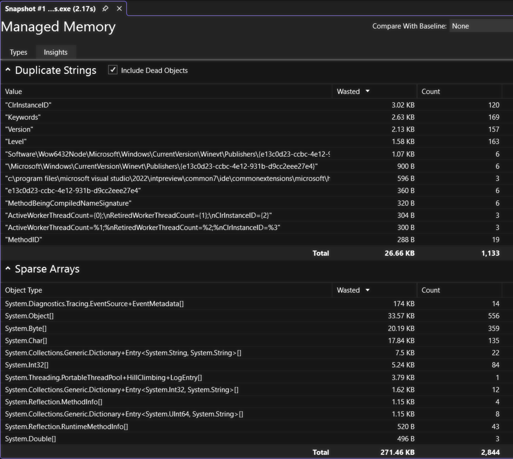
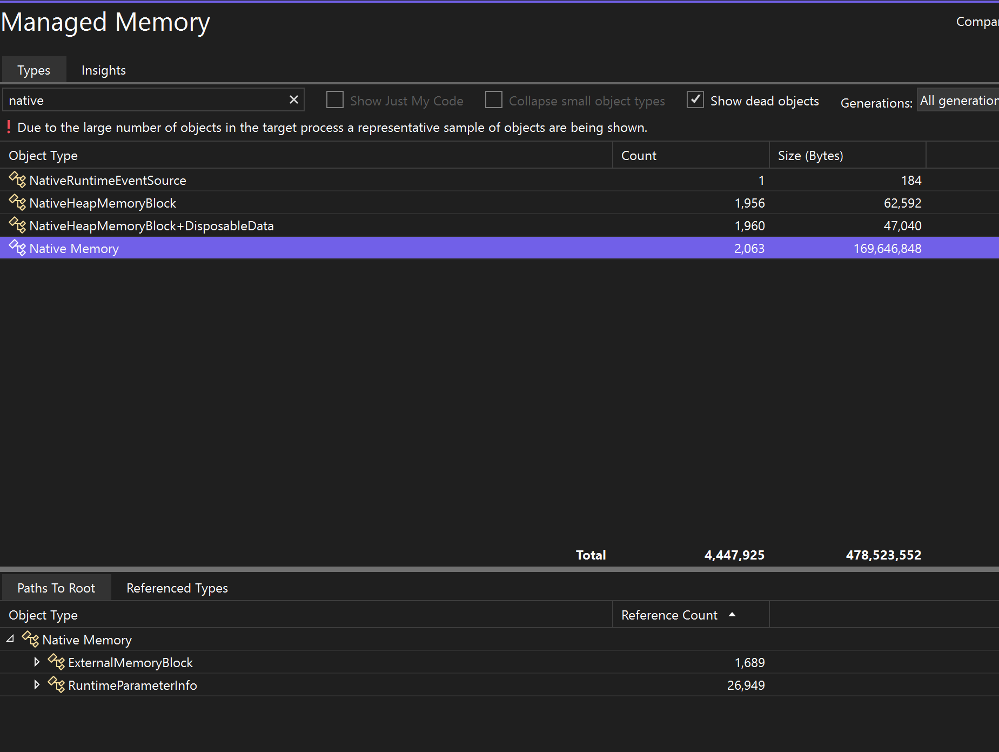

For managed memory, the Memory Analysis tool also gives multiple powerful built-in auto insights. Select the **Insights** tab in the Managed types reports and it shows the applicable auto insights like **Duplicate strings**, **Sparse arrays**, and **Event handler leaks**.

The **Duplicate Strings** section shows the list of strings that get allocated multiple times on the heap. In addition, this section shows the total wasted memory, that is, the (number of instances - 1) times the size of the string.

The **Sparse Arrays** section shows arrays that are mostly filled with zero elements, which can be inefficient in terms of performance and memory usage. The memory analysis tool will automatically detect these arrays and show you how much memory is being wasted due to these zero values.

The **Event Handler Leaks** section, available in Visual Studio 2022 version 17.9 Preview 1, shows potential memory leaks that can occur when one object subscribes to another object's event. If the publisher of the event outlives the subscriber, the subscriber remains alive, even if there are no other references to it. This can lead to memory leaks, where unused memory isn't properly freed, causing the application to use more and more memory over time.

Certain types are known to have fields that can be read to determine the size of the native memory they're holding onto. The **Insights** tab shows fake native memory nodes in the object graph, which are retained by their parent objects such that the UI will recognize them and display their size and reference graph.

