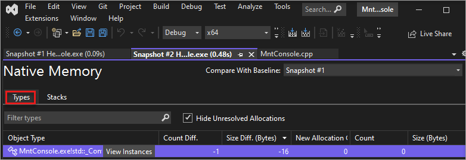
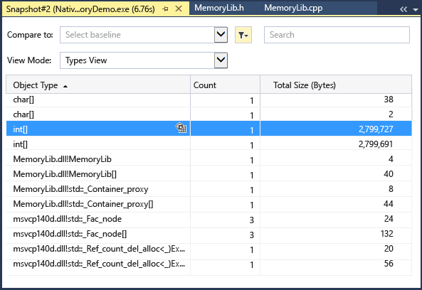
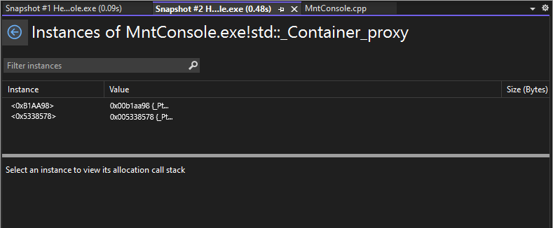
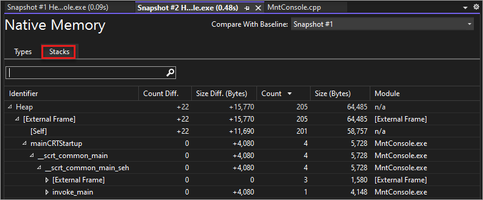
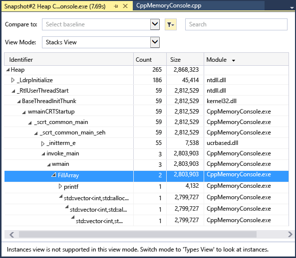

Choose the current link of an **Allocations (Diff)** or **Heap Size (Diff)** cell in the Memory Usage summary table of the **Diagnostic Tools** window.

::: moniker range=">=vs-2022"

::: moniker-end
::: moniker range="<=vs-2019"

::: moniker-end

The **Types View** displays the number and size of the types in the snapshot.

::: moniker range=">=vs-2022"

- Choose the **View Instances** icon next to a selected type to display information about the objects of the selected type in the snapshot.

     The **Instances** view displays each instance of the selected type. Selecting an instance displays the call stack that resulted in the creation of the instance in the **Allocation Call Stack** pane. (This information is only available while debugging.)

     

::: moniker-end

::: moniker range="<=vs-2019"

- Choose the instances icon () of a selected type to display information about the objects of the selected type in the snapshot.

     The **Instances** view displays each instance of the selected type. Selecting an instance displays the call stack that resulted in the creation of the instance in the **Allocation Call Stack** pane.

     

::: moniker-end

::: moniker range=">=vs-2022"

- Choose **Stacks** to see the allocation stack for the selected type.

     

::: moniker-end

::: moniker range="<=vs-2019"

- Choose **Stacks View** in the **View Mode** list to see the allocation stack for the selected type.

     

::: moniker-end