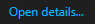
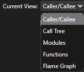

# Instrument your .NET application in Visual Studio (C#, C++, Visual Basic, F#)

With the release of Visual Studio 2022 version 17.5, you can use the new dynamic Instrumentation tool. This tool shows the exact number of times your functions are called and is faster than the previous version of the Instrumentation tool. This tool supports .NET Core instrumentation without needing PDBs.
Starting in Visual Studio 2022 version 17.6 Preview 2, the tool also supports C/C++.

The tool is similar to the CPU Usage tool except it's based on wall clock time instead of CPU utilization. This means blocked time such as time spent waiting for locks will show up in the instrumentation trace, unlike the CPU Usage tool. For additional information on learning to use the Instrumentation tool effectively, see [Instrumentation Overview](../profiling/instrumentation-overview.md) and [Case study: Isolate a performance issue](../profiling/isolate-performance-issue.md).

## Instrument your application

1. Select **Alt+F2** (or **Debug > Performance Profiler**) to open the performance profiler in Visual Studio.

1. Select the **Instrumentation** check box.

   

    If you enable the **Start with collection paused** option before starting the profiler, data won't be collected until you select the **Record** button in the diagnostic session view.

   > [!NOTE]
   > If the tool isn't available for selection, clear every other tool's check box because some tools need to run alone. To learn more about running tools together, see [Using multiple profiler tools simultaneously](../profiling/use-multiple-profiler-tools-simultaneously.md).
   >
   > If the tool still isn't available, check that your project meets the preceding requirements. Make sure your project is in Release mode to capture the most accurate data.

1. Select the **Start** button to run the tool.

1. Select the items in your program to instrument.

   

   Starting in Visual Studio 2022 version 17.11, the profiler persists the selected items for the next profiling run.

   Starting in Visual Studio 2022 version 17.13 Preview 1, you can select items to instrument for C++.

1. Select **OK**.

1. After the tool starts running, go through the scenario you want to profile in your app. Then select **Stop collection** or close the app to see your data.

## Analyze the Instrumentation report

Your profiling data appears in Visual Studio.

The Instrumentation data view shows you a list of functions ordered by longest running, with the longest running function at the top under **Top Functions**. The **Hot Path** section shows you the call stack for the functions that are using the most time. These lists can help guide you to functions where performance bottlenecks are happening. 

Click on a function that you're interested in, and you see a more detailed view.

The available data is similar to the CPU Usage tool, except that it's based on wall clock time and call counts instead of CPU utilization. 

## Analyze insights

If any insights show up in the **Top Insights** section, use the provided link to get more information about the issue identified. For more information, see [CPU insights](../profiling/cpu-insights.md), but be aware that information for the Instrumentation tool is specific to wall clock time and not CPU utilization. 

In addition, if you're using Copilot, use the **Ask Copilot** button to open the Copilot chat window, and Copilot will provide suggestions based on an examination of your code and any identified issues.

## Analyze instrumentation detailed reports

For in-depth analysis of the Instrumentation report, first open one of the detailed report views:

1. Click **Open details** in the summary page of the report, or select one of the top functions to open the **Functions** view.

   

1. From the **Current View** list, you can select one of the detailed report views.

   

The following table provides a description of the detailed views.

|View|Description|
|-|-|
|Caller/callee|Detailed view of time spent in a specific function, the function(s) that called it, and the function(s) that it calls. The performance data is aggregated for the data collection period. You can select calling functions and called functions to traverse the call path.|
|Call tree|Hierarchical view of the function call path. Used to identify call paths that are taking the most time (hot path).|
|Modules|View of the time spent in individual modules, aggregated over the data collection period. Used to identify modules that might be performance bottlenecks due to a combination of high call counts and/or performance issues.|
|Functions|View of the time spent in individual functions, aggregated over the data collection period. Used to identify functions that might be performance bottlenecks due to a combination of high call counts and/or performance issues.|
|Flame graph|Hierarchical view of the function call path in a flame graph visualization. Used to identify call paths that are taking the most time (hot path).|

In all views except Caller/callee, the diagnostic report is sorted by **Total [unit, %]**, from highest to lowest. Change the sort order or sort column by selecting the column headers. You can double-click on a function that you're interested in, and you'll see the source for the function as well as highlighting that shows where time is spent in that function. The table shows columns with data such as the time spent in the function, including called functions (Total), and a second column that shows the time spent in a function, excluding called functions (Self).

This data can help you assess whether the function itself is a performance bottleneck. Determine how much data the method is displaying to see if third-party code or runtime libraries are the reason for your endpoints being slow or resource-consumption heavy.

For more information on using the Flame graph, see [Identify hot paths with Flame Graph](../profiling/flame-graph.md).

### Instrumentation call tree

To view the call tree, select the parent node in the report. By default, the **Instrumentation** page opens to the **Caller/Callee** view. In the **Current View** dropdown, select **Call Tree**. The call tree view can help you quickly identify performance bottlenecks.

You can click the **Expand Hot Path** and **Show Hot Path** buttons to see the function calls that use the most wall clock time in the call tree view.

Here's more information on the column values:

- **Total** indicates how much time was spent in the function and any functions called by it. High **Total** values point to the functions that are consuming the most clock time.

- **Self** indicates how much time was spent in the function body, excluding the time spent in any functions that were called by it. High **Self** values may indicate a performance bottleneck within the function itself.

- **Call Count** indicates the number of times a function is called.

- **Module** The name of the module containing the function.

For help understanding unexpected data in the call tree, see [Understanding the call tree](../profiling/understanding-call-tree-data.md).

### Async calls in the Instrumentation call tree (.NET)

Starting in Visual Studio 2022 version 17.13 Preview 2, views representing a visual call tree nest .NET asynchronous calls under the functions where the asynchronous call was made, making it easier to trace the execution flow within a single, unified stack trace. This can help you quickly identify performance bottlenecks.

The unified stack trace shows in the **Call Tree** view and the **Hot Path** section of the Summary page. Async nodes appear with the **[Async Call]** descriptor.

You can toggle the display of a stitched together asynchronous call stack by selecting **Stitch Async Stacks** from the **Filter** option in the profiler's Summary view. The setting is enabled by default.

## Related content

- [Instrumentation](../profiling/instrumentation.md)
- [Improving Visual Studio performance with the new Instrumentation Tool](https://devblogs.microsoft.com/visualstudio/improving-visual-studio-performance-with-the-new-instrumentation-tool/)
- [First look at profiling tools](../profiling/profiling-feature-tour.md)
