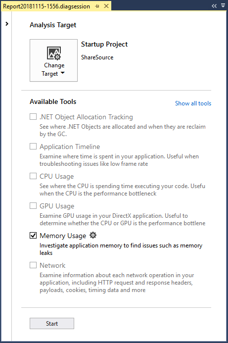
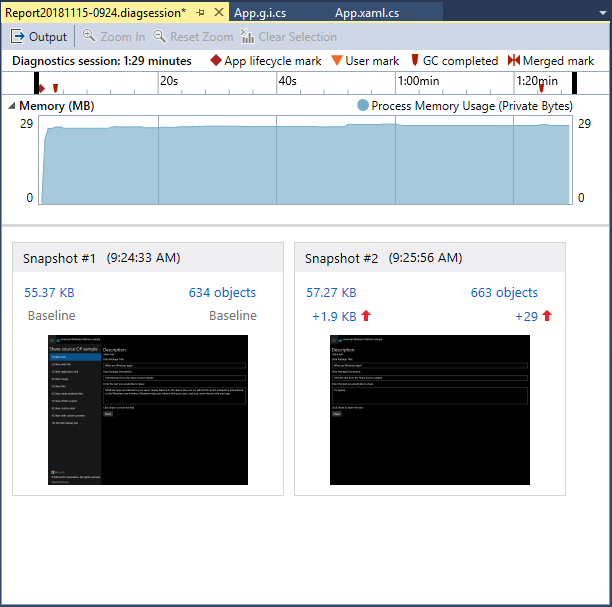

# Analyze memory usage without the debugger

The **Memory Usage** tool monitors your app's memory use. You can use the tool to study the real-time memory effects of scenarios you're actively developing in Visual Studio. You can take detailed snapshots of the app's memory states, and compare snapshots to find the root causes of memory issues.

The **Memory Usage** tool can run with or without the debugger. The following instructions show how to use the **Memory Usage** tool without the debugger in the Visual Studio **Performance Profiler**.

>[!NOTE]
>- To measure memory usage for a .NET Core app, you must use the **Memory Usage** tool with the debugger. For instructions, see [Profile memory usage in Visual Studio](memory-usage.md).
>- To analyze memory use in JavaScript or HTML UWP apps, use the [JavaScript Memory](../profiling/javascript-memory.md) tool in **Performance Profiler**.

## Memory Usage diagnostic sessions

**To start a Memory Usage diagnostic session:**

1. Open a C# Universal Windows (UWP) project in Visual Studio.

1. On the menu bar, choose  **Debug** > **Performance Profiler**.

1. Select **Memory Usage**, and then select **Start**.

   

### Monitor memory use

When you start a diagnostic session, your app starts, and the **Diagnostic Tools** window displays a timeline graph of your app's memory use.

The timeline graph shows memory fluctuations as the app runs. Spikes in the graph usually indicate that some code is collecting or creating data, and then discarding it when the processing is done. Large spikes indicate areas that you might be able to optimize. Of more concern is a rise in memory consumption that's not returned, because it may indicate inefficient memory use or even a memory leak.

### Take snapshots of app memory states

An app uses a large number of objects, and you might want to concentrate your analysis on one scenario. Or, you may find memory issues to investigate. You can take snapshots during a diagnostic session to capture memory usage at particular moments. It's a good idea to get a baseline snapshot of an app before a memory issue appears, another snapshot after the first occurrence of the problem, and additional snapshots if you can repeat the scenario.

To collect snapshots, select **Take snapshot** when you want to capture the memory data.

###  Close the diagnostic session

To stop a monitoring session without creating a report, just close the diagnostic window. To generate a report when you're done collecting or have taken snapshots, select **Stop Collection**.

## Memory Usage reports

After you stop data collection, the **Memory Usage** tool stops the app and displays the **Memory Usage** overview page.

###  Memory Usage snapshots

The numbers in the **Snapshot** panes show the bytes and objects in memory when each snapshot was taken, and the difference between the snapshot and the previous one.

The numbers are links that open detailed **Memory Usage** report views in new Visual Studio windows. A [snapshot details report](#snapshot-details-reports) shows the types and instances in one snapshot. A [snapshot difference (diff) report](#snapshot-difference-diff-reports) compares the types and instances in two snapshots.

  

|||
|-|-|
||The total number of bytes in memory when the snapshot was taken.   Select this link to display a snapshot details report sorted by the total size of the type instances.|
||The total number of objects in memory when the snapshot was taken.   Select this link to display a snapshot details report sorted by the count of instances of the types.|
||The difference between the total size of memory objects in this snapshot and the previous snapshot.    A positive number means the memory size of this snapshot is larger than the previous one, and a negative number means the size is smaller. **Baseline** means a snapshot is the first in a diagnostic session. **No Difference** means the difference is zero.   Select this link to display a snapshot diff report sorted by the difference in the total size of instances of the types.|
||The difference between the total number of memory objects in this snapshot and the previous snapshot.   Select this link to display a snapshot diff report sorted by the difference in the total count of instances of the types.|

## Memory Usage snapshot reports

 When you select one of the snapshot links in the **Memory Usage** overview page, a snapshot report opens in a new page.

In a snapshot report, you can expand **Object Type** entries to display child entries. Instance names are unique IDs that are generated by the Memory Usage tool.

If an **Object Type** is blue, you can select it to navigate to the object in the source code, in a separate window.

Types that you can't identify or whose involvement in your code you don't understand are probably .NET Framework, operating system, or compiler objects. The **Memory Usage** tool displays these objects if they're involved in the ownership chains of your objects.

In the snapshot report:

- The **Managed Heap** tree shows the types and instances in the report. Selecting a type or instance displays the **Paths to Root** and **Referenced Objects** trees for the selected item.

- The **Paths to Root** tree shows the chain of objects that reference a type or instance. The .NET Framework garbage collector cleans up the memory for an object only when all references to it have been released.

- The **Referenced Types** or **Referenced Objects** tree shows the objects that the selected type or instance references.

###  Report tree filters

Many types in apps aren't very interesting to app developers. The snapshot report filters can hide most of these types in the **Managed Heap** and **Paths to Root** trees.

-  To filter a tree by type name, enter the name in the **Filter** box. The filter isn't case-sensitive, and it recognizes the specified string in any part of the type name.

-  Select **Collapse Small Objects** in the **Filter** dropdown to hide types whose **Size (Bytes)** is less than 0.5 percent of the total memory.

-  Select **Just My Code** in the **Filter** dropdown to hide most instances that are generated by external code. External types belong to the operating system or framework components, or are generated by the compiler.

## Snapshot details reports

 A snapshot details report describes one snapshot from a diagnostic session. To open the report, select the size or objects link in a snapshot pane.

 

Both links open the same report. The only difference is the starting sort order of the **Managed Heap** tree. The size link sorts the report by the **Inclusive Size (Bytes)** column. The objects link sorts the report by the **Count** column. You can change the sort column or order after the report opens.

###  Managed Heap tree (Snapshot details reports)
 The **Managed Heap** tree lists the types of objects that are held in memory. Expand a type name to view the ten largest instances of the type, sorted by size. Select a type or instance to display the **Paths to Root** and **Referenced Objects** trees for the selected item.

 

The **Managed Heap** tree in a snapshot details report has the following columns:

|||
|-|-|
|**Object Type**|The name of the type or object instance.|
|**Count**|The number of object instances of the type. **Count**  is always 1 for an instance.|
|**Size (Bytes)**|For a type, the size of all instances of the type in the snapshot, less the size of objects contained in the instances.   For an instance, the size of the object, less the size of objects contained in the instance. |
|**Inclusive Size (Bytes)**|The size of the instances of the type, or the size of a single instance, including the size of contained objects.|
|**Module**|The module that contains the object.|

###  Paths to Root tree (Snapshot details reports)
The **Paths to Root tree** shows the chain of objects that reference a type or instance. The .NET Framework garbage collector cleans up the memory for an object only when all references to it have been released.

For a type in the **Paths to Root** tree, the number of objects that hold references to that type appears in the **Reference Count** column.

###  Referenced Types or Referenced Objects tree (Snapshot details reports)
The **Referenced Types** or **Referenced Objects** tree shows the objects that the selected type or instance references.

A **Referenced Types** tree in a snapshot details report has the following columns. A **Referenced Objects** tree does not have the **Reference Count** column.

|||
|-|-|
|**Object Type** or **Instance**|The name of the type or instance.|
|**Reference Count**|For types, the number of object instances of the type.|
|**Size (Bytes)**|For a type, the size of all instances of the type, less the size of objects contained in the type.   For an instance, the size of the object, less the size of objects contained in the object.|
|**Inclusive Size (Bytes)**|The total size of the instances of the type, or the size of the instance, including the size of contained objects.|
|**Module**|The module that contains the object.|

## Snapshot difference (diff) reports

A snapshot difference (diff) report shows the changes between a primary snapshot and the preceding snapshot. To open a diff report, select one of the difference links in a snapshot pane.

Both links open the same report. The only difference is the starting sort order of the **Managed Heap** tree in the report. The size link sorts the report by the **Inclusive Size Diff (Bytes)** column. The objects link sorts the report by the **Count Diff** column. You can change the sort column or order after the report opens.

 

###  Managed Heap tree (Snapshot diff reports)

 The **Managed Heap** tree lists the types of objects that are held in memory. You can expand a type name to view the ten largest instances of the type, sorted by size. Select a type or instance to display the **Paths to Root** and **Referenced Objects** trees for the selected item.

 

The **Managed Heap** tree in a snapshot diff report has the following columns:

|||
|-|-|
|**Object Type**|The name of the type or object instance.|
|**Count**|The number of instances of a type in the primary snapshot. **Count** is always 1 for an instance.|
|**Count Diff**|For a type, the difference in the number of instances of the type between the primary snapshot and the previous snapshot. The field is blank for an instance.|
|**Size (Bytes)**|The size of the objects in the primary snapshot, less the size of objects in the objects. For a type, **Size (Bytes)** and **Inclusive Size (Bytes)** are the totals of the sizes of the type instances.|
|**Total Size Diff (Bytes)**|For a type, the difference in the total size of instances of the type between the primary snapshot and the previous snapshot, less the size of objects in the instances. The field is blank for an instance.|
|**Inclusive Size (Bytes)**|The size of the objects in the primary snapshot, including the size of objects in the objects.|
|**Inclusive Size Diff (Bytes)**|For a type, the difference in the size of all instances of the type between the primary snapshot and the previous snapshot, including the size of objects in the objects. The field is blank for an instance.|
|**Module**|The module that contains the object.|

###  Paths to Root tree (Snapshot diff reports)

The **Paths to Root tree** shows the chain of objects that reference a type or instance. The .NET Framework garbage collector cleans up the memory for an object only when all references to it have been released.

For a type in the **Paths to Root** tree, the number of objects that hold references to that type appears in the **Reference Count** column. The difference in count from the previous snapshot is in the **Reference Diff** column.

 

###  Referenced Types or Referenced Objects tree (Snapshot diff reports)

The **Referenced Types** or **Referenced Objects** tree shows the objects that the selected type or instance references.

A **Referenced Types** tree in a snapshot diff report has the following columns. A **Referenced Objects** tree has the **Instance**, **Size (Bytes)**, **Inclusive Size (Bytes)**, and **Module** columns.

|||
|-|-|
|**Object Type** or **Instance**|The name of the type or object instance.|
|**Reference Count**|The number of instances of a type in the primary snapshot.|
|**Reference Count Diff**|For a type, the difference in the number of instances of the type between the primary snapshot and the previous snapshot.|
|**Size (Bytes)**|The size of the objects in the primary snapshot, less the size of objects in the objects. For a type, **Size (Bytes)** and **Inclusive Size (Bytes)** are the totals of the sizes of the type instances.|
|**Total Size Diff (Bytes)**|For a type, the difference in the total size of instances of the type between the primary snapshot and the previous snapshot, less the size of objects in the instances. |
|**Inclusive Size (Bytes)**|The size of the objects in the primary snapshot, including the size of objects in the objects.|
|**Inclusive Size Diff (Bytes)**|For a type, the difference in the size of all instances of the type between the primary snapshot and the previous snapshot, including the size of objects in the objects.|
|**Module**|The module that contains the object.|

## See also
- [JavaScript memory](../profiling/javascript-memory.md)
- [Profiling in Visual Studio](../profiling/index.yml)
- [First look at profiling tools](../profiling/profiling-feature-tour.md)
- [Performance best practices for UWP apps using C++, C#, and Visual Basic](/previous-versions/windows/apps/hh750313\(v\=win.10\))
- [Diagnosing memory issues with the new Memory Usage tool in Visual Studio](https://devblogs.microsoft.com/devops/diagnosing-memory-issues-with-the-new-memory-usage-tool-in-visual-studio/)