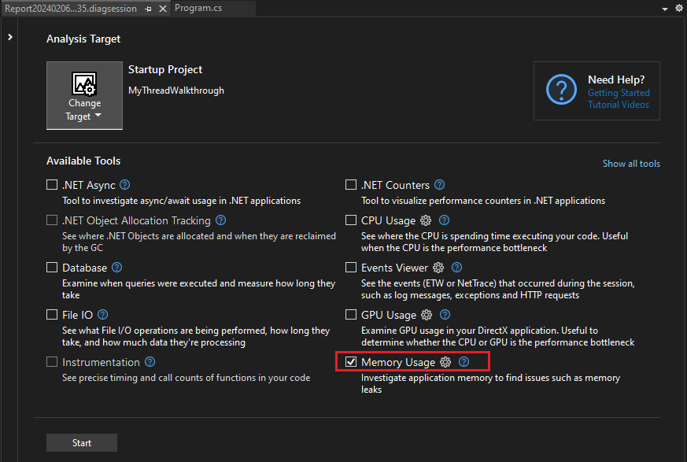
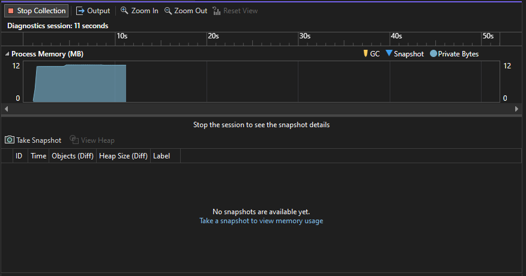
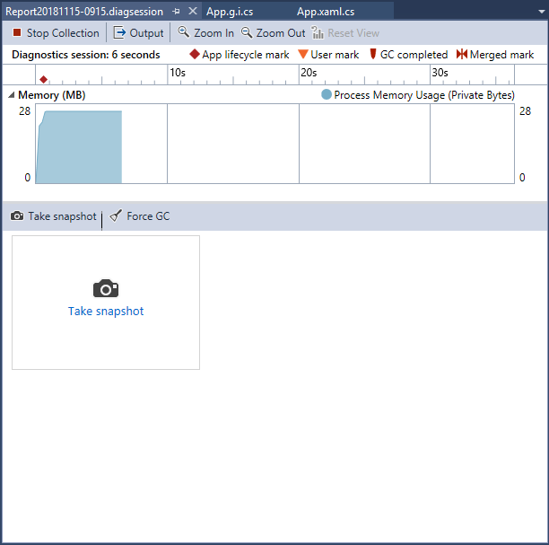
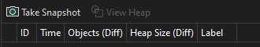
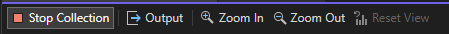
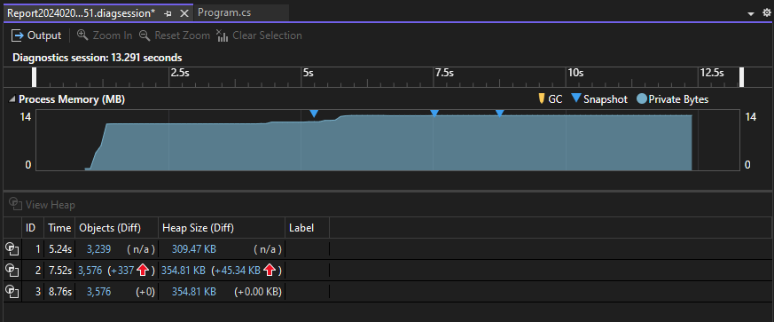
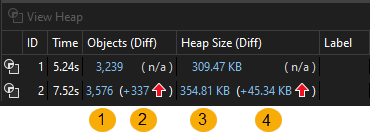
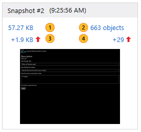
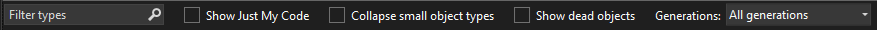
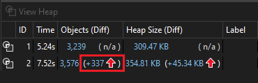

# Analyze memory usage in release builds (C#, Visual Basic, C++, F#)

The **Memory Usage** tool monitors your app's memory use. You can use the tool to study the real-time memory effects of scenarios you're actively developing in Visual Studio. You can take detailed snapshots of the app's memory states, and compare snapshots to find the root causes of memory issues. The Memory Usage tool is supported on .NET, ASP.NET, C++, or mixed mode (.NET and native) apps.

The Memory Usage tool can run [on release or debug builds](../profiling/running-profiling-tools-with-or-without-the-debugger.md). In this article, we show how to use the Memory Usage tool in the Visual Studio **Performance Profiler**, which is recommended for release builds. For information on choosing the best memory analysis tool for your needs, see [Choose a memory analysis tool](../profiling/analyze-memory-usage.md).

::: zone pivot="programming-language-dotnet,programming-language-dotnetf,programming-language-cpp"
## Memory Usage diagnostic sessions

**To start a Memory Usage diagnostic session:**

1. Open a project in Visual Studio.

   The Memory Usage tool supports .NET, ASP.NET, C++, or mixed mode (.NET and native) apps.

1. In the Debug menu, set the solution configuration to **Release** and select **Local Windows Debugger** (or **Local Machine**) as the deployment target.

1. On the menu bar, select  **Debug** > **Performance Profiler**.

1. Under **Available Tools**, select **Memory Usage**, and then select **Start**.

   ::: moniker range=">=vs-2022"
   
   ::: moniker-end

   ::: moniker range="vs-2019"
   
   ::: moniker-end
::: zone-end

### Monitor memory use

When you start a diagnostic session, your app starts, and the **Diagnostic Tools** window displays a timeline graph of your app's memory use.

::: moniker range=">=vs-2022"

::: moniker-end

::: moniker range="vs-2019"

::: moniker-end

The timeline graph shows memory fluctuations as the app runs. Spikes in the graph usually indicate that some code is collecting or creating data, and then discarding it when the processing is done. Large spikes indicate areas that you can optimize. Main concern is a rise in memory consumption that's not returned. This may indicate inefficient memory use or even a memory leak.

### Take snapshots of app memory states

An app uses a large number of objects, and you might want to concentrate your analysis on one scenario. Or, you may find memory issues to investigate. You can take snapshots during a diagnostic session to capture memory usage at particular moments. It's good to get a baseline snapshot of an app before a memory issue appears. You can take another snapshot after the first occurrence of the problem, and additional snapshots if you can repeat the scenario.

To collect snapshots, select **Take snapshot** when you want to capture the memory data.

::: moniker range=">=vs-2022"

::: moniker-end

###  Close the diagnostic session

To stop a monitoring session without creating a report, just close the diagnostic window. To generate a report when you're done collecting or have taken snapshots, select **Stop Collection**.

::: moniker range=">=vs-2022"

::: moniker-end

::: moniker range="vs-2019"

::: moniker-end

If you have trouble collecting or displaying data, see [Troubleshoot profiling errors and fix issues](../profiling/troubleshoot-profiler-errors.md).

## Memory Usage reports

After you stop data collection, the **Memory Usage** tool stops the app and displays the **Memory Usage** overview page.

::: moniker range=">=vs-2022"

::: moniker-end

::: moniker range="vs-2019"

::: moniker-end

###  Memory Usage snapshots

The numbers in the **Snapshot** panes show the objects and bytes in memory when each snapshot was taken, and the difference between the snapshot and the previous one.

The numbers are links that open detailed **Memory Usage** report views in new Visual Studio windows. A [snapshot details report](#managed-types-reports) shows the types and instances in one snapshot. A [snapshot difference (diff) report](#change-diff-reports) compares the types and instances in two snapshots.

::: moniker range=">=vs-2022"
  

For C++, the **Objects (Diff)** column is named **Allocations (Diff)**.

|Image|Description|
|-|-|
||The total number of objects in memory when the snapshot was taken. Select this link to display a snapshot details report sorted by the count of instances of the types.|
||The difference between the total number of memory objects in this snapshot and the previous snapshot. Select this link to display a snapshot diff report sorted by the difference in the total count of instances of the types.|
||The total number of bytes in memory when the snapshot was taken. Select this link to display a snapshot details report sorted by the total size of the type instances.|
||The difference between the total size of memory objects in this snapshot and the previous snapshot. A positive number means the memory size of this snapshot is larger than the previous one, and a negative number means the size is smaller. **Baseline** means a snapshot is the first in a diagnostic session. **No Difference** means the difference is zero. Select this link to display a snapshot diff report sorted by the difference in the total size of instances of the types.|
::: moniker-end

::: moniker range="vs-2019"
  

|Image|Description|
|-|-|
||The total number of bytes in memory when the snapshot was taken. Select this link to display a snapshot details report sorted by the total size of the type instances.|
||The total number of objects in memory when the snapshot was taken. Select this link to display a snapshot details report sorted by the count of instances of the types.|
||The difference between the total size of memory objects in this snapshot and the previous snapshot. A positive number means the memory size of this snapshot is larger than the previous one, and a negative number means the size is smaller. **Baseline** means a snapshot is the first in a diagnostic session. **No Difference** means the difference is zero. Select this link to display a snapshot diff report sorted by the difference in the total size of instances of the types.|
||The difference between the total number of memory objects in this snapshot and the previous snapshot. Select this link to display a snapshot diff report. It’s sorted by the difference in the total count of instances of the types.|
::: moniker-end

::: zone pivot="programming-language-dotnet,programming-language-dotnetf"
## Managed types reports

[!INCLUDE [managed-types-report](../profiling/includes/managed-types-report.md)]

###  Report tree filters

Many types in apps aren't required for app developers to investigate memory issues. The snapshot report filters can hide most of these types in the **Managed Memory** and **Paths to Root** trees.

::: moniker range=">=vs-2022"

::: moniker-end

::: moniker range="vs-2019"

::: moniker-end

-  To filter a tree by type name, enter the name in the **Filter** box. The filter isn't case-sensitive, and it recognizes the specified string in any part of the type name.

-  Select **Show Just My Code** in the **Filter** dropdown to hide most instances that are generated by external code. External types belong to the operating system or framework components, or are generated by the compiler.

-  Select **Collapse Small Objects** in the **Filter** dropdown to hide types whose **Size (Bytes)** is less than 0.5 percent of the total memory.
::: zone-end

::: zone pivot="programming-language-cpp"
## Native types reports

[!INCLUDE [native-types-report](../profiling/includes/native-types-report.md)]

::: moniker range=">=vs-2022"
## Memory Usage Insights

[!INCLUDE [memory-usage-insights](../profiling/includes/memory-usage-insights.md)]
::: moniker-end
::: zone-end

## Change (Diff) reports

- Choose the change link in a cell of the **Snapshot** pane in the Memory Usage overview page.

   ::: moniker range=">=vs-2022"

   

   ::: moniker-end

   ::: moniker range="vs-2019"

   

   ::: moniker-end

- Choose a snapshot in the **Compare To** list of a managed or native report.

   ::: moniker range=">=vs-2022"

   

   ::: moniker-end

   ::: moniker range="<=vs-2019"

   

   ::: moniker-end

[!INCLUDE [change-diff-report](../profiling/includes/change-diff-report.md)]

## Related content

- [Profiling in Visual Studio](../profiling/index.yml)
- [First look at profiling tools](../profiling/profiling-feature-tour.md)
- [Analyze hot path to root](../profiling/hot-path-to-root.md)
- [Diagnosing memory issues with the new Memory Usage tool in Visual Studio](https://devblogs.microsoft.com/devops/diagnosing-memory-issues-with-the-new-memory-usage-tool-in-visual-studio/)
