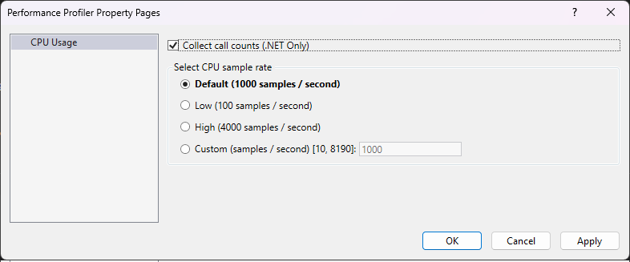

# Optimizing Profiler settings

 [!INCLUDE [Visual Studio](~/includes/applies-to-version/vs-windows-only.md)]

The Performance Profiler and Diagnostic Tools window in Visual Studio have many different settings which affect the overall performance of the tools. Changing some settings can cause analysis to run quickly or cause additional wait times while processing results in tools. Below is a summary of certain settings and their impact on performance.

## Symbol Settings

The symbols settings found in the debugger options (**Debug > Options > Symbols** or **Tools > Options > Debugging > Symbols**) have a significant impact on how long it takes to generate results in the tools. Enabling symbol servers or using the **_NT_SYMBOL_PATH** causes the profiler to request symbols for each loaded module in a report. Currently, the profiler always automatically loads all symbols regardless of the automatic symbol loading preference.

Progress on symbol loading can be seen in the **Output** window under the **Diagnostic Tools** heading.

Once downloaded, symbols are cached, which will speed up future analysis but still requires loading and analyzing the files. If symbol loading is slowing down analysis, try turning off symbol servers and clear your symbol cache. Instead, rely on symbols built locally for your project.

## Show External Code

Many of the tools within the **Performance Profiler** and **Diagnostic Tools** window have a concept of user code versus external code. User code is any code that's built by the open solution or open workspace. External code is anything else. By keeping the **Show external code** setting disabled, or **Show just my code** enabled, you allow the tools to aggregate external code to a single first level frame, greatly reducing the amount of processing that's required to show results. This allows users to see what was called in external code that created the slow down while keeping the data to be processed to a minimum. When possible, leave **Show external code** disabled and ensure that you have the solution or workspace open for the diagsession you are analyzing.

## Trace Duration

Profiling smaller durations results in less data, which is faster to analyze. Typically we recommend that you try to limit your traces to no longer than five minutes of performance data. Some tools, such as the [CPU Usage](../profiling/cpu-usage.md) tool, allow you to pause data collection while the tool is running, so that you can limit the amount of data that's collected to the scenario that you are interested in analyzing.

## Sampling Frequency

Certain tools, such as the [CPU Usage](../profiling/cpu-usage.md) tool and [NET Object Allocation](../profiling/dotnet-alloc-tool.md) tool, allow you to adjust a sampling frequency. Increasing this sampling frequency lets you measure more precisely, but increases the amount of data that's generated. Typically, it's best to leave this setting at the default rate unless a specific issue is being investigated.

::: moniker range=">=vs-2022"

::: moniker-end
::: moniker range="vs-2019"

::: moniker-end

## See also

- [Running profiling tools with or without the debugger](../profiling/running-profiling-tools-with-or-without-the-debugger.md)
- [Using multiple profiler tools simultaneously](../profiling/use-multiple-profiler-tools-simultaneously.md)
- [Understanding performance collection methods](../profiling/understanding-performance-collection-methods-perf-profiler.md)
