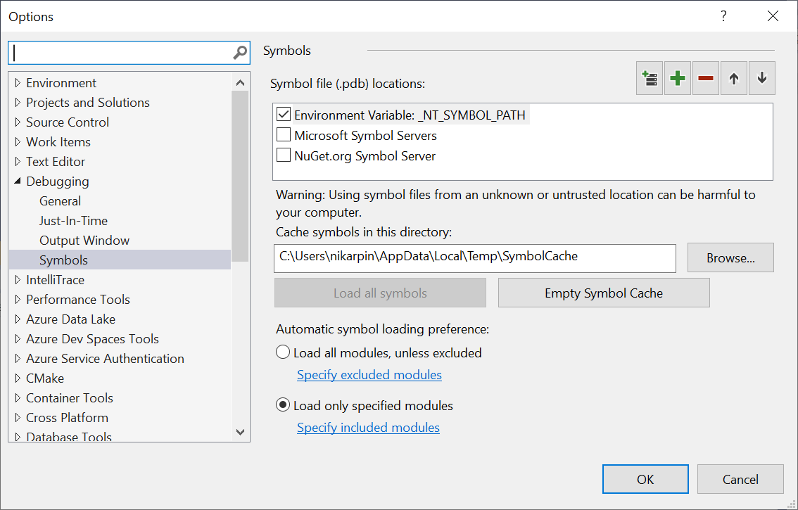
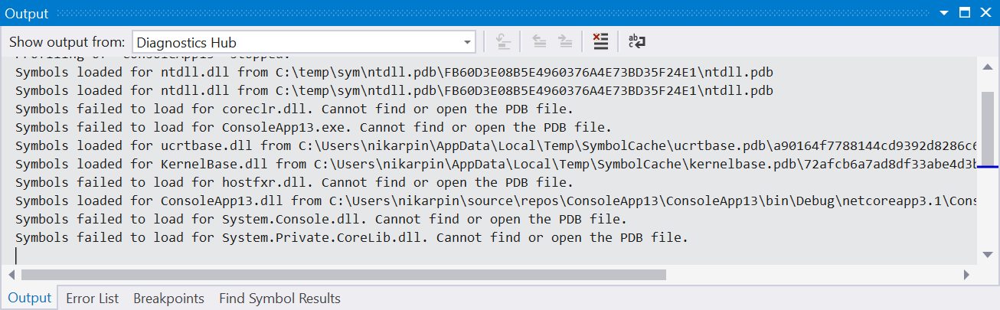

# Optimizing Profiler Settings

The Performance Profiler and Diagnostic Tools window in Visual Studio have many different settings which affect the overall performance of the tools. Changing some settings can cause analysis to run quickly or cause additional wait times while processing results in tools. Below is a summary of certain settings and their impact to performance.

## Symbol Settings

The symbols settings found in the debugger options (Debug > Options > Symbols) will have a significant impact on how long it takes to generate results in the tools. Enabling symbol servers or using the _NT_SYMBOL_PATH will cause the profiler to request symbols for each loaded module in a report. Currently the profiler will always automatically load all symbols regardless of the automatic symbol loading preference.

Progress on symbol loading can be seen in the Output window under the Diagnostic Tools heading.

Once downloaded symbols will be cached which will speed up future analysis but still requires loading and analyzing the files. If symbol loading is slowing down analysis try and turn off symbol servers and clear your symbol cache. Instead rely on symbols built locally for your project.

## Show External Code

Many of the tools within the Performance Profiler and Diagnostic Tools window have a concept of user code vs external code. User code is any code that is built by the open solution or open workspace, external code is anything else. Keeping the show external code setting disabled, or show just my code enabled, allows the tools to aggregate external code to a single first level frame and greatly reduce the amount of processing that is required to show results. This allows users to see what was called in external code that created the slow down yet keep the data to be processed to a minimum. When possible leave show external code disabled and ensure you have the solution or workspace open for the diagsession you are analyzing.

## Trace Duration

Profiling smaller durations will result in less data which is faster to analyze. Typically we recommend that users try and limit their traces to no longer than 5 minutes of performance data. Some tools such as the [CPU Usage](../profiling/cpu-usage.md) tool allow you to pause data collection while it is running so that you can limit the amount of data that is collected to the scenario that you are interested in analyzing.

## Sampling Frequency

Certain tools such as the [CPU Usage](../profiling/cpu-usage.md) tool and [NET Object Allocation](../profiling/dotnet-alloc-tool.md) tool allow the user to adjust a sampling frequency. Increasing this sampling frequency allows the user to measure more precisely but increases the amount of data that is generated. Typically it is best to leave this setting at the default rate unless a specific issue is being investigated.

