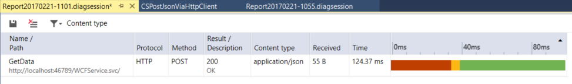
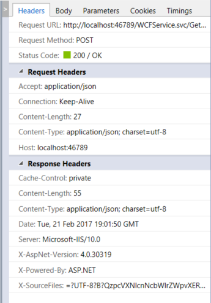

# Quickstart: First look at profiling tools

Visual Studio provides a variety of profiling tools to help you diagnose different kinds of performance issues depending on your app type.

The profiling tools that you can access during a debugging session are available in the Diagnostic Tools window. The Diagnostic Tools window appears automatically unless you have turned it off. To bring up the window, click **Debug / Windows / Show Diagnostic Tools**. With the window open, you can select tools for which you want to collect data.

While you are debugging, you can use the **Diagnostic Tools** window to analyze CPU and memory usage, and you can view events that show performance-related information.

The **Diagnostic Tools** window is often the preferred way to profile apps, but for Release builds you can also do a post-mortem analysis of your app instead. If you want more information on different approaches, see [Run profiling tools with or without the debugger](../profiling/running-profiling-tools-with-or-without-the-debugger.md). To see profiling tool support for different app types, see [Which tool should I use?](#which-tool-should-i-use).

> [!NOTE]
> You can use the post-mortem tools with Windows 7 and later. Windows 8 and later is required to run profiling tools with the debugger (**Diagnostic Tools** window).

## Analyze CPU Usage

The CPU Usage tool is a good place to start analyzing your app's performance. It will tell you more about CPU resources that your app is consuming. For a more detailed walkthrough of the CPU Usage tool, see [Beginner's guide to performance profiling](../profiling/beginners-guide-to-performance-profiling.md).

From the **Summary** view of the Diagnostic Tools, choose **Enable CPU Profiling** (you must be in a debugging session).

To use the tool most effectively, set two breakpoints in your code, one at the beginning and one at the end of the function or the region of code you want to analyze. Examine the profiling data when you are paused at the second breakpoint.

The **CPU Usage** view shows you a list of functions ordered by longest running, with the longest running function at the top. This can help guide you to functions where performance bottlenecks are happening.

Double-click on a function that you are interested in, and you will see a more detailed three-pane "butterfly" view, with the selected function in the middle of the window, the calling function on the left, and called functions on the right. The **Function Body** section shows the total amount of time (and the percentage of time) spent in the function body excluding time spent in calling and called functions. This data can help you evaluate whether the function itself is a performance bottleneck.

## Analyze memory usage

The **Diagnostic Tools** window also allows you to evaluate memory usage in your app. For example, you can look at the number and size of objects on the heap. For more detailed instructions to analyze memory, see [Analyze memory usage](../profiling/memory-usage.md).

To analyze memory usage, you need to take at least one memory snapshot while you are debugging. Often, the best way to analyze memory is to take two snapshots; the first right before a suspected memory issue, and the second snapshot right after a suspected memory issue occurs. Then you can view a diff of the two snapshots and see exactly what changed.

When you select one of the arrow links, you are given a differential view of the heap (a red up arrow  shows an increasing object count (left) or an increasing heap size (right)). If you click the right link, you get a differential heap view ordered by objects that increased the most in heap size. This can help you pinpoint memory problems. For example, in the illustration below, the bytes used by `ClassHandlersStore` objects increased by 3,492 bytes in the second snapshot.

If you click the link on the left instead in the **Memory Usage** view, the heap view is organized by object count; the objects of a particular type that increased the most in number are shown at the top (sorted by **Count Diff** column).

## Examine performance events

The **Events** view in the Diagnostic Tools shows you different events that occur while you are debugging, such as the setting of a breakpoint or a code stepping operation. You can check information such as the duration of the event (measured from when the debugger was last paused, or when the app started). For example, if you step through code (F10, F11), the **Events** view shows you the app runtime duration from the previous step operation to the current step.

 > [!NOTE]
 > If you have Visual Studio Enterprise, you can also see [IntelliTrace events](../debugger/intellitrace.md) in this tab.

The same events also show up in the code editor, which you can view as PerfTips.

## Examine UI performance and accessibility events (UWP)

In your UWP apps, you can enable **UI Analysis** in the **Diagnostic Tools** window. The tool searches for common performance or accessibility issues and displays them in the **Events** view while you are debugging. The event descriptions provide information that can help resolve issues.

##  Profile release builds without the debugger

Profiling tools like CPU Usage and Memory Usage can be used with the debugger (see earlier sections), or you can run profiling tools post-mortem using the Performance Profiler, which is intended to provide analysis for **Release** builds. In the Performance Profiler, you can collect diagnostic info while the app is running, and then examine the collected information after the app is stopped. For more information on these different approaches, see [Run profiling tools with or without the debugger](../profiling/running-profiling-tools-with-or-without-the-debugger.md).

Open the Performance Profiler by choosing **Debug** > **Performance Profiler**.

The window will allow you to select multiple profiling tools in some scenarios. Tools such as CPU Usage may provide complementary data that you can use to help in your analysis.

## Analyze resource consumption (XAML)

In XAML apps, such as Windows desktop WPF apps and UWP apps, you can analyze resource consumption using the Application Timeline tool. For example, you can analyze the time spent by your application preparing UI frames (layout and render), servicing network and disk requests, and in scenarios like application startup, page load, and Window resize. To use the tool, choose **Application Timeline** in the Performance Profiler, and then choose **Start**. In your app, go through the scenario with a suspected resource consumption issue, and then choose **Stop collection** to generate the report.

Low framerates in the **Visual throughput** graph may correspond to visual problems that you see when running your app. Similarly, high numbers in the **UI thread utilization** graph may also correspond to UI responsiveness issues. In the report, you can select a time period with a suspected performance issue, and then examine the detailed UI thread activities in the Timeline details view (lower pane).

In the Timeline details view, you can find information such as the type of activitiy (or the UI element involved) along with the duration of the activity. For example, in the illustration, a **Layout** event for a Grid control takes 57.53 ms.

For more information, see [Application Timeline](../profiling/application-timeline.md).

## Analyze GPU Usage (Direct3D)

In Direct3D apps (Direct3D components must be in C++), you can examine activity on the GPU and analyze performance issues. For more information, see [GPU Usage](/visualstudio/debugger/graphics/gpu-usage). To use the tool, choose **GPU Usage** in the Performance Profiler, and then choose **Start**. In your app, go through the scenario that you're interested in profiling, and then choose **Stop collection** to generate a report.

When you select a time period in the graphs and choose **view details**, a detailed view appears in the lower pane. In the detailed view, you can examine how much activity is happening on each CPU and GPU. Select events in the lowest pane to get popups in the timeline. For example, select the **Present** event to view **Present** call popups. (The light gray vertical Vsync lines can be used as a reference to understand whether certain **Present** calls missed Vsync. There must be one **Present** call between every two Vsyncs in order for the app to steadily hit 60 FPS.)

You can also use the graphs to determine whether there are CPU bound or GPU bound performance bottlenecks.

::: moniker range="vs-2017"
## Analyze performance (JavaScript UWP)

For UWP apps, you can use the JavaScript Memory tool and the HTML UI Responsiveness tool.

The JavaScript Memory tool is similar to the Memory Usage tool available for other app types. You can use this tool to understand memory usage and find memory leaks in your app. For more details about the tool, see [JavaScript Memory](../profiling/javascript-memory.md).

To diagnose UI responsiveness, slow loading time, and slow visual updates in UWP apps, use the HTML UI Responsiveness tool. Usage is similar to the Application Timeline tool for other app types. For more information, see [HTML UI responsiveness](../profiling/html-ui-responsiveness.md).

::: moniker-end

::: moniker range="vs-2017"
## Analyze network usage (UWP)

In UWP apps, you can analyze network operations performed using the `Windows.Web.Http` API.This tool may help you to resolve issues like access and authentication problems, incorrect cache-use, and poor display and download performance. To use the tool, choose **Network** in the Performance Profiler, and then choose **Start**. In your app, go through the scenario that uses `Windows.Web.Http`, and then choose **Stop collection** to generate the report.

Select an operation in the summary view to view more details.

For more information, see [Network Usage](../profiling/network-usage.md).
::: moniker-end

## Analyze performance (legacy tools)

If you need features such as instrumentation that are not currently present in CPU Usage or Memory Usage tools, and you are running desktop or ASP.NET apps, you can use the Performance Explorer for profiling. (Not supported in UWP apps). For more info, see [Performance Explorer](../profiling/performance-explorer.md).

## Which tool should I use?

Here is a table that lists the different tools Visual Studio offers and the different project types you can use them with:

::: moniker range=">=vs-2019"
|Performance Tool|Windows desktop|UWP|ASP.NET/ASP.NET Core|
|----------------------|---------------------|-------------|-------------|
|[CPU Usage](../profiling/cpu-usage.md)|yes|yes|yes|
|[Memory Usage](../profiling/memory-usage.md)|yes|yes|yes|
|[GPU Usage](/visualstudio/debugger/graphics/gpu-usage)|yes|yes|no|
|[Application Timeline](../profiling/application-timeline.md)|yes|yes|no|
|[PerfTips](../profiling/perftips.md)|yes|yes for XAML, no for HTML|yes|
|[Performance Explorer](../profiling/performance-explorer.md)|yes|no|yes|
|[IntelliTrace](../debugger/intellitrace.md)|.NET with Visual Studio Enterprise only|.NET with Visual Studio Enterprise only|.NET with Visual Studio Enterprise only|
::: moniker-end

::: moniker range="vs-2017"
|Performance Tool|Windows desktop|UWP|ASP.NET/ASP.NET Core|
|----------------------|---------------------|-------------|-------------|
|[CPU Usage](../profiling/cpu-usage.md)|yes|yes|yes|
|[Memory Usage](../profiling/memory-usage.md)|yes|yes|yes|
|[GPU Usage](/visualstudio/debugger/graphics/gpu-usage)|yes|yes|no|
|[Application Timeline](../profiling/application-timeline.md)|yes|yes|no|
|[PerfTips](../profiling/perftips.md)|yes|yes for XAML, no for HTML|yes|
|[Performance Explorer](../profiling/performance-explorer.md)|yes|no|yes|
|[IntelliTrace](../debugger/intellitrace.md)|.NET with Visual Studio Enterprise only|.NET with Visual Studio Enterprise only|.NET with Visual Studio Enterprise only|
|[Network Usage](../profiling/network-usage.md)|no|yes|no|
|[HTML UI responsiveness](../profiling/html-ui-responsiveness.md)|no|yes for HTML, no for XAML|no|
|[JavaScript Memory](../profiling/javascript-memory.md)|no|yes for HTML, no for XAML|no|
::: moniker-end

## See also
- [Debugging in Visual Studio](../debugger/debugger-feature-tour.md)
