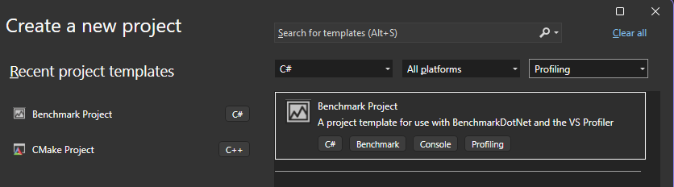

# Analyze BenchmarkDotNet data in Visual Studio

You can use the profiling tools to collect and view [BenchmarkDotNet](https://benchmarkdotnet.org/articles/overview.html) data in Visual Studio.

When you add a BenchmarkDotNet diagnoser to your benchmark classes as an attribute, a *.diagsession* file is generated after the benchmark runs. You can then open the *.diagsession* in Visual Studio and view profiling data for the benchmarks. 

The following diagnosers are supported:

- CPUUsageDiagnoser
- DatabaseDiagnoser
- DotNetCountersDiagnoser
- EventsDiagnoser
- FileIODiagnoser

Each diagnoser generates performance data related to that diagnoser. For example, the CPUUsageDiagnoser generates a *.diagsession* file with CPU data in it, and the DatabaseDiagnoser generates a *.diagsession* file with data on database operations. Limitations correspond to the associated profiling tool. For example, the profiler's Database tool works on [ADO.NET](/dotnet/framework/data/adonet/ado-net-overview) or [Entity Framework Core](/ef/core/).

## Prerequisites

- Visual Studio 2022 version 17.9 or later

- Your benchmark project must include the following two NuGet packages:

  - [BenchmarkDotNET](https://www.nuget.org/packages/BenchmarkDotNet/)
  - [Microsoft.VisualStudio.DiagnosticsHub.BenchmarkDotNetDiagnosers](https://www.nuget.org/packages/Microsoft.VisualStudio.DiagnosticsHub.BenchmarkDotNetDiagnosers)

  ::: moniker range=">=visualstudio"
  If you use the Benchmark project template, these NuGet packages are present when you create the project.
  ::: moniker-end

## Create your project

::: moniker range=">=visualstudio"
The benchmark functions must be added to a .NET console application. These functions can be wrapper functions that reference other project types.

You can either create a console project and add BenchmarkDotNet support manually, or use the **Benchmark Project** template. Some of the steps described in this article are required only when you manually add BenchmarkDotNet support.

The **Benchmark Project** template generates a fully integrated BenchmarkDotNet project with built-in support for CPU Usage profiling and Copilot insights. To use the template, select **Profiling** from the project types list when you create a new project, and then choose **Benchmark Project**.

 
::: moniker-end
::: moniker range="vs-2022"
Create a console project.

The benchmark functions must be added to a .NET console application. These functions can be wrapper functions that reference other project types. 
::: moniker-end

## Collect Benchmark.NET data

1. Set your build to a Release build instead of a Debug build.

1. Attribute your code for diagnosers and benchmarks, and include code to run the benchmarks (`BenchmarkRunner.Run`).

   Add the diagnoser name as an attribute to the class that contains the benchmarks for which you want to generate data.

   For example, you can use the following code for the CPUUsageDiagnoser.

   ::: moniker range=">=visualstudio"
   If you're using the **Benchmark Project** template, sample code is already provided in the template. If you're manually adding BenchmarkDotNet support, you can use the following example code.
   ::: moniker-end

    ```csharp
    using System;
    using System.Security.Cryptography;
    using BenchmarkDotNet.Attributes;
    using BenchmarkDotNet.Running;
    using Microsoft.VSDiagnostics;
    
    namespace MyBenchmarks
    {
        [CPUUsageDiagnoser]
        public class Md5VsSha256
        {
            private const int N = 10000;
            private readonly byte[] data;
    
            private readonly SHA256 sha256 = SHA256.Create();
            private readonly MD5 md5 = MD5.Create();
    
            public Md5VsSha256()
            {
                data = new byte[N];
                new Random(42).NextBytes(data);
            }
    
            [Benchmark]
            public byte[] Sha256() => sha256.ComputeHash(data);
    
            [Benchmark]
            public byte[] Md5() => md5.ComputeHash(data);
        }
    
        public class Program
        {
            public static void Main(string[] args)
            {
                var summary = BenchmarkRunner.Run(typeof(Program).Assembly);
            }
        }
    }
    ```
   
1. Run the application to generate the *.diagsession* file.

   Check the console output to get the location of the file. For example:  

   ```cmd
   // * Diagnostic Output - VSDiagnosticsDiagnoser * 
   Collection result moved to 'BenchmarkDotNet_Md5VsSha256_20231218_123326.diagsession'.
   Session : {7f38bcc2-c692-4266-aa24-b12bc5325ea4}
     Stopped
   Exported diagsession file: *.diagsession
   ```
   
## View BenchmarkDotNet data

1. In Visual Studio, select **File > Open > File** and navigate to the location of the *.diagsession* file, and then select and open the file.

1. Select the **Benchmarks** tab to view data for the BenchmarkDotNet benchmarks.

   

   For more information about the results in the **Benchmarks** tab, see [BenchmarkDotNet](https://benchmarkdotnet.org/articles/overview.html) documentation.

1. Right-click a row in the results and choose **Select time range** to sync the timeline graph with the benchmark.

1. Select one of the available tabs such as **CPU Usage** or **Allocations**.

   Depending on the diagnoser you used to collect data, you can gain insights related to memory allocation, CPU usage, counters, and other performance data. To analyze memory allocations, use the built-in [MemoryDiagnoser](https://benchmarkdotnet.org/articles/overview.html#diagnostics) by adding the \[MemoryDiagnoser\] attribute. For more information, see [Diagnosers](https://benchmarkdotnet.org/articles/configs/diagnosers.html).

   > [!NOTE]
   > The profiler supports only the \[MemoryDiagnoser\] and the diagnosers listed previously in this article.

   For an example of using the profiler to analyze memory allocations, see the blog post [Benchmarking with Visual Studio Profiler](https://devblogs.microsoft.com/visualstudio/benchmarking-with-visual-studio-profiler/).

   To analyze data related to other tabs such as **CPU Usage**, see the corresponding articles in the profiling documentation.

## Related content

- [First look at profiling](../profiling/choose-performance-tool.md)
- [Which tool should I use?](../profiling/choose-performance-tool.md)
