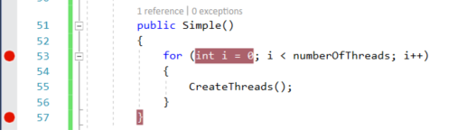
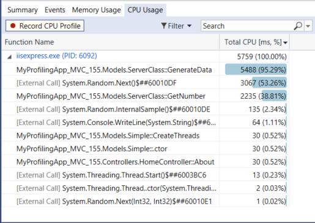
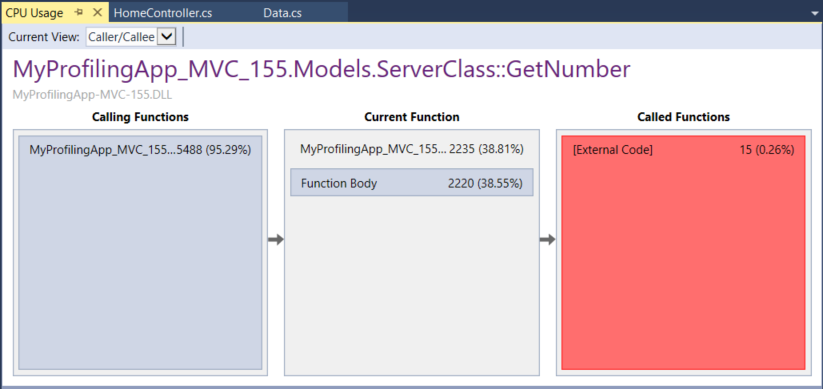

# Quickstart: Analyze CPU usage data in Visual Studio (ASP.NET Core)

Visual Studio provides many powerful features to help you analyze performance issues in your application. This topic provides a quick way to learn some of the basic features. Here, we look at a tool to identify performance bottlenecks due to high CPU usage. The Diagnostics Tools are supported for .NET development in Visual Studio, including ASP.NET, and for native/C++ development.

The Diagnostic hub offers you a lot of other options to run and manage your diagnostics session. If the **CPU Usage** tool described here does not give you the data that you need, the [other profiling tools](../profiling/profiling-feature-tour.md) provide different kinds of information that might be helpful to you. In many cases, the performance bottleneck of your application may be caused by something other than your CPU, such as memory, rendering UI, or network request time. [PerfTips](../profiling/perftips.md), another debugger-integrated profiling tool, also allows you to step through code and identify how long it takes particular functions or code blocks to complete.

Windows 8 and later is required to run profiling tools with the debugger (**Diagnostic Tools** window). On Windows 7 and later, you can use the post-mortem tool, the [Performance Profiler](../profiling/profiling-feature-tour.md).

## Create a project

1. Open Visual Studio and create the project.

   ::: moniker range="vs-2017"
   From the top menu bar, choose **File** > **New** > **Project**.

   In the **New Project** dialog box in the left pane, expand **Visual C#**, and then choose **Web**. In the middle pane, choose **ASP.NET Web Application (.NET Core)**. Then name the project *MyProfilingApp_MVC*.

   > [!NOTE]
   > If you don't see the **ASP.NET Web Application (.NET Core)** project template, choose the **Open Visual Studio Installer** link in the left pane of the **New Project** dialog box. The Visual Studio Installer launches. Choose the **ASP.NET and web development** workload, and then choose **Modify**.

   In the dialog box that appears, choose **MVC** in the middle pane, and then click **OK**.
   ::: moniker-end
   ::: moniker range=">=vs-2019"
   In Visual Studio 2019, choose **Create a new project** in the start window. If the start window is not open, choose **File** > **Start Window**, and then choose **Create a new project**.

   Type **web app** in the search box, choose **C#** as the language, choose **ASP.NET Core Web Application (Model-View-Controller)**, and then choose **Next**. On the next screen, name the project *MyProfilingApp_MVC*, and then choose **Next**.

   Choose either the recommended target framework or .NET 6, and then choose **Create**.

   > [!NOTE]
   > If you do not see the **ASP.NET Web Application (.NET Core)** template, you can install it from the **Create a new project** window. In the **Not finding what you're looking for?** message, choose the **Install more tools and features** link. Then, in the Visual Studio Installer, choose the **ASP.NET and web development** workload.
   ::: moniker-end

   Visual Studio creates and opens your new project.

1. In Solution Explorer, right-click the Models folder and choose **Add** > **Class**.

1. Name the new class `Data.cs` and choose **Add**.

1. In Solution Explorer, open `Models/Data.cs` and add the following `using` statement to the top of the file:

    ```csharp
    using System.Threading;
    ```

1. In Data.cs, replace the following code:

    ```csharp
    public class Data
    {
    }
    ```

    with this code:

    ```csharp
    public class ServerClass
    {
        const int MIN_ITERATIONS = int.MaxValue / 1000;
        const int MAX_ITERATIONS = MIN_ITERATIONS + 10000;

        long m_totalIterations = 0;
        readonly object m_totalItersLock = new object();
        // The method that will be called when the thread is started.
        public void GenerateData()
        {
            Console.WriteLine(
                "ServerClass.InstanceMethod is running on another thread.");

            var x = GetNumber();
        }

        private int GetNumber()
        {
            var rand = new Random();
            var iters = rand.Next(MIN_ITERATIONS, MAX_ITERATIONS);
            var result = 0;
            lock (m_totalItersLock)
            {
                m_totalIterations += iters;
            }
            // we're just spinning here
            // and using Random to frustrate compiler optimizations
            for (var i = 0; i < iters; i++)
            {
                result = rand.Next();
            }
            return result;
        }
    }

    public class Simple
    {
        int numberOfThreads = 200;

        public Simple()
        {
            for (int i = 0; i < numberOfThreads; i++)
            {
                CreateThreads();
            }
        }
        public static void CreateThreads()
        {
            ServerClass serverObject = new ServerClass();

            Thread InstanceCaller = new Thread(new ThreadStart(serverObject.GenerateData));
            // Start the thread.
            InstanceCaller.Start();

            Console.WriteLine("The Main() thread calls this after "
                + "starting the new InstanceCaller thread.");

        }

        public int GetData()
        {
            // Not returning any meaningful data.
            return numberOfThreads;
        }
    }
    ```

1. In Solution Explorer, open *Controller/HomeControllers.cs*, and replace the following code:

   ::: moniker range="vs-2017"

    ```csharp
    public ActionResult About()
    {
        ViewBag.Message = "Your application description page.";

        return View();
    }
    ```

    with this code:

    ```csharp
    public ActionResult About()
    {
        Models.Simple s = new Models.Simple();

        ViewBag.Message = "Your application description page.";

        return View(s.GetData());
    }
    ```

    ::: moniker-end
    ::: moniker range=">=vs-2019"

    ```csharp
    public IActionResult Privacy()
    {
        return View();
    }
    ```

    with this code:

    ```csharp
    public IActionResult Privacy()
    {
        Models.Simple s = new Models.Simple();

        return View(s.GetData());
    }
    ```

    ::: moniker-end


## Step 1: Collect profiling data

1. First, set a breakpoint in your app on this line of code in the `Simple` constructor:

    `for (int i = 0; i < 200; i++)`

    Set a breakpoint by clicking in the gutter to the left of the line of code.

1. Next, set a second breakpoint on the closing brace at the end of the `Simple` constructor:

     

    By setting two breakpoints, you can limit data collection to the parts of code that you want to analyze.

1. The **Diagnostic Tools** window is already visible unless you have turned it off. To bring up the window again, click **Debug** > **Windows** > **Show Diagnostic Tools**.

1. Click **Debug** > **Start Debugging** (or **Start** on the toolbar, or **F5**).

1. When the app finishes loading, click the appropriate link at the top of the web page to start running the new code.

   ::: moniker range="vs-2017"
   In Visual Studio 2017, click the **About** link to run the code.
   ::: moniker-end
   ::: moniker range=">=vs-2019"
   In Visual Studio 2019, click the **Privacy** link to run the code.
   ::: moniker-end

1. Look at the **Summary** view of the Diagnostics Tools appears.

1. While the debugger is paused, enable the collection of the CPU Usage data by choosing **Record CPU Profile**, and then open the **CPU Usage** tab.

     

     When data collection is enabled, the record button displays a red circle.

     When you choose **Record CPU Profile**, Visual Studio will begin recording your functions and how much time they take to execute, and also provides a timeline graph you can use to focus on specific segments of the sampling session.You can only view this collected data when your application is halted at a breakpoint.

6. Hit F5 to run the app to your second breakpoint.

     Now, you now have performance data for your application specifically for the region of code that runs between the two breakpoints.

     The profiler begins preparing thread data. Wait for it to finish.

     The CPU Usage tool displays the report in the **CPU Usage** tab.

     At this point, you can begin to analyze the data.

## Step 2: Analyze CPU usage data

We recommend that you begin analyzing your data by examining the list of functions under CPU Usage, identifying the functions that are doing the most work, and then taking a closer look at each one.

1. In the function list, examine the functions that are doing the most work.

     

    > [!TIP]
    > Functions are listed in order starting with those doing the most work (they're not in call order). This helps you quickly identify the longest running functions.

2. In the function list, double-click the `MyProfilingApp_MVC.Models.ServerClass::GetNumber` function.

    When you double-click the function, the **Caller/Callee** view opens in the left pane.

    

    In this view, the selected function shows up in the heading and in the **Current Function** box (`ServerClass::GetNumber`, in this example). The function that called the current function is shown on the left under **Calling Function**, and any functions called by the current function are shown in **Called Functions** box on the right. (You can select either box to change the current function.)

    This view shows you the total time (ms) and the percentage of the overall app running time that the function has taken to complete.

    **Function Body** also shows you the total amount of time (and the percentage of time) spent in the function body excluding time spent in calling and called functions. (In this illustration, 2220 out of 2235 ms were spent in the function body, and the remaining time (<20 ms) was spent in external code called by this function). Actual values will be different depending on your environment.

    > [!TIP]
    > High values in **Function Body** may indicate a performance bottleneck within the function itself.

## Next steps

- [Analyze memory usage](../profiling/memory-usage.md)to identify performance bottlenecks.
- [Analyze CPU usage](../profiling/cpu-usage.md) for more in-depth information on the CPU usage tool.
- Analyze CPU usage without a debugger attached or by targeting a running app - for more information see [Collect profiling data without debugging](../profiling/running-profiling-tools-with-or-without-the-debugger.md#collect-profiling-data-without-debugging) in [Run profiling tools with or without the debugger](../profiling/running-profiling-tools-with-or-without-the-debugger.md).

## See also

- [Profiling in Visual Studio](../profiling/index.yml)
- [First look at profiling tools](../profiling/profiling-feature-tour.md)
