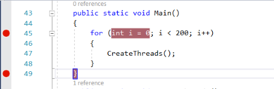
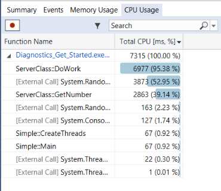
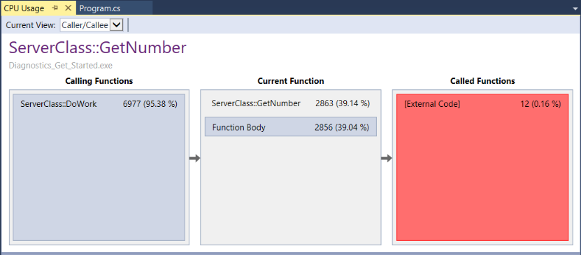

# Quickstart: Analyze CPU usage data in Visual Studio (C#, Visual Basic)

The Visual Studio provides many powerful features to help you analyze performance issues in your application. This topic provides a quick way to learn some of the basic features. Here, we look at the tool to identify performance bottlenecks due to high CPU usage. The Diagnostics Tools are supported for .NET development in Visual Studio, including ASP.NET, and for native/C++ development.

The Diagnostic hub offers you a lot of other options to run and manage your diagnostics session. If the **CPU Usage** tool described here does not give you the data that you need, the [other profiling tools](../profiling/profiling-feature-tour.md) provide different kinds of information that might be helpful to you. In many cases, the performance bottleneck of your application may be caused by something other than your CPU, such as memory, rendering UI, or network request time. The Diagnostics hub offers you a lot of other options to record and analyze this kind of data.

Windows 8 and later is required to run profiling tools with the debugger (**Diagnostic Tools** window). On Windows 7 and later, you can use the post-mortem tool, the [Performance Profiler](../profiling/profiling-feature-tour.md).

## Create a project

1. In Visual Studio, choose **File** > **New Project**.

2. Under **Visual C#** or **Visual Basic**, choose **Windows Desktop**, and then in the middle pane choose **Console App (.NET Framework)**.

    If you don't see the **Console App** project template, click the **Open Visual Studio Installer** link in the left pane of the **New Project** dialog box. The Visual Studio Installer launches. Choose the **.NET Desktop development** workload, then choose **Modify**.

3. Type a name like **MyProfilerApp** and click **OK**.

    Visual Studio creates the project.

2. Open *Program.cs* and replace all the code with the following code:

    ```csharp
    using System;
    using System.Threading;
    public class ServerClass
    {
        const int MIN_ITERATIONS = int.MaxValue / 1000;
        const int MAX_ITERATIONS = MIN_ITERATIONS + 10000;

        long m_totalIterations = 0;
        readonly object m_totalItersLock = new object();
        // The method that will be called when the thread is started.
        public void DoWork()
        {
            Console.WriteLine(
                "ServerClass.InstanceMethod is running on another thread.");

            var x = GetNumber();
        }

        private int GetNumber()
        {
            var rand = new Random();
            var iters = rand.Next(MIN_ITERATIONS, MAX_ITERATIONS);
            var result = 0;
            lock (m_totalItersLock)
            {
                m_totalIterations += iters;
            }
            // we're just spinning here
            // and using Random to frustrate compiler optimizations
            for (var i = 0; i < iters; i++)
            {
                result = rand.Next();
            }
            return result;
        }
    }

    public class Simple
    {
        public static void Main()
        {
            for (int i = 0; i < 200; i++)
            {
                CreateThreads();
            }
        }
        public static void CreateThreads()
        {
            ServerClass serverObject = new ServerClass();

            Thread InstanceCaller = new Thread(new ThreadStart(serverObject.DoWork));
            // Start the thread.
            InstanceCaller.Start();

            Console.WriteLine("The Main() thread calls this after "
                + "starting the new InstanceCaller thread.");

        }
    }
    ```

    ```vb
    Imports System
    Imports System.Threading

    Namespace MyProfilerApp
        Public Class ServerClass
            Const MIN_ITERATIONS As Integer = Integer.MaxValue / 1000
            Const MAX_ITERATIONS As Integer = MIN_ITERATIONS + 10000

            Private m_totalIterations As Long = 0
            ReadOnly m_totalItersLock As New Object()
            ' The method that will be called when the thread is started.
            Public Sub DoWork()
                Console.WriteLine("ServerClass.InstanceMethod is running on another thread.")

                Dim x = GetNumber()
            End Sub

            Private Function GetNumber() As Integer
                Dim rand = New Random()
                Dim iters = rand.[Next](MIN_ITERATIONS, MAX_ITERATIONS)
                Dim result = 0
                SyncLock m_totalItersLock
                    m_totalIterations += iters
                End SyncLock
                ' we're just spinning here
                ' and using Random to frustrate compiler optimizations
                For i As Integer = 0 To iters - 1
                    result = rand.[Next]()
                Next
                Return result
            End Function
        End Class

        Public Class Simple
            Public Shared Sub Main()
                For i As Integer = 0 To 199
                    CreateThreads()
                Next
            End Sub
            Public Shared Sub CreateThreads()
                Dim serverObject As New ServerClass()

                Dim InstanceCaller As New Thread(New ThreadStart(AddressOf serverObject.DoWork))
                ' Start the thread.
                InstanceCaller.Start()

                Console.WriteLine("The Main() thread calls this after " + "starting the new InstanceCaller thread.")

            End Sub
        End Class
    End Namespace
    ```

    > [!NOTE]
    > In Visual Basic, make sure the startup object is set to `Sub Main` (**Properties** > **Application** > **Startup Object**).

## Step 1: Collect profiling data

1. First, set a breakpoint in your app on this line of code in the `Main` function:

    `for (int i = 0; i < 200; i++)`

    or, for Visual Basic:

    `For i As Integer = 0 To 199`

    Set a breakpoint by clicking in the gutter to the left of the line of code.

2. Next, set a second breakpoint on the closing brace at the end of the `Main` function:

     

    > [!TIP]
    > By setting two breakpoints, you can limit data collection to the parts of code that you want to analyze.

3. The **Diagnostic Tools** window is already visible unless you have turned it off. To bring up the window again, click **Debug** > **Windows** > **Show Diagnostic Tools**.

4. Click **Debug** > **Start Debugging** (or **Start** on the toolbar, or **F5**).

     When the app finishes loading, the **Summary** view of the Diagnostics Tools appears.

5. While the debugger is paused, enable the collection of the CPU Usage data by choosing **Record CPU Profile**, and then open the **CPU Usage** tab.

     

     When data collection is enabled, the record button displays a red circle.

     When you choose **Record CPU Profile**, Visual Studio will begin recording your functions and how much time they take to execute, and also provides a timeline graph you can use to focus on specific segments of the sampling session.You can only view this collected data when your application is halted at a breakpoint.

6. Press **F5** to run the app to your second breakpoint.

     Now, you now have performance data for your application specifically for the region of code that runs between the two breakpoints.

     The profiler begins preparing thread data. Wait for it to finish.

     The CPU Usage tool displays the report in the **CPU Usage** tab.

     At this point, you can begin to analyze the data.

## Step 2: Analyze CPU usage data

We recommend that you begin analyzing your data by examining the list of functions under CPU Usage, identifying the functions that are doing the most work, and then taking a closer look at each one.

1. In the function list, examine the functions that are doing the most work.

     

    > [!TIP]
    > Functions are listed in order starting with those doing the most work (they're not in call order). This helps you quickly identify the longest running functions.

2. In the function list, double-click the `ServerClass::GetNumber` function.

    When you double-click the function, the **Caller/Callee** view opens in the left pane.

    

    In this view, the selected function shows up in the heading and in the **Current Function** box (`GetNumber`, in this example). The function that called the current function is shown on the left under **Calling Function**, and any functions called by the current function are shown in **Called Functions** box on the right. (You can select either box to change the current function.)

    This view shows you the total time (ms) and the percentage of the overall app running time that the function has taken to complete.

    **Function Body** also shows you the total amount of time (and the percentage of time) spent in the function body excluding time spent in calling and called functions. (In this illustration, 2856 out of 2863 ms were spent in the function body, and the remaining time (<20 ms) was spent in external code called by this function). Actual values will be different depending on your environment.

    > [!TIP]
    > High values in **Function Body** may indicate a performance bottleneck within the function itself.

## Next steps

- [Analyze memory usage](../profiling/memory-usage.md)to identify performance bottlenecks.
- [Analyze CPU usage](../profiling/cpu-usage.md) for more in-depth information on the CPU usage tool.
- Analyze CPU usage without a debugger attached or by targeting a running app - for more information see [Collect profiling data without debugging](../profiling/running-profiling-tools-with-or-without-the-debugger.md#collect-profiling-data-without-debugging) in [Run profiling tools with or without the debugger](../profiling/running-profiling-tools-with-or-without-the-debugger.md).

## See also

- [Profiling in Visual Studio](../profiling/index.yml)
- [First look at profiling tools](../profiling/profiling-feature-tour.md)
