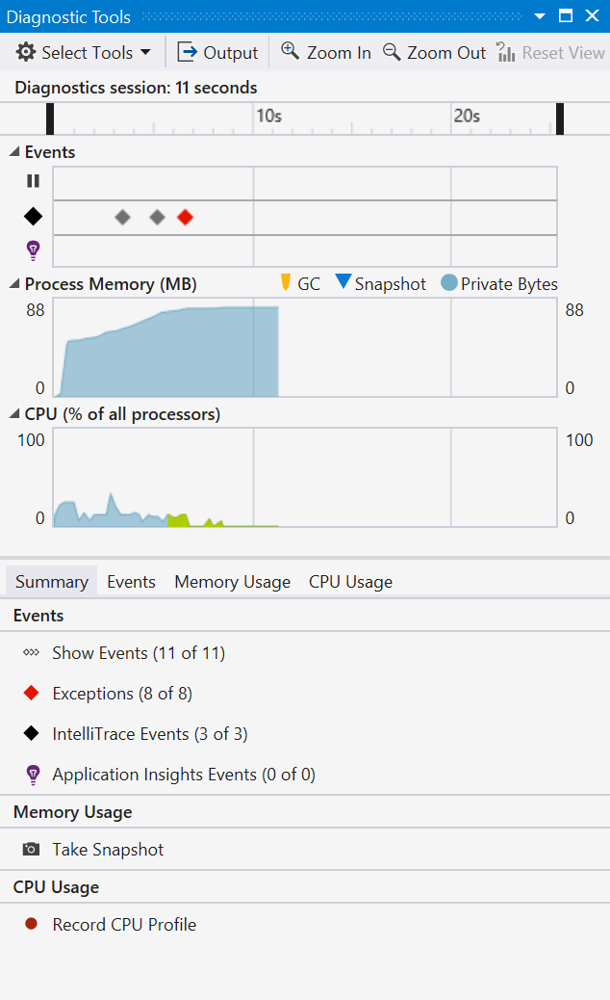
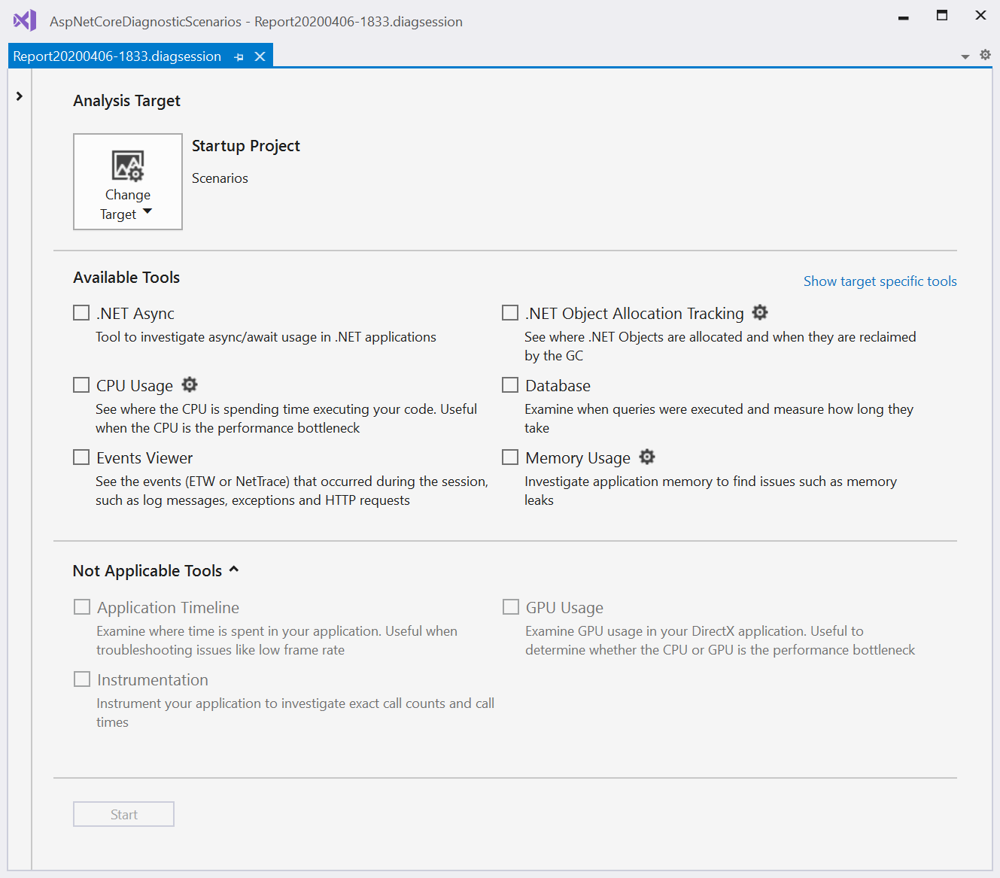
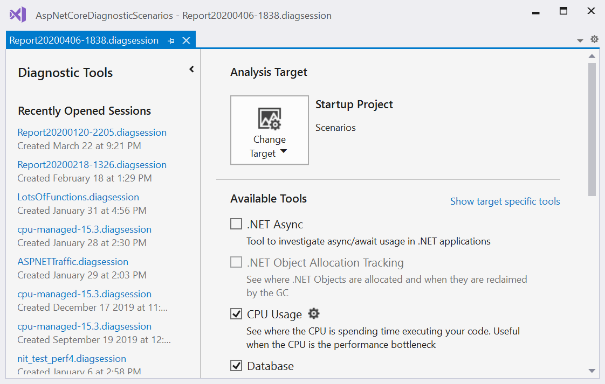

# Run profiling tools with or without the debugger

Visual Studio offers a choice of performance measurement and profiling tools. Some tools, like CPU Usage and Memory Usage, can run with or without the debugger, and on release or debug build configurations. Tools that appear in the [Diagnostics Tools window](../profiling/profiling-feature-tour.md#measure-performance-while-debugging) run only during a debugging session. Tools that appear in the [Performance Profiler](../profiling/profiling-feature-tour.md#post_mortem) run without the debugger and you analyze the results after you choose to stop and collect data (for post-mortem analysis).

>[!NOTE]
>You can use the non-debugger performance tools with Windows 7 and later. Windows 8 or later is required to run the debugger-integrated profiling tools.

The non-debugger Performance Profiler and the debugger-integrated Diagnostic Tools provide different information and experiences. Debugger-integrated tools show you variable values and let you use breakpoints. Non-debugger tools give you results closer to the end-user experience.

To help decide which tools and results to use, consider the following:

- Debugger-integrated tool vs. non-debugger tool
  - External performance problems, like file I/O or network responsiveness issues, won't look much different in the debugger or non-debugger tools.
  - The debugger itself changes performance times, as it does necessary debugger operations like intercepting exception and module load events.
  - Release build performance numbers in the Performance Profiler are the most precise and accurate. Debugger-integrated tool results are most useful to compare with other debugging-related measurements, or to use debugger features.
  - Some tools, such as the .NET Object Allocation tool, are only available for non-debugger scenarios.
- Debug vs. release build
  - For problems caused by CPU-intensive calls, there might be considerable performance differences between release and debug builds. Check to see whether the issue exists in release builds.
  - If the problem occurs only during debug builds, you probably don't need to run the non-debugger tools. For release build problems, decide whether features provided by the debugger-integrated tools will help to pinpoint the problem.
  - Release builds provide optimizations like inlining function calls and constants, pruning unused code paths, and storing variables in ways that can't be used by the debugger. Performance numbers in the debug builds are less accurate, because debug builds lack these optimizations.

##  Collect profiling data while debugging

When you start debugging in Visual Studio by selecting **Debug** > **Start Debugging**, or pressing **F5**, the **Diagnostic Tools** window appears by default. To open it manually, select **Debug** > **Windows** > **Show Diagnostic Tools**. The **Diagnostic Tools** window shows information about events, process memory, and CPU usage.

- Use the **Settings** icon in the toolbar to select whether to view **Memory Usage**, **UI Analysis**, and **CPU Usage**.

- Select **Settings** in the **Settings** drop-down list to open the **Diagnostic Tools Property Pages** with more options.

- If you're running Visual Studio Enterprise, you can enable or disable IntelliTrace by going to **Tools** > **Options** > **IntelliTrace**.

The diagnostic session ends when you stop debugging.

For more information, see:

- [Measure application performance by analyzing CPU usage](../profiling/beginners-guide-to-performance-profiling.md)
- [Measure memory usage in Visual Studio](../profiling/memory-usage.md)

### The Events tab

During a debugging session, the Events tab of the Diagnostic Tools window lists the diagnostic events that occur. The category prefixes *Breakpoint*, *File*, and others, let you quickly scan the list for a category, or skip the categories you don't care about.

Use the **Filter** drop-down list to filter events in and out of view, by selecting or clearing specific categories of events.

Use the search box to find a specific string in the event list. Here are the results of a search for the string *name* that matched four events:

For more information, see [Searching and filtering the Events tab of the Diagnostic Tools window](https://devblogs.microsoft.com/devops/searching-and-filtering-the-events-tab-of-the-diagnostic-tools-window/).

## Collect profiling data without debugging

To collect performance data without debugging, you can run the Performance Profiler tools.

1. With a project open in Visual Studio, set the solution configuration to **Release**, and select **Local Windows Debugger** (or **Local Machine**) as the deployment target.

1. Select **Debug** > **Performance Profiler**, or press **Alt**+**F2**.

1. On the diagnostic tools launch page, select one or more tools to run. Only the tools that are applicable to the project type, operating system, and programming language are shown. Select **Show all tools** to also see tools that are disabled for this diagnostic session.

   

1. To start the diagnostic session, select **Start**.

   While the session is running, some tools show graphs of real-time data on the diagnostic tools page, as well as controls to pause and resume data collection.

    

1. To end the diagnostic session, select **Stop Collection**.

   The analyzed data appears on the **Report** page.

You can save the reports, and open them from the **Recently Opened Sessions** list on the Diagnostic Tools launch page.

For more information, see:

- [Analyze CPU usage](../profiling/cpu-usage.md)
- [Analyze memory usage for .NET code](../profiling/dotnet-alloc-tool.md)
- [Analyze memory usage](../profiling/memory-usage-without-debugging2.md)
- [Analyze performance of .NET asynchronous code](../profiling/analyze-async.md)
- [Analyze database performance](../profiling/analyze-database.md)
- [Analyze GPU usage](../profiling/gpu-usage.md)

## Collect profiling data from the command line

To measure performance data from the command line, you can use VSDiagnostics.exe, which is included with either Visual Studio or the Remote Tools. This is useful for capturing performance traces on systems where Visual Studio isn't installed, or for scripting the collection of performance traces. For detailed instructions, see [Measure application performance from the command line](../profiling/profile-apps-from-command-line.md).