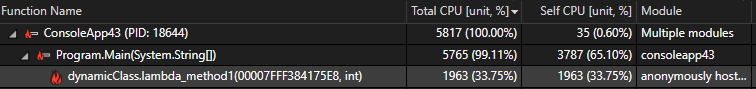

# Understanding the call tree

The profiling tools for CPU Usage and Instrumentation in Visual Studio include a call tree view that provides a visualization of the call paths in your application, along with performance data.

Sometimes, the call paths that appear in the **Call Tree** view may look different than you expect. To interpret the data you see in the call tree, it helps to understand the common reasons for these differences when they occur.

Here are the most common reasons:

- Release build optimizations. Release builds perform many optimizations such as inline function calls. Inline functions don't appear in the call tree. In some cases, release build optimizations may also generate unexpected code that appears in the call tree.

- Asynchronous functions. Asynchronous functions execute on their own thread independent of the call path, and they normally appear in a separate node.

  ::: moniker range=">=vs-2022"
  For Instrumentation, you can [configure options to view .NET async calls](../profiling/instrumentation.md#async-calls-in-the-instrumentation-call-tree-net) in a more intuitive way, within the call path where the async call was made.
  ::: moniker-end

- Sampling collection process. For sampling (CPU Usage only), functions that execute very quickly may not get sampled, in which case these functions don't appear in the call tree.

- Compiler generated code. Some operations generate code that isn’t immediately obvious. For example, async/await patterns generate state machines. Other examples include getters/setters, pattern matching, event handlers, query syntax for LINQ, source generators (for example, creation of source generators for json serialization), and other scenarios.  In these cases, some generated code may appear in the call tree.

- Dynamically generated code. Unlike compiler-generated code, dynamically-generated code is compiled on the fly. This is not as common as compiler-generated code. The following code using an expression tree will show the 

  

  The **Call Tree** view shows that this work is happening in a generated method with a generated name, which might be unexpected.

  

- Code that defers execution. For code that defers execution, such as LINQ, the call path can appear in unexpected ways if you're unfamiliar with how LINQ works. For example, if you use the following code:

  ```csharp
  // LINQ query to get all items less than 1,000,000
  var query = list.Where(number => number < 1_000_000);
  var count = query.Count();
  ```
  
  You may expect the call tree to show a lot of time spent in the Where statement, but the enumeration actually happens in Count, so Count may show up as a slower function in the call tree. The following example is the opposite:

  ```csharp
  // LINQ query to get all items less than 1,000,000
  var query = list.Where(number => number < 1_000_000).ToList();
  var count = query.Count();
  ```

  In this example, ToList forces the enumeration before Count, so the Count call is optimized and runs very fast. Instead, the Where statement takes most of the time.

