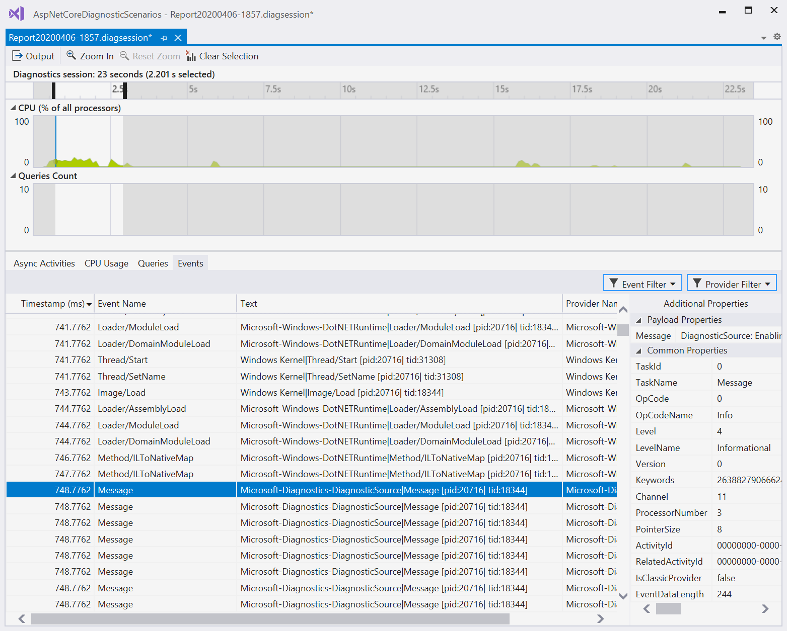

# Using multiple profiler tools simultaneously

The Performance Profiler was designed with the idea that multiple tools can be used in the same session to aid in understanding performance issues. Most tools in the Performance Profiler support running concurrently such as the [CPU Usage](../profiling/cpu-usage.md), [.NET Async Tool](../profiling/analyze-async.md), and [Database](../profiling/analyze-database.md) tool. To run tools simultaneously in the same diagnostic session simply click the check box next to them and then start the diagnostic session.

>[!NOTE]
>Certain tools such as the [.NET Object Allocation](../profiling/dotnet-alloc-tool.md) tool cannot be run with other tools due to the high overhead that they have or due to other technical limitations.

During analysis time filtering operations are applied across tools, thus you can use information in one tool to narrow down a time range and filter data in another tool. This helps guide analysis to specific points in a trace and understand the state of the application.

## See also

- [Optimizing profiler settings](../profiling/optimizing-profiler-settings.md)
- [Running profiling tools with or without the debugger](../profiling/running-profiling-tools-with-or-without-the-debugger.md)
- [Understanding performance collection methods](../profiling/understanding-performance-collection-methods.md)

