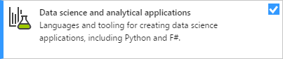
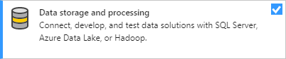
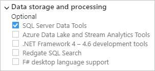

# Install data science support in Visual Studio

 [!INCLUDE [Visual Studio](~/includes/applies-to-version/vs-windows-only.md)]

The Data Science and Analytical Applications workload, which you select and install through the Visual Studio installer, brings together several languages and their respective runtime distributions:

::: moniker range="vs-2019"
- [Python](../python/overview-of-python-tools-for-visual-studio.md)
- [F# with the .NET Framework](/dotnet/fsharp/)
::: moniker-end

Python is a primary scripting language used for data science. Python is easy to learn and is supported by a rich ecosystem of packages. Those packages address a wide range of scenarios such as data acquisition, cleaning, model training, deployment, and plotting. F# is also a powerful functional-first .NET language that's suited for a wide variety of data processing tasks.)

<!--Note link on the image because this one is large -->

## Workload options

By default, the workload installs the following options, which you can modify in the summary section for the workload in the Visual Studio installer:

- F# desktop language support
- Python:
  - Python language support
  - Python web support
  - Python native development tools

## SQL Server integration

SQL Server supports using Python to do advanced analytics directly inside SQL Server. Python support is available in SQL Server 2017 CTP 2.0 and later.

You enjoy the following advantages by running your code where your data already lives:

- **Elimination of data movement**: Instead of moving data from the database to your application or model, you can build applications in the database. This capability eliminates barriers of security, compliance, governance, integrity, and a host of similar issues related to moving vast amounts of data around. You can also consume datasets that couldn't fit into the memory of a client machine.

- **Easy deployment**: Once you have a model ready, deploying it to production is a simple matter of embedding it in a T-SQL script. Any SQL client application written in any language can then take advantage of the models and intelligence through a stored procedure call. No specific language integrations are necessary.

- **Enterprise-grade performance and scale**: You can use SQL Server’s advanced capabilities like in-memory table and column store indexes with the high-performance scalable APIs in the RevoScale packages. The elimination of data movement also means that you avoid client memory constraints as your data grows or you wish to increase the performance of the application.

- **Rich extensibility**: You can install and run any of the latest open source packages in SQL Server to build deep learning and AI applications on huge amounts of data in SQL Server. Installing a package in SQL Server is as simple as installing a package on your local machine.

- **Wide availability at no additional cost**: Language integrations are available in all editions of SQL Server 2017 and later, including the Express edition.

To take full advantage of SQL Server integration, use the Visual Studio installer to install the **Data storage and processing** workload with the **SQL Server Data Tools** option. The latter option enables SQL IntelliSense, syntax highlighting, and deployment.

 &nbsp;&nbsp;&nbsp;&nbsp; 

For more information:

- [Python in SQL Server 2017: enhanced in-database machine learning (blog)](https://blogs.technet.microsoft.com/dataplatforminsider/2017/04/19/python-in-sql-server-2017-enhanced-in-database-machine-learning/)

## Additional services and SDKs

In addition to what's in the Data Science and Analytics Applications workload directly, the Azure Notebooks service and the Azure SDK for Python are also helpful for data science.

The Azure SDK for Python makes it easy to consume and manage Microsoft Azure services from applications running on Windows, Mac, and Linux. For more information, see [Azure SDK for Python](/azure/python/).

Azure Notebooks (currently in preview) provides free online access to Jupyter notebooks running in the cloud on Microsoft Azure. The service includes sample notebooks in Python, R, and F# to get you started. Visit [notebooks.azure.com](https://notebooks.azure.com/).

<!--Note link on the image because this one is large -->

