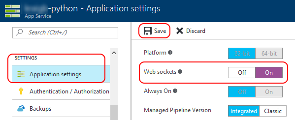
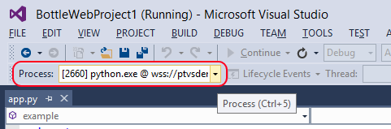
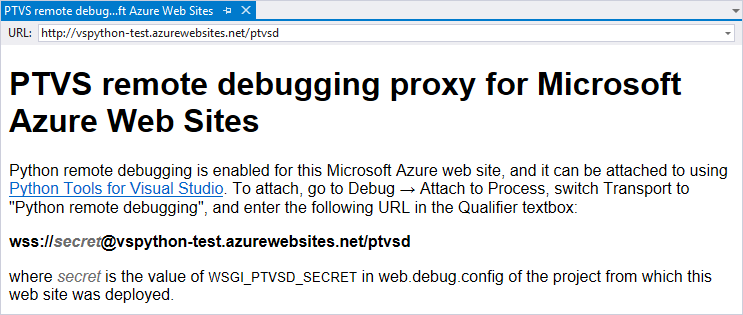
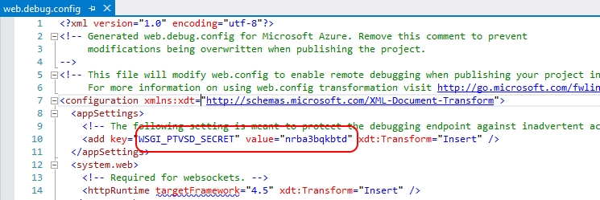
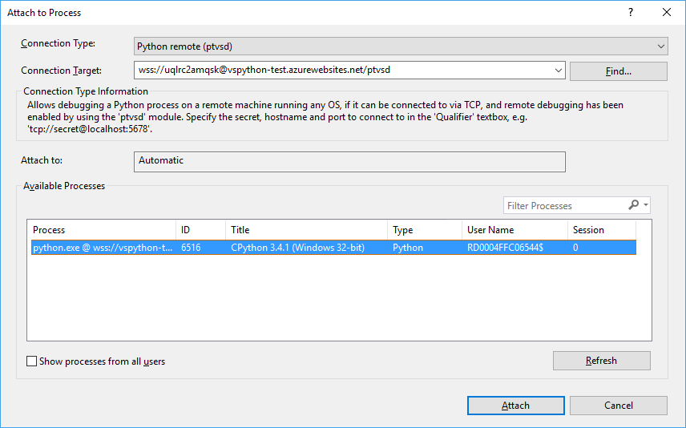

# Remotely debugging Python code on Azure

[Python support in Visual Studio](installing-python-support-in-visual-studio.md) includes the ability to remotely debugging Python code that's running on Azure App Service. Unlike simple remote debugging, the target computer in this scenario is not directly accessible over TCP, so Visual Studio provides a proxy that exposes the debugger protocol over HTTP. Projects created using the Web template automatically configure this proxy in the generated `web.debug.config` file. Remote debugging is also enabled when you publish a Debug configuration of your project as described on [Publishing to Azure App Service](template-web.md#publishing-to-azure-app-service).

Because Azure remote debugging uses web sockets, sockets must be enabled for your App Service through the [Azure portal](https://portal.azure.com) by going to **Settings > Application settings** and turning **General settings > Web sockets** to **On**, then selecting **Save** to apply the change. (Note that the **Debugging** settings do not apply to debugging Python.)

Once your project is properly deployed and web sockets enabled, you can attach to the App Service from **Server Explorer** in Visual Studio (**View > Server Explorer**). Locate your site under **Azure > App Service** and the applicable resources group, right-click, and select **Attach Debugger (Python)**. (The **Attach Debugger** command as that's for .NET applications running under IIS, and is useful only if you co-host .NET code alongside your Python app.)

Visual Studio may take you directly to a set of instructions for attaching directly, as described below in [Attaching without Server Explorer](#attaching-without-server-explorer). If you do not see the **Attach Debugger (Python)** command or Visual Studio fails to attach to your site, see [Troubleshooting Azure remote debugging](debugging-azure-remote-troubleshooting.md).

If the attach is successful, Visual Studio switches to a debugger view. The toolbar indicates the process being debugged such as a `wss://` URI:

Once attached, the debugging experience is mostly the same as for regular remote debugging subject to a few constraints. In particular, the IIS web server that handles incoming requests and delegates them to Python code via FastCGI has a timeout for request handling, which defaults to 90 seconds. If request handling takes longer than that timeout (for example, because of the process being paused at a breakpoint), IIS terminates the process, ending your debugging session. 

## Attaching without Server Explorer

To attach the debugger directly to App Service, follow the instructions given on the WebSocket proxy info page that Visual Studio deploys to your site at `<site_url>/ptvsd` such as `ptvsdemo.azurewebsites.net/ptvsd`. Visiting this page also verifies that the proxy is correctly configured:

As instructed, construct a URL using the secret from `web.debug.config`, which is regenerated every time your project is published. This file is hidden by default in Solution Explorer and not included in your project, so show all files or open it in a separate editor. Once you've opened the file, look at the value of the appSetting named `WSGI_PTVSD_SECRET`:

The URL you now need is in the form `wss://<secret>@<site_name>.azurewebsites.net/ptvsd` where you replace &lt;secret&gt;and &lt;site_name&gt; in the string with your specific values.

To attach the debugger, select **Debug > Attach to Process**, select **Python remote debugging** in the **Transport** dropdown, enter the URL into the **Qualifier textbox**, and press Enter. If Visual Studio can successfully connect to App Service, it shows a single Python process in the list. Select it and then **Attach** to start debugging:

