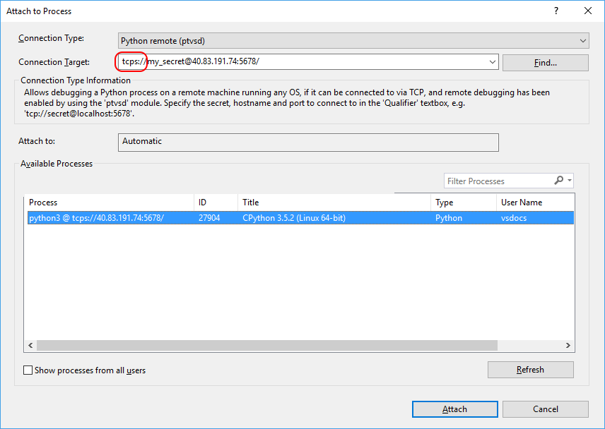

# Remotely Debugging Python Code

Python Tools for Visual Studio (PTVS) can launch and debug Python applications locally and remotely on a Windows machine (see [Remote Debugging](../debugger/remote-debugging.md)). It can also debug remotely on a different operating system, device, or Python implementation other than CPython using the [ptvsd library](https://pypi.python.org/pypi/ptvsd).

When using ptvsd, the Python code being debugged hosts the debug server to which Visual Studio can attach. This requires a small modification to your code to import and enable the server, and may require network or firewall configurations on the remote machine to allow TCP connections.

For an introduction to remote debugging, see [Deep Dive: Cross-Platform Remote Debugging](https://youtu.be/y1Qq7BrV6Cc) (youtube.com, 6m22s).

> [!VIDEO https://www.youtube.com/embed/y1Qq7BrV6Cc]

## Preparing the script for debugging

1. Create a Python file with the following code on the remote machine:

  ```python
  import random

  guesses_made = 0
  name = raw_input('Hello! What is your name?\n')
  number = random.randint(1, 20)
  print 'Well, {0}, I am thinking of a number between 1 and 20.'.format(name)

  while guesses_made < 6:
      guess = int(raw_input('Take a guess: '))
      guesses_made += 1
      if guess < number:
          print 'Your guess is too low.'
      if guess > number:
          print 'Your guess is too high.'
      if guess == number:
          break
  if guess == number:
      print 'Good job, {0}! You guessed my number in {1} guesses!'.format(name, guesses_made)
  else:
      print 'Nope. The number I was thinking of was {0}'.format(number)
  ```
 
1. Install the `ptvsd` package into your environment using `pip install ptvsd`.

1. Enable remote debugging by adding the code below at the earliest possible point in the script, before other code. (Though not a strict requirement, it's impossible to debug any background threads spawned before the `enable_attach` function is called.)

   ```python
   import ptvsd
   ptvsd.enable_attach(secret='my_secret')
   ```

   The `secret` parameter passed to `enable_attach` is used to restrict access to the running script. When attaching, you will have to specify it in Visual Studio or the connection will be denied. To disable this and allow anyone to connect, use `enable_attach(secret=None)`.

1. Save the file and start the script on the remote machine. Note that the call to `enable_attach` runs in the background and waits for incoming connections. If desired, the `wait_for_attach` function can be called after `enable_attach` to block the program until the debugger attaches.

In addition to `enable_attach` and `wait_for_attach`, ptvsd also provides a helper function `break_into_debugger`, which serves as a programmatic breakpoint if the debugger is attached. There is also an `is_attached` function that returns `True` if the debugger is attached (note that there is no need to check this result before calling any other `ptvsd` functions).

## Attaching remotely from Python Tools

In these steps we'll set a simple breakpoint to stop the remote process.

1. Create a copy of the remote file on the local machine and open it in Visual Studio. It doesn't matter where the file is located, but its name should match the name of the script on the remote machine that will be attached to.

1. Select **Debug > Attach to Process** to open the "Attach to Process" dialog.

1. Set **Transport** to **Python remote debugging**.

1. Enter the address of the remote machine in the **Qualifier** fiel and press Enter. This should list available processes on that machine:


1. An error at this stage typically indicates that the secret did not match, the `ptvsd` version does not match that being used by PTVS, or a connection could not be established. One of the common causes of failing to connect is that the remote machine has a firewall that is blocking the debug server port (default is 5678) open. You can either reconfigure the firewall or use a different port; the latter can be done by explicitly specifying it in the call to `enable_attach` in the `address` parameter, such as:

  ```python
  ptvsd.enable_attach(secret = 'my_secret', address = ('0.0.0.0', 8080))
  ```

  The address format is the same as the one used by the standard Python module socket for sockets of type `AF_INET`; see its [documentation](http://docs.python.org/3/library/socket.html#socket-families) for details. 

1. Once the process appears in the list, double-click it to attach. Visual Studio brings up its debugging tools while the script continues to run. For the example script shown above, entering a number will cause the breakpoint to be hit:

    

1. At this point you can use all the usual PTVS debugging features. 

1. When you stop debugging, Visual Studio detaches from your script, but the script will continue running on the remote machine. The debug server also continues running on its background thread, so you can re-attach to the process later using the same procedure.


## Securing the debugger connection with SSL

By default, the connection to the PTVS remote debug server is not secured in any way; anyone with the secret can connect, and all data is passed in plain text. Consequently, others on the network can snoop on the data or even execute a man-in-the-middle (MITM) attack. To prevent this when debugging over unsecured networks or Internet, the debug server supports SSL. 

To secure the channel with SSL, you'll need an SSL certificate. You can generate a self-signed certificate yourself, as described in the [documentation for Python standard module `ssl`](http://docs.python.org/3/library/ssl.html#self-signed-certificates). To prevent MITM attacks, such a generated certificate will also have to be added to the CA root store on the Windows machine running PTVS. This can be done using the Certificate Manager (certmgr.msc) as described on [How do I export certificates and/or private keys?](https://answers.microsoft.com/en-us/windows/forum/windows_10-security/how-do-i-export-certificates-andor-private-keys/7722900a-e848-4076-bc50-9e2f5e3c66ac). Note that you will need to have a separate certificate file (not combined with the private key in a single file) to import. 

After you have the certificate and the private key files generated and registered, you'll need to update the call to `enable_attach` in your script to use them. This is done by means of `certfile` and `keyfile` parameters, which have the same meaning as for the standard Python function `ssl.wrap_socket`. For example, if the certificate file is called `my_cert.cer`, and the key file is called `my_cert.key`, use: 

```python
ptvsd.enable_attach(secret='my_secret', certfile='my_cert.cer', keyfile='my_cert.key')
```

The attach process is exactly the same as described earlier, except that, instead of using the `tcp://` scheme in the Qualifier, use `tcps://`: 



If you did not add the certificate to the CA root store, you will get a warning message: 


You may choose to ignore this and proceed with debugging; the channel will still be encrypted against eavesdropping, but ignoring the warning opens you to a possibility of a MITM attack.
