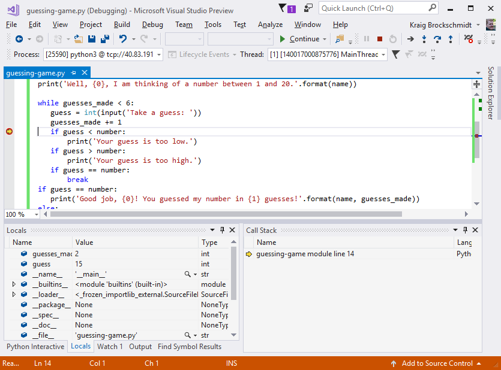
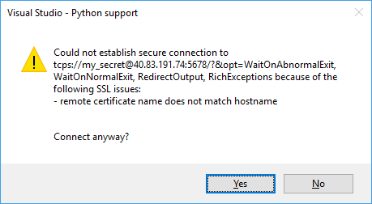

# Remotely debug Python code on Linux

Visual Studio can launch and debug Python applications locally and remotely on a Windows computer (see [Remote debugging](../debugger/remote-debugging.md)). It can also debug remotely on a different operating system, device, or Python implementation other than CPython using the [ptvsd library](https://pypi.python.org/pypi/ptvsd).

When using ptvsd, the Python code being debugged hosts the debug server to which Visual Studio can attach. This hosting requires a small modification to your code to import and enable the server, and may require network or firewall configurations on the remote computer to allow TCP connections.

|   |   |
|---|---|
|  | For an introduction to remote debugging, see [Deep Dive: Cross-platform remote debugging](https://youtu.be/y1Qq7BrV6Cc) (youtube.com, 6m22s), which is applicable to both Visual Studio 2015 and 2017. |

## Set up a Linux computer

The following items are needed to follow this walkthrough:

- A remote computer running Python on an operating system like Mac OSX or Linux.
- Port 5678 (inbound) opened on that computer's firewall, which is the default for remote debugging.

You can easily create a [Linux virtual machine on Azure](/azure/virtual-machines/linux/creation-choices) and [access it using Remote Desktop](/azure/virtual-machines/linux/use-remote-desktop) from Windows. Ubuntu for the VM is convenient because Python is installed by default; otherwise, see the list on [Install a Python interpreter of your choice](installing-python-interpreters.md) for additional Python download locations.

For details on creating a firewall rule for an Azure VM, see [Open ports to a VM in Azure using the Azure portal](/azure/virtual-machines/windows/nsg-quickstart-portal).

## Prepare the script for debugging

1. On the remote computer, create a Python file called *guessing-game.py* with the following code:

    ```python
    import random

    guesses_made = 0
    name = input('Hello! What is your name?\n')
    number = random.randint(1, 20)
    print('Well, {0}, I am thinking of a number between 1 and 20.'.format(name))

    while guesses_made < 6:
        guess = int(input('Take a guess: '))
        guesses_made += 1
        if guess < number:
            print('Your guess is too low.')
        if guess > number:
            print('Your guess is too high.')
        if guess == number:
            break
    if guess == number:
        print('Good job, {0}! You guessed my number in {1} guesses!'.format(name, guesses_made))
    else:
        print('Nope. The number I was thinking of was {0}'.format(number))
    ```

1. Install the `ptvsd` package into your environment using `pip3 install ptvsd`.
   >[!NOTE]
   >It's a good idea to record the version of ptvsd that's installed in case you need it for troubleshooting; the [ptvsd listing](https://pypi.python.org/pypi/ptvsd) also shows available versions.

1. Enable remote debugging by adding the code below at the earliest possible point in *guessing-game.py*, before other code. (Though not a strict requirement, it's impossible to debug any background threads spawned before the `enable_attach` function is called.)

   ```python
   import ptvsd
   ptvsd.enable_attach()
   ```

1. Save the file and run `python3 guessing-game.py`. The call to `enable_attach` runs in the background and waits for incoming connections as you otherwise interact with the program. If desired, the `wait_for_attach` function can be called after `enable_attach` to block the program until the debugger attaches.

> [!Tip]
> In addition to `enable_attach` and `wait_for_attach`, ptvsd also provides a helper function `break_into_debugger`, which serves as a programmatic breakpoint if the debugger is attached. There is also an `is_attached` function that returns `True` if the debugger is attached (note that there is no need to check this result before calling any other `ptvsd` functions).

## Attach remotely from Python Tools

In these steps, we set a simple breakpoint to stop the remote process.

1. Create a copy of the remote file on the local computer and open it in Visual Studio. It doesn't matter where the file is located, but its name should match the name of the script on the remote computer.

1. (Optional) To have IntelliSense for ptvsd on your local computer, install the ptvsd package into your Python environment.

1. Select **Debug** > **Attach to Process**.

1. In the **Attach to Process** dialog that appears, set **Connection Type** to **Python remote (ptvsd)**. (On older versions of Visual Studio these commands are named **Transport** and **Python remote debugging**.)

1. In the **Connection Target** field (**Qualifier** on older versions), enter `tcp://<ip_address>:5678` where `<ip_address>` is that of the remote computer (which can be either an explicit address or a name like myvm.cloudapp.net), and `:5678` is the remote debugging port number.

1. Press **Enter** to populate the list of available ptvsd processes on that computer:

    

    If you happen to start another program on the remote computer after populating this list, select the **Refresh** button.

1. Select the process to debug and then **Attach**, or double-click the process.

1. Visual Studio then switches into debugging mode while the script continues to run on the remote computer, providing all the usual [debugging](debugging-python-in-visual-studio.md) capabilities. For example, set a breakpoint on the `if guess < number:` line, then switch over to the remote computer and enter another guess. After you do so, Visual Studio on your local computer stops at that breakpoint, shows local variables, and so on:

    

1. When you stop debugging, Visual Studio detaches from the program, which continues to run on the remote computer. ptvsd also continues listening for attaching debuggers, so you can reattach to the process again at any time.

### Connection troubleshooting

1. Make sure that you've selected **Python remote (ptvsd)** for the **Connection Type** (**Python remote debugging** for **Transport** with older versions.)
1. Check that the secret in the **Connection Target** (or **Qualifier**) exactly matches the secret in the remote code.
1. Check that the IP address in the **Connection Target** (or **Qualifier**) matches that of the remote computer.
1. Check that you're opened the remote debugging port on the remote computer, and that you've included the port suffix in the connection target, such as `:5678`.
    - If you need to use a different port, you can specify it in the `enable_attach` call using the `address` argument, as in `ptvsd.enable_attach(address = ('0.0.0.0', 8080))`. In this case, open that specific port in the firewall.
1. Check that the version of ptvsd installed on the remote computer as returned by `pip3 list` matches that used by the version of the Python tools you're using in Visual Studio in the table below. If necessary, update ptvsd on the remote computer.

    | Visual Studio version | Python tools/ptvsd version |
    | --- | --- |
    | 2017 15.8 | 4.1.1a9 (legacy debugger: 3.2.1.0) |
    | 2017 15.7 | 4.1.1a1 (legacy debugger: 3.2.1.0) |
    | 2017 15.4, 15.5, 15.6 | 3.2.1.0 |
    | 2017 15.3 | 3.2.0 |
    | 2017 15.2 | 3.1.0 |
    | 2017 15.0, 15.1 | 3.0.0 |
    | 2015 | 2.2.6 |
    | 2013 | 2.2.2 |
    | 2012, 2010 | 2.1 |

## Using ptvsd 3.x

The following information applies only to remote debugging with ptvsd 3.x, which contains certain features that were removed in ptvsd 4.x.

1. With ptvsd 3.x, the `enable_attach` function required that you pass a "secret" as the first argument that restricts access to the running script. You enter this secret when attaching the remote debugger. Though not recommended, you can allow anyone to connect, use `enable_attach(secret=None)`.

1. The connection target URL is `tcp://<secret>@<ip_address>:5678` where `<secret>` is the string passed `enable_attach` in the Python code.

By default, the connection to the ptvsd 3.x remote debug server is secured only by the secret and all data is passed in plain text. For a more secure connection, ptvsd 3.x supports SSL using the `tcsp` protocol, which you set up as follows:

1. On the remote computer, generate separate self-signed certificate and key files using openssl:

    ```command
    openssl req -new -x509 -days 365 -nodes -out cert.cer -keyout cert.key
    ```

    When prompted, use the hostname or IP address (whichever you use to connect) for the **Common Name** when prompted by openssl.

    (See [Self-signed certificates](https://docs.python.org/3/library/ssl.html#self-signed-certificates) in the Python `ssl` module docs for additional details. Note that the command in those docs generates only a single combined file.)

1. In the code, modify the call to `enable_attach` to include `certfile` and `keyfile` arguments using the filenames as the values (these arguments have the same meaning as for the standard `ssl.wrap_socket` Python function):

    ```python
    ptvsd.enable_attach(secret='my_secret', certfile='cert.cer', keyfile='cert.key')
    ```

    You can also make the same change in the code file on the local computer, but because this code isn't actually run, it isn't strictly necessary.

1. Restart the Python program on the remote computer, making it ready for debugging.

1. Secure the channel by adding the certificate to Trusted Root CA on the Windows computer with Visual Studio:

    1. Copy the certificate file from the remote computer to the local computer.
    1. Open **Control Panel** and navigate to **Administrative Tools** > **Manage computer certificates**.
    1. In the window that appears, expand **Trusted Root Certification Authorities** on the left side, right-click **Certificates**, and select **All Tasks** > **Import**.
    1. Navigate to and select the *.cer* file copied from the remote computer, then click through the dialogs to complete the import.

1. Repeat the attach process in Visual Studio as described earlier, now using `tcps://` as the protocol for the **Connection Target** (or **Qualifier**).

    

1. Visual Studio prompts you about potential certificate issues when connecting over SSL. You may ignore the warnings and proceed, but although the channel is still encrypted against eavesdropping it can be open to man-in-the-middle attacks.

    1. If you see the **remote certificate is not trusted** warning below, it means you did not properly add the certificate to the Trusted Root CA. Check those steps and try again.

        

    1. If you see the **remote certificate name does not match hostname** warning below, it means you did not use the proper hostname or IP address as the **Common Name** when creating the certificate.

        
